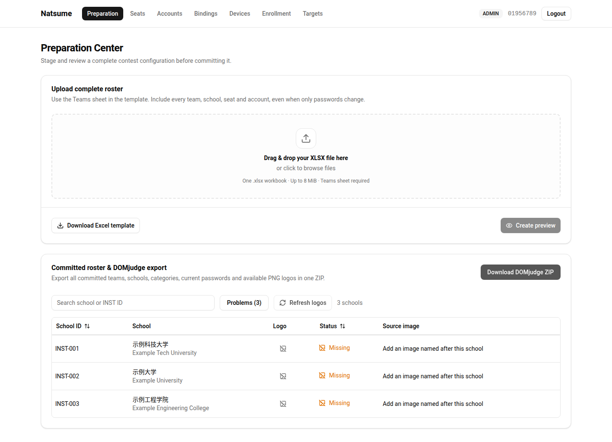
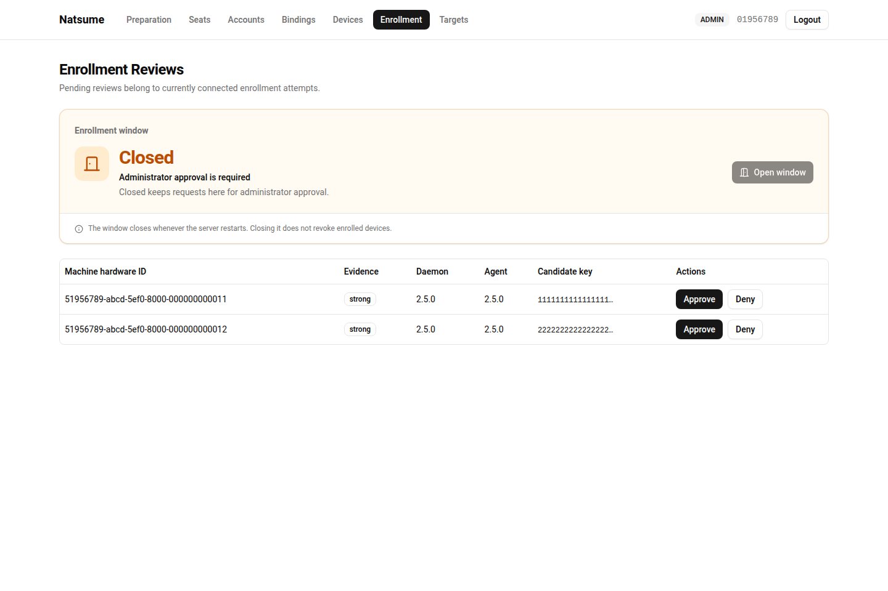
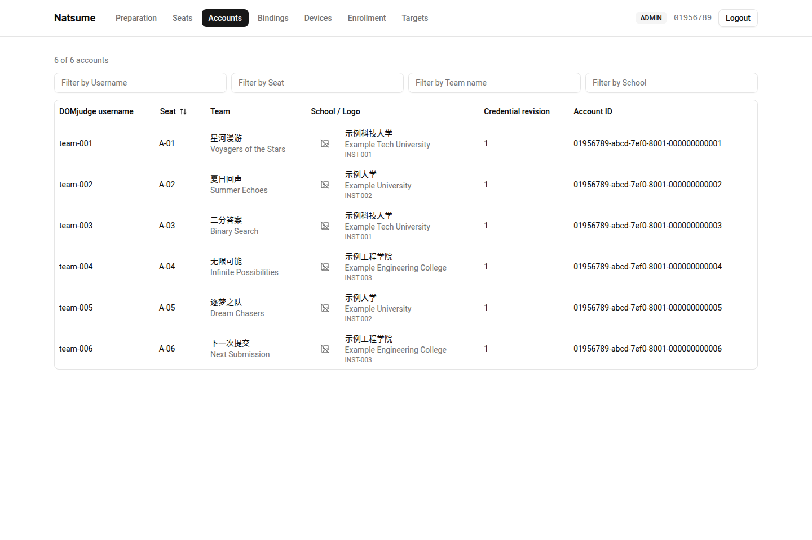
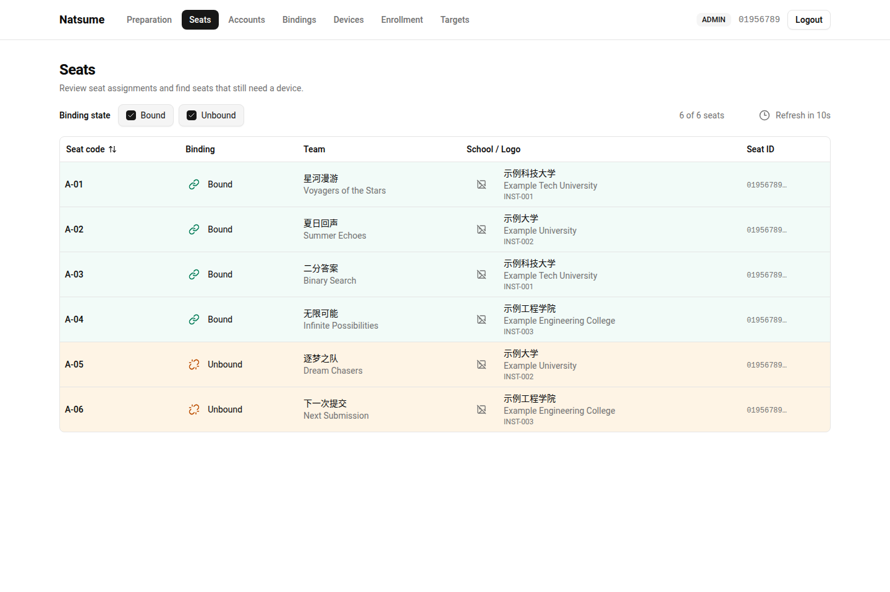
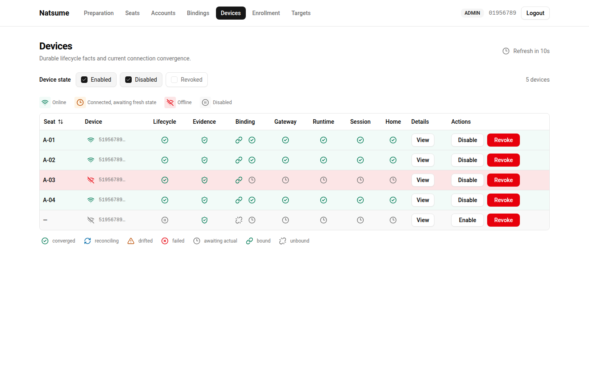
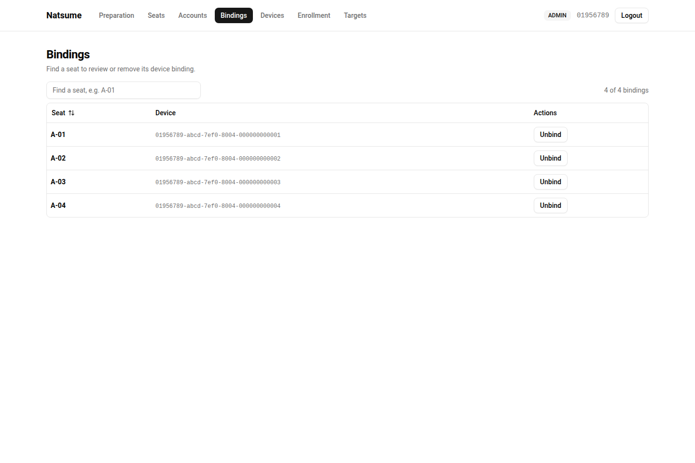
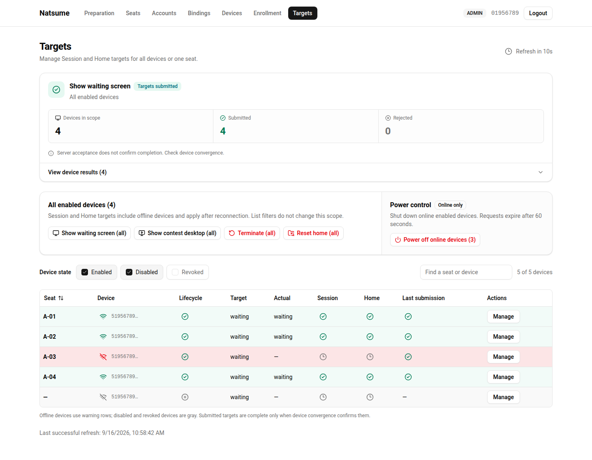
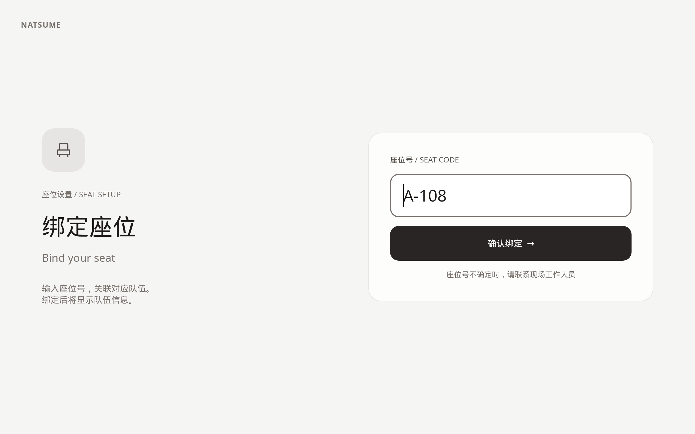
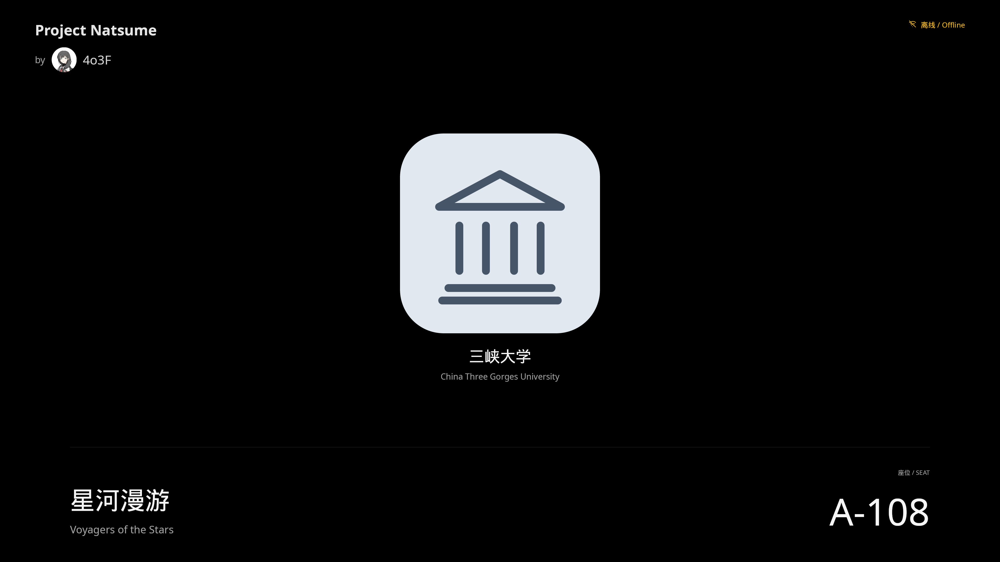

# Project Natsume

[](https://github.com/4o3F/Natsume/actions/workflows/ci.yml?query=branch%3Av2) [](https://github.com/4o3F/Natsume/releases/latest) [](LICENSE) [](Cargo.toml) [](web/package.json)

Workstation orchestration for on-site programming contests.

> [!WARNING]
> Natsume is **not yet battle-tested** in real contests. Validate the complete workflow in your target environment before relying on it for a live event.

Natsume connects a contest roster, physical seats, managed Ubuntu workstations, and DOMjudge through one operator panel. Prepare the roster, enroll devices, bind them to seats, and manage the waiting screen and contest desktop from a central Server.

[Feature gallery](#feature-gallery) · [Architecture](#architecture) · [Documentation](#core-documentation) · [Development](#get-started-in-development)

## Project goals

1. **Make contest-day operations manageable.** Support a single on-site contest, with a design target of approximately 500–600 workstations per Server.
2. **Keep roster and workstation assignments consistent.** Connect schools, teams, DOMjudge accounts, seats, and devices without hand-configuring each contestant desktop.
3. **Converge on the intended state.** Reconcile Server targets with device reports, including after reconnects and process restarts. A submitted target is not proof that a workstation has applied it.
4. **Keep privileged operations narrow.** Separate operator access, device identity, credential handling, desktop presentation, and root capabilities. Fail closed when identity or trust cannot be established.

Natsume is not a judging system or a general-purpose remote administration tool. DOMjudge remains the judging platform. Multi-contest hosting, Server HA, arbitrary remote shells, and file management are outside the project scope.

## Core features

- **Contest preparation:** drag-and-drop XLSX roster import, a redacted change preview before commit, bilingual team and school metadata, school-logo checks, and DOMjudge ZIP export. Exports contain account passwords and must be handled as sensitive files; the panel does not display those passwords.
- **Enrollment and device lifecycle:** an explicit enrollment window for automatic approval, manual review when closed, and independent Enabled, Disabled, and Revoked filters for ongoing fleet management.
- **Seats and accounts:** seat-to-device binding, quick identification of unbound seats, row-level state colors, and account searches by username, seat, Chinese or English team name, and school.
- **Session, Home, and power control:** show the waiting screen or contest desktop, terminate contest sessions, reset contestant Home data, and request confirmed shutdown of online enabled devices. Bulk submissions expose per-device acceptance or rejection; shutdown requests expire after 60 seconds.
- **Live readiness:** automatically refreshed views of connection state and Gateway, Binding, Runtime, Session, and Home convergence, with refresh indicators on the Devices, Seats, and Targets pages.
- **Contestant experience:** a native GNOME Wayland waiting screen with team, school, seat, and offline information; a separate full GNOME contest desktop; and a local HTTPS gateway for DOMjudge automatic login.

## Feature gallery

The Web screenshots below show the actual panel with synthetic API fixtures, not a live contest. Seat setup and Waiting are native Slint UI previews with sample data. These illustrate the interface, not deployment or scale acceptance. Click any image to view it at full resolution.

| Preparation                                                                                                                                                      | Enrollment                                                                                                                                            |
| ---------------------------------------------------------------------------------------------------------------------------------------------------------------- | ----------------------------------------------------------------------------------------------------------------------------------------------------- |
| [](docs/screenshots/preparation.png) | [](docs/screenshots/enrollment.png) |
| Import the complete roster, check school logos, and export for DOMjudge.                                                                                         | See the approval policy at a glance and review new devices.                                                                                           |

| Accounts                                                                                                                                                  | Seats                                                                                                                                            |
| --------------------------------------------------------------------------------------------------------------------------------------------------------- | ------------------------------------------------------------------------------------------------------------------------------------------------ |
| [](docs/screenshots/accounts.png) | [](docs/screenshots/seats.png) |
| Find bilingual team and school records alongside their DOMjudge accounts.                                                                                 | Spot unbound seats and keep seat assignments visible.                                                                                            |

| Devices                                                                                                                                                 | Bindings                                                                                                                                 |
| ------------------------------------------------------------------------------------------------------------------------------------------------------- | ---------------------------------------------------------------------------------------------------------------------------------------- |
| [](docs/screenshots/devices.png) | [](docs/screenshots/bindings.png) |
| Inspect connectivity, lifecycle state, and resource readiness.                                                                                          | Review seat-to-device assignments and release a binding when needed.                                                                     |

| Targets                                                                                                                                                     |
| ----------------------------------------------------------------------------------------------------------------------------------------------------------- |
| [](docs/screenshots/targets.png) |
| Apply fleet-wide targets and distinguish submission from device convergence.                                                                                |

| Seat setup                                                                                                                                                               | Waiting screen                                                                                                                                                                       |
| ------------------------------------------------------------------------------------------------------------------------------------------------------------------------ | ------------------------------------------------------------------------------------------------------------------------------------------------------------------------------------ |
| [](docs/screenshots/seat-setup.png) | [](docs/screenshots/waiting.png) |
| Enter the workstation seat code to associate it with the assigned team.                                                                                                  | Display the bound team, school, and seat while waiting for the contest.                                                                                                              |

## Architecture

The [architecture document](docs/architecture.md) is the sole manually maintained architecture authority. This is an orientation guide; the architecture describes the target state, and completion must be checked against code and acceptance evidence.

| Component                       | Location                                                 | Responsibility                                                                                                                                                                                    |
| ------------------------------- | -------------------------------------------------------- | ------------------------------------------------------------------------------------------------------------------------------------------------------------------------------------------------- |
| Server                          | [`server/`](server/)                                     | Rust, Axum, and SQLite/Diesel; owns committed contest data, operator sessions, enrollment, bindings, credentials, and desired state. Serves HTTPS APIs, device WSS, and the production Web panel. |
| Operator panel                  | [`web/`](web/)                                           | React, TypeScript, and shadcn/ui; reads the generated OpenAPI contract and exposes administrator and viewer workflows.                                                                            |
| Device Daemon                   | [`client/device-daemon/`](client/device-daemon/)         | Owns workstation identity, the authenticated control connection, local state reconciliation, and Caddy configuration.                                                                             |
| Privileged Helper               | [`client/privileged-helper/`](client/privileged-helper/) | Provides a closed set of privileged system operations over typed D-Bus; has no network role or arbitrary command interface.                                                                       |
| Session Agent                   | [`client/session-agent/`](client/session-agent/)         | Renders Waiting and seat-binding UI with Slint/Skia inside the GNOME Kiosk Wayland session.                                                                                                       |
| Shared contracts                | [`crates/`](crates/)                                     | Device Control Protobuf, typed local D-Bus interfaces, and the shared XLSX roster contract.                                                                                                       |
| Packaging and image integration | [`packaging/`](packaging/)                               | Server/Client Debian packages, verified Caddy inputs, service integration, and the image-builder handoff.                                                                                         |

The panel talks to Server over HTTPS. Device Daemons use authenticated WSS with Protobuf and reconcile complete desired state, rather than consuming a remote command queue. On each workstation, the Daemon coordinates the Helper and Agent through typed local IPC. Caddy provides the loopback HTTPS path to DOMjudge; the Agent does not contact Server or receive account credentials.

## Core documentation

Most operational and product documents are currently written in Chinese.

| Document                                                                                                                  | Start here when you need to…                                                                   |
| ------------------------------------------------------------------------------------------------------------------------- | ---------------------------------------------------------------------------------------------- |
| [Documentation index](docs/README.md)                                                                                     | Find maintained guides and release notes.                                                      |
| [Architecture](docs/architecture.md)                                                                                      | Understand ownership, protocols, trust boundaries, data models, and verification requirements. |
| [Deployment and operations](docs/operations-deployment.zh-CN.md)                                                          | Provision TLS, bootstrap Server, install Client, and plan backup or recovery.                  |
| [Image integration requirements](packaging/image/integration.md) and [acceptance criteria](packaging/image/acceptance.md) | Configure the workstation image and verify Session, Home, display, and input behavior.         |
| [Packaging](packaging/README.md) and [image-builder handoff](packaging/image/README.md)                                   | Build Debian artifacts or integrate Client into an Ubuntu image.                               |
| [Server guide](server/README.md), [Web guide](web/README.md), and [roster contract](crates/roster/README.md)              | Work on a specific application surface or the XLSX format.                                     |
| [Issue workflow](docs/agents/issue-tracker.md)                                                                            | Track requirements and changes in GitHub Issues.                                               |

## Get started in development

### 1. Prepare the toolchain

Use Linux; Ubuntu 24.04 is the deployment baseline. Install Git, rustup, Node.js **24.1.0**, pnpm **11.x**, `just`, and `prek` **0.5.0**. The repository pins Rust **1.97.1** in [`rust-toolchain.toml`](rust-toolchain.toml). On Ubuntu, the workspace's native build and test prerequisites include:

```bash
sudo apt-get install --yes build-essential pkg-config dbus-daemon \
  libfontconfig1-dev libgl1-mesa-dev libudev-dev
```

From the repository root:

```bash
rustup show                         # Install/select the repository toolchain
cargo install cargo-deny --version 0.20.2 --locked
just toolchain                      # Check the pinned toolchain and manifests
just install                        # Install Node dependencies from the lockfile
prek install                        # Enable this checkout's pre-commit hook
```

### 2. Run the Web panel

```bash
pnpm --filter @natsume/web dev --host 127.0.0.1
```

Open the local URL printed by Vite. Its `/api` proxy expects an already configured Server at `https://127.0.0.1:8443`; the UI does not provide a built-in demo login. For a working local backend, follow the [Server guide](server/README.md) and [deployment runbook](docs/operations-deployment.zh-CN.md) to provision configuration, TLS/CA material, and an initial operator. Server modes read the fixed `/etc/natsume-server/config.toml`, not command-line configuration flags.

For UI-only work, the Playwright suite uses intercepted API fixtures and needs no running Server:

```bash
pnpm --filter @natsume/web exec playwright install --with-deps chromium
pnpm --filter @natsume/web e2e
```

### 3. Build, check, and update contracts

```bash
cargo build --workspace --locked
pnpm --filter @natsume/web build
prek run --all-files
```

`prek` is the single pre-commit check entry point. It runs dependency policy, Web Prettier and ESLint, Rust Clippy, and Rust/Web tests without automatically editing or staging files. CI adds further contract, browser, and packaging checks.

When changing the HTTP API, run `just api` and include the regenerated OpenAPI and TypeScript snapshots. Do not edit generated contracts by hand. Exact dependencies belong to lockfiles; package inputs and release procedures belong to [`packaging/`](packaging/README.md). Running the full Client requires the provisioned GNOME dual-session image, not just a development build.

## License

[GNU AGPL-3.0-or-later](LICENSE).
