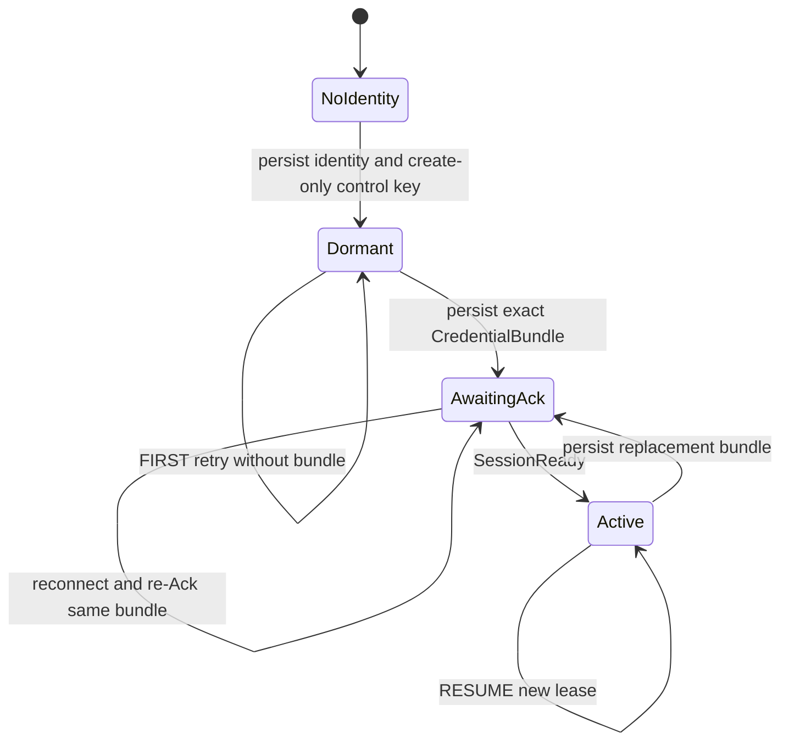
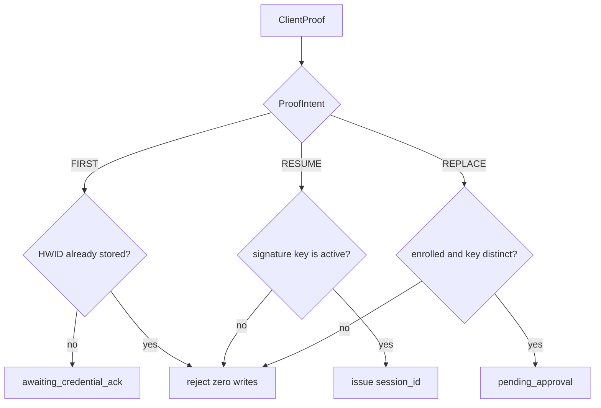
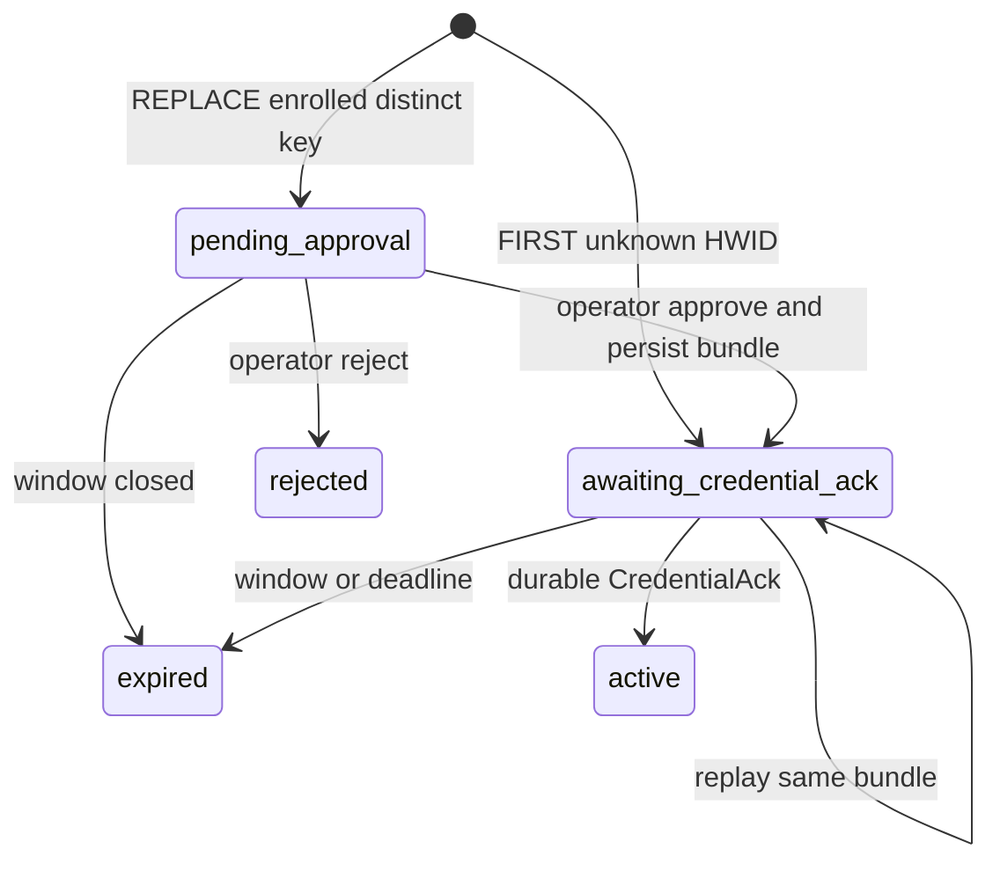

# ADR-0038: Unified ordinary-WSS Device control authority

> Status: `ACCEPTED`
> Implementation: `FOUNDATIONS PRESENT — AUTHORITY PENDING ATOMIC CUTOVER`
> Scope: Device control identity, unified Enrollment/control WSS, dynamic authority actors, credential activation, and destructive pre-release cutover
> Consolidates: —
> Supersedes: [ADR-0033](0033-enrollment-and-device-control-boundary.md)
> Superseded by: —

## Implementation boundary

本 ADR 于 2026-08-19 接受为预发布 flag-day authority 目标。Batch 1 已按 owner 的预发布 BC 决策原位拆分 production Proto、把单一 package 改为 `natsume.device.control`、把当前双端 subprotocol 同步改为 `natsume.control`，并加入 dormant Challenge/Proof/ClientInit 与 crypto/schema foundations；不存在 `control_v2`、第二 descriptor 或旧/新 package 兼容层。

这些 foundation 不授予 control-key authority。当前网络认证仍是 HTTPS Enrollment、Device Token 与 Bearer-before-101，当前 socket 仍运行 `ControlEnvelope`；新 handshake/direction messages 尚无 runtime consumer。Atomic flag day 才删除 Token/public Enrollment HTTP、启用 PreAuth/actor/Ack authority 并收紧 transitional schema。任何中间版本都不得同时接受 Token 与 control key 作为 authority。

## Context

当前设计把公开 HTTPS Enrollment 与 Bearer WSS 控制分为两条 Device 路径，credential issuance、reconnect、replacement、lifecycle eviction 与 command dispatch 因而跨越多个 admission 与 runtime owner。把 persisted Device 在启动时预建为 runtime slot 仍会保留该分裂，并把启动枚举变成 authority 前提。

部署仍是单 Server 进程、单 SQLite、约 500 台 Device、无 HA、物理受控 provisioning period。Machine Hardware ID 可观察，不能认证 Device。Gateway TLS key 服务本地浏览器 origin，不能兼任 control identity。

首次 control key 没有更早的 Device credential 可以背书。窗口内接受未知 hardware 的 first key 是明确的残余信任，只能由容量限制、物理清点、Binding 与 secret release gate 约束，不能被描述为制造商身份或硬件证明。

## Decision

### Dedicated control identity

每台 Device 在完成本地 Machine Hardware ID 验证后、首次网络连接前生成专用 Ed25519 control signing key。Private key 为 daemon-owned `0600`、create-only PKCS#8 DER，不离开 Device；Server 只保存 public key 与派生 key ID。Control key 与 Server TLS、Origin CA、Gateway TLS key 完全分离。

ControlKeyId 固定为：

```text
SHA-256(
  "NATSUME-CONTROL-KEY-ID-v1\0"
  || u8(0x01)                 // algorithm_id: ED25519
  || uint16_be(32)
  || public_key[32]
)
```

`0x01` 是本版本冻结的唯一 algorithm ID；增加算法必须修订 domain/version 并增加跨实现 golden，不能复用该字节。使用维护中的 Ed25519/PKCS#8 Rust 实现；禁止手写曲线运算、签名解析或自定义密码学原语。

### Ordinary-WSS challenge-response

目标继续使用普通 pinned server-auth TLS 1.3 与 RFC 6455 Upgrade，不要求 mTLS、TLS exporter 或认证 header：

```text
TLS 1.3
→ HTTP 101 / exact subprotocol natsume.control
→ standalone binary WebSocket message: ServerChallenge
→ standalone binary WebSocket message: ClientProof
→ standalone binary WebSocket message: exact ClientInit
→ classified dynamic DeviceActor
```

HTTP 101 只建立 transport。Proof 完成前，连接没有 Device、Enrollment、Command、Observed 或 lifecycle authority。

`ClientProof.intent` 是客户端声明，不是权威。服务端在 Proof 验签之后按 HWID、active key 与 `devices.state` 独立分类；声明与分类不一致则拒绝，不得改写。冻结的 intent：

| Intent | 签名 key | `candidate_control_public_key` / `gateway_csr_der` |
|---|---|---|
| `FIRST_ENROLLMENT` | 候选新 key | 必带 |
| `RESUME` | 当前 active key | 禁止 |
| `REPLACE` | 候选新 key | 必带 |

`UNSPECIFIED` 拒绝。`REPLACE` 覆盖仍为 `enrolled` 的 distinct-key 凭据替换，包括持有旧 key 的轮转与经显式运维授权的重建；daemon 不得因缺文件自动改发 `REPLACE`。

每条 WSS connection 拥有一次性随机 challenge ID 与 server nonce；它们只存在于该 connection-local PreAuthSession，并在 proof 成功、失败、timeout、非法 message 或 disconnect 后销毁。不得建立全局 challenge lookup 或允许第二次 proof。

Proof crypto 不再逐字段维护第二套 byte schema，也不承担协议语义校验。发送侧 clone typed `ClientProof`、只清空 `signature`，用 pinned Prost `0.14.4` 编码两个完整 typed message，并计算固定摘要：

```text
canonical_input =
  "NATSUME-WSS-CONTROL-PROOF-v2\0"
  || "/api/v2/device/control\0"
  || "natsume.control\0"
  || ServerChallenge.encode_length_delimited_to_vec()
  || ClientProof{signature: empty}.encode_length_delimited_to_vec()
proof_digest = SHA-256(canonical_input)
signature = ordinary Ed25519.sign(proof_digest)
```

SHA-256 通过 `Sha256::update` 按上述 chunks 增量计算，不分配 combined transcript `Vec`。domain、route 与 subprotocol 是固定的 NUL 分隔前缀，两个完整 Protobuf 消息由 Prost 的 length-delimited 编码自定界。这里签的是固定 32-byte digest，仍是普通 Ed25519，不是 Ed25519ph；接收侧使用 ordinary `verify_strict(proof_digest, signature)`。

`verify_proof_strict` 只解析 Ed25519 public key/signature、拒绝 weak key、重算 digest 并做 strict crypto verification；它不检查 Challenge/Proof UUID、nonce、intent、ID、hash 长度、challenge equality 或 max-init。Batch 2 consumer 在字段的实际使用边界执行所需 semantic validation，不提前引入 speculative shared validator。因而任意 typed fields 都可以形成 cryptographically valid proof，但在 consumer validation 通过前不授予 authority。完整消息仍确保任何已签字段变化都会使 digest/signature 失效；`ClientInit` canonical validation 与摘要语义不变。该设计**不宣称TLS channel binding**。

安全假设明确为：TLS在Natsume Server进程内终止；不存在TLS-terminating proxy或共享TLS identity中介；daemon只签署其当前pinned Server WSS connection收到的challenge，并不暴露任意signing oracle。若这些假设失效，必须重开本ADR并采用channel-bound proof。

ServerChallenge、ClientProof 与 ClientInit 各占一个 standalone binary WebSocket message，不属于 active envelope。这里的 message 是 tungstenite 重组 RFC 6455 fragmentation 后暴露的应用边界；不要求访问 raw frame。`max_message_size` 在 Protobuf decode 前约束重组后的完整消息，`max_frame_size` 独立约束单个 transport fragment。Client 与 Server 都把经语义校验的 typed `ClientInit` 交给 pinned Prost `0.14.4` encoder，并以 `SHA-256(encode_to_vec(value))` 作为 proof 中的语义摘要；入站字段顺序、非最短 varint、显式 default、unknown bytes、重复字段的被覆盖值与等价 repeated 布局不进入签名。Server 丢弃收到的 raw bytes，只继续使用并持久化规范再编码结果。切换 Protobuf runtime 或编码版本必须重开本 ADR 并重算全部语义摘要 golden。

### Unified dynamic actor

Registry 启动为空，不枚举 persisted Device。只有在 proof、exact ClientInit、bounded DB classification 与 capacity admission 成功后，才按需创建或复用 process-lifetime DeviceActor。

Machine Hardware ID 是 primary runtime shard，只负责让 first Enrollment、existing reconnect、key rotation 与 DeviceId operator action汇聚同一个 actor，不授予 authority。DeviceId 与 persisted control-key IDs 是同一 entry 的 aliases；alias presence 同样不授予 authority。

Actor 是 first Enrollment、pending approval、immutable CredentialBundle delivery、CredentialAck、Resume、key rotation/recovery、Gateway refresh、lifecycle、Command dispatch/status、Observed 与 disconnect 的唯一排序点。

FIRST 对任何已有 Machine Hardware ID 都必须拒绝且零签发。Enrolled Device 的 distinct key 必须显式 operator approval；disabled/revoked Device 不能通过 Enrollment、reconnect、Ack 或 recovery 隐式恢复。

### Credential activation and replay

First Enrollment 在 Ack 前不创建 Device row 或 active control-key row。Actor 持久化 request、preallocated DeviceId 与一个 immutable public CredentialBundle，并在同一 WSS 上发送。Client 完整验证并 crash-safely 持久化 bundle 后发送 CredentialAck；随后一个 application-owned transaction 创建 Device revision 1、激活 control key 与 Gateway certificate、写 audit，并将 request 置为 active。Commit 后同一 socket 获得 SessionReady 并进入 Active。

CredentialBundle canonical bytes 与 SHA-256 是可持久化 public data。Response loss 必须重放同一 bytes，禁止为同一 issuance 重新签名、重新分配 DeviceId 或重复推进 revision。

不同 key replacement 中，旧 key 与旧 session 保持 authority，直到新 candidate 对 exact bundle 完成 durable Ack。一个 transaction supersede 旧 key、activate 新 key并推进 ControlAuthorityRevision；commit 后旧 lease失效。Approval operation 直接生成并持久化 bundle，状态从 PendingApproval 进入 AwaitingCredentialAck，不保留独立 Approved/CredentialIssued 阶段。

**2026-08-20 修订（权威状态机）**：下列图冻结 Client 本地权威、Proof 分类与 control `enrollment_requests.state` 的转移。dormant control key 与已落盘但未 Ack 的 CredentialBundle 都不是 enrolled。`SessionReady` 必须携带本连接的 `session_id`；Active 帧只回该值做租约校验。`devices.control_authority_revision` 只在首次 Ack（=1）与替换 Ack（+1）推进，不出现在每帧 Active envelope 上。

本地权威与 Enrollment 请求是不同事实。先落下 identity 与 create-only control key，才能签 Proof；Gateway 证书只存在于 Server 下发的 CredentialBundle 中，Client 在 Ack 前 crash-safe 落盘，Ack 丢失则重放同一 bytes。



`NoIdentity` / `Dormant` / `AwaitingAck` 均未 enrolled。缺 key、坏 key 或 identity 不匹配 fail closed，不在本图内自动转移。`REPLACE` 只能由显式运维进入，不能从缺文件推断。



FIRST 对已有 HWID、REPLACE 对未知 HWID、RESUME 对非 active key、REPLACE 对 `disabled`/`revoked` 或同一把 active key，全部拒绝且零签发。不得把 FIRST 改写成 REPLACE，也不得把 REPLACE 改写成 FIRST。



这些 `enrollment_requests.state` 值仅适用于 `control_intent IS NOT NULL`。FIRST 的 Ack 才创建 `devices` row 与 active control key（revision 1）。REPLACE 的 Ack 不新建 Device，只 supersede key 并推进 revision；替换期间旧 lease 仍有效。`devices.state` 的 disable/revoke 由 operator lifecycle 排序，Enrollment / reconnect / Ack 不得隐式复活。

### Limits, shutdown, and restart

TLS handshake、WSS、PreAuth、signature verification、DB classification、provisional actor、frame size、deadline 与 outbound send 均使用以下冻结的 hard limits：

| 边界 | 值 |
|---|---:|
| Device rows + live FIRST reservations | 600 |
| provisional actors | 128 |
| in-flight TLS handshakes | 128 global |
| TLS handshakes per IPv4 / IPv6 `/64` | 4 |
| post-TLS HTTP/WSS connections | 2048 global，复用current HTTP connection cap |
| upgraded Device WSS | 768 |
| concurrent PreAuth connections | 64 |
| PreAuth per IPv4 / IPv6 `/64` | 4 |
| signature verification concurrency | 16 |
| PreAuth DB reads | 8 |
| TLS handshake timeout | 5s |
| Challenge send / Proof / ClientInit timeout | 各3s |
| total PreAuth timeout | 10s |
| Proof binary message | 1024 bytes |
| ClientInit binary message | 48 KiB |
| Active binary message | 64 KiB |
| outbound send timeout | 10s |

Permit顺序固定为`TCP accept → global/per-source TLS-handshake permit → spawn handshake → post-TLS HTTP connection permit(2048) → Device-WSS permit(768) → global/per-source PreAuth permit(64/4) → subprotocol → 101`。TLS permit在握手结束释放；HTTP permit持有至Hyper connection结束；Device-WSS permit持有至socket关闭；PreAuth permit持有至actor attach或preauth关闭。任一permit满时在对应阶段立即拒绝，不创建无界waiter。Provisional actor semaphore满时在proof/classification后返回ServerBusy并关闭。Rate state必须bounded，IPv6按`/64`归一。

Fleet capacity由 SQLite 中 Device rows 与 live first-enrollment requests 共同表达。Provisional actors 使用单一 RAII semaphore；Registry 不保存可能漂移的持久化 class 或 budget counter。Registry 只拥有 aliases、actor task state 与 typed Running/ShuttingDown phase。

Startup只执行 schema/set-based recovery、初始化 quotas 与空 registry，然后 listener bind。Restart不恢复 actor、ticket、candidate、session或outbound frame；pending request与immutable bundle从 SQLite按需重放，active key重新 proof。

### Flag-day rollout

Batch 0 只建立决策、依赖准入、deterministic vectors 与 isolated private feasibility listener。Batch 1 使用预发布 breaking change 原位拆分唯一 Proto/package/descriptor 并同步现有 peers 的 subprotocol，同时只增加 dormant crypto/schema/client-local foundations；不维护旧 wire 兼容副本。

后续 dormant batch可以构建actor与client authority路径，但任何启用的中间版本都不得同时支持Device Token和control key authority。Atomic cutover同批删除Device Token、public Device Enrollment HTTP、旧 `ControlEnvelope`/registry 与 transitional schema state，并重建预发布DB与Device image。

## Alternatives

- 保留Bearer或移入首帧：继续使用可重放共享秘密，并保留Enrollment/control双路径。
- mTLS bootstrap：需要预存在的client PKI，且连接内签发的新证书不能自然成为已完成TLS握手的client identity。
- TLS-exporter Upgrade proof：可在101前认证，但需要手工拆解TLS/WebSocket；本部署中connection-local random challenge已经提供所需的freshness。
- PAKE：需要独立预置shared secret；Machine Hardware ID不能被转换成该secret。
- 预建persisted Device slot：让启动枚举成为authority前提，并仍需另一条unknown Enrollment路径。
- 复用Gateway key：耦合不相干的key usage与恢复生命周期。

## Consequences

### Positive

- 一条WSS和一个actor排序全部Device authority transition。
- First Enrollment可在原socket进入Active，不产生Bearer。
- Immutable bundle replay使response-loss边界确定化。
- Empty startup与bounded provisional actor避免启动枚举和无界unknown allocation。
- Replacement、disable与revoke由revision和lease明确排序。

### Negative / trade-offs

- First key来自物理受控窗口而非manufacturer credential；Binding与secret release必须等待inventory reconciliation。
- 未认证peer在proof前已经获得101，因此TLS/WSS/PreAuth limit是load-bearing安全边界。
- Flag day破坏当前预发布Token状态，需要协调重建DB与Device image。
- Ed25519/PKCS#8增加经过审查的crypto dependency与本地private-key lifecycle。
- 为避免actor retirement ABA，process-lifetime provisional actors最多128个；窗口内恶意有效proof可耗尽该额度直到Server restart。该风险由物理受控窗口、per-source limits与立即关窗约束，未来若需要在线回收必须另行冻结incarnation/tombstone设计。

## Acceptance basis and revisit trigger

Batch 0 的 private isolated listener 已证明 server-auth TLS 1.3、ordinary WSS 101、random challenge、deterministic Ed25519/PKCS#8 vectors、strict verification、exact ClientInit hash binding 与 clean close。Batch 1 将 transcript、Prost decode/semantic validation 与 typed canonical re-encoding纳入唯一production protocol crate，但新proof消息仍未接入runtime authority。

后续还必须证明 capacity、crash cuts、actor races、immutable replay、filesystem durability、lifecycle ordering 与 500–600 Device envelope。Foundation 落地不关闭 G4。

当TLS在外部终止、provisioning不再物理受控、要求HA、多Server、出现manufacturer Device credential，或无法接受destructive coordinated rollout时重开本ADR。

## Normative sources

- [Architecture](../architecture.md)
- [Domain model](../domain-model.md)
- [Contracts](../contracts.md)
- [Security and recovery](../security-recovery.md)
- [Dependency policy](../dependency-policy.md)
