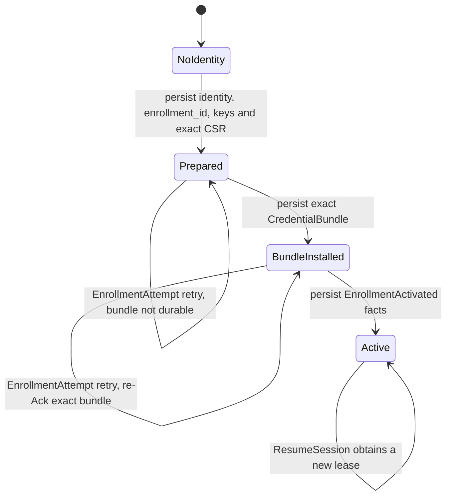
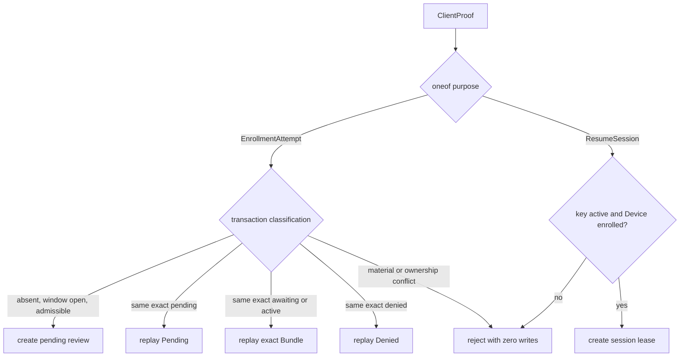
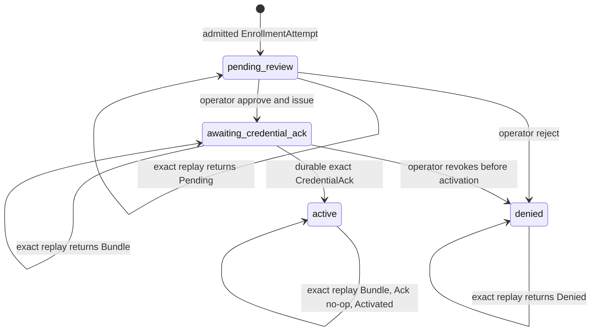

# ADR-0038: Unified ordinary-WSS Device control authority

> Status: `ACCEPTED`
> Implementation: `FOUNDATIONS PRESENT — AUTHORITY PENDING ATOMIC CUTOVER`
> Scope: Device control identity, unified Enrollment/control WSS, dynamic authority actors, credential activation, and destructive pre-release cutover
> Consolidates: —
> Supersedes: [ADR-0033](0033-enrollment-and-device-control-boundary.md)
> Superseded by: —

## Implementation boundary

本 ADR 于 2026-08-19 接受为预发布 flag-day authority 目标。Batch 1 已按 owner 的预发布 BC 决策原位拆分 production Proto、把单一 package 改为 `natsume.device.control`、建立 dormant Challenge/Proof/Bundle/Ack/Activated/Ready/SessionReady 与 crypto/schema foundations。目标双端 subprotocol 现为唯一版本权威 `natsume.control.v1`；当前 Rust runtime 尚使用旧 token，留待 authority flag day 同步。不存在 `control_v2`、第二 descriptor 或旧/新 package 兼容层。无 `ClientInit`、无 `ControlEnvelope`、无 Hello。

这些 foundation 不授予 control-key authority。当前网络认证仍是 HTTPS Enrollment、Device Token 与 Bearer-before-101；wire 已是定向 handshake/Active envelopes，尚无 runtime key-auth consumer。Atomic flag day 才删除 Token/public Enrollment HTTP、启用 PreAuth/actor/Ack authority 并收紧 transitional schema。任何中间版本都不得同时接受 Token 与 control key 作为 authority。

**2026-08-24 修订（人工审核、无业务 expiry）**：所有新 Enrollment transaction 先进入 `pending_review`；operator 批准与 Gateway 签发在同一事务进入 `awaiting_credential_ack`，`CredentialBundle` 本身即批准的 wire 证据。新增 `EnrollmentReviewStatus(PENDING_REVIEW|DENIED)`，删除 `approved` wire/state 间隙、Enrollment expiry 与 activation deadline。Provisioning window 只门禁新 admission 与批准/签发，不使既有 transaction 过期。

**2026-08-24 修订（单 nonce 与初始 Observed barrier）**：Challenge 只有 32-byte connection-local `challenge_nonce`，Proof deadline 仅为 Server 本地 PreAuth timer，不上 wire。`SessionReady` 后第一条 Active 消息必须是 fresh Observed；actor 在其校验并持久化前不投递 Command。

**2026-08-24 修订（统一 Server 终止）**：Handshake 与 Active 共用 `ServerClose{error_code, action: ServerCloseAction}`，删除 phase-specific `ProtocolError` / `ServerDrain`。`RETRY` / `STOP` enum 是 Client 行为权威；error code 只作稳定诊断分类。人工审核 `EnrollmentReviewStatus(DENIED)` 仍是 durable transaction 结果，不包装为连接错误。

**2026-08-24 修订（单控制租约与字段域）**：每台 Device 同时至多一个 current control lease；新连接的 Server-generated UUIDv7 lease 在 `SessionReady` 前替换旧 lease。`session_id` 是 16-byte RFC 9562 network-order UUIDv7。持久化 revision/epoch 的 wire 有效域统一为 `1..=i64::MAX`；Client 版本是 canonical SemVer；Enrollment 的 aggregate evidence quality 是 present anchors 的第二高质量，是 candidate-signed、Server 不独立验证 anchors 的自报 advisory evidence，仅供人工审核参考。

**2026-08-24 修订（单版本权威与 Handshake attachment）**：删除 Challenge/Proof 重复的 numeric `protocol_version`，只由 exact `natsume.control.v1` 选择当前 wire generation。每个非终态 Enrollment transaction 同时至多一个 current Handshake attachment；新 exact replay 原子替换旧 attachment，但 credential replacement 的 attachment 在 Ack 激活前不驱逐旧 Active lease。

**2026-08-25 修订（双向终止、durable enqueue 与 terminal lifecycle）**：Client 在 Handshake/Active 统一用 `ClientClose{error_code}` best-effort 报告本连接无法安全继续；它不带 action，也不改变 durable 业务状态。Command 以 Device 内持久化 `enqueue_order` 恢复 actor 顺序。disable/revoke 在 lifecycle transaction 内先收口旧 Device 非终态 Command 再驱逐；revoked 身份永久终止，显式本地 reprovision 必须经全新人工审核 Enrollment 创建新 Device。

**2026-08-20 修订（无 ControlKeyId）**：Server natural key 是 `public_key`；不派生 ControlKeyId。daemon manifest pins hex(public_key)。Enrollment/WSS Token 路径仍按本 ADR 原子 flag day 重写，本记录仍是目标。

## Context

当前设计把公开 HTTPS Enrollment 与 Bearer WSS 控制分为两条 Device 路径，credential issuance、reconnect、replacement、lifecycle eviction 与 command dispatch 因而跨越多个 admission 与 runtime owner。把 persisted Device 在启动时预建为 runtime slot 仍会保留该分裂，并把启动枚举变成 authority 前提。

部署仍是单 Server 进程、单 SQLite、约 500 台 Device、无 HA、物理受控 provisioning period。Machine Hardware ID 可观察，不能认证 Device。Gateway TLS key 服务本地浏览器 origin，不能兼任 control identity。

首次 control key 没有更早的 Device credential 可以背书。窗口内接受未知 hardware 的 first key 是明确的残余信任，只能由容量限制、物理清点、Binding 与 secret release gate 约束，不能被描述为制造商身份或硬件证明。

## Decision

### Dedicated control identity

每台 Device 在完成本地 Machine Hardware ID 验证后、首次网络连接前生成专用 Ed25519 control signing key。Private key 为 daemon-owned `0600`、create-only PKCS#8 DER，不离开 Device。**无 ControlKeyId**：Server natural key 是 `public_key`（32-byte Ed25519）；`device_control_keys.public_key` 是 PK。daemon manifest pins hex(public_key)。Control key 与 Server TLS、Origin CA、Gateway TLS key 完全分离。

算法固定为 Ed25519。增加算法必须切换 WS subprotocol generation、重开 proof domain 决策并增加跨实现 golden。使用维护中的 Ed25519/PKCS#8 Rust 实现；禁止手写曲线运算、签名解析或自定义密码学原语。

### Ordinary-WSS challenge-response

目标继续使用普通 pinned server-auth TLS 1.3 与 RFC 6455 Upgrade，不要求 mTLS、TLS exporter 或认证 header：

```text
TLS 1.3
→ HTTP 101 / exact subprotocol natsume.control.v1
→ ServerHandshakeEnvelope: ServerChallenge
→ ClientHandshakeEnvelope: ClientProof{purpose = EnrollmentAttempt | ResumeSession}
→ (Enrollment) ServerHandshakeEnvelope: EnrollmentReviewStatus{PENDING_REVIEW|DENIED}
→ (Enrollment, operator approval) ServerHandshakeEnvelope: CredentialBundle{enrollment_id, gateway_leaf_der}
→ (Enrollment) ClientHandshakeEnvelope: CredentialAck{enrollment_id, bundle_sha256}
→ (Enrollment) ServerHandshakeEnvelope: EnrollmentActivated{enrollment_id, device_id, bundle_sha256}
→ (Enrollment) ClientHandshakeEnvelope: EnrollmentReady{enrollment_id, device_id, bundle_sha256}
→ ServerHandshakeEnvelope: SessionReady{session_id = 16-byte UUIDv7}
→ first ClientActiveEnvelope: ObservedStateSnapshot
→ Active envelopes echo session_id
↳ (Handshake/Active connection failure) ServerClose{error_code, action = RETRY | STOP}
↳ (Handshake/Active local fatal failure) ClientClose{error_code}
```

该旁路不适用于 durable `EnrollmentReviewStatus(DENIED)`；Denied 发送后直接关闭，不再追加 Close。

HTTP 101 只建立 transport。Proof 完成前，连接没有 Device、Enrollment、Command、Observed 或 lifecycle authority。

Exact WS subprotocol 是 control wire generation 的唯一版本权威。`ServerChallenge` / `ClientProof` 不再携带或回显 numeric protocol version；不支持 `natsume.control.v1` 的 peer 在 101 前协商失败。未来 breaking wire 使用新 subprotocol，不在同一 schema 内再建立一套 version negotiation。

`ClientProof.purpose` 是结构化 `oneof`，不是可被服务端改写的 hint。缺失 purpose 拒绝。冻结的 purpose：

| Purpose | 签名 key | 结构化内容 |
|---|---|---|
| `EnrollmentAttempt` | 候选新 key | 必带 canonical UUIDv7 `enrollment_id`、32-byte `candidate_public_key`、非空 `gateway_csr_der` 与非 `UNSPECIFIED` aggregate `evidence_quality` |
| `ResumeSession` | 当前 active key | 空 message；不得携带任何 Enrollment material |

Device 在第一次网络尝试前 crash-safe 持久化 `enrollment_id`、control key、Gateway key、exact CSR 与当次计算的 `evidence_quality`。处于 Prepared 或 BundleInstalled 的 Device 每次连接都从该持久化 material 重建完全相同的 `EnrollmentAttempt`，不得因后续启动时 anchor 可用性变化而重新计算 quality；只有本地 Active manifest 已持久化后才发送 `ResumeSession`。Server 不把 Enrollment 改写为 Resume，也不在拒绝后要求 Device 猜测另一 purpose。control-key rotation 不是 handshake。

Server 将 `(machine_hardware_id, enrollment_id, candidate_public_key, gateway_csr_der, evidence_quality)` 视为 immutable Enrollment transaction material；daemon/agent version、connection challenge 与 signature 不属于该 material。同 `enrollment_id` + exact material 是 replay；同 ID + 不同 material 是稳定 conflict。不同**非终态** transaction ID 对同一 HWID 或候选 key 的 reservation 同样拒绝；已完成的旧 transaction 不妨碍 Server 为 lifecycle 允许的现有 Device 派生一个新的 replacement/recovery attempt。Server 从当前事实派生 create/replace/recovery，并在有 revoked predecessor 时派生“这是新 Device”的关系；Client 不声明该 intent。`disabled` Device 不得借 Enrollment 恢复；`revoked` 旧 Device 同样永不恢复，但显式清除旧本地 identity-bound material 后产生的全新 key/CSR/`enrollment_id` 可作为**新 Device**进入人工审核，绝不改写旧 transaction 或旧 Device row。

`ClientProof.daemon_version` 是当前实际运行的 Device Daemon build version；`agent_version` 是本机已安装的 Session Agent build version，即使 Agent 当前未运行也必须报告。两者都使用无前导 `v`、无空白或路径的 canonical SemVer 2.0.0 字符串，由 Panel 消费；它们随每次 Proof 重新观测，不进入 immutable Enrollment replay identity，也不参与认证、授权或 evidence-quality 计算。

`EnrollmentAttempt.evidence_quality` 不是 UI 或网络层任意打分，而是 Device 本地 identity 配方对已通过 2-of-3 claim 的 present anchors 按固有 `EvidenceQuality` 排序后取第二高值：它表示形成 quorum 的最低质量；三个 slot 全部 present 时仍取第二高值。当前 `strong + strong`（含第三个 medium）为 `STRONG`，`strong + medium` 为 `MEDIUM`。该值在首次 attempt 前随 transaction material 固化并由 candidate key 签名，但 Server 不接收 raw anchors，因而不能独立复算或证明该质量。Panel 必须标为 Device self-reported advisory evidence；它不放宽 2-of-3、placeholder、unsupported 或 startup strict-equality 规则，也不授予 authority。

每条 WSS connection 只拥有一个 32-byte CSPRNG `challenge_nonce`；它只存在该 connection-local PreAuthSession，不由 Client 回显，并在 proof 成功、失败、timeout、非法 message 或 disconnect 后销毁。不得建立全局 challenge lookup 或允许第二次 proof。Client 的时间义务只是在 Server 本地 PreAuth timer 内提交唯一 `ClientProof`；人工审核、Bundle、Ack、Activated 与 Ready 不受该 timer 约束。

Proof crypto 不再逐字段维护第二套 byte schema，也不承担协议语义校验。发送侧 clone typed `ClientProof`、只清空 `signature`，用 pinned Prost `0.14.4` 编码两个完整 typed message，并计算固定摘要：

```text
canonical_input =
  "NATSUME-WSS-CONTROL-PROOF\0"
  || "/api/v2/device/control\0"
  || "natsume.control.v1\0"
  || ServerChallenge.encode_length_delimited_to_vec()
  || ClientProof{signature: empty}.encode_length_delimited_to_vec()
proof_digest = SHA-256(canonical_input)
signature = ordinary Ed25519.sign(proof_digest)
```

SHA-256 通过 `Sha256::update` 按上述 chunks 增量计算，不分配 combined transcript `Vec`。domain、route 与 subprotocol 是固定的 NUL 分隔前缀，两个完整 Protobuf 消息由 Prost 的 length-delimited 编码自定界。这里签的是固定 32-byte digest，仍是普通 Ed25519，不是 Ed25519ph；接收侧使用 ordinary `verify_strict(proof_digest, signature)`。

`verify_proof_strict` 只解析 Ed25519 public key/signature、拒绝 weak key、用本连接实际发出的 typed Challenge 重算 digest 并做 strict crypto verification；它不检查 purpose semantics、Identifier、hash 长度或 admission policy。Consumer 在字段实际使用边界执行 semantic validation。因而任意 typed fields 都可以形成 cryptographically valid proof，但在 consumer validation 通过前不授予 authority。完整消息仍确保任何已签字段变化都会使 digest/signature 失效。该设计**不宣称TLS channel binding**。

安全假设明确为：TLS在Natsume Server进程内终止；不存在TLS-terminating proxy或共享TLS identity中介；daemon只签署其当前pinned Server WSS connection收到的challenge，并不暴露任意signing oracle。若这些假设失效，必须重开本ADR并采用channel-bound proof。

`ServerHandshakeEnvelope` 与 `ClientHandshakeEnvelope` 各占一个 standalone binary WebSocket message，不属于 Active envelope。这里的 message 是 tungstenite 重组 RFC 6455 fragmentation 后暴露的应用边界；不要求访问 raw frame。`max_message_size` 在 Protobuf decode 前约束重组后的完整消息，`max_frame_size` 独立约束单个 transport fragment。Client 与 Server 都把经语义校验的 typed `ServerChallenge` / `ClientProof` 交给 pinned Prost `0.14.4` encoder；proof digest 对 Challenge 与清空 `signature` 的 Proof 做 length-delimited canonical encoding。入站字段顺序、非最短 varint、显式 default、unknown bytes、重复字段的被覆盖值与等价 repeated 布局不进入签名。Server 丢弃收到的 raw bytes，只继续使用规范再编码结果。切换 Protobuf runtime 或编码版本必须重开本 ADR 并重算全部语义摘要 golden。

101 后的 Server 终止统一使用两个 Server envelope 都可承载的 `ServerClose`。`action` 是 required `ServerCloseAction` enum：`RETRY` 只进入 Client 统一的指数退避 + jitter 重连策略；`STOP` 终止该 local connection intent，直到 Client 可观察的软件或 durable local state 改变，或 operator 明确重新 arm。不存在 Server 提供的 retry delay、deadline 或 error-code-to-action 表；Server-only 状态可能自行恢复时必须选择 `RETRY`，不能让 `STOP` 等待 Client 无法观察的 Server 变化。

Client 在两个 Client envelope 中统一用 `ClientClose{error_code}` 报告本地状态使本连接无法安全继续。它没有 action，因为 Client 无权命令 Server 选择 retry、审核或 transaction transition；也不替代 `CredentialAck`、`EnrollmentReady`、`CommandStatus` 或 Observed。双向 Close 的 `error_code` 都必须是非空、不超过 64 ASCII bytes 且匹配 `[A-Z][A-Z0-9_]*` 的稳定 token；接收方对未知但合法的 token 保持 opaque，不得因本地 registry 未知而拒绝 envelope，也不得据此驱动 authority。每一方向每连接最多发送一次 Close，发送后不再发任何业务 Protobuf、对端无需 ACK，并关闭 WebSocket。Server 可把 ClientClose 的 bounded token 记为 structured connection diagnostic；proof 后可关联已认证 attachment/current lease，proof 前不可归因于 Device。两者都只执行与该阶段普通断线相同的 barrier/recovery，不创建 durable 业务事实。超限消息、无法安全分类或无法可靠编码响应的失败可以直接关闭。101 前的 subprotocol/容量/HTTP 拒绝仍由对应 transport response 表达，因为 protobuf 尚不可用。

### Unified dynamic actor

Registry 启动为空，不枚举 persisted Device。只有在 proof、bounded DB classification 与 capacity admission 成功后，才按需创建或复用 process-lifetime DeviceActor。

Machine Hardware ID 是 primary runtime shard，只负责让 first Enrollment、existing reconnect 与 DeviceId operator action 汇聚同一个 actor，不授予 authority。DeviceId 与 `public_key` 是同一 entry 的 aliases；alias presence 同样不授予 authority。

Actor 是 durable Enrollment transaction、operator review、immutable CredentialBundle delivery、CredentialAck、EnrollmentActivated/Ready barrier、Resume、lifecycle、Command dispatch/status、Observed 与 disconnect 的唯一排序点。每个 actor 只有一个有界 mailbox；所有 Device-targeted operator action 与 socket event 以 actor 接受顺序串行决策。

每个非终态 Enrollment transaction 同时至多一个 current Handshake attachment。Proof、durable classification 与 actor admission 成功后，新 exact `EnrollmentAttempt` replay 先原子安装新 attachment generation 并使旧 attachment 失效，再按 transaction state 返回 Pending、Denied 或 exact Bundle。旧 socket 可写时 best-effort 收到 `ServerClose{error_code=CONTROL_CONNECTION_SUPERSEDED,action=STOP}` 并关闭；Client connection manager 只能将 Close 作用于携带它的本地 socket incarnation，陈旧 socket 上的 Close 不得取消较新连接或删除 durable Enrollment material。

Operator approve/reject 只向 actor 当时的 current attachment 发送 Bundle/Denied；无 attachment 或 send 失败不回滚 durable transaction，下次 exact replay 依当前状态收敛。Credential replacement/recovery 的 Handshake attachment 与旧 Active lease 是两个独立槽位：替换 candidate attachment 不驱逐旧 Active lease，只有 exact Ack activation transaction 才 supersede 旧 key/lease。

每个 DeviceActor 同时至多一个 current control lease。认证与 durable barrier 通过后，actor 生成一个 UUIDv7，以 RFC 9562 network-order 16 bytes 写入 `SessionReady.session_id`；该 lease 只存活于本连接和 actor 内存，不写数据库，也不属于公开 Identifier 目录。actor 必须先原子安装新 lease、使旧 lease 的后续 Active frame 全部失效，再发送新连接的 `SessionReady`；若旧 socket 仍可写，则 best-effort 发送 `ServerClose{error_code=CONTROL_CONNECTION_SUPERSEDED,action=STOP}` 后关闭，其 Active outer envelope 回显被终止的旧 `session_id`。authority 转移不依赖旧 socket 是否收到 Close。由同一连接 exact `EnrollmentReady` replay 得到原 SessionReady/lease；任何重连都生成新 UUIDv7 lease。

租约替换后，旧连接上尚未开始的 Command 不得执行；已开始的 Oneshot 若终态丢失仍按 `outcome_unknown`，不得自动重放；Converge 在新连接完成 initial Observed barrier 后按最新 drift 重评估。旧连接尚未完成的 BindingRequest/Result 关联随连接终止，新连接可由现场重新提交，Server 仍按 current Binding truth 幂等判断。

当前为 `enrolled` 的已有 Machine Hardware ID 可以把新 transaction 分类为待审核的 credential replacement/recovery；批准不立即退役旧 key，只在新 transaction 的 exact Ack 激活时原子 supersede 旧 key 并使旧 control lease 失效。`disabled` Device 不能通过 Enrollment、reconnect、Ack 或 recovery 隐式恢复，也不释放 HWID ownership。

`revoked` 是旧 Device identity 的永久终态，而不是可 reactivate 的状态。旧 key 的 Resume、旧 active Enrollment 的 replay/Ack 与旧本地 material 永远不能恢复旧 row。现场显式 factory reset/reprovision 必须清除旧 identity-bound material，生成新的 control key、Gateway key/CSR 与 `enrollment_id`；只有这样形成的全新 attempt 才能在 open window 创建另一条 `pending_review`，且仍由 operator 人工批准。Server 从 revoked predecessor 与全新 material 派生新旧 Device 关系，不信任 Client intent；Panel 必须展示 predecessor。Ack 创建全新 `device_id`，旧 Device/key/certificate/Command/audit 历史保持终态。物理约束只允许每个 HWID 一个 non-revoked Device row，revoked 历史可共享 HWID；旧 row 不能因新 row 出现而删除或改写。

### Credential activation and replay

所有新 transaction 都先经人工审核。新 `EnrollmentAttempt` 只在 provisioning window open、identity/material 校验通过且容量可用时创建 `pending_review`；该事务只保存 immutable request material、Server 派生 intent、preallocated DeviceId 与审计所需的非秘密事实，不签发证书、不创建 Device row、不激活 control key。持久化成功后 Server 向 current Handshake attachment 发送 `EnrollmentReviewStatus(PENDING_REVIEW)`。Pending socket 可由 WS ping/pong 保持；断线只要求 Client 以 exact attempt 重连并替换旧 attachment，不改变 transaction。

Operator approve 是唯一 `pending_review → awaiting_credential_ack` 路径。它重新校验 provisioning window、Device lifecycle、HWID/key ownership 与容量，在一个 application transaction 中原子提交 approval audit、Gateway certificate 签发、immutable public `CredentialBundle` 与 candidate reservation。没有独立 `approved` state 或 packet：`CredentialBundle` 本身证明批准、签发与持久化都已提交。Operator reject 将 `pending_review → denied` 并写 audit；Server 发送 `EnrollmentReviewStatus(DENIED)` 后直接关闭 pending connection，不追加 `ServerClose`。Denied 是可 exact replay 的 transaction result，不是瞬时连接 failure。同一 `enrollment_id` 的 exact replay 永远得到相同 denied 结果；未来 open window 可受理一个材料自洽的新 enrollment ID，但不得覆盖旧终态行。

`CredentialBundle` 只有 `enrollment_id` 与 `gateway_leaf_der`。`bundle_sha256 = SHA-256(CredentialBundle.encode_to_vec())`，输入是经语义校验的 typed message，并使用 proof transcript 同一 pinned Prost 版本。canonical bytes 与 SHA-256 是可持久化 public data；Client 必须完整验证 Bundle 并 crash-safe 持久化 Gateway credential、exact Bundle 与 BundleInstalled phase 后，才能发送回显 `enrollment_id` / `bundle_sha256` 的 `CredentialAck`。写入失败不得 Ack；可安全编码时发送一次 `ClientClose` 后关闭。`awaiting_credential_ack` 或 active transaction 收到 exact EnrollmentAttempt 都必须重放同一 typed bundle，禁止重新签名、重新分配 DeviceId 或激活另一把 key。

Enrollment 在 exact `CredentialAck` 前不创建首次 Device row 或 active candidate control-key row。`awaiting_credential_ack` 的 exact Ack 执行一次 activation transaction：首次注册创建 Device，replacement/recovery 则在同一事务原子 supersede 旧 key、激活 candidate key/certificate、写 audit、驱逐旧 lease，并把 Enrollment transaction 置为 active。Active transaction 的 exact Ack 验证当前 ownership 后是 durable no-op。两者都返回同一 `EnrollmentActivated` facts。Operator 可在 Ack 前显式撤销已批准 transaction，原子撤销 candidate certificate/material 并进入 `denied`；没有自动 deadline 或 sweeper。

Ack transaction commit 后，Server authority 已 durable active，但连接尚未进入 Active phase。Server 发送 `EnrollmentActivated{enrollment_id, device_id, bundle_sha256}`；Client 验证 transaction/hash，原子、crash-safe 写入 Active manifest 后才能发送 `EnrollmentReady{enrollment_id, device_id,bundle_sha256}`，完整回显 Activated facts。manifest 写入失败不得 Ready；可安全编码时发送一次 `ClientClose` 后关闭。`EnrollmentReady` 只是本连接的 durable-client barrier，不是新的 Server durable state。Server 收到完全匹配的 Ready 后安装本 Device 的新 current control lease 并发送 `SessionReady`；同一连接重复的 exact Ready 重放同一 SessionReady。若 Ready 或 SessionReady 丢失并断线，Client 已持有 Active manifest，下一条连接直接使用 `ResumeSession` 获取新的 UUIDv7 lease。

断线点的恢复结果冻结如下；任何一行都不依赖 Server 猜测 Client phase：

| Server durable state / Client fact | Client 重连 purpose | Server 行为 | 收敛结果 |
|---|---|---|---|
| 无 transaction / Client Prepared | exact `EnrollmentAttempt` | open window 内创建 `pending_review`，发送 Pending | 等待人工审核 |
| `pending_review` | exact `EnrollmentAttempt` | 重放 Pending；不签发 | 等待人工审核 |
| `denied` | exact `EnrollmentAttempt` | 重放 Denied 并关闭 | 等待现场人员处理 |
| `awaiting_credential_ack` / Client 未持久化 Bundle | exact `EnrollmentAttempt` | 重放 exact Bundle | Client 持久化 Bundle 后 Ack |
| `awaiting_credential_ack` / Client BundleInstalled | exact `EnrollmentAttempt` | 重放 exact Bundle；exact Ack 激活一次 | Server 发送 Activated |
| `active` / Client 尚未持久化 Activated | exact `EnrollmentAttempt` | 重放 exact Bundle；exact Ack no-op | Server 重放 Activated，Client 转 Active |
| Client 已持久化 Active；Ready 或 SessionReady 丢失 | `ResumeSession` | 校验 active key/Device 后创建新 lease | 新连接收到 SessionReady |

**2026-08-23 修订（可恢复 Enrollment transaction）**：下列图冻结 Client 本地权威、Proof purpose 与 control `enrollment_requests.state` 的转移。Prepared 与 BundleInstalled 均未 enrolled；Server transaction active 与 Client manifest Active 是两个明确的 durable barrier。`SessionReady` 只携带本连接的 16-byte UUIDv7 `session_id`；Active 帧只回该值做 current-lease 校验。Active envelope 不携带 `authority_revision`。

**2026-08-20 修订（删除 `devices.control_authority_revision`）**：不存在 Device 级 authority integer。当前 control key 由 `device_control_keys.status = 'active'` 表达（partial unique `one_active_device_control_key`）。key replacement supersede 旧行；Resume 被 supersede 的 key 因 status 拒绝。`device_control_keys.activated_revision` / `retired_revision` 与 `enrollment_requests.baseline_authority_revision` 仍残留、曾依赖已删除的 devices 列，属 owed-to-drop，随 keys 表评审处理——不发明新的全局 clock。Identifier 与 FK 使用 `device_id`（含 `resolved_device_id` / `proposed_device_id`），同一 UUIDv7 surrogate。

本地权威与 Enrollment transaction 是不同事实。先落下 identity、canonical UUIDv7 `enrollment_id`、create-only control key、Gateway key 与 exact CSR，才能签 Enrollment Proof；Gateway 证书只存在于 Server 下发的 CredentialBundle 中，Client 在 Ack 前 crash-safe 落盘。Client 只有在收到 `EnrollmentActivated` 并原子写入 Active manifest 后才改变 Proof purpose。



`NoIdentity` / `Prepared` / `BundleInstalled` 均未 enrolled。缺 ID/key/CSR、坏 key/CSR、identity 不匹配或 manifest phase/material 不一致全部 fail closed，不自动生成新 transaction 或改发 Resume。Active manifest 缺失时，即使 Server transaction 已 active，Device 仍用相同 EnrollmentAttempt 取回 exact Bundle，经幂等 Ack 取回 `EnrollmentActivated`。control-key rotation 不是 handshake。



Enrollment 与 Resume 是互斥 purpose。只有 exact transaction replay 可以跨 Server awaiting/active phase 收敛；Resume 对非 active key、Enrollment 对不相关的既有 HWID/key，全部拒绝且零签发。不得把一种 purpose 改写成另一种。



这些 state 只适用于 durable control Enrollment transaction。Provisioning window 只门禁新 admission 与 `pending_review → awaiting_credential_ack` 的批准/签发；窗口关闭不修改既有 transaction。Pending 留待下次开窗审核，已签发 Bundle 可在关窗后 exact replay 并完成 Ack。不存在 Enrollment `expired`、activation deadline 或自动 sweeper。`devices.state` 的 disable/revoke 由 operator lifecycle 排序，Enrollment / reconnect / Ack 不得隐式复活。

### Active admission and Command ordering

`SessionReady` 只表示认证连接与 current lease 已建立。Server actor 随后处于 `AwaitingInitialObserved`：Client 的第一条 Active envelope 必须是 fresh `ObservedStateSnapshot`。Actor 在完成语义校验与持久化前不投递 Command，也不受理 BindingRequest 等其他业务包。可安全分类的非法首包、无效 Observed 或 Server 持久化失败以 `ServerClose` 终止；Client 若因本地 current-fact 损坏而无法安全构造真实 Observed，则保持数据面 BLOCKED、best-effort 发送 `ClientClose` 并关闭，不能伪造 `ABSENT`。每次重连重新执行该 barrier；SQLite 中上一条 Observed 只是 last-known，不能代替当前 actor 的 fresh barrier。无 `observed_sequence`、`observed_session_id` 或额外 ACK。

Server actor 以单消费者有界 channel 接收 operator action、socket event 与 lifecycle event。Client WS reader 把 Command 放入单消费者有界 command channel；唯一 executor 严格按出队顺序执行。Server 同时最多投递一条尚未终态的 Command，收到终态后才投递下一条。WS I/O、ping/pong、Observed 与 disconnect 检测可并发，但业务 Command 的本地副作用不并发。不增加 wire sequence 或 generation。

Command 的确定顺序由数据库内每 Device 严格递增的 `enqueue_order` 冻结，不由时间戳、UUID 或 actor 重启后的 mailbox 到达次序猜测。它是 `1..=i64::MAX` 的内部字段，`UNIQUE(device_id,enqueue_order)`，不进 wire。所有首次创建（包括 Device 离线）都路由到动态 DeviceActor；actor 首次装载读取已持久化最大值，在同一串行 turn 分配下一值并原子提交 Command + audit。Exact HTTP replay/conflict 不分配。Crash gap 合法，不要求连续；到达 SQLite INTEGER 上界 fail closed。Actor 重建时若存在 `in_flight`，先按 cut/initial Observed 规则收敛它；否则按 `enqueue_order` 选择最早 queued，因而进程重启不改变执行顺序。

disable/revoke lifecycle event 与 Command status 在同一 actor 排序，并由 guarded DB transaction 最终仲裁。Lifecycle transaction 在提交 Device/key/certificate/audit 变化与 post-commit eviction 前，将该旧 Device 全部 `queued` Command（Converge/Oneshot）置为 `failed/COMMAND_NOT_DELIVERED`，全部 `in_flight` 置为 `outcome_unknown`，既有终态不变。前者可确定零 wire 副作用；后者可能已有副作用，而 lifecycle 已切断未来 Observed 收敛。若 status 先提交就保留该终态；若 lifecycle 先提交，旧 lease 的迟到 status 无 authority。终态 Command rows 保留，HTTP exact replay/conflict 不变；未来 lifecycle 也不得复活旧意图。

### Limits, shutdown, and restart

TLS handshake、WSS、PreAuth、signature verification、DB classification、provisional actor、frame size、deadline 与 outbound send 均使用以下冻结的 hard limits：

| 边界 | 值 |
|---|---:|
| Device rows + live Enrollment transaction reservations | 600 |
| provisional actors | 128 |
| in-flight TLS handshakes | 128 global |
| TLS handshakes per IPv4 / IPv6 `/64` | 4 |
| post-TLS HTTP/WSS connections | 2048 global，复用current HTTP connection cap |
| upgraded Device WSS | 768 |
| concurrent PreAuth connections | 64 |
| PreAuth per IPv4 / IPv6 `/64` | 4 |
| signature verification concurrency | 16 |
| PreAuth DB reads | 8 |
| TLS handshake timeout | 5s |
| ClientProof receive-and-verify timeout | 10s；从 Challenge 成功发送后开始 |
| reassembled WSS Protobuf message | 64 KiB |
| outbound send timeout | 10s |

Permit顺序固定为`TCP accept → global/per-source TLS-handshake permit → spawn handshake → post-TLS HTTP connection permit(2048) → Device-WSS permit(768) → global/per-source PreAuth permit(64/4) → subprotocol → 101`。TLS permit在握手结束释放；HTTP permit持有至Hyper connection结束；Device-WSS permit持有至socket关闭；PreAuth permit持有至actor attach或preauth关闭。任一permit满时在对应阶段立即拒绝，不创建无界waiter。Provisional actor semaphore满时若已完成 101 且可安全响应，则发送 `ServerClose{error_code=SERVER_UNAVAILABLE,action=RETRY}` 后关闭；101 前继续使用对应 transport rejection。Rate state必须bounded，IPv6按`/64`归一。

Fleet capacity由 SQLite 中 Device rows 与 live Enrollment transaction reservations 共同表达。Provisional actors 使用单一 RAII semaphore；Registry 不保存可能漂移的持久化 class 或 budget counter。Registry 只拥有 aliases、actor task state 与 typed Running/ShuttingDown phase。

Startup只执行 schema/set-based recovery、初始化 quotas 与空 registry，然后 listener bind。Restart不恢复 actor、session 或 outbound frame；`pending_review` / `denied` 与 immutable bundle 从 SQLite 按 exact EnrollmentAttempt 重放，active key 重新 proof。不因 restart 关闭或过期 Enrollment transaction。

### Flag-day rollout

Batch 0 只建立决策、依赖准入、deterministic vectors 与 isolated private feasibility listener。Batch 1 使用预发布 breaking change 原位拆分唯一 Proto/package/descriptor 并同步现有 peers 的 subprotocol，同时只增加 dormant crypto/schema/client-local foundations；不维护旧 wire 兼容副本。

后续 dormant batch可以构建actor与client authority路径，但任何启用的中间版本都不得同时支持Device Token和control key authority。Atomic cutover同批删除Device Token、public Device Enrollment HTTP、旧 Token/Bearer registry 与 transitional schema state，并重建预发布DB与Device image。wire 已无 `ControlEnvelope` / `ClientInit` / Hello。

## Alternatives

- 保留Bearer或移入首帧：继续使用可重放共享秘密，并保留Enrollment/control双路径。
- mTLS bootstrap：需要预存在的client PKI，且连接内签发的新证书不能自然成为已完成TLS握手的client identity。
- TLS-exporter Upgrade proof：可在101前认证，但需要手工拆解TLS/WebSocket；本部署中connection-local random challenge已经提供所需的freshness。
- PAKE：需要独立预置shared secret；Machine Hardware ID不能被转换成该secret。
- 预建persisted Device slot：让启动枚举成为authority前提，并仍需另一条unknown Enrollment路径。
- 复用Gateway key：耦合不相干的key usage与恢复生命周期。

## Consequences

### Positive

- 一条WSS和一个actor排序全部Device authority transition。
- 人工审核是明确 durable barrier，批准与签发没有可崩溃的中间态。
- First Enrollment可在原socket进入Active，不产生Bearer。
- Immutable bundle replay使response-loss边界确定化。
- Empty startup与bounded provisional actor避免启动枚举和无界unknown allocation。
- Replacement、disable 与 revoke 由 key status 与 lease 明确排序。

### Negative / trade-offs

- First key来自物理受控窗口而非manufacturer credential；Binding与secret release必须等待inventory reconciliation。
- 全部新 Enrollment 都需要 operator 审核；50–500 台的批准成本由 Panel 批量操作承担，Server 仍逐 transaction 校验与审计。
- 未认证peer在proof前已经获得101，因此TLS/WSS/PreAuth limit是load-bearing安全边界。
- Flag day破坏当前预发布Token状态，需要协调重建DB与Device image。
- Ed25519/PKCS#8增加经过审查的crypto dependency与本地private-key lifecycle。
- 为避免actor retirement ABA，process-lifetime provisional actors最多128个；窗口内恶意有效proof可耗尽该额度直到Server restart。该风险由物理受控窗口、per-source limits与立即关窗约束，未来若需要在线回收必须另行冻结incarnation/tombstone设计。

## Acceptance basis and revisit trigger

Batch 0 的 private isolated listener 已证明 server-auth TLS 1.3、ordinary WSS 101、random challenge、deterministic Ed25519/PKCS#8 vectors、strict verification、canonical ClientProof digest 与 clean close。Batch 1 将 transcript、Prost decode/semantic validation 与 typed canonical re-encoding纳入唯一production protocol crate，但新proof消息仍未接入runtime authority。

后续还必须证明 capacity、manual-review/issuance/Ack crash cuts、Bundle/Active-manifest write-before-Ack/Ready、单 current Handshake attachment 的 exact-replay replacement 及其与旧 Active lease 并存、actor channel ordering 与 durable `enqueue_order` 的分配/重启恢复、single current UUIDv7 lease replacement、initial-Observed barrier、immutable replay、revoked predecessor 的新 Device reprovision/旧 Resume 永久拒绝、exact `natsume.control.v1` 的 sole-version authority 与 versioned-subprotocol proof transcript、Handshake/Active `ServerCloseAction`、无 action 的 `ClientClose`、Denied 与 Close 的终止分流、ErrorCode 64-byte ASCII grammar/unknown-opaque handling、canonical SemVer、aggregate evidence quality 的首次持久化/exact replay/self-reported Panel 标识、state/error-code 矩阵、disable/revoke Command 终态化、revision/epoch 上界、Gateway state/hash 独立组合、filesystem durability、lifecycle ordering 与 500–600 Device envelope。Foundation 落地不关闭 G4。

当TLS在外部终止、provisioning不再物理受控、要求HA、多Server、出现manufacturer Device credential，或无法接受destructive coordinated rollout时重开本ADR。

## Normative sources

- [Architecture](../architecture.md)
- [Domain model](../domain-model.md)
- [Contracts](../contracts.md)
- [Security and recovery](../security-recovery.md)
- [Dependency policy](../dependency-policy.md)
