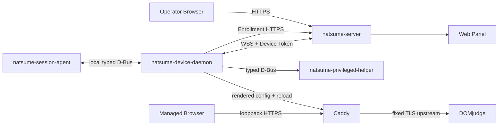

# Natsume V2 系统架构

> 状态：`NORMATIVE`
> 适用范围：Natsume V2
> 当前实现成熟度：Phase 0 工程基线
> 校准基线：[ADR-0030](adr/0030-foundation-deployment-and-delivery-baseline.md)
> 相关文档：[领域模型](domain-model.md) · [边界契约](contracts.md) · [状态与执行](state-and-execution.md) · [安全与恢复](security-recovery.md)

## 0. 当前拓扑与目标拓扑

正文中的 `Enrollment HTTPS`、Device Token 与 Bearer WSS 仍是当前 authority 拓扑，在 atomic cutover 前保持权威。

[ADR-0038](adr/0038-unified-ordinary-wss-device-control-authority.md) 的原位 wire/crypto/schema foundation 已开始落地：production Proto 是单一六文件 `natsume.device.control` package，subprotocol 为 `natsume.control`，定向 handshake/Active envelopes（Server Challenge|Bundle|Activated|SessionReady；Client Proof|Ack|Ready）、strict signature transcript、Prost semantic canonicalizer 与 control-key/bundle persistence facts 已存在但无 runtime authority consumer。无 `ClientInit`、无 `ControlEnvelope`、无 Hello。项目不维护旧/新 package 兼容层。**2026-08-20**：Identifier 统一为 `device_id`；已删除 `devices.control_authority_revision`，当前 control key 由 `device_control_keys.status = 'active'` 表达。

尚未实现的目标 runtime 是：普通 server-auth TLS/WSS 内完成 Challenge/Proof；Enrollment purpose 使用 durable canonical UUIDv7 `enrollment_id`，依次交换 `CredentialBundle`、`CredentialAck`、`EnrollmentActivated` 与 `EnrollmentReady`，最后才签发 `SessionReady{session_id bytes}`；Active manifest 的 reconnect 使用结构化 `ResumeSession` purpose。由启动为空的动态 registry 创建统一 DeviceActor，并在同一 socket 进入 Active。无 `ClientInit`、无 Hello、无 `ControlEnvelope`、无 `ProofIntent` enum。Token/public Enrollment HTTP 只有在 atomic flag day 才删除。

## 1. 目标

Natsume 为单场竞赛现场提供以下能力：

1. 从固定 CSV 导入 Seat、account 和 password；
2. 将 Seat 绑定到受管理工作站；
3. 以显式命令同步非秘密状态和密码；
4. 在 provisioning 窗口内为 Device 签发 Token 与 Gateway certificate；
5. 在工作站本地提供受控浏览器数据面与 DOMjudge 自动登录；
6. 编排受管桌面会话和 Home 准备；
7. 让操作员看到 Target、Observed、Drift、Command 和审计记录；
8. 在身份、凭据、证书或 Home 无法证明安全时停止敏感操作。

架构优先级依次是：

1. 身份和秘密安全；
2. 可审计的显式副作用；
3. 离线稳态和可恢复性；
4. 低耦合、高内聚；
5. 可验证、可打包和可运维；
6. 与 [ADR-0030](adr/0030-foundation-deployment-and-delivery-baseline.md) 部署事实相称的实现规模。

## 2. 产品范围

### 2.1 包含

- 一个 Server 实例服务当前一场竞赛；
- 当前单场竞赛的一份可重复 import 的 confirmed contest configuration；
- `seat,account,password` CSV；
- Device 注册（provisioning 窗口）、绑定、配置和状态；
- Device Token 与 Gateway certificate；
- operator Web Panel（admin/viewer 两级角色）；
- Caddy 到 DOMjudge 的本地 HTTPS 数据面与 `/login` 自动登录注入；
- Session Agent、受管会话和 Home 准备；
- 审计、命令状态和恢复流程。

### 2.2 不包含

- 多 Event、跨赛事历史业务模型或运行时 phase；
- XLSX/ODS 或任意列映射；
- 密码导出；
- Device merge/split；
- 通用远程 shell、文件管理或任意 systemd unit 控制；
- 任意反向代理配置平台；
- Server 高可用或多控制器一致性；
- ACME、TOFU、运行时下载或 postinstall 下载；
- 多桌面环境同时支持（每周期单镜像，[ADR-0035](adr/0035-session-home-and-desktop-cycle.md)）；
- 可编辑的角色/权限模型（固定 admin/viewer）；
- 对本地 root、物理攻击者或固件篡改的防护；
- 将 Session lock 或遮罩 UI 当作网络隔离/完整性边界。

需要进入这些范围时，必须先新增 ADR，而不是在现有接口中加入特例。

## 3. 系统上下文



该图表示信任和调用方向，不表示所有组件已经实现。Operator HTTP、Enrollment 与 Device WSS 共用同一 TCP 端口（[ADR-0033](adr/0033-enrollment-and-device-control-boundary.md)）。

## 4. 进程与职责

### 4.1 `natsume-server`

拥有：

- operator 身份、授权（admin/viewer）和 HTTP API；
- CSV preview 与 commit；
- Server truth（当前 Seat 集合、Seat→Account mapping、credential 的 current-fact（当前事实）与当前 Binding；无 Seat-universe freeze、generic instance state 或业务 snapshot history）；
- Target 计算；
- Device lifecycle 和 binding；
- provisioning 窗口状态；
- Enrollment：Device Token 与 Gateway certificate 签发（origin CA key 保管）；
- WSS Device control；
- direct single-Device Command persistence（`commands` 使用 `frozen_payload_json` 保存 typed frozen content，作 operator 审计）与按 Converge/Oneshot 二分的 dispatcher；
- Server vault；
- AuditEvent；
- Web Panel 静态资源或集成入口。

不得：

- 直接访问工作站本地文件、桌面或 Caddy；
- 把 password 明文、private key 或 Device Token 值加入 Target、Observed、普通 API/Browser 可见响应、日志、指标、audit diff 或导出；
- 将 Web request 生命周期当作远端副作用完成边界；
- 在 provisioning 窗口之外签发任何 token 或证书。

内部模块边界见 [仓库布局](repository-layout.md)。

### 4.2 Web Panel

拥有：

- operator 交互；
- Preparation Center；
- Device、binding、Target、Observed、Drift、Command 和 Audit 视图（轮询刷新）；
- 在每个 direct Command create 前生成 canonical lowercase hyphenated UUIDv7 `command_id`，并调用 `PUT /api/v2/commands/{command_id}`；
- 人工触发 `SYNC_STATE`、`SYNC_SECRET`、session/home 操作；
- provisioning 窗口开关入口；
- enrollment 凭据替换请求的待审批视图与批准/拒绝动作（[ADR-0033](adr/0033-enrollment-and-device-control-boundary.md)）；
- 可访问性和错误呈现。

不得：

- 保存密码到浏览器持久化存储；
- 自行计算权限、Target 或 Drift；
- 本地重算 import diff classification；只渲染 Server 返回的结构化 preview；
- 解析错误显示文本作业务判断；
- 让 Server 为同一请求生成/替换 Command ID，或以 Device journal / 重连重放 Oneshot 补充投递语义；
- 宣称命令已完成，除非 Server 状态已经确认。`OPEN_BINDING_PROMPT` 的 Server `succeeded` 只表示 Device 已打开 binding-prompt screen，不表示绑定已确认。

### 4.3 `natsume-device-daemon`

拥有：

- identity-before-credentials 启动检查；
- Client 凭据文件（Device Token、Gateway key/leaf、Seat 凭据、LKG）；
- Enrollment 客户端（含 Gateway CSR）；
- WSS 控制连接；
- Converge 命令的领域键幂等执行（`canonical_hash` / `credential_revision` / `home_epoch`）与 Oneshot 的 live-socket 执行；**不**维护 Device command journal；
- Target 应用和 Observed 采集；
- Caddy 配置渲染（含 `/login` 自动登录注入）、validate、原子激活与 LKG 回滚；
- Session Agent 协调；
- Home transaction 编排；
- 离线稳态。

不得：

- 直接执行网络输入给出的路径、UID、unit、命令或 upstream；
- 把一个传输 handler 同时作为凭据、Caddy 和 Home 的业务实现；
- 将密码返回给 Server、Agent、浏览器或普通日志；
- 在身份不确定或凭据文件损坏时自动 re-enroll 或重建凭据。

内部必须分离 transport、application、domain、port 和 adapter。见 [仓库布局](repository-layout.md)。

### 4.4 `natsume-privileged-helper`

拥有最小 root 权限能力，例如：

- 受限硬件标识采集；
- 固定 contest user 和 Home backend 所需的受限系统操作；
- 由封闭枚举定义的少量特权动作。

不得：

- 建立外部网络连接；
- 持有 DOMjudge 密码、Device Token 或 Gateway private key；
- 接受任意 shell、任意路径、任意 UID、任意 unit 或任意环境变量；
- 读取 Server vault 或 Client 凭据文件；
- 代替 Device Daemon 作业务决策。

Helper 的每个方法必须是独立、可审计、参数封闭的 capability。

### 4.5 `natsume-session-agent`

拥有：

- 由系统级 XDG Autostart 在当前图形会话中直接启动；
- 当前会话资格和 singleton 验证；
- typed snapshot 的本地展示（view kind 为封闭 enum，可经版本升级扩展）；
- Seat/binding 提示（`OPEN_BINDING_PROMPT` 空 body，打开 screen 即 Command 成功；现场确认/拒绝走 `BindingRequest.seat_code`）；
- lock/unlock 等经授权的会话交互；
- focus-denied 等 UI 结果报告。

不得：

- 使用 systemd user unit；
- 使用 bootstrap/run 两阶段或环境转交文件；
- 读取凭据文件、密码、Device Token 或 Gateway private key；
- 管理 Caddy；
- 调用 Server；
- 依赖外部 GUI helper 或 runtime UI interpreter。

### 4.6 Caddy

拥有：

- package-pinned binary 和固定 module closure；
- loopback HTTPS（Gateway certificate）；
- BLOCKED 状态页；
- READY 时代理固定 DOMjudge upstream（TLS）；
- 仅 `/login` 路由的 X-Headers 自动登录注入（[ADR-0034](adr/0034-state-execution-and-data-plane-boundary.md)）；
- `Accept-Encoding` 透传（brotli 在 upstream 完成）。

不得：

- 决定 Device 身份、binding、授权；
- 接收自由格式 upstream、路径或配置片段；
- 因 Session lock/unlock 变更配置；
- 在证书或配置未验证时代理 upstream；
- 在 `/login` 之外的路由注入凭据头。

### 4.7 Managed Browser

拥有：

- 访问固定 loopback HTTPS origin；
- 竞赛现场允许的浏览器策略。

不得：

- 直接访问 Device control 或凭据文件；
- 绕过 Caddy 访问由 Natsume 管理的 upstream；
- 被视为秘密存储。

### 4.8 DOMjudge

是外部竞赛系统。Natsume 只依赖已冻结的访问契约，不拥有其用户、比赛或认证实现。部署前提（在平台文档冻结并经 contract lab 验证）：版本与 endpoint；`auth_methods` 含 `xheaders`；web server 启用 brotli；upstream 至少 `/login` 为 TLS。

## 5. 信任边界

| 边界 | 认证 | 数据类型 | 失败策略 |
|---|---|---|---|
| Operator → Server | operator session/固定角色 | 人类控制面 | 拒绝并审计 |
| Device Enrollment → Server | server-auth HTTPS + provisioning 窗口 | 硬件身份证据、Gateway CSR | 窗口关闭或校验失败即拒绝，零状态变更 |
| Device control ↔ Server | server-auth TLS + Device Token（WSS） | typed protocol、Command、Observed | 认证失败 401（解码前）；协议失败断开 |
| Device Daemon → Helper | 本地 system D-Bus + OS policy | 封闭特权请求 | 拒绝且不降级 |
| Agent ↔ Device Daemon | 本地 session-aware typed IPC | UI snapshot 和会话动作 | lease/当前 session 失效 |
| Browser → Caddy | loopback HTTPS | 页面和 DOMjudge 流量 | BLOCKED/503 |
| Caddy → DOMjudge | 固定 TLS upstream（`INV-DATAPLANE-02`） | 竞赛数据面与 `/login` 凭据注入 | 不健康或非 TLS 则 fail closed |

信任边界之间不得共享"全能 context"或未分类秘密。

## 6. 分层与依赖方向

每个有业务逻辑的进程应采用以下方向：

```text
transport / presentation adapters
              ↓
application use cases
              ↓
domain policies and value objects
              ↓
ports
              ↓
database / credential / protocol / OS adapters
```

规则：

1. domain 不依赖 Axum、具体持久化 adapter、zbus、Slint 或 Caddy；
2. application 不暴露数据库 row、Protobuf message、D-Bus object 或 HTTP schema；HTTP adapter 持有 `serde` / `utoipa` DTO 并负责与 application value object 转换；
3. adapter 负责结构转换和公开错误映射；
4. transport handler 只完成认证、解码、调用 use case 和编码；
5. 跨模块调用使用明确 port 或 command，不直接跨表写入；
6. composition root 可以依赖所有模块，但不得包含业务规则；
7. shared crate 只承载稳定、至少两个生产消费者使用的契约。

## 7. 数据所有权

| 数据 | 唯一 Owner | 允许消费者 |
|---|---|---|
| confirmed contest configuration / current Seat collection | contest-domain | Target、Web、CSV；无 Seat-universe freeze 或业务 snapshot history |
| account 标识与当前 Seat→Account mapping | contest-domain | Target、Web；`account_mappings` 由 Import Commit 唯一写入 |
| password 明文 | Server vault / Client 凭据文件的短生命周期 use case | secret sync、自动登录配置渲染；`server_vault_records` 按 `account_id` 与 `accounts` 一对一 join，每个 Account 仅当前 ciphertext，无独立 `vault_record_id` |
| Device lifecycle | device | Web、Target |
| Device Token（哈希）与 Gateway certificate 终态 | device | WSS 认证与 Enrollment adapter；`device_tokens` 仅保存 device/request/hash |
| Enrollment request workflow | device | Enrollment HTTP、operator review、凭据签发 |
| provisioning 窗口 | provisioning | Enrollment、Web |
| 当前 Seat↔Device Binding | contest-domain | Target、session；Binding-set mutation 仅 bind/unbind/rebind，bind 铸造新 `binding_id` occupancy UUID。Import 不写入 Binding、不铸造 `binding_id` |
| Target | configuration-target | dispatcher、Web |
| Observed snapshot | device-control | Drift、Web；按 `device_id` 的 current row |
| direct single-Device Command | command-dispatch | Web、audit；Panel-owned UUIDv7 ID，typed content 位于 `frozen_payload_json` |
| Server certificate/key | pki | Server TLS adapter |
| origin CA key | pki | Enrollment 签发 use case |
| Gateway certificate/key | Client 凭据文件 | Caddy 配置渲染 |
| Machine Hardware ID | identity startup | Enrollment、Observed |
| 本地 session 身份 / `home_epoch` | local runtime domain | Agent/Home adapters；WSS Oneshot 为空 body，不携带 SessionTarget |
| AuditEvent | audit module | operator query/export |

数据库表是模块实现细节。一个模块不得通过任意 SQL 写入另一个模块拥有的状态。

## 8. 关键业务流程

### 8.1 CSV 到 Server truth

```text
upload（全局单非秘密 pending candidate）
  → strict parse（invalid 不落库；密码只在请求体解析期内）
  → 计算 redacted diff 与 nonsecret fingerprint
  → 持久化 pending 草稿（零 confirmed 写入、零 vault 写入）
  → server-computed redacted preview（opaque preview_token）
  → explicit Import Commit（同一 CSV + Natsume-Preview-Token）
  → fingerprint 常量时间比对（IMPORT_CANDIDATE_MISMATCH 则零写入、candidate 保留）
  → 将删座位若仍绑定则拒绝（IMPORT_SEATS_STILL_BOUND，零写入）
  → 替换 Seat / mapping / credentials（零 Binding 写入、零 `binding_id`）
  → redacted AuditEvent
  → 删除 pending 草稿
  → Target 可重算（仅非秘密 material 变化时）
```

每个 CSV 都是完整的 contest configuration candidate。Seat collection 不冻结，confirmed configuration 只表示当前 Seat、Seat→Account mapping 与 current credential；`account_mappings` 由 Import Commit 唯一写入，**仅 bind/unbind/rebind** 才铸造或删除 `binding_id` occupancy。不存在全局 configuration 或 binding-set clock。**Material** Import Commit 才替换 confirmed contest configuration；**no-op** 只记录 lineage 与 redacted AuditEvent，不铸造 `binding_id`、不触发 Target churn。material 与 no-op 都只在**非秘密**维度上由 seats/mappings diff 定义：任何已提交的 import 都无条件以新 nonce 替换每个 Account 的 vault ciphertext 并推进其 `credential_revision`（[ADR-0031](adr/0031-contest-import-and-secret-evidence.md)），随后由操作员显式发起批量 `SYNC_SECRET`。preview 不持久化密码、不写 vault。commit、discard 和 expiry 终止 candidate 时只删除 `pending_import_candidate`，只保留 redacted audit。Import Commit 不创建 Command，不产生 Device I/O，**不修改 Binding**，也不对任何 revision 做 CAS。fingerprint 不一致可重试原文件；将删座位仍绑定须重新 preview，且不改变 confirmed truth。权威规则见 [领域模型](domain-model.md) 与 [ADR-0031](adr/0031-contest-import-and-secret-evidence.md)。

### 8.2 Device Enrollment（provisioning 窗口内）

```text
identity-before-credentials（ADR-0032 配方）
  → server endpoint/trust validation（预置 CA + IP-SAN）
  → 本地生成 Gateway keypair + CSR
  → server-auth HTTPS enrollment 请求
  → Server：窗口门禁 → 校验 → resolution 判定
      ├─ create_device（未知 hardware ID）
      │    → 同一事务签发 { Device Token + Gateway leaf } + 审计
      └─ replace_device_credentials（hardware ID 已有 Device）
           ├─ 同一 SPKI → 自动批准，同上同步签发
           └─ 不同 SPKI → 202 pending → operator 审批（零签发）
                → Device 幂等重投观察到 approved
                → 该次请求内同步签发 { Device Token + Gateway leaf } + 审计
  → Client 校验响应（SPKI/chain/SAN）
  → 本地原子持久化（token 0600、gateway 0640）
  → WSS 控制连接（Bearer token）
```

窗口关闭后 Server 拒绝一切签发，未被 claim 的 `pending`/`approved` request 转为 `expired`。窗口只有一个 current singleton；restart/restore 若发现 `open`，以同事务 audit+CAS close-once，若已 `closed` 则零写入。首次 Enrollment 同步完成且不需要审批；凭据替换是受审计的 operator 审批路径，只有同 SPKI 的重试自动批准（[ADR-0033](adr/0033-enrollment-and-device-control-boundary.md)）。operator 拒绝后 Device 收到稳定码并停止，等待现场人员介入。

### 8.3 非秘密状态同步

```text
operator starts SYNC_STATE
  → Panel generates canonical UUIDv7 command_id
  → PUT /api/v2/commands/{command_id}（operator 审计；same canonical request = existing Command）
  → Target snapshot 与 canonical_hash 被冻结
  → live WSS 投递；若已 applied_hash 相同则 no-op
  → Device validates and stages state
  → Caddy 配置渲染 → validate → 原子激活（失败回滚 LKG）
  → Observed slim snapshot（applied_hash / gateway_state）
```

`SYNC_STATE` 是 Converge 命令，不涉及任何签发。PUT 的首次 create/replay/conflict 只表示 Server 已记下意图。断线后若 `canonical_hash` 仍 drift，Server 重推同一 payload；Device 无 command journal。

### 8.4 密码同步

```text
operator starts SYNC_SECRET
  → Panel generates canonical UUIDv7 command_id
  → PUT /api/v2/commands/{command_id}（operator 审计）
  → current assignment、`binding_id` 与 credential_revision are frozen
  → secret read from current Server vault record
  → live WSS 投递；installed_credential_revision 已相同则 no-op
  → Device validates current Binding row and `binding_id`
  → 凭据文件原子更新
  → Caddy /login 注入配置重渲染并原子激活
  → secret is discarded from transient buffers
  → Observed reports installed_binding_id + installed_credential_revision
```

没有自动 secret sync。PUT 相同 ID+相同 canonical request 只返回既有 Command。Converge 正确性看 `credential_revision`，不是 Client journal。

### 8.5 Session/Home

```text
current binding and home_epoch
  → prepare Home transaction（同 epoch 可重入）
  → prove backend result
  → start/validate graphical session
  → XDG Autostart starts Agent
  → Agent validates current logind session
  → typed UI snapshots and actions
```

Home 无法证明安全时不得启动受管 session。`HOME_RESET` 不拆 daemon WSS；中断经本地状态文件 + RecoverHomeInstance 恢复。Session lock/unlock/terminate/`open_binding_prompt` 是 Oneshot（空 body，live socket，重连不重放），不改变 Caddy。`open_binding_prompt` 打开 binding-prompt screen 即 `CommandStatus` `SUCCEEDED`；确认/拒绝绑定是 Device `BindingRequest{binding_request_id, seat_code}` → Server `BindingResult{binding_request_id, state, error_code}`。`BindingResult` 不携带 occupancy `binding_id`。

## 9. 部署拓扑

### 9.1 Server package

包含：

- `natsume-server`；
- Web assets；
- systemd unit、sysusers/tmpfiles、配置目录；
- migration 和必要静态契约。

Server control certificate 由离线控制根或经批准的离线流程签发。postinstall 不生成 CA/private key，也不下载运行时组件。

### 9.2 Client package

包含：

- Device Daemon；
- Privileged Helper；
- Session Agent；
- 固定 Caddy binary；
- system service、D-Bus policy；
- `/etc/xdg/autostart/org.natsume.SessionAgent.desktop`；
- BLOCKED 状态页静态资源；
- debconf 预置：Server endpoint、Gateway hostname、站点参数；Gateway hostname 与 Server endpoint 使用同一 canonical parser/validator。

Client 包不得包含 Session Agent systemd user unit。

## 10. 可用性与离线稳态

Device 可以在 Server 暂时不可达时继续使用已经验证的本地状态，但不得推断新授权：

- 已验证 LKG 配置可以继续服务；
- 已安装且未过期的 Gateway certificate 可以继续使用；
- 当前有效 binding 的本地凭据可以继续使用；
- 不得在离线时创建新 binding、获得新 token/证书或接受陈旧 revision；
- 重连后通过 slim Observed 与 Converge 领域键（hash/revision/home_epoch）收敛；Oneshot 意图若离线已丢弃，不重放；
- 本地损坏不能通过"自动重建身份"绕过。
