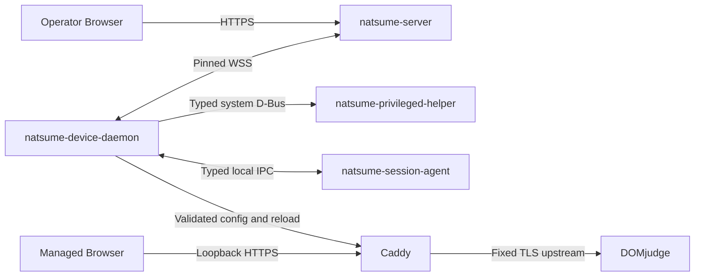

# Natsume V2 目标架构与实施计划

> 状态：`ACCEPTED TARGET`
> 基线日期：2026-08-28
> Session/Home 修订：2026-09-07；GNOME 原生双会话，以 foreground_target 选择等待界面或比赛桌面
> 适用范围：Natsume V2 全系统
> 实施策略：预发布 flag day；协议、数据库、Server、Client、Web 与测试同步切换

本文是仓库中唯一的人工维护架构权威。它同时定义目标系统、模块所有权、安全边界、Device Control 状态模型、目标数据库和实施顺序。功能 PRD 补充产品范围与验收，部署文档落实配置和维护要求；文档入口见[文档索引](README.md)。GNOME 双会话的产品范围见[功能 PRD](prd-gnome-dual-session.zh-CN.md)。

本文描述的是目标状态，不是完成声明。当前代码与本文冲突时，冲突属于待实施债务，不能反向限制目标架构。

## 1. 权威来源与阅读规则

各类事实只有一个权威来源：

| 事实 | 权威来源 |
|---|---|
| 产品边界、组件职责、数据所有权、安全和实施顺序 | 本文 |
| Device Control wire 字段、field number、presence 与 descriptor | `crates/device-protocol/proto/*.proto` |
| HTTP API 的精确公开 schema | Server OpenAPI 生成源与生成物 |
| 本地 IPC 的精确接口 | `crates/local-control-api` 与 D-Bus introspection |
| SQLite 物理表、列、索引与约束 | 完成 flag day 后的 `server/migrations/00000000000001_initial/up.sql` |
| Diesel 生成类型 | `server/diesel/schema.rs`，必须由 migration 重建 |
| Device Control `error_code` 字段与开放token语法 | `crates/device-protocol/proto/*.proto` 与 `crates/device-protocol` |
| HTTP公开错误码与status映射 | Server OpenAPI生成源与HTTP adapter |
| 本地IPC typed失败 | `crates/local-control-api` 与各IPC adapter |
| 构建、依赖和发布版本 | Cargo、pnpm、打包配置与 lockfile |

规则：

1. 不在第二个 Markdown 文件建立并行架构 authority；PRD 与验证材料引用本文，历史实验不覆盖当前目标语义。
2. Proto 和 migration 是机器可执行契约，但不能自行创造与本文相反的业务语义。
3. 生成代码不能手工编辑。
4. 当前 migration、Rust adapter、OpenAPI 或 Web 代码若仍表达 Command、Token、Bundle 或 Observed 旧模型，均视为同步债务。
5. 本次发布前不存在对外兼容基线；删除旧字段不保留 `reserved`，编号按当前结构压紧。
6. flag day 中间提交可以暂时不可运行，但不得进入部署包或形成双协议、双 authority、双 schema fallback。

## 2. 系统目标与非目标

Natsume 服务一场现场竞赛，目标规模约 500–600 台工作站。一个 Server 实例只维护当前赛事，不建模多 Event 或跨赛事业务历史。

系统必须提供：

1. 固定 XLSX 全量导入学校、队伍、Seat、DOMjudge Account 与密码。
2. Device 注册、人工审核、启用、禁用、撤销和重新部署。
3. 现场 Seat→Device Binding。
4. Server Desired State 与 Client Actual State 的持续收敛。
5. Gateway credential 签发、Caddy 配置和 DOMjudge 自动登录。
6. Runtime Config、图形 Session 和 contestant Home 控制。
7. admin/viewer Operator、Web Panel、best-effort可观测性和恢复证据。
8. 网络中断与单进程重启后的确定性恢复。
9. 身份、秘密、证书或本地状态不可证明安全时 fail closed。

系统明确不提供：

- 多 Server 高可用、分布式共识或多写数据库；
- 多赛事并存、Event timeline 或历史配置快照；
- 通用远程命令、shell、文件管理、任意 systemd 控制；
- 通用 resource/plugin marketplace；
- 动态 JSON/`Any` 控制协议；
- ACME、TOFU 或跳过证书校验的开发回退；
- 对工作站本地 root、物理攻击者或固件篡改的防护；
- 自动 Device merge/split 或静默身份迁移；
- 多桌面环境同时支持；
- 可编辑角色和权限策略；
- 业务审计账本、操作历史或审计Panel；
- 将 UI 遮罩、会话切换或 Caddy 状态页当作强隔离边界。

## 3. 核心设计原则

### 3.1 Authority 明确

Server committed truth、Server Intent、Client Input、Concrete Target 和 Client Actual 是不同事实。任何一层都不能被另一层的消息隐式推进。

### 3.2 完整状态代替操作投递

系统没有 Device Command delivery plane。远控效果由完整 Desired State 持续收敛，不保存 queued、in-flight、Ack、outcome unknown 或投递历史。

Operator HTTP Target 提交保留去重 receipt：只记录规范化请求、操作者和已提交的逐设备结果，
不记录 Client 执行、投递、Ack 或历史进度。它保证网络重试不再次推进 terminate/reset epoch。

### 3.3 业务纵向组件化

每项业务拥有自己的规则、数据库访问、事务、Operator 操作和查询。Transport 与 Actor 只调度组件，不理解组件内部状态。

### 3.4 静态类型和静态组合

所有资源在编译期可见。新增资源必须同时增加 Rust 类型、Proto 字段、组件实现、验证和测试。禁止字符串资源名、运行时 downcast、通用 payload 和动态注册表。

### 3.5 Crash-safe、幂等、可重放

每个成功 wire barrier 必须晚于它证明的 durable fact。重复的完整状态不得重复分配 identity、Binding、证书或副作用。

### 3.6 KISS 与 YAGNI

只实现当前系统确实需要的抽象：

- trait 统一同类生命周期，不统一语义不同的业务；
- static dispatch 优先于 trait object；
- 明确调用优先于宏、tuple magic 或通用执行器；
- 一个资源一个组件，不为每个字段或状态创建组件；
- 没有第二个真实消费者时不创建共享 crate；
- 没有测量瓶颈时不并行组件事务；
- 没有跨组件原子不变量时不创建协调事务。

## 4. 系统上下文与进程



### 4.1 `natsume-server`

Server 是唯一业务 authority，拥有：

- Operator 账户、会话和角色；
- Contest Seat、Account、Seat→Account mapping 与 Server vault；
- Import preview/commit；
- Provisioning window；
- Enrollment review 与 Device control key；
- Device lifecycle；
- Binding negotiation 与 occupancy；
- Gateway credential generation 与 Origin CA；
- Runtime、Session 和 Home 的 Server target；
- 当前lease的latest Actual与receive-time，仅存在于对应DeviceActor内存；Client Input
  经整体校验和组件消费后丢弃；
- Operator HTTP API、Web 静态资源和 Device WSS。

Server 不直接操作工作站文件、Caddy、图形 Session 或 Home。

### 4.2 `natsume-device-daemon`

Daemon 是工作站系统级协调器，拥有：

- identity-before-credentials 启动；
- control key、Enrollment recovery marker；
- Gateway private key、CSR 与证书 artifact；
- pinned WSS 连接；
- 完整 Client Input/Actual 发布；
- 完整 Server Target 分发；
- 各资源 Client Reconciler；
- Caddy 配置生成、validate、reload 和 LKG；
- 与 Helper、Session Agent 的 typed IPC；
- 离线安全稳态。

Daemon 不把网络字段直接解释成任意路径、UID、unit、命令或配置片段。

### 4.3 `natsume-privileged-helper`

Helper 只提供封闭的 root capability：

- 读取固定硬件身份来源；
- 对固定 waiting/contest 角色执行受限 Session 查询、激活和恢复，仅对 contest 执行 Home 操作；
- 对固定目录和固定 policy 执行必要的特权文件操作。

Helper 不联网，不持有 DOMjudge 密码、control private key、Gateway private key 或 Server trust decision，不接受任意 shell、路径、UID、unit 或环境变量。

### 4.4 `natsume-session-agent`

waiting 使用发行版官方 GNOME Kiosk 的原生 X11 会话（当前入口 `gnome-kiosk-script-xorg`），contest 使用完整 GNOME（`ubuntu-xorg`）。Agent 由 Kiosk 的 `org.gnome.Kiosk.Script.service` 启动，包内固定 drop-in 将 ExecStart 指向 Agent，并限制为 waiting 用户。Agent 拥有：

- 普通等待时的全屏静态占位：本期默认纯黑色块，也可由镜像随包提供单张 ICPC logo，缺图时回退纯黑；
- 既有部署 Binding 窗口；
- Binding pending状态；
- 窗口生命周期、首帧就绪和 UI lease。

等待占位复用现有 Slint/Skia 渲染能力，保持一个随窗口尺寸变化的无装饰全屏窗口。普通等待、重置和恢复期间均可显示同一占位，不要求动态文案、进度条或动画；详细状态由 Panel/Actual 展示。Binding 是既有部署流程的专用页面，不新增绑定协议。未来复杂 Skia 页面只替换 Agent 内的等待内容；本期不预建页面插件、主题协议或远程图片下发能力。

Agent 不连接 Server，不管理 Caddy，不读取 credential；不自行启动或控制用户服务。“显示等待界面 / 显示比赛桌面”由 Daemon 通过 Helper 激活 waiting/contest 实现，不调用桌面 Lock/Unlock，也不向 Agent 发送会话切换命令。失联撤销 Binding 输入并保留占位，不能隐藏窗口暴露可操作桌面。

GNOME Kiosk 的用户服务是 Agent 的唯一启动与重启所有者；不同时使用全局 XDG Autostart、Agent RegisterClient 或另一个 keeper。服务配置 `Restart=always`、1 秒间隔及 60 秒内最多 5 次启动。Daemon 根据连续展示故障观测冷却至少 60 秒，再请求 Helper 自动重建 waiting；任何可信的就绪观测均结束该连续故障区间。Helper 持有本次 boot 最多一次的恢复预算，不因 lease 更新或服务重启而重置。再次失败报告展示不可用，等待维护；不终止 contest 或重启 GDM。若捕获的旧 waiting 已消失且 GDM 已自动建立唯一、健康的新 waiting，Helper 复用它并完成持有的恢复窗口，保留已消耗预算，不追杀 replacement。waiting readiness 核对 SessionManager 与 Kiosk，contest 核对 SessionManager 与 Shell；两边还需对应 Xorg 的电源与有效输出观测，不能依赖 Mutter 的缓存电源属性。Agent 的当前首帧与 lease 仍是独立必要条件，显示尺寸改变时撤销旧帧并等待实际重绘。

### 4.5 Caddy、Browser 与 DOMjudge

Caddy 只负责本机数据面：

- 固定 loopback HTTPS origin；
- 加载 Server 授予的 Gateway leaf；
- BLOCKED 503响应；
- 代理固定 HTTPS DOMjudge upstream；
- 只在 `/login` 注入`X-DOMjudge-Login`和base64编码的`X-DOMjudge-Pass`；
- 其他 route 不注入 credential。

Runtime Config 的 DOMjudge HTTPS origin 只由Server部署配置提供和修改，不暴露
Operator HTTP/Web mutation。它不能改变Control Endpoint、Server trust root或Gateway
hostname；这些都是部署期不可远程修改的bootstrap参数。

## 5. 信任、身份与秘密

### 5.1 信任边界

| 边界 | 认证 | 失败策略 |
|---|---|---|
| Operator → Server | 数据库中的 Operator session 与固定角色 | 拒绝，按可观测性规则记录诊断结果 |
| Device → Server | pinned server-auth TLS + connection challenge + Ed25519 proof | protobuf 前后均 fail closed |
| Daemon → Helper | system D-Bus policy + 封闭方法 | 拒绝，不降级 |
| Agent ↔ Daemon | 总线调用者 PID/UID + 精确 waiting boot/session + typed IPC | stale Session/lease 失效 |
| Browser → Caddy | loopback HTTPS | BLOCKED 或不可用 |
| Caddy → DOMjudge | 固定 HTTPS upstream | 非 TLS、验证失败或配置不完整时 BLOCKED |

### 5.2 Machine identity

Machine Hardware ID 是自然键和路由证据，不是认证凭据。

Client 使用固定三个来源：

1. DMI system UUID；
2. DMI motherboard serial；
3. 第一块 system disk serial。

经过固定 normalization、placeholder 拒绝和 2-of-3 判定后，以 Helper 内固定的 Natsume 命名空间 `de1ae196-317f-5204-880f-0b5256c98ce6` 派生 UUIDv5。该常量由 `UUIDv5(NAMESPACE_URL, "urn:natsume:machine-hardware-id:v1")` 固定，不能随版本或部署改变；相同硬件证据跨部署得到相同 Hardware ID。配置和本地 IPC 不接收站点 UUID，identity.json 只保存 machine_hardware_id。原始 serial 不发往 Server、不写日志、不进入 fixture。Enrollment wire 只携带派生 Hardware ID 外层 proof context和 aggregate `MEDIUM`/`STRONG` advisory quality。

无法形成 quorum 时必须停止 identity-bound adapter 初始化；不得读取旧 credential 后猜测身份。

### 5.3 PKI

存在两个不同的根：

| 根 | 私钥位置 | 用途 |
|---|---|---|
| Control Root | 离线，不在运行中 Server | 签发 Server TLS leaf |
| Local Origin CA | Server 私有状态目录 | 在 Active Session 中签发每台 Device 的 Gateway leaf |

Server TLS leaf 必须包含部署实际 Control Endpoint 的 IP-SAN。Server 只读取离线提供的 leaf/key，不自签、不自动生成回退。

### 5.4 秘密边界

秘密包括：

- Operator password 和 session cookie；
- Server vault master key；
- DOMjudge password；
- Device control private key；
- Gateway private key；
- Server TLS private key；
- Local Origin CA private key。

秘密不得进入：

- 普通 `Debug`、日志、trace、metric；
- HTTP 普通响应；
- Client Input 或 Actual State；
- Client 通用 target journal；
- 错误 source chain；
- 命令行参数、环境变量或包管理脚本。

Server vault 使用 application-level XChaCha20-Poly1305 current-fact 加密；`accounts` 是 vault row 的父表。Client credential 依赖 root-owned 严格权限文件、原子写入与目录权限；当前 threat model 明确不抵抗本地 root。

## 6. 领域 authority 与数据所有权

| 事实 | Owner | 备注 |
|---|---|---|
| Seat、Account、Seat→Account | Contest/Import Component | Import 唯一修改者 |
| Account password ciphertext/revision | Contest/Import + Vault | plaintext 只存在于短生命周期内存 |
| Device lifecycle | Device Component | enabled/disabled/revoked |
| Pending Enrollment review | Device Component memory registry | 仅当前WSS连接有效，Server生成`review_id`供Panel定位 |
| Device control key | Device Component | activation事务后才是durable authority，和Gateway解耦 |
| Gateway generation/grant | Gateway Component | 每 Device 至多一个 current generation |
| Binding negotiation/occupancy | Binding Component | Binding ID 是每次 occupancy 的 UUID |
| Runtime Config | Runtime Config Component | 当前 DOMjudge HTTPS origin |
| Session target | Session Control Component | foreground target + terminate epoch |
| Home target | Home Component | reset epoch |
| 当前lease的latest Actual与receive-time | DeviceActor memory | fresh snapshot；Input消费后丢弃，重连或重启后必须重报 |
| Active control lease | DeviceActor | 只在内存，不持久化 |

Import 不修改 Binding，不创建远端操作，不产生 Device I/O。Binding 和 Gateway 互不授予对方 authority。Client Input 和 Actual 都是不可信报告。

## 7. Device Control 统一状态模型

所有 Active 资源遵守：

```text
ConcreteTarget = Resolve(ServerIntent, ClientInput)
ActualState    = Reconcile(ConcreteTarget)
```

其中：

- `ServerIntent` 是组件内部的完整 Server truth/policy 视图；
- `ClientInput` 是 Client 对当前协商 generation 的不可信输入；
- `ConcreteTarget` 是 Server 给 Client 的完整精确目标；
- `ActualState` 是 Client Reconciler 应用、验证并重新采样后的事实。

Actual State 不进入当前 `Resolve`。当 Actual 需要推动 Server lifecycle 时，组件内部的 Intent Policy 产生 typed transition：

```text
NextServerIntent = DeriveIntent(ServerTruth, Policy, ActualState)
```

transition 必须先提交，再从新 truth 重新 Resolve。不得从提交前推测下一 Target。

### 7.1 四个 wire plane

Server 完整快照：

```text
ServerStateSnapshot
  intent: ServerIntentState
  target: ConcreteTargetState
```

Client 完整快照：

```text
ClientStateSnapshot
  input: ClientInputState
  actual: ActualState
```

规则：

- 每帧 replace latest，不是 delta；
- 缺字段表达协议定义的 exact absence，绝不继承旧帧；
- `ConcreteTargetState` 和 `ActualState` 的资源字段语义校验后必须完整；
- Unit-input 资源不伪造空 Intent/Input wire message；
- 无全局 snapshot revision、configuration clock 或 resource version；
- 关联使用资源自己的 `credential_id`、`negotiation_id`、`binding_id`、`credential_revision` 和 epoch；
- 重复相同状态必须是 no-op。

### 7.2 Level 与 Transition

Level 持续要求 exact convergence：

- Gateway leaf；
- Binding access；
- Runtime Config；
- Session 前台选择（`foreground_target`：waiting 显示等待界面，contest 显示比赛桌面）。

Transition 通过单调 epoch 表达需要至少执行一次的目标：

- terminate Session；
- reset Home。

Level 和 Transition 都属于 Concrete Target，不形成第二套 Command 模型。

## 8. WSS、Enrollment 与 Session lease

### 8.1 Transport

Operator HTTPS 与 Device WSS 可以共用一个 Server listener。Device 只连接固定
`/api/v2/device/control` route，并使用唯一 pinned `natsume.control.v3` WSS subprotocol。
每个完成重组的 Protobuf frame 最多 65,536 bytes。这个上限同时适用于 Handshake
与 Active frame，不再为单个消息类型建立重复上限。一个 wire generation 只有一个
descriptor，不维持旧/新双栈。

`ClientProof.signature` 是 Ed25519 对下列 32-byte SHA-256 digest 的签名：

```text
SHA-256(
    "NATSUME-DEVICE-CONTROL-CLIENT-PROOF\0" ||
    0x01 ||
    UTF-8("/api/v2/device/control") || 0x00 ||
    UTF-8("natsume.control.v3") || 0x00 ||
    challenge_nonce ||
    public_key ||
    purpose ||
    UTF-8(machine_hardware_id)
)
```

`challenge_nonce`和`public_key`分别固定为exact 32 bytes，`purpose`固定为单字节：
Enrollment是`0x01`，Resume是`0x02`，缺失purpose非法；canonical Machine Hardware ID
固定为36-byte ASCII并位于末尾。因此字段边界不使用length prefix。两种purpose使用完全
相同的transcript，没有Enrollment专属后缀；签名端从private key推导`public_key`，
Enrollment验签使用proof内exact `candidate_public_key`，Resume验签使用Server数据库
选出的current control public key。

transcript不依赖Prost或任意收到的wire bytes。Daemon/Agent版本和Enrollment evidence
quality是经TLS传输的自报审核metadata，不属于identity proof。协议crate统一transcript、
签名和strict verification，但不选择authority key，也不校验Enrollment/Resume的业务
presence、ID、版本或状态组合。

成功升级后：

```text
production WSS route
  → device_control::serve_connection
      → ServerChallenge
      → ClientProof
      → Enrollment flow 或 Resume flow
      → final exact authority/lifecycle check
      → DeviceRegistry attach
      → SessionReady
      → first ClientStateSnapshot
      → Active full snapshots
```

WSS route只移交socket和进程共享的`Arc<DeviceControl>`，不编排Device、
Provisioning、admission和Registry的中间步骤。`serve_connection`是单条连接的
唯一application orchestration入口；admission的proof、pre-auth和ready barrier都不
泄漏到transport或其他组件。连接期最终只向attach流程交付现有
`ControlAuthority`，不再建立admission ticket、attachment ID或authority generation。

`ServerChallenge` 的超时只约束当前连接唯一 `ClientProof` 的提交窗口，不是 Enrollment TTL。

### 8.2 Enrollment

Enrollment 只注册 Device control authority，不签发 Gateway credential，不承载 Binding 或业务配置。

连接期Enrollment material：

```text
EnrollmentAttempt
  candidate_public_key
  evidence_quality
```

Server另外从proof context取得Machine Hardware ID和版本信息。Client必须在proof前crash-safe持久化candidate private key，但pending review本身不持久化。Server为Panel生成仅在当前进程和连接内有效的`review_id`。

`PENDING_REVIEW`和`DENIED`都是当前WSS上的状态，不是跨连接authority；没有offline approval、attempt TTL、业务activation deadline或sweeper。Pending期间Client通过WebSocket Ping/Pong证明连接活性，任一端超过固定静默期限即关闭连接，Server同时移除仍未被审批领取的review。

完整规则：

1. Client在发送proof前持久化candidate control key；重连可以继续使用该key，但每条连接都建立全新review。
2. Server先检查candidate public key是否已经是该Machine Hardware ID对应Device的current control key；若是，直接重放已提交authority，不再次审核。
3. 其他Enrollment进入连接期pending review。Provisioning window为open时自动审批新请求及当前在线的待审请求；closed时保留请求等待管理员批准或拒绝。窗口控制自动审批，不阻止创建review。
4. Pending registry以`review_id`保存经过验证的非秘密evidence；同一entry持有一个
   进程内一次性完成通知sender，originating connection持有receiver。registry中仍存在该`review_id`就表示
   当前连接仍持有该review，它不是authority，也不缓存可能漂移的current Device ID。
5. 自动审批与管理员审批都只能批准当前仍存在的review，原子移除对应
   `review_id`；管理员审批不受窗口状态限制。同一进程内的审批串行，并在activation前按evidence中的Machine
   Hardware ID实时读取current authority。activation完成后通过该entry的一次性通知把结果交回原连接。
   连接断开也移除同一个ID，不建立第二个attachment标识，不轮询审批结果。
6. Deny只通知并终止当前连接；需要跨连接封禁时必须建立明确的Device lifecycle/denylist authority，不能复用attempt状态。
7. 连接在activation commit前断开时直接删除pending review；Client重连后重新审核。
8. Control-key replacement在activation commit前保留旧authority和旧lease。
9. activation事务原子创建/更新Device并切换current control key；成功commit是Enrollment唯一持久化分界点，所有外部副作用都发生在其后。
10. activation commit后Server发送只含`device_id`的`EnrollmentAuthority`。
11. Client crash-safe安装新authority manifest后回显exact `EnrollmentAuthority`；Server验证后建立lease并发送`SessionReady`。
12. activation commit后、Client安装前发生断联或Server重启时，Client用同一candidate key重新proof；Server按第2条重放authority。

Client 本地 control manifest 直接保存 exact Ed25519 public key并与私钥文件重新派生的
公钥比较；不再为同一自然authority建立派生 `ControlKeyId`。

Panel只使用Server生成的`review_id`访问pending registry；该ID不进入Device Proto，也不落库。Server重启清空所有pending review并把Provisioning window恢复为closed；未提交的注册请求随Client重连重新进入人工审批。

### 8.3 Resume 与 lease

Resume proof 使用current control key。`serve_connection`让Device Component选出完整
`ControlAuthority`，admission使用其exact public key验签并要求Device为
`enabled`。Enrollment Ready和Resume最终都交付同一`ControlAuthority`表示，
不在中间压缩为只含`device_id`的新ticket。

在Registry attach前，`serve_connection`再让Device Component确认该exact authority仍是
current且Device仍为`enabled`。这次复查关闭proof验证期间发生disable、
revoke或control-key replacement的竞态，但完全封装在`device_control`内。
复查成功后才使用authority中的`device_id`附着DeviceActor。

每个 Device 同时只有一个 current lease：

- `session_id` 是 Server 生成的 16-byte UUIDv7；
- lease 不落库；
- 新 Attach 原子替换旧 lease；
- 旧 socket 的晚到 frame 因 session fencing 零写入拒绝；
- Client每30秒发送携带当前`session_id`的WebSocket Ping；只有匹配的Pong或合法Server Active frame刷新60秒静默期限；
- Active写入最多等待5秒；写入超时或Server静默超时都结束lease，Client先切换本地数据面为BLOCKED再重连；若无法确认BLOCKED，Daemon失败退出，systemd硬终止Caddy并由其fail-closed bootstrap重启；
- Server restart 使所有 lease 失效。

Client首次连接随机等待0～5秒；连接、握手或短暂Active失败后的重试窗口依次为5、10、20、30秒，并在窗口内随机等待（full jitter），单次重试等待上限为30秒。只有进入Active至少60秒后仍收到当前session的合法Pong或有效Server状态，才重置为5秒窗口；TCP/TLS连接成功、等待审核和本地清理耗时均不触发重置。

### 8.4 Freshness barrier

`SessionReady` 后第一条 Active frame 必须是完整、语义有效的 `ClientStateSnapshot`。在它全部通过边界校验前，任何组件不得写入。

Server 随后依次调用所有组件 `ingest`。只有全部组件成功后，当前 Actor 才把
`initial_state_received` 设为 true 并生成完整 `ServerStateSnapshot`。

组件事务彼此独立，因此进程可能在部分组件提交后崩溃。这是允许的：

- 完整 snapshot 已在写入前完成全局 semantic validation；
- 已经提交的组件 transition 必须幂等；
- Server 未发送 Target；
- 新连接重新关闭 freshness barrier；
- Client 重发完整 snapshot 后各组件收敛；
- 已被部分组件处理的旧snapshot不能代替新lease barrier；新连接仍须重报完整snapshot。

系统不要求跨资源原子 snapshot transaction。如果未来出现真实的跨资源原子不变量，应合并相关组件，而不是增加分布式事务协调器。

## 9. 资源语义

### 9.1 Gateway Credential

Gateway Component 管理一个 negotiated resource：

```text
GatewayCredentialIntent  { credential_id }
GatewayCredentialInput   { credential_id, csr? }
GatewayTarget            { credential_id, certificate? }
GatewayActualState       { credential_id?, state, leaf_sha256? }
```

规则：

- 新 Device 通过 fresh barrier 后自动拥有一个 current credential generation；
- Client 为新 generation 生成并持久化全新 private key 和 exact CSR，再发布 Input；
- Input message 缺失表示尚未准备；
- same ID + same CSR 是 replay；
- same ID + different CSR 是 protocol violation；
- same ID + CSR absent 表示当前本地 input 不可恢复，触发 replacement；
- CSR 必须是 DER 编码的 PKCS#10，且携带 ECDSA P-256 public key；Server 必须使用
  该 public key 验证 ECDSA-SHA256 CSR 自签名，不接受其他 key 或签名算法；
- Server 忽略 CSR requested subject、SAN、extension 和其他 attribute，完全生成 leaf
  profile；
- 证书 grant 必须先 durable，再进入 Target；
- current generation 的 grant由 Server 重放，不重新签名；
- 过期、private key/CSR 丢失、Apply/Verify 完成失败或实际 leaf hash 不匹配都走同一个 replacement；
- replacement 即使旧 private key 仍可读也生成新 key/CSR；
- Replacement原子覆盖current generation；旧generation不再保留，也不再成为Target。

Gateway leaf profile 固定为：

- subject 是 empty distinguished name；
- SAN 只包含一个 DNS name，值为部署配置的 `gateway_hostname`；
- `CA=false`，Key Usage 只包含 `digitalSignature`，Extended Key Usage 只包含
  `serverAuth`；
- serial 的值字节是 `credential_id` UUID 的 16 bytes；
- `not_before` 是签发时刻减 5 分钟，`not_after` 是部署配置的绝对
  `gateway_not_after`；
- Local Origin CA 直接签发 leaf；grant 只携带完整 leaf DER。

Gateway Actual 的 leaf hash是 Caddy 实际加载的完整 leaf DER 的 SHA-256，不是 PEM、SPKI、chain、serial 或磁盘候选文件。

Server 签发使用 read–sign–compare-and-set：

1. 读取 current generation 与 CSR；
2. 事务外调用 Origin CA；
3. 短写事务重检 generation/CSR；
4. 写入 exact grant并commit；
5. 竞争失败时丢弃候选并重新读取。

CA、网络或文件 I/O 不能发生在 SQLite 写事务内。

### 9.2 Binding

Binding Component 同时管理 negotiated input 和 access target：

```text
BindingNegotiationIntent { negotiation_id, evaluation? }
BindingInput             { negotiation_id, submission_epoch, seat_code }
BindingAccessTarget      { bound? }
BindingAccessActualState { assignment_state, credential_state, context? }
```

规则：

- 比赛部署阶段，只有未绑定、唯一 contest 已就绪且 Home 为 `Steady`，并满足 §9.6 本地许可的 Device 在前台 waiting 中显示既有 Binding UI；普通等待画面仍为静态占位；
- Server 不发送 `OPEN_BINDING_PROMPT`；
- 每个 UNBOUND Device 恰有一个 current negotiation；
- 志愿者确认时 Client 先持久化新 `submission_epoch` 和 Seat，再发布完整 Input；
- 网络 replay 不推进 epoch；
- same epoch + same Seat 是 replay；
- same epoch + different Seat 是 protocol violation；
- 较旧 negotiation/epoch 不改变 current authority；
- Binding提交authority绑定当前Target plan；replacement在同一内存锁内先撤销旧plan eligibility，旧plan之后不能重新开放提交；
- 可修正业务拒绝写入 current negotiation 的 bounded evaluation，error code 只允许
  `SEAT_NOT_FOUND`、`SEAT_UNMAPPED`、`SEAT_OCCUPIED`；
- 接受 Binding 时在一个组件事务内重检 Device 仍为 enabled 且 unbound、Seat、
  Account mapping 和 Seat/Device occupancy，消费 negotiation、铸造新 `binding_id`并写
  accepted association；
- Bound Target 在一次数据库一致性快照中取得 context、Account revision 和 vault
  ciphertext；数据库事务结束后才在受控内存中解密密码并进入当次完整 Target；
- Actual 只有 assignment 与 credential 都成功且 context coherent 时才携带 context；
- Actual 的 `FAILED` 或 context mismatch 只表示 drift，不自动修改 authoritative Binding；
- 显式 Unbind 删除 occupancy 并建立全新 negotiation；
- Import 不创建或删除 Binding。

### 9.3 Runtime Config

Runtime Config 当前只包含 canonical HTTPS DOMjudge origin：

- 唯一配置源是Server `config.toml` 的 `[runtime].domjudge_origin`，必须提供 canonical HTTPS origin；`bootstrap` 与首个管理员在同一事务中初始化 `runtime_config`，`serve` 启动时从部署配置同步；Operator Panel只在Device convergence中查看target/actual；
- 禁止 userinfo、path、query、fragment；
- Control Endpoint、trust root 和 Gateway hostname 永不进入远程配置；
- Client 不持久化密码到 Runtime Config；
- 应用新配置失败时 Gateway 数据面必须确认BLOCKED；BLOCKED也无法加载时Daemon失败退出，systemd硬终止仍可能持有旧READY配置的Caddy，并只从无listener的bootstrap配置重启；
- Target 重发必须幂等。

### 9.4 Session Control

Session Control 是 Device-level target，固定控制 seat0 的 waiting/contest 两个原生 GNOME/X11 会话，不存在 per-user target：

```text
SessionControlTarget
  foreground_target: waiting | contest
  terminate_epoch?
```

- `foreground_target` 是持续的前台选择 Level；waiting 表示“显示等待界面”，contest 表示“显示比赛桌面”。它选择固定会话角色，不表示 GNOME screensaver 的锁定状态；
- 新设备的默认目标为 waiting；绑定成功不改写该目标，由管理员选择 contest 后才显示比赛桌面。已有持久目标不因绑定、重连或重启重新初始化；
- 普通切换只调用受限 logind 激活能力，不调用 `LockSession`/`UnlockSession`，不结束任一会话，不改变 Home generation；两边比赛/等待进程继续运行；
- 固定 Unix 用户 waiting 和 teams 分别对应 waiting/contest 角色，Home 为 `/home/waiting` 和 `/home/teams`；角色 token 与用户名分开。两个用户各自拥有 Xorg、GNOME、用户总线和 Home，均由官方 GDM 创建和管理；每个角色最多一个合法会话，waiting 与 contest 各一个不构成 Ambiguous，后台 contest 也不是歧义；
- 分开观测 contest 生命周期、两边精确 boot/session、桌面就绪、seat0 实际前台及 `waiting_ready`/`contest_ready`。健康 contest 生命周期统一为 `Running`，不再用 `Active`/`Locked` 表示 GNOME 锁屏或业务前台；`Running` 本身不证明显示就绪；
- waiting 目标收敛需占位首帧已就绪且在前台；contest 目标收敛需当前 Home/Binding/epoch 条件满足、比赛桌面已就绪且在前台。GDM 创建桌面或 API 返回成功不等于已完成呈现；
- 镜像对两个受管会话禁用自动锁屏及普通锁屏入口。意外出现的桌面锁屏属于显示异常，不能作为 waiting 目标已收敛的证据，也不通过“显示比赛桌面”自动绕过；
- 开机无有效 Target 或设备未绑定时显示 waiting；Home 健康后可通过固定 GDM API 预备 contest，再返回 waiting，不恢复旧 lease 的比赛放行。已经比赛中断网时保持现有会话，不因断网自动切换或重置；
- 重启后重新连接 Server，收到当前有效 Target 且 Binding、Home、会话就绪条件满足时，恢复 Server 保存的前台目标；不以重启前的物理前台覆盖远程目标；
- terminate 是仅作用于捕获的 contest 会话的单调 Transition；副作用前重检 boot/session，不得追逐 replacement。完成后正常收敛可经 GDM 重新准备 contest，不隐式 reset Home；
- Helper 串行执行激活、登录、terminate 与 Home mutation，共享固定排他边界；新 plan 的最终呈现必须晚于旧副作用重新观测，不能把 D-Bus 超时解释为已取消；
- `/var/lib/natsume/state`由tmpfiles在Daemon启动前固定创建；Daemon不在运行时重建丢失的状态根目录；
- Client 只在 durable completion 后推进 completed epoch。

`foreground_target` 只允许 waiting/contest；Actual 的 `foreground` 另可报告 greeter、other、none、unknown，不能把这些观测值作为远程目标。生命周期为 None/Starting/Running/Terminating/Ambiguous/Error。Wire 中缺失的前台默认为 unknown，缺失的 readiness 默认为 false；`contest_ready=true` 与非 Running 生命周期矛盾时拒绝整个报告。两项 readiness 都是当前控制 lease 的新鲜观测，不落入业务表。

Helper 的 `QueryManagedSessions` 分别返回 waiting/contest 的精确会话、生命周期、`desktop_ready`、`locked_hint` 和实际前台。Daemon 结合这些系统事实与 Agent 的当前展示确认生成 readiness：比赛需唯一 Running、精确身份、桌面已就绪且未锁屏；waiting 还需当前 Agent lease 对当前 UI revision 的首帧及实际全屏尺寸确认。`ConfirmSessionPresentation` 的参数携带 lease ID、boot/session、revision、首帧标记和宽高；总线调用者连接由 Device1 验证，不能由参数自报。确认本身不证明会话已激活。

X11 探针在角色自身 UID 下检查 GNOME、输出和 `XFree86_has_VT`；Helper 比较探针前后的 logind 前台，只有前台稳定且 VT 属性与该角色的前后台身份一致时才报告桌面就绪。持有 VT 时还须通过 XInput 2 观察到至少一个已启用的物理输入设备：slave keyboard/pointer 的完整 `Device Node` 属性必须指向 `/dev/input/eventN`；虚拟 core/XTEST 设备不能代替。后台 Xorg 正常释放物理输入，不以该条件否定健康后台桌面。矛盾状态拒绝激活，持续的 waiting 故障进入既有有界恢复。这些是附加就绪门槛，不能单独证明实际画面及全部键鼠功能；发行验收仍须核对真实输出和输入。

分辨率变化期间，Agent 可对当前 revision 提交首帧标记 false、宽高均为零的撤销报告，清除展示资格但保留已鉴权的 lease。显示器与窗口尺寸稳定且新帧完成后再确认；不通过重新注册恢复尺寸，不为健康静态页面开启持续重绘。

原 `lock_state` 及 locked/unlocked 命名在本功能实施时统一迁移，不保留并行业务别名；Proto、本地 IPC、HTTP/OpenAPI、持久目标字段、Server/Client 和 Panel 生成类型同步更新。仍通过 session-control 的 PUT 替换目标，不新增切换 Command、toggle 或两套操作接口。

Helper 仅接受固定角色和捕获的精确身份。登录通过固定的 gdm 身份单次入口，调用 GDM/libgdm 的 greeter API：创建或复用 greeter，选择镜像的 X11 session entry，以固定 `gdm-contest`/`gdm-waiting` PAM 服务开始验证并请求启动桌面。调用者退出不影响由 GDM 管理的桌面；不接受任意账户、session entry、PAM 名或 unit，不直接启动 Xorg/GNOME，不修改 GDM/GNOME 程序或资源。

开始认证前，固定 gdm 入口必须等待同一 seat0 X11 greeter 的 GNOME 启动完成。logind 的 Active 不能独自证明 greeter 已能交接 VT：入口在 gdm UID 下定位属于该 greeter 的 GNOME Shell，核对其会话总线所有者与 `org.gnome.SessionManager.IsSessionRunning`，并重新确认进程身份和前台。等待包含在既有 40 秒准备期限内；失败后重新观测，不提前启动认证或额外补发 VT 激活。

系统关闭顺序由镜像配置：logind 的 `session-*.scope` 通过 `Before=display-manager.service` 在停止时排到 GDM 之后，由 GDM 先结束自己的桌面与 worker，避免并行关闭中的 VT 等待。配置归属、管理员会话影响和实际对照见 [IMG-02 停止顺序](gnome-session-image-requirements.zh-CN.md#img-02-stop-order)。这不改变普通前台切换或 Home 维护的所有权。

镜像还应通过 logind 的 `NAutoVTs=0` 禁止在普通空闲 VT 上自动启动 getty，并用 `ReserveVT=6` 保留独立管理员控制台，防止图形会话重建时与 agetty 争用终端。Natsume只调用已有会话API，不在运行时调整该配置或终止getty；配置和验证边界见 [IMG-02 图形VT隔离](gnome-session-image-requirements.zh-CN.md#img-02-vt)。

当前测试镜像不是最终版。账号、GDM/PAM 接入、实际 Kiosk dconf profile、Xorg/空闲显示、正式 Home 模板与旧 OOBE 退出等镜像侧要求，统一记录在 [镜像交付要求](gnome-session-image-requirements.zh-CN.md)，具体文件与接入方式见[配置附录](gnome-session-image-configuration.zh-CN.md)。正式输入唯一维护在 [packaging/image](../packaging/image/README.md)，随 Client Deb 安装到 `/usr/share/natsume/image-integration/`；镜像构建按清单应用 UID、上游栈和模板相关配置，不依赖忽略的 VM 目录。IMG-01～08 是镜像必需交付项；历史 VM 证据不代替最终镜像验收。

waiting 不可用时报告切换失败，必要时显示 greeter；不得以锁住 contest 冒充“显示等待界面”成功。故障修复只恢复 waiting，普通前台切换不触发重建。

### 9.5 Home

Home reset 使用单调 `reset_epoch`：

- same epoch 可重入；
- Client 通过 Prepare/Apply/Verify/Recover 完成；
- Helper与原生systemd主机的PID 1共享mount namespace，Home的挂载和验证都在该域内执行；unit显式设置`PrivateMounts=no`，同时保留`PrivateNetwork=yes`与`RestrictAddressFamilies=AF_UNIX`；
- systemd通过`OpenFile=/proc/1/ns/mnt:host-mount-namespace:read-only`预先打开固定宿主namespace，以唯一的fd 3交给Helper；Helper现有capability集合保持不变，无需`CAP_SYS_PTRACE`；该部署要求systemd支持`OpenFile`（253及以上）；
- Helper注册D-Bus服务前核验`LISTEN_PID/FDS/FDNAMES`，跟随`/proc/self/ns/mnt`与`/proc/self/fd/3`并比较namespace对象的device/inode；缺失交接、读取失败或不一致都拒绝启动，防止其他unit配置或drop-in引入私有挂载域后仍报告`Verified`；
- Helper状态固定在root-owned的`/var/lib/natsume-privileged/home-reset`，Daemon不能重命名或替换其目录树；
- reset 是切到 waiting、关闭 contest 登录入口、结束旧 contest、清 Home、由 GDM 重建 contest 的完整流程；正常 reset 保持 waiting 的 session/Xorg/GNOME/Agent 及 GDM 实例不变，允许 greeter、闪屏及短暂前台变化；
- Helper 持有覆盖 Prepare/Apply/Verify/Recover 的 root-only 维护窗口。确认 waiting 可展示并激活后，先持久化 reset epoch、阶段和捕获的 contest boot/session，再撤销每次开机重建的 `/run/natsume-privileged/contest-permit` 许可；Prepare 负责结束捕获的比赛会话，不要求管理员另发 terminate；
- 采用发行版 pam_exec 调用固定 Helper 门禁子命令，覆盖允许的 contest 图形登录栈的 auth/account/open_session。门禁在共享短锁内确认许可并原子登记 GDM worker 的 boot/PID/start-time；登记保留到精确 worker 退出，不因 pam_exec 返回或 close_session 提前删除；
- Helper 关闭许可、取消/排空登录事务，在同一文件排他锁内确认无存活的登记 worker、contest 会话、UID 进程、用户 manager 及 Home 占用，才允许普通卸载或更换 Home。单独取得 flock 不足以证明登录已排空；未知/损坏记录及超时保持门禁关闭，禁止 force/lazy umount；
- 移除旧的全局 home-ready/GDM 启动互锁，不停止 display-manager。waiting/greeter 不受 contest 门禁阻塞；双方禁用其他登录入口及 linger。只操作固定角色，不开放任意 unit 控制；
- 当前 epoch 的宿主挂载和模板通过 Verify、完成进度 durable 后才允许 contest 登录；登录失败只重试桌面准备，不再次清空同一 generation。Home 完成与桌面/前台收敛独立上报，最终按最新 foreground_target 留在 waiting 或返回 contest；
- 开机 GDM 自动登录 waiting，Home 恢复独立执行；固定启动预备经同一 Helper 排他规则等待 Home 许可，再请求 GDM 创建 contest 并返回 waiting。Home 失败或 Helper 未就绪不阻止 waiting 启动；持久化 Verified 不能替代本次宿主挂载证据。健康 Helper 重启保留已有桌面与挂载，不恢复旧业务授权；
- 维护窗口显式版本化，只解析当前格式；格式损坏或未知时保持门禁关闭，不转换或删除记录绕过；
- Helper只向Daemon暴露该root-only目录是否包含状态；Startup在首次身份落盘前将其与Daemon-owned identity-bound artifact一并检查，任何残留都拒绝`CleanFirstStart`；
- `Prepared` marker只在generation目录链全部fsync后发布，same epoch重放必须重新验证完整generation；
- 当前generation验证成功后，Helper删除其他generation并fsync `generations/`，完成前不发布`Verified`；
- 完成记录必须 durable 后才能发布；
- 进行中继续报告上一个 completed epoch；
- reset 只影响 contestant Home；
- 不得删除 control key、Gateway material、Binding credential artifact 或系统配置；
- 损坏或无法验证时报告 recovery required 并 fail closed。

### 9.6 Session/Home 的访问关闭范围

Daemon 在现有 `SnapshotReconciler` 中从当前 Target 与新鲜 Actual 推导本地访问许可，不持久化另一份许可状态。唯一 contest 必须为 `Running` 且桌面已就绪，Home 必须为 `Steady`，`completed_terminate_epoch` 与 `completed_reset_epoch` 必须分别精确匹配当前目标（包括双方均无 epoch）；旧完成记录、超前记录和未知状态均不能放行。Binding 输入另要求前台 waiting、有效 Agent lease 和现有部署资格。

| Session/Home 状态 | 新Binding输入 | 经本机Caddy的上游访问 |
|---|---|---|
| 满足本地许可，且未绑定 | 前台 waiting 和 UI 资格均有效时允许 | 无Binding仍BLOCKED |
| 满足本地许可，且已绑定 | 不开放新绑定 | 同时满足Gateway/Binding/Runtime条件才READY |
| Home为Resetting、RecoveryRequired，或reset epoch未完成 | 禁止 | BLOCKED |
| Session为None、Starting、Terminating、Ambiguous、Error、未知，或terminate epoch未完成 | 禁止 | BLOCKED |

切到 waiting 本身允许保留上游访问，不撤销既有 Binding，不因前台切换必然重载 Caddy。关闭访问保留 Server 的 Binding 关系、身份及凭据，控制通信、状态上报和资源恢复仍可继续；观测错误沿用现有 lease 撤销、BLOCKED 确认和重连路径。这里约束本机 Caddy 后续的代理请求，不构成主机防火墙或对已在途请求的回滚。Home 维护窗口的图形登录互锁仍由 Helper 独立持有。

新 reset/terminate 目标执行前，Daemon 先确认 Caddy 已加载 BLOCKED；reset 先激活 waiting，再执行旧 contest 清理、Home 恢复和 GDM 登录，最后按最新目标呈现。存在未完成 reset 时，旧 Session 收敛顺序不能提前返回 contest；维护后重新观测会话、Home 和前台，不能沿用旧事实。仅当前有效 Target 计划能恢复 READY 和 Binding 资格。周期观测只撤销访问，不授予访问；撤销资格不改变已排队的新 Target 的 plan 归属。发现异常或观测失败后先阻断，再上报或返回错误；无法确认 BLOCKED 则沿用 Daemon 失败退出、systemd 硬终止 Caddy 的处理。

GNOME 应用可运行在 `user@UID.service` 下的 scope，Agent 的 `GetSessionByPID` 不一定直接返回图形会话。Daemon 从总线取得调用者 PID/UID；直接查询成功时必须匹配精确 waiting，返回其他会话则拒绝。只有明确无所属会话时，才检查 `GetUserByPID` 为 waiting、系统 systemd `GetUnitByPID` 为该用户 manager，且 logind 的唯一用户会话与 `User.Display` 均指向声称的 waiting/seat0/X11。未知结果不降级，不信任自报环境变量。前后台不改变 lease 身份；waiting replacement 前必须排空旧用户 manager 和 UID 进程，旧 lease 随精确会话失效。

本地异常通过现有30秒观测周期发现，等待Server回应不暂停观测。观测与资源副作用仍由单一调度器串行执行，完成时限包含当前操作已有的deadline；此机制不声称在OS状态变化的瞬间同步阻断。真实镜像验收见[镜像验收标准](../packaging/image/acceptance.md)。

## 10. Server 组件架构

### 10.1 组件分类

Server 业务采用纵向组件：

| 组件 | 是否由 `DeviceActor` 编排 | 主要职责 |
|---|---|---|
| Operator | 否 | 账户、会话、角色 |
| Contest/Import | 否 | Seat、Account、mapping、vault import |
| Provisioning | 否 | 进程内Enrollment自动审批窗口；open自动审批，closed人工审批，重启即closed |
| Device | 否 | Device identity、control key、Enrollment review/activation、lifecycle |
| Gateway | 是 | Gateway intent/input/target/actual |
| Binding | 是 | negotiation、occupancy、access target/actual |
| Runtime Config | 是 | DOMjudge origin target/actual |
| Session Control | 是 | foreground/terminate target/actual |
| Home | 是 | reset target/actual |

组件化不意味着一个 trait 统治所有业务。Active资源由`DeviceActor`按固定wire结构
显式编排；各component只接收自身transition实际消费的Input或Actual，不用统一trait
制造`()`、空Intent或未使用参数。Device、Provisioning、Operator和Import保持独立
concrete component。`device_control/admission.rs` 只负责连接期的
Challenge/Proof 分类与 Enrollment Ready barrier，不是业务 authority owner。
其中间类型是admission module私有实现细节；
`device_control::serve_connection`使用Device Component的公开事实完成单向编排，
不把protocol状态移入Device Component。

### 10.2 Active component contract

production `DeviceActor`是当前唯一编排消费者，而五个资源的Input、Actual、Intent、
Target和错误均不同，因此不建立`StateComponent` trait或泛型runner。Actor直接调用
concrete component method；固定顺序和完整wire字段在调用点可见。

资源transition必须：

1. 只消费当前lease已经整体校验通过的fresh Input/Actual；
2. 只把fresh Actual传给确实据此运行Intent Policy的component；
3. 只把fresh Input传给确实据此运行transition的component；
4. 只把恢复必需的accepted input与authority写入组件事务，不保存原始projection；
5. 保持exact replay幂等。

资源materialize必须：

1. 从自己的数据库视图读取ServerIntent与已接受的必要Input事实；
2. 调用组件内部纯`resolve(intent, accepted_input)`；
3. 只返回 committed stable target；
4. 不读取 Actual 作为 current Resolve 参数。

组件可以在内部执行有限的 transition→re-read→resolve，但不建立通用 fixed-point engine。每个组件明确证明自己的 transition 会终止。

### 10.3 Active 资源的静态编排

WP4-WP6实现concrete Active components；WP7的production `DeviceActor`通过
`DeviceControl`的显式组件依赖按固定wire structure调用它们，不增加
`StateComponents` wrapper。

不使用：

- `Vec<Box<dyn ResourceComponent>>`式动态集合；
- 字符串 component ID；
- `Any`/downcast；
- 宏生成的异构执行器；
- feature-controlled server/client 双面组件。

顶层显式调用每个组件。少量重复是静态 wire structure 的直接表达。

### 10.4 `ServerState`

`ServerState::load/from_parts`是进程依赖的组装入口，`ServerState`是组装后的共享句柄集合，
不执行设备应用用例。HTTP 的 `AppState` 是 `Arc<ServerState>` 类型别名；
WSS连接处理和Actor只取得设备协调器，不依赖整个组合对象。

当前已实现的组成是：

```rust
pub(crate) struct ServerState {
    operator: OperatorComponent,
    contest: ContestComponent,
    import: ImportComponent,
    provisioning: Arc<ProvisioningComponent>,
    device: Arc<DeviceComponent>,
    binding: Arc<BindingComponent>,
    session: Arc<SessionControlComponent>,
    home: Arc<HomeComponent>,
    target_submission: TargetSubmissionComponent,
    device_control: Arc<DeviceControl>,
}
```

`DeviceControl`是设备应用协调器，构造时显式取得Device、Provisioning和五个资源组件，
并私有持有`DeviceRegistry`、Enrollment审批串行门及fencing/eviction操作。
同时被HTTP使用的五个组件共享同一`Arc`实例；Gateway和Runtime Config目前只有协调器消费，
构造后直接移交给它，`ServerState`不保留无消费者的副本或accessor。

生产构造入口统一为`ServerState::load(database, &config)`：加载一次`VaultSession`，
调用组件自己的concrete constructor，再把具体依赖注入`DeviceControl::new`。
完整`ServerConfig`不下传给各组件，不增加`Components` wrapper、service locator、
`DeviceService → DeviceControl`转发层或通用用例执行器。
HTTP通过component reference处理单组件业务，通过`state.device_control()`处理设备跨组件用例；
Operator Target 提交由独立的 `state.target_submission()` 负责事务与去重；
不能取得Registry、actor handle、审批锁或authority fence。

跨组件实现集中在`device_control/application.rs`的`impl DeviceControl`分片。
当前仅提供九个有实际消费者的入口：

- `read_device_status`、`read_all_device_statuses`汇总组件当前事实和lease observation；
  HTTP convergence端点从单Device结果中提取convergence，不另建查询转发方法。
- `disable_device`、`revoke_device`、`approve_enrollment`编排authority提交与fencing/eviction；
  三者使用`self: &Arc<Self>`，独立任务只克隆协调器，不持有`ServerState`。
- `dirty_device`、`dirty_devices`、`dirty_all_devices`向已有Actor发出提交后通知，不创建Actor。
- `attach_device_lease`负责attach前后exact authority重检与lease替换；
  只在Device Control模块内向WSS处理返回既有lease ID和handle，不接管socket。

单资源mutation仍直接调用owning component，成功后调用上述Dirty入口，不再增加一层
一对一业务包装。协调器方法不接受父容器；Registry操作与锁不再向组合对象暴露。
Attach携带的`Weak<DeviceControl>`属于lease运行上下文，Actor按事件临时upgrade，
不建立协调器、Registry与Actor之间的长期强引用环。

### 10.5 组件内部数据库

每个组件持有自己需要的 concrete dependency：

```rust
pub(crate) struct GatewayComponent {
    database: Database,
    issuer: Arc<GatewayIssuer>,
}

pub(crate) struct BindingComponent {
    database: Database,
    vault: Arc<VaultSession>,
}
```

规则：

- HTTP、WSS 和 DeviceActor 不直接写业务表；
- 组件公开业务方法，内部 DB adapter 私有；
- 一张业务表只有一个 mutation owner；
- 组件可以通过明确 read model 读取其他组件的公开事实，但不得修改其表；
- 必须在同一组件事务内原子变化的表由该组件组合；
- 数据库 row、Diesel 类型和 store error 不泄漏出组件；
- 不创建 Repository、UnitOfWork 或 DI framework trait。

TargetSubmission 是明确的事务协调用例：它拥有 receipt 表和整个短写事务，在同一事务中
通过 Device 的公开事务读方法确定资格，再调用 Session/Home 的同步事务业务入口。
Session/Home 仍独占各自表的校验与写入规则，DB adapter 不公开；HTTP 和 TargetSubmission
不直接写这两类目标表。每设备可继续的领域拒绝必须发生在该设备第一次写入前，
写入/行数不符/receipt 保存/commit 失败必须回滚整个提交，不引入通用跨组件事务框架。

## 11. Server runtime 与 Actor

### 11.1 Composition root

当前 Server 启动顺序是：

```text
Database + ServerConfig
  → ServerState::load
      → VaultSession
      → GatewayComponent { Origin CA }
      → concrete business components
      → Arc<DeviceControl> { concrete dependencies, DeviceRegistry }
  → Arc<ServerState>
  → HTTP
      → Device WSS { Arc<DeviceControl> }
```

HTTP持有组合对象，WSS和DeviceActor使用其中构造的同一协调器。`GatewayIssuer`由Gateway Component持有。
不存在全局 singleton，也不允许transport重新组装
组件依赖。Database连接/迁移、TLS listener和HTTP生命周期仍由`serve`启动入口负责；
`ServerState`不持有完整`ServerConfig`，组件也不自行重复加载共享依赖。

Production WSS handler只把socket交给`device_control::serve_connection`。该入口在模块
内完成admission与Enrollment握手，通过`DeviceControl::attach_device_lease`完成最终复查和Registry attach；
handler不传递或match admission中间状态。

匿名入口采用固定容量与快速拒绝：

- TLS listener最多保留1024条已接受连接，TCP连接许可随底层IO存活，覆盖TLS、HTTP keep-alive与WebSocket upgrade，直到socket关闭；打包Server的`LimitNOFILE=4096`为数据库、日志等FD留出空间；
- TLS在途握手最多64个，保持5秒deadline；容量不足时关闭新连接，不创建等待任务。已完成握手优先交付，失败与超时释放连接容量；
- DeviceControl在HTTP upgrade前预留最多64个短期认证名额，满额返回503与`Retry-After: 1`；失败、断线或SessionReady后释放，active lease不占用短期名额；
- Enrollment review registry在创建时原子检查640条上限；新review成功登记后释放短期认证名额，长期人工审核由registry条目约束，删除或认领即释放名额。exact committed replay和Resume不占用待审核容量；
- 各容量由既有owner维护，不建立统一admission manager；上限限制资源积累，不承诺同一匿名网络入口在持续饱和时仍能保证新连接公平性。现场验收须测量RSS、FD、拒绝行为及已有控制连接延迟。

### 11.2 Registry

`DeviceRegistry` 是小型内存 map：

```rust
HashMap<DeviceId, DeviceHandle>
```

Registry：

- 启动为空；
- `DeviceControl::attach_device_lease`完成exact authority/lifecycle预检查后按`device_id`懒创建Actor，
  替换lease后再次复查；authority mutation也只为已存在的Device取得或创建Actor；
- 锁只保护 map，不跨 `.await`、DB 或 channel send；
- 不按 HWID 创建 MachineActor；
- 不维护 public-key/HWID alias authority；
- 不扫描数据库预热全部 Device；
- 当前 fleet 规模下 Actor 可保持到进程结束。

HWID 并发和一个 non-revoked Device 约束由数据库 unique constraint 最终仲裁。

### 11.3 DeviceActor

每个 Device 恰有一个单消费者 Actor：

```rust
enum DeviceEvent {
    ReplaceCurrentLease { control: Weak<DeviceControl>, outbound, replaced },
    ReconcileClientState { session_id, snapshot, received_at_unix_ms },
    EvictCurrentLease { evicted },
    ReadConnectionState { respond },
    ClearLeaseIfCurrent { session_id },
}
```

Actor 只拥有临时协调状态：

- current lease；
- 首个有效 ClientState 到达前不生成target；
- 有界 mailbox；
- 独立于mailbox容量、可合并的Dirty watch；
- attach时保存在current lease中的`Weak<DeviceControl>`，处理事件时临时upgrade，
  不在Actor内长期持有强引用，也不在ClientState事件中反复传递状态；
- 首个有效ClientState之后才可使用的低频完整Target刷新计时器；
- current outbound sender；
- current lease的latest fully-validated typed Actual与receive-time。

Actor 不拥有：

- 业务 truth cache；
- Command queue；
- 资源独立 channel；
- 持久化 mailbox；
- 数据库 transaction；
- Machine lifecycle aliases。

### 11.4 ClientState 主流程

```text
validate current lease
  → validate complete snapshot
  → construct typed Actual observation
  → Gateway ingest
  → Binding ingest
  → Gateway materialize
  → Binding materialize
  → Runtime materialize
  → Session materialize
  → Home materialize
  → encode complete ServerStateSnapshot
  → send on current lease
  → retain typed Actual observation
```

初期顺序执行。SQLite 是单写者，提前并行只会增加 cancellation、错误聚合和 race。只有测量证明瓶颈后才考虑并行 materialize。

跨组件读取不要求同一数据库 snapshot。组件必须语义独立；Operator mutation在commit后
推进Actor独立的Dirty watch，重复通知可以合并；若发生在materialize期间，watch仍会触发下一份
完整`ServerStateSnapshot`。若发现两个资源必须在同一时点原子一致，应合并为一个组件。

### 11.5 Dirty、Evict 与周期收敛

会改变Active resource target的Server mutation接入时：

1. 先提交业务；
2. application coordination根据当前mutation的具体语义确定影响一个Device还是全部在线Device；
3. 调用`DeviceControl::dirty_device/dirty_all_devices`，
   推进对应Actor的可合并`Dirty` watch。

组件不能反向持有 Registry。

Dirty不携带业务数据，也不占用业务mailbox；Actor在首个有效ClientState后另以固定低频周期从数据库重新生成并发送完整Target，作为独立反熵路径。各lease使用现有随机session ID将首次刷新分散到一分钟内，避免批量上线的Actor同相读取数据库。Client对与current/queued Target完全相同的周期帧直接合并；idle时仅在它刚发布了变化的Actual、正在等待Server回应时，才用相同Target重新执行收敛。当前规模允许Import/Runtime全局变化后直接dirty all connected actors。

Device disable、revoke和current control-key replacement不是普通target变更。它们在
Device Component commit后对准确`device_id`发送`Evict`，终止current lease；
`Evict`不能合并为或降级为best-effort `Dirty`。组件仍不反向持有Registry，
该用例顺序和runtime原语都封装在`DeviceControl`内，组合对象不参与执行。
为保证authority commit后旧lease零写入，协调器先取得该Device的authority fence，
与正在执行的ClientState/Dirty互斥，再调用Device Component提交authority mutation，
在释放互斥前标记lease fenced，随后发送并等待`Evict`确认；组件提交失败时不fence。
Lifecycle入口在创建Actor前先确认Device存在，不存在的合法ID不能留下Registry entry。
该mutation→fence→evict序列由进程持有的任务完成，不因发起它的HTTP请求取消而中断。
审批另持有`DeviceControl`的串行门，在读取当前authority后取得其fence；
完成旧lease eviction后才交付activation通知。自动审批复用同一用例；Provisioning组件通知窗口状态变化，Device Component仍拥有review claim和数据库事务。

### 11.6 Channel 与背压

- Actor mailbox 和每 lease outbound queue 都必须有界；
- ClientState 不能静默丢弃；
- 重复 Dirty 可以合并，但mailbox饱和不能丢失尚未观察的Dirty状态；
- Active Client每30秒发送携带exact session ID的Ping；Server只由该Ping推进一分钟Client silence deadline，超时即清除lease；
- outbound queue满时终止 lease；
- 不为每个资源创建 channel；
- 不创建持久化网络 outbox。

## 12. 目标数据库

### 12.1 基础原则

- SQLite 单数据库、单 Server writer；
- 预发布只维护一个 initial migration；
- SQLite只表达typed column、`NOT NULL`、PK、FK、UNIQUE和索引；
- 禁止用数据库`CHECK`承载UUID格式、长度、枚举、状态组合、时间范围或presence等业务校验；
- 所有持久化值必须先通过owning component的Rust validated type和事务规则；读取到非法历史值时fail closed；
- 不用通用 resource、event-sourcing、operation、JSON payload 表；
- 不持久化 `ServerStateSnapshot`/ConcreteTarget blob；
- 不持久化 lease；
- 不持久化原始Client Input/Actual projection；只有参与恢复或replay fencing的accepted input字段才进入owning component的current-fact表；
- 不建立 global revision counter；
- 业务 revision/epoch 只在资源确实需要 fencing 或 transition 时存在；
- Client 报告的 stale ID 合法，因此 reported credential/binding/context ID 不建立 authority FK；
- 时间统一为 UTC epoch milliseconds；
- UUID 使用 canonical UUIDv7，wire Session ID 例外为 16-byte network-order。

### 12.2 目标表与 mutation owner

| 表 | Owner | 关键约束 |
|---|---|---|
| `site_identity` | 历史 schema | 当前运行路径不读写；Client 身份派生不依赖此表 |
| `operator_accounts` | Operator | username unique，role封闭，credential revision正数 |
| `operator_sessions` | Operator | 只存cookie hash和绝对过期 |
| `seats` | Contest/Import | seat code unique |
| `accounts` | Contest/Import | username unique，credential revision正数 |
| `server_vault_records` | Contest/Import + Vault | account PK/FK，一账户一current ciphertext |
| `account_mappings` | Contest/Import | Seat与Account一对一current mapping |
| `pending_import_candidate` | Contest/Import | singleton、非秘密、可过期 |
| `devices` | Device | revoked历史可共享HWID；每HWID至多一个non-revoked |
| `device_control_keys` | Device | public key PK；每Device一个current |
| `gateway_credentials` | Gateway | 每Device一个current generation及其accepted CSR/grant |
| `binding_negotiations` | Binding | 每UNBOUND Device一个current negotiation及最新拒绝元组 |
| `device_bindings` | Binding | Binding/Seat/Device唯一occupancy |
| `runtime_config` | Runtime | singleton canonical HTTPS origin |
| `device_session_targets` | Session | 每 Device foreground target/terminate epoch |
| `device_home_targets` | Home | 每Device reset epoch |
| `target_submission_receipts` | TargetSubmission | operation ID 全局唯一；操作者、规范化请求、逐设备结果 |

receipt 与成功 Target 在同一事务提交；空集合和全部拒绝也保留 receipt。记录随当前比赛数据库
保留，不随 logout、Device revoke 或删除而级联删除，不提供自动过期或批次历史页面。

具体列由 Proto 和组件 typed facts推导，但以下 shape 已冻结。

### 12.3 Enrollment 与 control key

数据库不保存Enrollment attempt、pending review、approval或denial。`device_control_keys`只保存已激活authority的public key、Device、current/terminal状态和时间，不包含`enrollment_id`或review关联。

`device_control_keys`不需要global authority revision。current key由partial unique index表达。Replacement activation事务原子supersede old、activate new并保留历史。已提交activation的恢复通过“proved Machine Hardware ID + exact current public key”查询完成，不依赖attempt记录。

Provisioning window同样不落库；每次Server启动都构造closed状态，要求人工审批。open/close请求改变当前进程内的自动审批策略；开启时通知仍在线的待审连接执行自动审批。

### 12.4 Gateway

`gateway_credentials` 合并 generation、CSR 与 grant：

- `device_id` primary key；
- unique current `credential_id`；
- accepted exact CSR DER；
- exact leaf DER。

不存在terminal row或独立status。Replacement在同一Device row原子换入新`credential_id`并清空CSR/grant；旧generation不保留。CSR hash、leaf hash、serial、validity与certificate policy都从exact DER或当前issuer policy派生，不复制为数据库列。字段presence和状态组合由Gateway组件的Rust validated types与事务规则保证。Gateway不再引用Enrollment。

如果未来实现Client实际执行的CRL/OCSP撤销，再为撤销authority增加独立最小ledger；当前不为尚不存在的撤销机制保留certificate history。

### 12.5 Binding

`binding_negotiations` 保存：

- `device_id` primary key；
- unique current `negotiation_id`；
- 最新被拒绝submission的epoch、Seat与bounded error code。

没有submission时后三项同时absent。拒绝事务一次性写入完整三元组；`BindingEvaluation.submission_epoch`直接取该submission epoch，不单独复制。接受事务删除negotiation并创建Binding，因此不需要status或历史row。

`device_bindings` 保存：

- `binding_id`；
- `device_id`；
- `seat_id`。

Binding成功后旧Input由“没有current negotiation”自然fence；Unbind会创建全新negotiation ID，因此accepted negotiation/epoch不是current authority。Binding Target中的Account和密码始终从current Seat→Account mapping与vault读取，不复制到Binding authority table。

### 12.6 Client component state不落库

完整ClientStateSnapshot先在DeviceActor边界整体校验，再依次交给组件：

- Gateway接受的exact CSR直接进入`gateway_credentials`；
- Binding被拒绝的最新submission直接进入`binding_negotiations`，接受则进入`device_bindings`；
- Runtime、Session与Home只持久化Server target；
- 原始Input经整体校验和组件消费后丢弃；latest Actual与receive-time只保留在当前
  DeviceActor lease内存，lease结束即丢弃。

Server重启会丢失所有Client observation，但同时也会使所有lease失效；Client重连后的fresh barrier要求重新发送完整snapshot，因此不影响恢复、Resolve或transition completion。旧Actual不得参与新lease决策。

WP8 的 Panel query 只读取durable authority和当前在线Actor状态。如果未来出现明确的离线last-seen/telemetry需求，应建立独立诊断projection；不得让诊断数据参与控制正确性。

### 12.7 必须删除的旧表和字段

flag day 必须删除：

- `commands`；
- `observed_device_states`；
- `credential_bundles`；
- `device_tokens`；
- 独立 `gateway_certificates`；
- 旧 `enrollment_requests` 混合状态；
- 所有 Command delivery/status/fingerprint/payload字段；
- 所有 Bundle/Ack/deadline字段；
- 所有 authority/global revision字段；
- Gateway 与 Enrollment 的耦合 FK。
- 所有`*_client_states`持久化projection及其session/receive-time字段。

不要为这些删除项保留 compatibility table、view、adapter、feature flag或 `reserved` wire字段。

## 13. 数据库与事务纪律

现有 `Database::read` 和 `Database::write` 可继续作为 SQLite 基础设施：

- 阻塞 Diesel 工作在 `spawn_blocking`；
- 写使用短 `IMMEDIATE` transaction；
- 不得跨 `.await`、网络、CA、Vault文件I/O、Caddy或D-Bus持有事务；
- 组件内部 table adapter可以保持“一函数写一表”；
- 组件 application method负责同一组件多表原子组合；
- read model可以 JOIN 多表，但必须只读、显式命名、索引可验证。

跨组件 partial commit 是设计允许的恢复状态，不使用补偿事务。可观测性数据不参与业务事务，也不影响SQLite提交结果。

Operator HTTP response、WSS发送和 Dirty notification均发生在 commit 之后。网络失败不能回滚 durable authority。

## 14. Client 目标架构

Server Component 不与 Client 共用。双方只共享 [`natsume-device-protocol`](../crates/device-protocol/src/lib.rs)。
该crate只拥有Protobuf schema、生成类型、descriptor、canonical cryptographic
transcript、薄签名/严格验签操作和确属wire grammar的helper；它不提供全envelope
semantic validation，也不拥有authority key选择。
`prost`负责decode与wire类型约束，Server/Client各自在所属admission、component或
reconciler边界校验业务presence、ID、epoch、state组合和cross-field不变量。

### 14.1 Client-local concrete implementation

Gateway和Binding各自由所属concrete implementation生成、持久化并重放协商输入；五个
target资源各自暴露具体的`reconcile`与`observe`方法，由`SnapshotReconciler`按固定资源图
直接调用。当前没有第二种实现、运行时替换或多态消费者，因此不建立统一
`InputProvider`/`Reconciler` trait、dynamic registry或resource-erased payload。

具体实现可以在确有需要时把纯`plan`、副作用执行和`verify`分离。成功Actual只能来自
durable artifact或真实runtime重采样，不能直接复用apply返回值。

### 14.2 不创建共享 component crate

Server和Client都直接使用各自的concrete method；双方职责和dependency完全不同，不共享
component interface。

暂不创建 `device-control-model`、`core` 或 `shared-components`。完成 Gateway 和 Binding 双端实现后，只有出现至少两个真实消费者使用的完全相同纯逻辑，才允许提取具体命名的共享 crate。共享 crate禁止依赖：

- Diesel/Axum；
- Tokio orchestration；
- Vault/CA；
- 文件系统、Caddy、D-Bus、Slint；
- Server或Client concrete component。

### 14.3 Client effect ordering

Daemon 可以有一个有界 effect executor，但它处理 latest target计划，不是 Command queue：

- 新完整 `ServerStateSnapshot` 通过验证后原子替换当前 target；
- 与current/queued完全相同的target不替换plan；资源返回的Actual与本地重试判断独立，`Ok(snapshot)`不代表已经收敛，Actual去重只控制上报；
- active lease内保留最近的target；资源明确要求重试时，单一调度器以1秒起步、指数增长至30秒封顶，每档在50%～100%范围内加入抖动；期限从本轮完成时计算，到期且本地执行器空闲后重跑同一target，不依赖新的Server消息或变化Actual；
- 相同target不会重置或绕过重试期限，等待Server回应也不阻止到期重试；新target清除旧重试期限并通过原有fence替换计划，断线清除该lease的全部重试权限；
- 资源自行区分临时依赖故障、等待外部输入和安全拒绝；Helper的Session/Home能力用明确的`Unavailable`与`Rejected`错误交接这一判断，不解析错误文本；未知错误保持拒绝，损坏记录、不受管挂载等不因重试绕过安全检查；
- 已无本地待重试工作时停止计时，继续observe；Client发布变化Actual后仍允许Server用相同target触发一次重新检查。重试复用既有epoch与durable progress，Session pending只绑定原先捕获的确切会话，completed epoch只在durable completion后推进；
- 旧 plan在副作用之间检查cooperative fence；该fence不声称取消已经发出的外部操作；
- Caddy子进程、Admin HTTP、local TLS采样和D-Bus method各有10秒deadline；Caddy子进程超时时kill-on-drop；
- D-Bus deadline只把结果分类为未知，远端调用仍可能完成；后续plan必须通过durable progress或重新观察继续收敛；
- 资源副作用按安全依赖排序；
- Session/Home 按 §9.5～9.6 的双会话恢复顺序收敛，呈现只取最新 foreground_target；保持具体 reconciler，不新增通用操作队列；
- Gateway数据面先BLOCKED，再变更credential/config；
- password不进入非秘密LKG；
- 重启从durable input/artifact/completion重新采样并收敛。

Helper进程由systemd独占监督；`Type=dbus`以取得`org.natsume.Privileged1`作为启动就绪条件，不安装D-Bus activation service。`Restart=on-failure`、`RestartSec=2s`和`StartLimitIntervalSec=60s`/`StartLimitBurst=5`使异常退出后延迟重启，并限制60秒内最多5次启动（包括首次和手动启动）。触发限制后不再自动尝试；修复故障后显式`reset-failed`并启动服务。`systemctl stop`是维护停机，不触发自动重启。

Daemon保留对Helper的`Requires`/`After`启动依赖；运行期通过原system bus连接重新创建指向well-known name的代理，Helper更换bus owner不改变Session/Home的持久化epoch或pending确切会话。观测失败终止active lease时，仍先确认Caddy为BLOCKED再重连；不能确认BLOCKED则失败退出并触发现有Caddy硬终止。新lease从本地重新观测，旧Actual不跨lease复用。Helper的启动成功本身不代表任何资源已经完成。

## 15. Operator、Import 与业务 API

### 15.1 Operator

角色固定为 `admin` 和 `viewer`。Operator账户与session在Server数据库：

- password使用Argon2id PHC；
- `operator_accounts.credential_revision`从1开始，只由Operator组件在密码重置事务中递增；
- 登录读取PHC与revision，在事务外完成Argon2验证，再以exact expected revision条件插入session；零行表示凭据已失效，返回认证失败；
- 密码重置原子更新PHC、递增revision并删除该账户全部session；相同密码重置也递增，溢出或任一步失败均回滚；revision fence未完成的登录，删除操作撤销已签发session，session不保存revision副本；
- 登录JSON body最多8 KiB，读取deadline为5秒；用户名为1～128 UTF-8字节，密码最多1024 UTF-8字节，登录与TTY bootstrap/reset使用同一字段规则，不截断或规范化；超出body上限返回413，读取超时返回408，非法字段返回400；
- 最多4条在途登录，读账户前立即尝试取得许可；满额返回503与`Retry-After: 1`，不设匿名等待队列。许可依次随账户读取、Argon2验证、session写入的阻塞任务及其结果存活，请求取消不能提前释放排队或执行中的容量；
- session cookie明文只在浏览器与响应，数据库只存SHA-256；
- 绝对过期，不滑动续期；
- logout/password reset删除session；
- first admin由TTY-only `bootstrap` 创建；
- password recovery由TTY-only `reset-operator-password`执行；
- serve不隐式创建账户或vault key。

Web以本地会话代次持有独立的API客户端、QueryClient和临时Import预览状态。登录成功（包括同账号重新登录）、退出成功、当前代次收到非登录请求的401，或会话轮询发现Operator身份/角色变化时，统一换代；正常轮询不换代。换代先使旧代次失效，再取消旧请求、清空旧缓存/预览并重新挂载页面，文件选择和操作提示随页面释放。旧请求和回调只能访问旧代次；旧401不能结束新会话，退出后完成的文件读取不能借用新会话发起上传，晚到响应不能恢复旧token或清除新预览。

Import预览token仅保留在创建它的当前前端会话内，页面刷新或会话换代后不继承。新会话重新读取Server的非秘密pending candidate；有权限的Administrator通过现有的丢弃、重新上传流程恢复提交。前端换代不删除Server candidate，也不撤销Server已接受的业务变更。

### 15.2 Import

导入使用固定 XLSX `Teams` 工作表，表头为 `organization_zh, organization_en, country, account, password, seat, team_name_zh, team_name_en, category`，按表头识别而非列位置。模板和无数据库解析由 `natsume-roster` 共享库提供，Server 与离线 Logo 预检使用同一规则。旧 CSV 导入及 JSON commit body 删除。

```text
strict XLSX parse
  → read baseline and compare passwords within the vault boundary
  → plan stable organization IDs and redacted full-roster diff
  → persist one non-secret pending candidate
  → explicit commit with reviewed XLSX and opaque token
  → revalidate baseline, candidate and password-change set
  → atomic Organization/Team/Contest/Vault update
  → delete candidate
  → dirty affected/all devices
```

规则：

- 每次上传完整名单；未出现的学校、队伍、账号、座位进入移除预览。学校由队伍行归并，不要求预填 ID 或图片字段；
- 所有单元格必须为文本，拒绝公式和 Excel 错误值。密码、账号、座位保留原文，其他字段 trim；中英文校名、队名各至少一种；国家默认为 CHN；
- account 与 category 用作 DOMjudge 导出 ID：1–36 个 ASCII 字母、数字、下划线、点或短横线，不能以点／短横线开头、不能以点结尾。运行时 Binding 的用户名校验边界保持独立；
- XLSX 最多 8 MiB，展开后最多 64 MiB，最多 10000 个数据行；错误只返回实际工作表行列和固定规则，不回显单元格内容；
- 同一中文校名归并，无中文时按英文名；同校英文名与国家必须一致，允许从同校其他行补齐空英文名。首次按学校键排序生成 INST-001 起的编号；后续复用当前映射，新学校从持久化自增序号追加，删除后不复用已用编号。学校匹配名称修改表现为移除和新增；
- `organizations` 保存序号、中英文名、匹配键和国家；`teams` 以既有 account_id 为主键，关联学校并保存中英文队名、类别。Import 是这些表和 Seat、Account、mapping、credential revision 的唯一写入者；
- 预览中的 INST ID 是同一基线下的拟分配结果，不提前写业务表或消耗编号；
- pending 不含原始 XLSX、密码或密码摘要，只保存非秘密 diff、token hash、候选及基线指纹，候选有效期 30 分钟；
- 非秘密候选指纹覆盖规范化名单的学校、队伍、账号、类别、座位和计划编号；基线指纹覆盖现有元数据、学校分配序号、Seat/Account identity、mapping、Binding 占用、credential revision 与密文，取代 global revision；
- 预览只公布发生密码变化的账号名；commit 在 vault 边界内重算变化集合，任何基线、非秘密名单或变化集合不一致都必须重新预览；
- `POST /api/v2/imports` 和 commit 都直接发送 XLSX 二进制，Content-Type 为 OOXML spreadsheet；commit 使用 `x-natsume-preview-token` 请求头，token 不放 URL。管理员可通过 `GET /api/v2/imports/template` 下载模板；
- Web 在当前登录会话内持有已审核的 File 和 token，页面内导航可保留；刷新、退出或会话换代后，丢弃候选再上传。文件和 token 不进入浏览器持久存储；
- 删除仍被 Binding 占用的 Seat 必须拒绝；已占用座位的资料或账号映射变化显示具体设备供确认，Binding 仍属于原座位；
- 只为实际变化的密码生成新 nonce、重写密文并推进对应 revision。完全相同的名单不写业务数据；资料变化不修改凭据、Binding ID、Session 前台目标或 Home 目标；
- 学校、队伍、账号、凭据、座位、映射和候选消费在同一事务内提交，失败全部回滚。commit 后自动 dirty，不创建 Command，不依赖 Operator 再发 sync；
- 一次性 schema 迁移保留既有业务数据并清除旧格式待提交候选，存量队伍资料通过完整 XLSX 补齐，不自动清库。

源图位于部署方配置的 `[storage].organization_logos`，按学校完整中／英文名匹配直接子文件，无 Excel 文件名字段、别名表或自动外部下载。学校资料为名单数据，图片为独立部署文件；缺图不影响导入。`natsume-roster` 共享实际内容识别、限额、解码和 SVG 渲染，拒绝符号链接和外部 SVG 资源。目录与图片失败通过 tracing 记录路径和原因。

Contest 提供已提交学校及导出读取边界；OrganizationDetails 是其根模块的非秘密契约，Import 保留全部名单写权限。导出从同一数据库 read transaction 读取全量学校、队伍、映射和加密 vault records，关闭事务后才解密并打包。一个 export worker 生成最多 256 MiB 的内存 ZIP；四个 image workers 处理目录观测／图像请求，阻塞 IO 和转码不占据异步控制循环。

管理员 `GET /api/v2/exports/domjudge` 返回 groups.json、organizations.json、teams.json、accounts.yaml、README.md 和当前名单中全部可用的 `logos/INST-xxx.png`。重复导出使用固定排序和持久 ID；只改密时只影响 accounts.yaml。密码只进入这份管理员下载，响应 no-store，不落 Server 临时文件或浏览器持久存储。缺图／歧义写入 README；匹配到的损坏／不可读／超限图片中止整包，并给出学校、源文件和原因。栅格转 PNG 保留尺寸和透明通道，SVG 以自然画布／96 DPI 渲染；源文件不改动。

管理员通过 `/organizations` 或 `/imports/{import_id}/organizations` 读取学校图像状态，候选图片接口也要求管理员权限。公开的只读 `/organizations/{organization_id}/logo` 先验证该 ID 属于当前名单，随后提供实际 MIME 的栅格源图或 SVG 渲染后的 PNG。成功响应以 SHA-256 ETag 和 no-cache 重新验证，404 不缓存；后补和替换图片无需重启、重导名单或 revision/Dirty 变更。Web 显示学校 ID／源图／缩略图及状态，支持校名搜索、问题过滤和手动刷新。

BoundTarget 必须包含非秘密 TeamPresentation：中英文队名、中英文校名和 INST ID；seat/account/binding_id 沿用同一 BindingContext。Binding 组件在读取凭据的同一事务中读取队伍／学校资料，缺少资料拒绝 materialize。旧部署须先用完整 XLSX 补齐资料再恢复控制连接。展示不进入凭据 revision、工件或 Binding Actual，也不参与 Client 资源目标比较。

Daemon 独立处理展示：完整目标验证成功后立即发布文字，后台从同一 Server 的公开 Logo 路由下载图像。请求使用同一 pinned Control CA、HTTPS origin，不使用系统代理、不跟随重定向。每次最多一个 HTTP 请求或图像解码，20 秒请求超时，响应最多 20 MiB，栅格限制 4096 单边／4 Mi 像素，按内容识别 PNG/JPEG/WebP 并转成 PNG；SVG 由 Server 先转 PNG。每分钟以 ETag 重验，缺图或失败不阻塞控制循环，不新增 Logo convergence。

展示记录位于 `/var/lib/natsume/state/waiting.json`（0600），仅含展示资料、归属摘要和图像摘要／ETag。归属绑定 HTTPS endpoint、Control CA、已 Enrollment 的 Device ID 与控制公钥。只读 PNG 位于 `/var/lib/natsume-display`（目录 0755，由 natsume 写入，文件 0644），waiting 可读但不可写；不授予 waiting 访问私有 state 目录。只保留当前图像，Home reset 不删除这些数据。

启动从匹配归属的缓存恢复并标离线；有效控制握手后仍须完整当前快照才能取消离线。断线保留画面；解绑先原子持久化空记录，再清除文字与图片选择；换绑立即显示新资料和默认图。HTTP/解码完成时重新验证展示代次、归属、Binding 和学校，旧下载不能覆盖新展示。缓存损坏降级为默认图或通用 waiting；缓存写入失败明确报错并关闭当前控制连接，不能声称已保存新状态。缓存不授予访问、不产生 Binding 输入，也不恢复控制 lease。

SessionUiSnapshot 携带非秘密 WaitingTeam、Daemon 管理的图片路径和 offline 标识。文字／图片更新推进 UI revision，由现有首帧观测确认；默认图也可正常 ready。Agent 失去 Device1 时保留展示并撤销 Binding 输入，重连必须重新注册；快照及首帧均携带注册 lease ID，旧 lease 的帧不能确认新注册。RegisterSessionAgent 显式检查本地协议版本 3，WSS 只接受 `natsume.control.v3`；不提供旧协议适配。Client Deb 依赖 Noto CJK 字体。

waiting 使用纯黑背景，中央展示放大的学校 Logo 与双语校名，底栏左侧为双语队名、右侧突出座位号；离线图标与文字固定在右上角。单一语言不重复显示；长名称可换行／滚动，座位号保持可见。Web Accounts 和 Seats 展示同一导入资料的队伍、学校和 Logo，缺图与设备离线分别显示。 未绑定的座位输入页采用暖色双栏，界面统一称“座位 / seat”；自动聚焦输入，Enter、键盘按钮和鼠标共享当前 negotiation/epoch 提交入口，空值禁用。等待确认时隐藏输入；不存在、未关联和已占用座位使用可读提示，不把内部错误码作为产品文案。

Web 界面图标统一使用 `lucide-react` 的具名组件，保留状态的文字说明和无障碍名称，不维护手写 SVG 路径。导入预览中的队伍、学校、座位、映射、绑定影响及 Logo 表格在同一容器内处理横纵滚动，并固定表头；避免嵌套 overflow 容器使 sticky 失效。高度和尺寸使用 Tailwind 预定义值。

### 15.3 Desired-state Operator API

旧 `/commands` API和Panel Command模型删除。单组件Operator操作直接调用owning component；
跨组件查询及authority变更使用`DeviceControl`应用入口：

- 状态赋值使用资源方法：`PUT /provisioning-window`替换窗口状态，
  `PATCH /devices/{device_id}`修改Device lifecycle；
- 资源移除使用`DELETE`：解绑`/devices/{device_id}/binding`，丢弃pending import
  `/imports/{import_id}`；Binding UI是否开放由当前unbound与eligibility事实推导，
  不增加operator-owned open policy；
- 只有实际推进workflow、epoch或一次性终态决策的操作保留
  `POST .../actions/...`：Import commit 与 Enrollment approve/deny；
- 创建Session和Import preview使用collection `POST`。

Session foreground、terminate、Home reset 的单台/批量写入口统一为
`POST /api/v2/target-submissions`。旧单台 PUT session-control 和 POST terminate/reset
入口删除，原读取接口保留。这是 HTTP Breaking Change。请求包含 canonical nonnil UUID
`operation_id`、`scope`（`all_enabled` 或 `devices` ID 列表）和封闭 `action`：
`set_foreground`（waiting/contest）、`terminate_session`、`reset_home`。每次请求只包含一种动作。

进入 `BEGIN IMMEDIATE` 后先查询 receipt：相同 ID/操作者/规范化请求返回原名单和原结果，
不重新筛选或执行；同 ID 不同请求或操作者拒绝。首次提交才在事务中选择当前 Enabled，
离线设备包含在内。显式 ID 列表规范化去重；不存在、非 Enabled、无效目标、epoch 耗尽等
领域拒绝逐设备返回，其他设备继续。数据库写入或最终 COMMIT 失败整批回滚。
HTTP 200 表示完整提交结果已持久化，可以包含部分或全部拒绝；从不等待 Client converge。

HTTP方法表达资源语义，不为动词机械创建伪资源，也不把实际transition伪装成普通字段
覆盖。`/api/v2`根层在认证和路由handler前统一拒绝`HEAD`并执行请求体大小上限；
业务handler不重复声明这些transport策略。

Operator Target 提交成功后通过 `DeviceControl::dirty_devices` 通知成功设备的已有 Actor。
receipt 重放也只触发从当前数据库重新读取，不恢复旧 Target。Dirty 丢失由现有周期刷新和
重连恢复；通知不在数据库事务内，也不等待终端执行。HTTP handler 不直接访问组件表。

### 15.4 Panel状态

Panel展示：

- Server authority/intent；
- current concrete target；
- latest Actual和receive-time；
- typed convergence/drift；
- Enrollment/Binding evaluation；

Panel query可以显式汇总组件read model，但不能成为authority、不能把缺失fresh state显示为成功。系统不提供业务审计页，也不把trace或普通日志作为业务状态来源。

Targets 页面列出全部 Device，以当前 Binding 的座位号定位，支持排序和搜索，并分别展示
Session／Home convergence、foreground Target 和 Actual。单台操作通过该行详情进入；
全部操作的名单由 Server 写事务确定（包括离线设备），Web 确认框数量为预估，搜索不缩小
范围。单台也是同一接口的一个显式 Device ID，且必须 Enabled。

Web 每个页面/浏览器 tab 只允许一个未确认提交；请求发送前按 Operator 身份在 sessionStorage
保存原 operation ID 和完整非秘密请求。刷新后先确认登录身份再恢复，旧 scope 的回调不能
清除新 scope 的请求。存储失败不发送；网络/5xx 等结果不明时保留原请求，提供同 ID 手动重试，
不自动重试。收到明确结果即可发起下一次操作，不等待设备收敛；期间仍可浏览和切换设备。
“仅重试失败设备”创建新 ID，只包含上次明确拒绝的设备，并重新检查 Enabled 资格。
提交结果与 Target/Actual/convergence 分别展示，确认后的结果仅保留在当前页面，不增加
Server 后台任务、执行队列或独立批次进度。已有请求失败、轮询失败和陈旧状态均明确展示。

`DeviceActor`只在ClientState入口完成一次完整Actual校验并保留typed observation，
不缓存target或convergence。`DeviceControl`读取各组件当前durable target与内部Registry返回的
current-lease observation，通过`device_control/convergence`的共享纯builder即时比较。
该模块只定义transport-neutral observation、查询模型与比较规则，不引用HTTP、Serde或Utoipa；
`convergence`及其资源子模块保持私有，仅由`device_control`根模块显式重导出HTTP需要的
查询结果类型和枚举；HTTP不依赖内部模块路径，observation与比较函数不对外导出。
HTTP的`convergence.rs`及资源子文件拥有原DTO、字段表示和schema，纯`From`转换不查询、
校验或重新计算convergence，也不引入秘密材料。HTTP handler只处理请求、错误映射和序列化。单Device
详情保留直接读取路径；Device collection为完整fleet状态执行固定批量读取：Device、Gateway、
Runtime Config、Session Control和Home各一条查询，Binding以negotiation和bound public
context两条查询完成，并在内存中按`device_id`组装。Registry只在一次短锁内复制已有handle，
释放锁后并发查询Actor；从未连接的Device直接视为offline，不为查询创建Actor。这样数据库业务
查询固定为七条，Actor查询和内存计算仍随Device数量线性增长。离线Device、进程重启后尚未创建
Actor的Device以及周期刷新前尚未收到新Target的Device仍以数据库当前target为准。该Panel投影不是
跨组件事务快照；不增加跨组件缓存、持久化read model或通用batch abstraction。

## 16. 错误与可观测性

### 16.1 错误

- 组件拥有module-local typed error；
- transport adapter对本边界可达的typed failure穷举映射；
- 不建立global domain error enum；
- 不建立跨HTTP、WSS和本地IPC的全局错误码registry或共享crate；
- 业务拒绝是typed evaluation/decision，不是exception；
- malformed、unauthorized、session fence violation和不可能状态才终止协议；
- Protobuf `error_code`保持`string`，不建立全局错误enum；其wire语法固定为
  `1..=64` ASCII bytes且匹配`[A-Z][A-Z0-9_]*`；
- Device Control发送方只在协议adapter中声明自己实际发送的码；接收方只校验
  token语法，未知合法peer code保持opaque，只服从伴随typed state/action；
- HTTP adapter私有拥有当前API实际发出的closed code set及其status映射；精确
  公开集合由OpenAPI契约测试约束，不进入业务组件；
- 本地IPC优先以typed enum/state表达可处理结果；只有接口确需稳定诊断标识时，
  才由`local-control-api`和对应adapter共同拥有该标识；
- 同一内部失败可以在不同边界映射为不同的安全公开分类；恰好使用相同字符串
  不产生共享类型、共享所有权或跨transport兼容承诺；
- Display、Debug、source text不作为公开语义。

是否驱动接收方行为是建模分界：会改变retry、授权、UI流程或业务transition的
信息必须是所属业务的typed state/action/evaluation；`error_code`只用于诊断
关联或通用展示，永不成为控制流协议。稳定公开字符串在首次发布后仍是各自边界的
兼容承诺，但新增和审查在该边界内完成。

### 16.2 Distributed tracing

业务审计不属于V2范围。Server可观测性只使用标准 `tracing`、
`tracing-opentelemetry`、OpenTelemetry SDK和OTLP trace exporter，不实现自定义
operation log schema、应用内JSONL writer或OpenTelemetry Logs signal。trace是
best-effort诊断数据，不参与业务正确性、授权或事务；Batch Span Processor在资源
耗尽或异常退出时可能丢失span。

设置非空的标准`OTEL_EXPORTER_OTLP_ENDPOINT`或
`OTEL_EXPORTER_OTLP_TRACES_ENDPOINT`时启用OTLP/gRPC导出；未设置endpoint时只启用
stderr fmt日志，不尝试连接默认Collector。`OTEL_SDK_DISABLED=true`强制禁用导出。
Exporter的endpoint、timeout和headers继续使用OpenTelemetry标准环境变量。endpoint配置
无法建立exporter时启动失败；进程正常退出时显式shutdown provider以flush已排队span，
但shutdown/export失败只输出固定诊断，不覆盖业务命令结果。

每个HTTP请求建立`otel.kind=server`根Span，记录method、matched route、status和
success/client-error/server-error结果；只把5xx标记为OpenTelemetry error。入口从
W3C `traceparent`提取父上下文，trace ID、span ID和父子关系均由OpenTelemetry生成。
认证成功后可向当前Span补充不含secret的actor ID，但HTTP header、错误体、OpenAPI和
业务函数参数都不公开或传递自定义correlation/operation ID。CLI命令建立internal根Span。

async调用依靠tracing instrumentation传播；进入`spawn_blocking`时共享数据库边界显式
捕获subscriber和当前Span。每个Diesel连接通过官方`Instrumentation`接口为query建立
`otel.kind=client`子Span，只记录SQLite类型和成功/失败，不读取或记录SQL文本、bind参数、
数据库URL、错误正文或其他secret。

### 16.3 日志和metrics

允许：

- 当前边界已审查的error code；
- component kind；
- opaque ID；
- 计数、延迟、连接状态。

禁止：

- password/token/private key；
- CSR/leaf/chain正文；
- 完整HWID；
- 本地path；
- username+credential组合；
- peer free text；
- 高基数secret-derived label。

## 17. Crate、模块与依赖

### 17.1 Workspace

继续使用一个 Cargo workspace和一个 `Cargo.lock`：

```text
server/
client/device-daemon/
client/privileged-helper/
client/session-agent/
crates/device-protocol/
crates/local-control-api/
```

共享 crate准入条件：

1. 至少两个production consumer；
2. contract稳定；
3. 不含任一consumer的DB/framework/orchestration；
4. 依赖无环；
5. 独立crate确实保护边界。

禁止以整洁为由新增 `common`、`utils`、`core`、`shared-models` 或 `helpers`。
`integration-tests`也不预建空crate；第一个无法由组件、协议、IPC或package
probe拥有的真实跨进程/持久化/fault-injection场景出现时再创建。

### 17.2 Server目标目录

新模块继续使用 `parent.rs + parent/child.rs`，不使用 `mod.rs`：

```text
server/diesel/
  schema.rs
  sqlite-integer-to-bigint.patch
server/src/
  server_state.rs
  component.rs
  component/
    operator.rs
    operator/db.rs
    contest.rs
    contest/db.rs
    import.rs
    import/db.rs
    provisioning.rs
    device.rs
    device/authority.rs
    device/db.rs
    device/db/control_keys.rs
    device/db/devices.rs
    device/enrollment.rs
    device/lifecycle.rs
    device/types.rs
    gateway.rs
    gateway/db.rs
    binding.rs
    binding/db.rs
    runtime.rs
    runtime/db.rs
    session.rs
    session/db.rs
    home.rs
    home/db.rs
  device_control.rs
  device_control/
    actor.rs
    admission.rs
    application.rs
    state.rs
    convergence.rs
    convergence/
      gateway.rs
      binding.rs
      runtime.rs
      session.rs
      home.rs
  http.rs
  http/handler/
    device_control.rs
    device/convergence.rs
    device/convergence/
      gateway.rs
      binding.rs
      runtime.rs
      session.rs
      home.rs
  db.rs
  vault.rs
  pki.rs
```

`db.rs`只提供连接和transaction；`server/diesel/schema.rs`是由migration生成、通过
`crate::diesel_schema`引用的独立类型入口。`sqlite-integer-to-bigint.patch`只表达
SQLite STRICT `INTEGER`到Diesel `BigInt`的类型映射差异。业务SQL进入owning
component的私有`db.rs`。组件父文件先容纳types/rules/implementation；只有实际
变大后才拆`types.rs`或`resolve.rs`。

Contest的三个只读查询只占`contest.rs`与`contest/db.rs`，不按每个查询拆子模块；
Facts用具名字段交给HTTP转换。Gateway/Binding的原始持久化row字段只在owning component内
可见，领域转换继续验证；不为直接字段读写增加无校验constructor/getter。
普通HTTP JSON响应使用Axum `Json`，不维护重复的手工序列化response wrapper。

现有Operator/Import代码迁移时保持行为测试，不借本次重构增加新功能。

### 17.3 Client目标目录

```text
client/device-daemon/src/
  control.rs
  control/
    connection.rs
    enrollment.rs
  reconcile.rs
  reconcile/
    gateway.rs
    binding.rs
    runtime.rs
    session.rs
    home.rs
```

Helper和Agent保留各自capability/UI边界，不复制Server组件。

## 18. 部署与运行边界

- Server与Client使用原生Deb package；
- 安装期不下载runtime；
- postinstall不生成CA、Server leaf、vault key或Operator；
- Server `bootstrap`创建/迁移完整数据库 schema、显式生成缺失的vault master key，并在同一事务中创建first admin和初始化Runtime Config；重复执行不修改业务数据；比赛数据和设备数据由后续导入、注册产生；
- Server `serve`只读取已存在secret，缺失即失败；
- Client package 安装固定 Caddy binary，以及官方 GNOME Kiosk Script 用户服务的 Agent drop-in；不保留第二个 XDG 启动入口；
- Server 与 Client package 均只附带文档配置示例，不包含部署配置或 CA；部署方生成完整 `/etc/natsume-server/config.toml` 与 `/etc/natsume/config.toml`，各自通过 TOML section 保存运行与站点参数，并提供两份公共根证书。Client 配置与 CA 由 autoinstall 在目标系统中落地，首次启动前完成匹配与完整性检查；包脚本不生成或改写配置，CA 私钥不进入 Deb 包或 Client 镜像；
- Control Endpoint由安装配置确定，赛事期间不轮换；
- Runtime Config只远程下发DOMjudge origin；
- 工作站目标基线是 Ubuntu Client 镜像、官方 GDM/GNOME + 原生 X11，固定 waiting/contest 两个独立会话；禁止嵌套桌面和图形组件 patch；
- GDM 自动登录 waiting；contest 由固定 API 入口预备和重建，不以 timed login 驱动业务；自动登录不得反复抢占后续greeter，每次GDM启动初始化一次自动登录的官方配置见[IMG-02](gnome-session-image-requirements.zh-CN.md#img-02-autologin)，Daemon不运行时改写该配置；
- waiting 使用官方 GNOME Kiosk 和独立 dconf profile，不启动比赛桌面的 GNOME Shell/ArcMenu；contest 保持完整 GNOME 和独立配置并关闭自动锁屏。未绑定的等待界面可使用随包静态图；已绑定展示队伍、学校和 Logo，断线保留缓存并显示离线标识；
- `environment.d`、PAM、Kiosk session/用户服务、dconf、Xorg 及 Home 恢复依赖随镜像交付；Home 维护不停止全局 GDM；
- 本期按当前 schema、Home 窗口格式和 waiting/teams 账号全新部署，不提供重构前版本的迁移或兼容路径。当前系统维护按[镜像维护要求](gnome-session-image-requirements.zh-CN.md#maintenance)完成控制连接退出、状态备份和整套恢复验证；
- Client 持续安装，卸载不作为本次交付门槛；已有包移除脚本保留，不据此拆分镜像输入的所有权；
- 镜像拥有具名 PAM 入口及 `other` fallback 的受管账号限制；删除 Client 的固定服务文件后仍不能回退到普通密码登录。缺失 PAM 服务或阶段必须仍拒绝受管登录，具体范围见[镜像维护范围](gnome-session-image-requirements.zh-CN.md#maintenance-remove)；
- Server目标是单Ubuntu Server节点；
- 确切OS point release、kernel和package evidence由部署测试记录，不写入业务状态机；
- 更换Client镜像必须重新验证identity、Session、Home、IME、Caddy和package lifecycle；
- 备份必须同时覆盖SQLite、vault master key、Origin CA和Server TLS材料；主密钥丢失等同vault不可恢复；
- rollback按整个flag-day release和数据库备份进行，不允许只降级一端。

## 19. 验证策略

### 19.1 组件测试

每个State Component必须具备：

- 纯Resolve决策矩阵；
- Input/Actual semantic正反例；
- SQLite真实transaction测试；
- exact replay幂等测试；
- transition commit前后crash cut；
- stale ID/epoch零authority写入；
- secret redaction测试。

可观测性基础设施另行覆盖：HTTP success/4xx/5xx根Span字段、actor late record、W3C父上下文、跨async与`spawn_blocking`传播、无SQL/bind secret以及provider graceful shutdown。HTTP契约测试必须证明response header、错误体和OpenAPI均无自定义correlation ID。

不为数据库组件建立Repository mock。使用临时SQLite和真实constraint。

### 19.2 Actor与WSS测试

必须覆盖：

- challenge/proof唯一窗口；
- Enrollment pending/approve/deny的连接期清理；
- activation前断联重新审核，以及activation后按current key重放authority；
- Activated/Ready/SessionReady各丢包点；
- 新lease替换旧lease；
- 旧socket晚到frame；
- 首ClientState barrier；
- 完整snapshot校验先于任何写入；
- 组件partial ingest后crash与重放；
- mailbox饱和下的Dirty合并和周期恢复；
- 周期重复Target不重启plan，Actual漂移后的相同Target仍重新收敛；
- Active exact-session heartbeat续期、错误heartbeat和Client silence deadline；
- outbound背压；
- Server restart全部lease失效；
- `error_code`语法边界与未知合法token保持opaque；
- frame上限和非法envelope关闭连接。

### 19.3 资源故障测试

Gateway：

- CSR持久化、same/different replay；
- 签名与DB commit各cut；
- grant replay不重签；
- key丢失、expiry、leaf mismatch和Apply failure统一replacement；
- Caddy实际loaded leaf hash；
- 无Binding时数据面BLOCKED。

Binding：

- submission epoch；
- Seat不存在、mapping缺失、occupancy冲突；
- reject evaluation；
- accept transaction；
- Unbind新negotiation；
- context/password一致性；
- partial local artifact FAILED。

Runtime/Session/Home：

- invalid origin；
- 配置切换失败BLOCKED；
- waiting/contest 各一个原生会话，普通前台切换只改变实际前台，双方 PID/session/Home generation 不变；
- 业务切换不调用桌面 Lock/Unlock，不能只凭 LockedHint 或 API 返回报告成功；
- 纯黑占位、可选本地单图缺失回退、全屏首帧和失联保留占位；
- reset 只重建 contest，PAM 检查后且 logind 注册前的竞态、各阶段崩溃恢复、Home 失败时 waiting 仍可用；
- waiting 应用 scope 的精确身份、后台 lease 与禁止 Binding 输入、replacement 撤销旧 lease；
- terminate不retarget；
- Home epoch可重入与completion durability。

### 19.4 架构约束测试

集成policy scan必须证明：

- HTTP/WSS不直接执行业务SQL；
- 一个业务表只有一个mutation owner；
- 组件不调用其他组件private DB；
- 协议crate不依赖Server/Client framework；
- 无Command/Bundle/Token/Observed旧symbol；
- 无通用resource payload/table；
- 无secret Debug/serde/log；
- migration与Diesel schema clean diff；
- Proto descriptor与golden clean diff；
- OpenAPI与Web generated schema clean diff；
- workspace不存在全局error-code crate，业务组件不依赖transport公开码。

### 19.5 常用验收命令

```bash
cargo fmt --all --check
cargo clippy --workspace --all-targets --all-features -- -D warnings
cargo test --workspace --all-features
just diesel-schema
just api
```

实现批次还必须运行secret scan和目标环境package/desktop/Caddy evidence。

## 20. Flag-day 实施计划

以下Work Package是依赖顺序，不是长期Phase体系。每个WP只在列出的验收满足后结束。

### 当前实现基线

2026-09-03 的实现基线（Server组合边界于2026-09-05修正）：

- split Proto、四平面快照、Challenge/Proof 和 Enrollment barrier 已在
  `natsume-device-protocol` 中形成；
- 唯一 initial migration 和 Diesel schema 已统一到 17 张目标表，不再包含
  Command、Observed、Token 或 Bundle 旧模型；
- Server 已建立纵向 `component` 结构和进程级 `ServerState`；所有业务组件持有自己的
  concrete dependency，HTTP只调用component facade或显式持有依赖的`DeviceControl`；
  `ServerState`只负责组装，Actor/WSS不再依赖该根对象；
- Vault 在 Server 启动时加载一次并由需要它的组件持有，Provisioning gate 也不再
  属于 HTTP；
- Device Component 拥有 Device/current control key 的 durable authority、连接期
  Enrollment review registry 和 lifecycle，并统一编排 review claim
  与 activation transaction；`device_control/admission.rs` 拥有纯
  Challenge/Proof 准入与 Enrollment Ready barrier；
- Server 已实现production Device WSS、每Device Actor/Registry、lease fencing、fresh
  barrier、完整snapshot处理和当前在线Actual查询；
- Operator HTTP与Panel已接入Enrollment、Device lifecycle、五资源target mutation和
  convergence查询，mutation在commit后按语义触发Dirty或Evict；
- Daemon 已实现单一 pinned WSS 连接循环、Gateway/Binding concrete input、
  五资源 concrete reconciliation，并接通 Helper、Session Agent 与 Caddy；
- `integration-tests` 不预建；第一个真实跨进程、持久化或故障注入场景到达时再创建，
  组件、协议和 IPC 单元契约不得在此复制。

后续 WP 开始前仍需只读核对本文、Proto、migration 和相关源码；跳过已经完成的工作，
不得恢复旧设计。

### WP0：单一架构基线（已完成）

目标：

- 以本文和当前Proto作为唯一目标；
- 删除旧文档、ADR、Gate和Planning体系；
- 建立失效symbol扫描。

验收：

- 仓库只有本文一份`docs/*.md`；
- 本文不引用已删除的旧文档。

### WP1：目标migration（已完成）

目标：

- 重写唯一initial migration；
- 建立组件所有权表；
- 删除Command/Observed/Token/Bundle旧schema；
- 生成Diesel schema；
- 补PK/FK/UNIQUE/index和query-plan测试；业务校验只测试Rust类型与组件事务。

验收：

- fresh database migration成功；
- `just diesel-schema` clean；
- 旧表/列symbol为零；
- 每HWID一个non-revoked Device、每Device一个current key/credential/negotiation约束可由并发测试证明。

### WP2：Server组件骨架（已完成）

目标：

- 建立`component`纵向结构；
- 建立进程级`ServerState`组合入口；HTTP使用其组件句柄，WSS/Actor使用其中组装的设备协调器；
- 让Operator、Contest、Import、Provisioning持有自己的concrete dependency；
- Vault在启动时加载一次，Provisioning gate归属组件；
- 定义application-owned validated types。

验收：

- 无trait object/dynamic registry；
- HTTP state不暴露Database、Vault path或业务gate；
- Proto/Diesel/Axum类型不进入纯resolver；
- 组件DB私有；
- Operator/Import既有行为测试保持。

### WP3：Device authority与Admission（已完成）

目标：

- 实现Challenge proof分类；
- 实现内存pending review、人工审核、review fencing和activation replay；
- 实现control-key Resume；
- 实现enable/disable/revoke/replacement；
- 不提前实现DeviceActor、Active Registry或production WSS。

验收：

- Challenge/Proof、pending review、activation commit 和 Enrollment Ready barrier 的
  crash cut 全部覆盖；
- SessionReady/lease/socket 的 crash cut 在 production WSS 与 DeviceActor 落地的
  WP7 验收；
- 旧authority在replacement activation前可用；
- revoked旧key永久拒绝；
- Enrollment不包含Gateway/Binding。

### WP4：Gateway Component（已完成）

目标：

- 只实现Server concrete `GatewayComponent`及当前资源需要的`ingest/materialize`，
  不预建统一trait、静态集合或dynamic registry；
- 实现accepted CSR current fact，不持久化原始Client projection；
- Intent Policy、CSR validation、sign/CAS、grant/replacement；
- Client private key/CSR生成、durable artifact与Caddy收敛留在WP9。

验收：

- 签发不持有SQLite事务；
- 所有replacement入口统一；
- exact replay不重签；
- secret/DER日志扫描通过。

### WP5：Binding Component（已完成）

目标：

- 只实现Server concrete `BindingComponent`，不预建统一component trait、
  `DeviceActor`或production WSS；
- 实现每个unbound Device唯一current negotiation、submission epoch fencing、bounded
  evaluation和accept/unbind；
- concrete `BindingComponent::ingest` 当前只接收会参与transition的`BindingInput`；
  production `DeviceActor`在组件调用前校验Binding Actual；
- 一致性读取Contest/Vault；
- 生成Bound/Unbound target；
- Server不建立Prompt Command或HTTP/Panel入口；
- 不实现Client artifact、Binding UI或input generation；
- Client侧遗留的`prompt_command_id`已在WP9删除；Binding UI由current Intent与
  本地Session/Home eligibility自动展示。

验收：

- 并发Seat/Device occupancy正确；
- Import不修改Binding；
- password/context来自同一次数据库快照，密码在事务外解密；
- bounded evaluation只产生`SEAT_NOT_FOUND`、`SEAT_UNMAPPED`、`SEAT_OCCUPIED`；
- Binding authority只由accepted Input或显式Unbind改变；
- Server代码不包含Prompt Command，Client UI由Intent自动切换。

### WP6：Runtime、Session与Home Components（已完成）

目标：

- 只实现Server concrete Runtime Config、Session Control与Home组件，不预建
  统一component trait、`DeviceActor`、HTTP、Dirty或`AffectedDevices`接口；
- 实现三个Unit-input资源的durable target；Runtime只接受部署配置，Session/Home提供
  concrete operator mutation method，不恢复已删除的lock/unlock/terminate/reset Command API；
- concrete component当前不接收不会参与Server transition的Actual；
  production `DeviceActor`在组件调用前校验fresh Actual；
- WP9已实现Client侧exact graphical session捕获与terminate fencing，以及Home reset的
  Prepare/Apply/Verify/Recover与durable completion。

验收：

- epoch overflow与非法持久值fail closed，target只由显式operator mutation推进；
- 同一terminate target在下一次显式推进前保持稳定；
- Home reset target跨组件重建保持durable；
- Runtime Config不允许修改Control Endpoint。

### WP7：DeviceActor与生产WSS（已完成）

目标：

- 实现单连接`device_control::serve_connection`编排入口；
- 使用同一`review_id`的一次性通知交付Enrollment activation结果；
- 实现Registry、Actor、lease fencing、fresh barrier；
- production Actor使用`DeviceControl`中的concrete components，不增加
  `StateComponent`、`StateComponents`或dynamic registry；
- 串行组件ingest/materialize；
- 完整snapshot编解码；
- bounded mailbox与outbound背压；
- Registry的`Dirty`/`Evict`原语封装在`DeviceControl`应用用例内部。

验收：

- admission中间状态不泄漏到WSS handler，attach前后exact authority与
  lifecycle复查覆盖disable/revoke/replacement竞态；
- 每Device一个current lease；
- 旧frame零写入；
- 首帧前零组件写入；
- partial component commit crash可恢复；
- 500–600 Device模拟负载满足容量目标。

### WP8：Operator HTTP、Web与旧面删除（已完成）

目标：

- 保持HTTP handler只调用component facade或`DeviceControl` application coordination；
- 增加Enrollment、target mutation与convergence查询；
- Operator/Panel query汇总durable current fact与当前在线Actor状态，不在更早WP预建
  read DTO；
- 更新generated API。

验收：

- Server、OpenAPI与Web无Device Command/Bundle/Token/Observed旧业务symbol；普通CLI
  Command、Import preview token与协议ErrorCode token不属于该旧模型；
- WP9已删除Client旧控制路径使用的Command journal、device token与对应
  local-control字段；
- Web不复制Rust enum；
- 所有Active resource target mutation在commit后Dirty；Device disable、revoke与
  current control-key replacement在commit后Evict；
- API/generated clean diff。

### WP9：Client Input与Reconciliation（已实现，待审查）

§4.4、§9.4～9.6 定义双会话增量的角色激活、Home 门禁/GDM 重建、Running/foreground 观测及 waiting 展示（队伍资料见 §15.2）。实现审查与 WP10 的最终镜像/部署签收分别进行。

目标：

- 实现Daemon单一连接循环；
- Gateway/Binding concrete input generation；
- 五资源concrete reconciliation；
- secret splitting、durable artifact和Actual采样；
- 接通Helper/Agent/Caddy。

验收：

- Client不持久化password target；
- Input durable-before-publish；
- Actual verify/re-sample-before-publish；
- 新Target取消旧plan；
- Control建连、握手和发送具有固定deadline，Pending Enrollment通过WebSocket heartbeat有界检测半开连接；
- 离线稳态保持安全。

### WP10：全链路故障与部署签收

TODO(R5)：在最终镜像完成正式模板、从零安装、100/20/10 次重复、冷登录测量和 AT-01～26 签收，并核对发行版本一致。通过标准见[镜像验收标准](../packaging/image/acceptance.md)；阶段 VM 证据不代替 WP10 部署签收。

目标：

- 端到端Enrollment→Gateway→Binding→Runtime→Session/Home；
- fault injection；
- 真实 Caddy、DOMjudge contract、GDM/GNOME 原生 X11 双会话和 package lifecycle；
- backup/restore与rollback rehearsal。

验收：

- 本文验证矩阵全部有可定位证据；
- secret scan无泄漏；
- clean install/upgrade/reboot通过；
- descriptor、migration、OpenAPI和生成代码clean；
- 不存在双协议、双authority或兼容fallback。

## 21. 实施纪律

交给实现模型的约束：

1. 每个WP开始前先读取本文、当前Proto、migration和相关源码。
2. 只把当前机器schema视为实现现状，不把旧代码语义当目标。
3. 不为了让中间commit编译而恢复已删除的Command/Token/Bundle协议。
4. 不创建第二WSS route、第二Proto package或兼容adapter。
5. 不把component内部DB重新上提到Actor或HTTP。
6. 不引入`async-trait`、DI container、event bus、outbox、CQRS或Repository framework，除非有新的明确证据和owner批准。
7. 不在一个WP顺手重构无关组件。
8. 每个mutation先证明transaction提交，再接网络通知。
9. 每个成功状态先证明durability，再发送。
10. 每个WP提交前运行与风险相称的测试，最终运行全workspace与生成物校验。

## 22. 完成判据

只有全部满足，目标架构才算落地：

- 本文是唯一人工维护架构文档；
- 协议中没有Command、Bundle、通用payload或资源专用操作packet；
- Server的production `DeviceActor`按固定wire结构显式编排所有concrete Active资源；
- 每个业务组件内部拥有自己的数据库访问和transaction；
- Server Component与Client Reconciler没有共享业务crate；
- HTTP、WSS和本地IPC没有跨transport错误码registry；
- Client/Server只通过typed完整快照协作；
- Enrollment只注册control authority；
- Gateway只在Active Session签发并可确定重放；
- Binding由Intent自动展示并由人工Input协商；
- Runtime、Session、Home全部是Desired State；
- 每Device只有一个current lease；
- 首ClientState barrier前零业务写入；
- 跨组件partial commit可由完整snapshot幂等恢复；
- 数据库没有Command、Observed、Token、Bundle、global revision或通用resource表；
- 密码、private key、CSR/leaf正文不越过规定边界；
- OpenTelemetry trace仅作best-effort可观测性，不充当业务审计或事务证据；
- 所有已建模业务故障只造成暂时drift或明确fail closed，不产生双authority、错误Binding、旧Session副作用或不可判断投递结果；
- 完整测试、生成物、目标环境和恢复演练通过。
