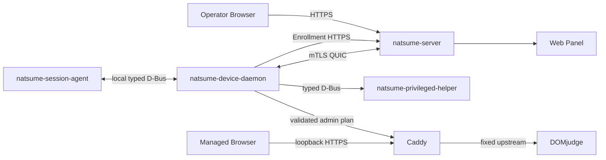

# Natsume V2 系统架构

> 状态：`NORMATIVE`  
> 适用范围：Natsume V2  
> 当前实现成熟度：Phase 0 工程基线  
> 相关文档：[领域模型](domain-model.md) · [边界契约](contracts.md) · [状态与执行](state-and-execution.md) · [安全与恢复](security-recovery.md)

## 1. 目标

Natsume 为单场竞赛现场提供以下能力：

1. 从固定 CSV 导入 Seat、account 和 password；
2. 将 Seat 绑定到受管理工作站；
3. 以显式命令同步非秘密状态和密码；
4. 管理 Device Identity 与 Gateway certificate；
5. 在工作站本地提供受控浏览器数据面；
6. 编排受管桌面会话和 Home 准备；
7. 让操作员看到 Target、Observed、Drift、Command 和审计记录；
8. 在身份、vault、证书或 Home 无法证明安全时停止敏感操作。

架构优先级依次是：

1. 身份和秘密安全；
2. 可审计的显式副作用；
3. 离线稳态和可恢复性；
4. 低耦合、高内聚；
5. 可验证、可打包和可运维；
6. 在当前现场规模下保持实现简单。

## 2. 产品范围

### 2.1 包含

- 一个 Server 实例服务当前一场竞赛；
- 一个固定 Seat universe；
- `seat,account,password` CSV；
- Device 注册、绑定、配置和状态；
- Device 与 Gateway 两级证书；
- operator Web Panel；
- Caddy 到 DOMjudge 的本地 HTTPS 数据面；
- Session Agent、受管会话和 Home 准备；
- 审计、操作状态和恢复流程。

### 2.2 不包含

- 多 Event、跨赛事历史业务模型或运行时 phase；
- XLSX/ODS 或任意列映射；
- 密码导出；
- Device merge/split；
- 通用远程 shell、文件管理或任意 systemd unit 控制；
- 任意反向代理配置平台；
- Server 高可用或多控制器一致性；
- ACME、TOFU、运行时下载或 postinstall 下载；
- 对本地 root、物理攻击者或固件篡改的防护；
- 将 Session lock 当作网络隔离。

需要进入这些范围时，必须先新增 ADR，而不是在现有接口中加入特例。

## 3. 系统上下文



该图表示信任和调用方向，不表示所有组件已经实现。

## 4. 进程与职责

### 4.1 `natsume-server`

拥有：

- operator 身份、授权和 HTTP API；
- CSV staging、preview、commit；
- Server truth；
- Target 计算；
- Device lifecycle 和 binding；
- Enrollment；
- PKI 签发策略；
- mTLS QUIC Device control；
- Operation/Command dispatcher；
- Server vault；
- AuditEvent 和 ChangeEvent；
- Web Panel 静态资源或集成入口。

不得：

- 直接访问工作站本地文件、桌面或 Caddy Admin；
- 把密码加入普通 Target、Observed、日志、SSE 或导出；
- 将 Web request 生命周期当作远端副作用完成边界；
- 让 Enrollment 签发 Gateway certificate。

内部模块边界见 [仓库布局](repository-layout.md#5-server-内部模块)。

### 4.2 Web Panel

拥有：

- operator 交互；
- Preparation Center；
- Device、binding、Target、Observed、Drift、Operation 和 Audit 视图；
- 人工触发 `SYNC_STATE`、`SYNC_SECRET`、session/home 操作；
- 可访问性和错误呈现。

不得：

- 保存密码到浏览器持久化存储；
- 自行计算权限、Target 或 Drift；
- 解析错误显示文本作业务判断；
- 宣称命令已完成，除非 Server 状态已经确认。

### 4.3 `natsume-device-daemon`

拥有：

- identity-before-vault 启动检查；
- Client vault；
- Enrollment 客户端；
- Device certificate 与 Gateway certificate 本地材料；
- mTLS QUIC 连接；
- Command journal 和幂等执行；
- Target 应用和 Observed 采集；
- Caddy 配置/证书激活编排；
- Session Agent 协调；
- Home transaction 编排；
- LKG 和离线稳态。

不得：

- 直接执行网络输入给出的路径、UID、unit、命令或 upstream；
- 把一个传输 handler 同时作为 vault、Caddy 和 Home 的业务实现；
- 将密码返回给 Server、Agent、浏览器或普通日志；
- 在身份不确定或 vault 解密失败时自动创建新身份。

内部必须分离 transport、application、domain、port 和 adapter。见 [仓库布局](repository-layout.md#6-device-daemon-内部模块)。

### 4.4 `natsume-privileged-helper`

拥有最小 root 权限能力，例如：

- 受限硬件标识采集；
- 固定 contest user 和 Home backend 所需的受限系统操作；
- 由封闭枚举定义的少量特权动作。

不得：

- 建立外部网络连接；
- 持有 DOMjudge 密码、Device private key 或 Gateway private key；
- 接受任意 shell、任意路径、任意 UID、任意 unit 或任意环境变量；
- 读取 Server/Client vault；
- 代替 Device Daemon 作业务决策。

Helper 的每个方法必须是独立、可审计、参数封闭的 capability。

### 4.5 `natsume-session-agent`

拥有：

- 由系统级 XDG Autostart 在当前图形会话中直接启动；
- 当前会话资格和 singleton 验证；
- typed snapshot 的本地展示；
- Seat/binding 提示；
- lock/unlock 等经授权的会话交互；
- focus-denied 等 UI 结果报告。

不得：

- 使用 systemd user unit；
- 使用 bootstrap/run 两阶段或环境转交文件；
- 读取 vault、密码、Device/Gateway private key；
- 管理 Caddy；
- 调用 Server；
- 依赖外部 GUI helper 或 runtime UI interpreter。

### 4.6 Caddy

拥有：

- package-pinned binary 和固定 module closure；
- loopback HTTPS；
- Gateway certificate 使用；
- BLOCKED 状态页；
- READY 时代理固定 DOMjudge upstream；
- Unix socket 或等价的本地受限 Admin control。

不得：

- 决定 Device 身份、binding、授权或密码；
- 接收自由格式 upstream、路径或配置片段；
- 因 Session lock/unlock 变更配置；
- 在证书或配置未验证时代理 upstream。

### 4.7 Managed Browser

拥有：

- 访问固定 loopback HTTPS origin；
- 竞赛现场允许的浏览器策略。

不得：

- 直接访问 Device control 或 vault；
- 绕过 Caddy 访问由 Natsume 管理的 upstream；
- 被视为秘密存储。

### 4.8 DOMjudge

是外部竞赛系统。Natsume 只依赖已冻结的访问契约，不拥有其用户、比赛或认证实现。DOMjudge 版本和 endpoint 必须在平台文档中冻结。

## 5. 信任边界

| 边界 | 认证 | 数据类型 | 失败策略 |
|---|---|---|---|
| Operator → Server | operator session/RBAC | 人类控制面 | 拒绝并审计 |
| Device Enrollment → Server | server-auth HTTPS | Device CSR 和 enrollment material | 不创建 Device identity artifact |
| Device control ↔ Server | mandatory mTLS QUIC | typed protocol、Command、Observed | TLS/协议失败即断开 |
| Device Daemon → Helper | 本地 system D-Bus + OS policy | 封闭特权请求 | 拒绝且不降级 |
| Agent ↔ Device Daemon | 本地 session-aware typed IPC | UI snapshot 和会话动作 | lease/epoch 失效 |
| Browser → Caddy | loopback HTTPS | 页面和 DOMjudge 流量 | BLOCKED/503 |
| Caddy → DOMjudge | 固定 upstream policy | 竞赛数据面 | 不健康则 fail closed |

信任边界之间不得共享“全能 context”或未分类秘密。

## 6. 分层与依赖方向

每个有业务逻辑的进程应采用以下方向：

```text
transport / presentation adapters
              ↓
application use cases
              ↓
domain policies and value objects
              ↓
ports
              ↓
database / vault / protocol / OS adapters
```

规则：

1. domain 不依赖 Axum、SQLx、Quinn、zbus、Slint 或 Caddy；
2. application 不暴露数据库 row、Protobuf message 或 D-Bus object；
3. adapter 负责结构转换和公开错误映射；
4. transport handler 只完成认证、解码、调用 use case 和编码；
5. 跨模块调用使用明确 port 或 command，不直接跨表写入；
6. composition root 可以依赖所有模块，但不得包含业务规则；
7. shared crate 只承载稳定、至少两个生产消费者使用的契约。

## 7. 数据所有权

| 数据 | 唯一 Owner | 允许消费者 |
|---|---|---|
| Seat universe | contest-domain | Target、Web、CSV |
| account 标识 | contest-domain | Target、Web |
| password 明文 | Server vault / Client vault 的短生命周期 use case | secret sync、Caddy credential adapter |
| Device lifecycle | identity-enrollment/device-control | Web、Target |
| Binding | contest-domain | Target、session |
| Target | configuration-target | dispatcher、Web |
| Observed snapshot | device-control | Drift、Web |
| Operation/Command | command-dispatch | Web、audit |
| Server certificate/key | pki-vault | Server TLS adapter |
| Device certificate/key | Client vault | QUIC adapter |
| Gateway certificate/key | Client vault | Caddy adapter |
| Machine Hardware ID | identity startup | Enrollment、Observed |
| Session/Home epoch | local runtime domain | Agent/Home adapters |
| AuditEvent | audit module | operator query/export |
| ChangeEvent/outbox | transaction owner | SSE/dispatcher |

数据库表是模块实现细节。一个模块不得通过任意 SQL 写入另一个模块拥有的状态。

## 8. 关键业务流程

### 8.1 CSV 到 Server truth

```text
upload
  → encrypted staging
  → strict parse
  → preview classification
  → explicit commit
  → domain transaction
  → AuditEvent + ChangeEvent
  → Target becomes stale/recomputable
```

CSV 提交只改变 Server truth，不直接联系 Device。首次成功提交冻结 Seat universe。

### 8.2 Device Enrollment

```text
identity-before-vault
  → server endpoint/trust validation
  → server-auth HTTPS
  → Device Identity CSR
  → Server policy validation
  → Device Identity leaf/chain
  → local atomic persistence
  → mandatory-mTLS QUIC
```

Enrollment 不接收或返回 Gateway CSR/certificate。

### 8.3 非秘密状态同步

```text
operator starts SYNC_STATE
  → Target snapshot and generation are frozen
  → durable Command is created
  → Device persists receipt
  → Device validates and stages state
  → Gateway CSR subprotocol, when required
  → Caddy activation
  → Observed snapshot
  → Command terminal status
```

Gateway certificate 只能存在于该 active Command 上下文。

### 8.4 密码同步

```text
operator starts SYNC_SECRET
  → current assignment + credential revision are frozen
  → secret read from Server vault
  → encrypted authenticated command
  → Device validates current binding/revision
  → atomic Client vault update
  → secret is discarded from transient buffers
  → redacted terminal status
```

没有自动 secret sync。

### 8.5 Session/Home

```text
current binding and epochs
  → prepare Home transaction
  → prove backend result
  → start/validate graphical session
  → XDG Autostart starts Agent
  → Agent validates current logind session
  → typed UI snapshots and actions
```

Home 无法证明安全时不得启动受管 session。Session lock/unlock 不改变 Caddy。

## 9. 部署拓扑

### 9.1 Server package

包含：

- `natsume-server`；
- Web assets；
- systemd unit、sysusers/tmpfiles、配置目录；
- migration 和必要静态契约。

Server control certificate 由离线控制根或经批准的离线流程签发。postinstall 不生成 CA/private key，也不下载运行时组件。

### 9.2 Client package

包含：

- Device Daemon；
- Privileged Helper；
- Session Agent；
- 固定 Caddy binary；
- system service、D-Bus policy；
- `/etc/xdg/autostart/org.natsume.SessionAgent.desktop`；
- BLOCKED 状态页静态资源。

Client 包不得包含 Session Agent systemd user unit。

## 10. 可用性与离线稳态

Device 可以在 Server 暂时不可达时继续使用已经验证的本地状态，但不得推断新授权：

- 已验证 LKG 配置可以继续服务；
- 已安装且未过期/未撤销的 Gateway certificate 可以继续使用；
- 当前有效 binding 的本地凭据可以继续使用；
- 不得在离线时创建新 binding、签发证书或接受陈旧 generation；
- 重连后通过 Observed 和 Drift 收敛；
- 本地损坏不能通过“自动重建身份”绕过。

## 11. 低耦合和高内聚检查

每个设计变更应回答：

1. 该规则是否只有一个变化原因和一个 Owner？
2. 是否把 transport、database 或 OS 细节泄漏到 domain？
3. 是否要求多个模块同步修改同一事实？
4. 是否把少数平台特例放进核心状态机？
5. 是否创建了通用 manager、context、helper 或 error code 分支？
6. 是否把异步 Operation 模型强加给普通 CRUD？
7. 是否可以用 value object、capability 或 port 收敛边界？
8. 是否有负向测试证明禁止路径不能绕过？

以下是应拒绝的信号：

- 一个 handler 同时操作 vault、SQL、Caddy 和 D-Bus；
- 一个共享 crate 只有一个消费者；
- 一个“全局状态”同时表达证书、配置、秘密和 session；
- 一个 UI 文案变化要求修改领域逻辑；
- 一个桌面环境差异要求改 wire protocol；
- 一个新错误必须让所有领域模块依赖全局 registry。

## 12. 变更治理

需要 ADR 的变更：

- 产品范围和信任边界；
- 新进程、新 root capability 或新外部网络路径；
- 身份、证书、秘密或 fail-closed 规则；
- wire compatibility 或持久化身份语义；
- 新共享 crate 或新的通用工作流模型；
- Home backend 策略；
- 目标桌面启动模型；
- 放宽任何 `INV-*`。

不需要 ADR 的变更：

- 不改变稳定语义的内部重构；
- 新增测试或 evidence；
- runbook 命令修正；
- 已定义 contract 内的新 adapter；
- 不影响跨模块边界的性能优化。

架构变更合并时，应同步检查：

- 对应规范文档；
- ADR；
- machine schema/golden；
- requirement/Gate 引用；
- runbook；
- 安全和负向测试。
