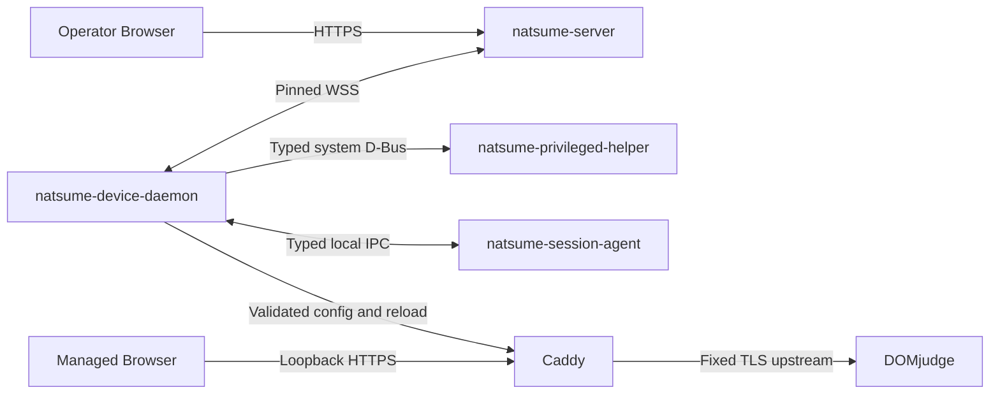

# Natsume V2 目标架构与实施计划

> 状态：`ACCEPTED TARGET`
> 基线日期：2026-08-26
> 适用范围：Natsume V2 全系统
> 实施策略：预发布 flag day；协议、数据库、Server、Client、Web 与测试同步切换

本文是仓库中唯一的人工维护架构文档。它同时定义目标系统、模块所有权、安全边界、Device Control 状态模型、目标数据库和实施顺序。旧 ADR、Phase、Gate、规划和分主题规范均已删除；设计理由只通过本文与 Git 历史追溯，不再维护平行文档体系。

本文描述的是目标状态，不是完成声明。当前代码与本文冲突时，冲突属于待实施债务，不能反向限制目标架构。

## 1. 权威来源与阅读规则

各类事实只有一个权威来源：

| 事实 | 权威来源 |
|---|---|
| 产品边界、组件职责、数据所有权、安全和实施顺序 | 本文 |
| Device Control wire 字段、field number、presence 与 descriptor | `crates/device-protocol/proto/*.proto` |
| HTTP API 的精确公开 schema | Server OpenAPI 生成源与生成物 |
| 本地 IPC 的精确接口 | `crates/local-control-api` 与 D-Bus introspection |
| SQLite 物理表、列、索引与约束 | 完成 flag day 后的 `server/migrations/00000000000001_initial/up.sql` |
| Diesel 生成类型 | `server/src/db/schema.rs`，必须由 migration 重建 |
| Device Control `error_code` 字段与开放token语法 | `crates/device-protocol/proto/*.proto` 与 `crates/device-protocol` |
| HTTP公开错误码与status映射 | Server OpenAPI生成源与HTTP adapter |
| 本地IPC typed失败 | `crates/local-control-api` 与各IPC adapter |
| 构建、依赖和发布版本 | Cargo、pnpm、打包配置与 lockfile |

规则：

1. 不在第二个 Markdown 文件复制本文规则。
2. Proto 和 migration 是机器可执行契约，但不能自行创造与本文相反的业务语义。
3. 生成代码不能手工编辑。
4. 当前 migration、Rust adapter、OpenAPI 或 Web 代码若仍表达 Command、Token、Bundle 或 Observed 旧模型，均视为同步债务。
5. 本次发布前不存在对外兼容基线；删除旧字段不保留 `reserved`，编号按当前结构压紧。
6. flag day 中间提交可以暂时不可运行，但不得进入部署包或形成双协议、双 authority、双 schema fallback。

## 2. 系统目标与非目标

Natsume 服务一场现场竞赛，目标规模约 500–600 台工作站。一个 Server 实例只维护当前赛事，不建模多 Event 或跨赛事业务历史。

系统必须提供：

1. 严格 CSV 导入 Seat、DOMjudge Account 与密码。
2. Device 注册、人工审核、启用、禁用、撤销和重新部署。
3. 现场 Seat→Device Binding。
4. Server Desired State 与 Client Actual State 的持续收敛。
5. Gateway credential 签发、Caddy 配置和 DOMjudge 自动登录。
6. Runtime Config、图形 Session 和 contestant Home 控制。
7. admin/viewer Operator、Web Panel、审计和恢复证据。
8. 网络中断与单进程重启后的确定性恢复。
9. 身份、秘密、证书或本地状态不可证明安全时 fail closed。

系统明确不提供：

- 多 Server 高可用、分布式共识或多写数据库；
- 多赛事并存、Event timeline 或历史配置快照；
- 通用远程命令、shell、文件管理、任意 systemd 控制；
- 通用 resource/plugin marketplace；
- 动态 JSON/`Any` 控制协议；
- ACME、TOFU 或跳过证书校验的开发回退；
- 对工作站本地 root、物理攻击者或固件篡改的防护；
- 自动 Device merge/split 或静默身份迁移；
- 多桌面环境同时支持；
- 可编辑角色和权限策略；
- 将 UI 遮罩、Session lock 或 Caddy 状态页当作强隔离边界。

## 3. 核心设计原则

### 3.1 Authority 明确

Server committed truth、Server Intent、Client Input、Concrete Target 和 Client Actual 是不同事实。任何一层都不能被另一层的消息隐式推进。

### 3.2 完整状态代替操作投递

系统没有 Device Command delivery plane。远控效果由完整 Desired State 持续收敛，不保存 queued、in-flight、Ack、outcome unknown 或投递历史。

### 3.3 业务纵向组件化

每项业务拥有自己的规则、数据库访问、事务、Operator 操作和查询。Transport 与 Actor 只调度组件，不理解组件内部状态。

### 3.4 静态类型和静态组合

所有资源在编译期可见。新增资源必须同时增加 Rust 类型、Proto 字段、组件实现、验证和测试。禁止字符串资源名、运行时 downcast、通用 payload 和动态注册表。

### 3.5 Crash-safe、幂等、可重放

每个成功 wire barrier 必须晚于它证明的 durable fact。重复的完整状态不得重复分配 identity、Binding、证书或副作用。

### 3.6 KISS 与 YAGNI

只实现当前系统确实需要的抽象：

- trait 统一同类生命周期，不统一语义不同的业务；
- static dispatch 优先于 trait object；
- 明确调用优先于宏、tuple magic 或通用执行器；
- 一个资源一个组件，不为每个字段或状态创建组件；
- 没有第二个真实消费者时不创建共享 crate；
- 没有测量瓶颈时不并行组件事务；
- 没有跨组件原子不变量时不创建协调事务。

## 4. 系统上下文与进程



### 4.1 `natsume-server`

Server 是唯一业务 authority，拥有：

- Operator 账户、会话和角色；
- Contest Seat、Account、Seat→Account mapping 与 Server vault；
- Import preview/commit；
- Provisioning window；
- Enrollment review 与 Device control key；
- Device lifecycle；
- Binding negotiation 与 occupancy；
- Gateway credential generation 与 Origin CA；
- Runtime、Session 和 Home 的 Server target；
- 每项资源最新 Client Input/Actual；
- append-only redacted audit；
- Operator HTTP API、Web 静态资源和 Device WSS。

Server 不直接操作工作站文件、Caddy、图形 Session 或 Home。

### 4.2 `natsume-device-daemon`

Daemon 是工作站系统级协调器，拥有：

- identity-before-credentials 启动；
- control key、Enrollment recovery marker；
- Gateway private key、CSR 与证书 artifact；
- pinned WSS 连接；
- 完整 Client Input/Actual 发布；
- 完整 Server Target 分发；
- 各资源 Client Reconciler；
- Caddy 配置生成、validate、reload 和 LKG；
- 与 Helper、Session Agent 的 typed IPC；
- 离线安全稳态。

Daemon 不把网络字段直接解释成任意路径、UID、unit、命令或配置片段。

### 4.3 `natsume-privileged-helper`

Helper 只提供封闭的 root capability：

- 读取固定硬件身份来源；
- 对固定 contestant user 执行受限 Session/Home 操作；
- 对固定目录和固定 policy 执行必要的特权文件操作。

Helper 不联网，不持有 DOMjudge 密码、control private key、Gateway private key 或 Server trust decision，不接受任意 shell、路径、UID、unit 或环境变量。

### 4.4 `natsume-session-agent`

Agent 由系统级 XDG Autostart 直接启动，拥有当前图形会话内的 UI：

- Binding 窗口；
- Lock presentation；
- typed 状态展示；
- focus 和窗口生命周期结果。

Agent 不连接 Server，不管理 Caddy，不读取 credential，不使用 systemd user service。

### 4.5 Caddy、Browser 与 DOMjudge

Caddy 只负责本机数据面：

- 固定 loopback HTTPS origin；
- 加载 Server 授予的 Gateway leaf；
- BLOCKED 页面；
- 代理固定 HTTPS DOMjudge upstream；
- 只在 `/login` 注入 `X-DOMjudge-Login` 和 base64 password header；
- 其他 route 不注入 credential。

Runtime Config 可以改变 DOMjudge HTTPS origin，但不能改变 Control Endpoint、Server trust root、fleet namespace 或 Gateway hostname。Control Endpoint 是部署期不可远程修改的 bootstrap 参数。

## 5. 信任、身份与秘密

### 5.1 信任边界

| 边界 | 认证 | 失败策略 |
|---|---|---|
| Operator → Server | 数据库中的 Operator session 与固定角色 | 拒绝，必要时审计 |
| Device → Server | pinned server-auth TLS + connection challenge + Ed25519 proof | protobuf 前后均 fail closed |
| Daemon → Helper | system D-Bus policy + 封闭方法 | 拒绝，不降级 |
| Agent ↔ Daemon | 当前本地 Session identity + typed IPC | stale Session 失效 |
| Browser → Caddy | loopback HTTPS | BLOCKED 或不可用 |
| Caddy → DOMjudge | 固定 HTTPS upstream | 非 TLS、验证失败或配置不完整时 BLOCKED |

### 5.2 Machine identity

Machine Hardware ID 是自然键和路由证据，不是认证凭据。

Client 使用固定三个来源：

1. DMI system UUID；
2. DMI motherboard serial；
3. 第一块 system disk serial。

经过固定 normalization、placeholder 拒绝和 2-of-3 判定后，以 fleet namespace 派生稳定 ID。原始 serial 不发往 Server、不写日志、不进入 fixture。Enrollment wire 只携带派生 Hardware ID 外层 proof context和 aggregate `MEDIUM`/`STRONG` advisory quality。

无法形成 quorum 时必须停止 identity-bound adapter 初始化；不得读取旧 credential 后猜测身份。

### 5.3 PKI

存在两个不同的根：

| 根 | 私钥位置 | 用途 |
|---|---|---|
| Control Root | 离线，不在运行中 Server | 签发 Server TLS leaf |
| Local Origin CA | Server 私有状态目录 | 在 Active Session 中签发每台 Device 的 Gateway leaf |

Server TLS leaf 必须包含部署实际 Control Endpoint 的 IP-SAN。Server 只读取离线提供的 leaf/key，不自签、不自动生成回退。

### 5.4 秘密边界

秘密包括：

- Operator password 和 session cookie；
- Server vault master key；
- DOMjudge password；
- Device control private key；
- Gateway private key；
- Server TLS private key；
- Local Origin CA private key。

秘密不得进入：

- 普通 `Debug`、日志、trace、metric；
- Audit detail；
- HTTP 普通响应；
- Client Input 或 Actual State；
- Client 通用 target journal；
- 错误 source chain；
- 命令行参数、环境变量或包管理脚本。

Server vault 使用 application-level XChaCha20-Poly1305 current-fact 加密；`accounts` 是 vault row 的父表。Client credential 依赖 root-owned 严格权限文件、原子写入与目录权限；当前 threat model 明确不抵抗本地 root。

## 6. 领域 authority 与数据所有权

| 事实 | Owner | 备注 |
|---|---|---|
| Site/fleet identity | Server core | 单例、部署期固定 |
| Seat、Account、Seat→Account | Contest/Import Component | Import 唯一修改者 |
| Account password ciphertext/revision | Contest/Import + Vault | plaintext 只存在于短生命周期内存 |
| Device lifecycle | Device Lifecycle Component | enabled/disabled/revoked |
| Enrollment attempt/control key | Enrollment Component | 人工审核，和 Gateway 解耦 |
| Gateway generation/grant | Gateway Component | 每 Device 至多一个 current generation |
| Binding negotiation/occupancy | Binding Component | Binding ID 是每次 occupancy 的 UUID |
| Runtime Config | Runtime Config Component | 当前 DOMjudge HTTPS origin |
| Session target | Session Control Component | lock level + terminate epoch |
| Home target | Home Component | reset epoch |
| Client Input/Actual | 对应 State Component | 每资源最新事实，不是 history |
| Active control lease | DeviceActor | 只在内存，不持久化 |
| Audit | 公共 append sink，mutation owner 写入 | 不参与 Resolve |

Import 不修改 Binding，不创建远端操作，不产生 Device I/O。Binding 和 Gateway 互不授予对方 authority。Client Input 和 Actual 都是不可信报告。

## 7. Device Control 统一状态模型

所有 Active 资源遵守：

```text
ConcreteTarget = Resolve(ServerIntent, ClientInput)
ActualState    = Reconcile(ConcreteTarget)
```

其中：

- `ServerIntent` 是组件内部的完整 Server truth/policy 视图；
- `ClientInput` 是 Client 对当前协商 generation 的不可信输入；
- `ConcreteTarget` 是 Server 给 Client 的完整精确目标；
- `ActualState` 是 Client Reconciler 应用、验证并重新采样后的事实。

Actual State 不进入当前 `Resolve`。当 Actual 需要推动 Server lifecycle 时，组件内部的 Intent Policy 产生 typed transition：

```text
NextServerIntent = DeriveIntent(ServerTruth, Policy, ActualState)
```

transition 必须先提交，再从新 truth 重新 Resolve。不得从提交前推测下一 Target。

### 7.1 四个 wire plane

Server 完整快照：

```text
ServerStateSnapshot
  intent: ServerIntentState
  target: ConcreteTargetState
```

Client 完整快照：

```text
ClientStateSnapshot
  input: ClientInputState
  actual: ActualState
```

规则：

- 每帧 replace latest，不是 delta；
- 缺字段表达协议定义的 exact absence，绝不继承旧帧；
- `ConcreteTargetState` 和 `ActualState` 的资源字段语义校验后必须完整；
- Unit-input 资源不伪造空 Intent/Input wire message；
- 无全局 snapshot revision、configuration clock 或 resource version；
- 关联使用资源自己的 `credential_id`、`negotiation_id`、`binding_id`、`credential_revision` 和 epoch；
- 重复相同状态必须是 no-op。

### 7.2 Level 与 Transition

Level 持续要求 exact convergence：

- Gateway leaf；
- Binding access；
- Runtime Config；
- Session lock。

Transition 通过单调 epoch 表达需要至少执行一次的目标：

- terminate Session；
- reset Home。

Level 和 Transition 都属于 Concrete Target，不形成第二套 Command 模型。

## 8. WSS、Enrollment 与 Session lease

### 8.1 Transport

Operator HTTPS 与 Device WSS 可以共用一个 Server listener。Device 只连接固定
`/api/v2/device/control` route，并使用唯一 pinned `natsume.control` WSS subprotocol。
每个完成重组的 Protobuf frame 最多 65,536 bytes。这个上限同时适用于 Handshake
与 Active frame，不再为单个消息类型建立重复上限。一个 wire generation 只有一个
descriptor，不维持旧/新双栈。

`ClientProof.signature` 是 Ed25519 对下列 32-byte SHA-256 digest 的签名：

```text
SHA-256(
    "NATSUME-DEVICE-CONTROL-CLIENT-PROOF\0" ||
    UTF-8("/api/v2/device/control") || 0x00 ||
    UTF-8("natsume.control") || 0x00 ||
    protobuf_length_delimited(ServerChallenge) ||
    protobuf_length_delimited(ClientProof { signature = empty })
)
```

双方都先把当前 schema 的 typed message 以 Prost length-delimited encoding重新编码，
而不是签名收到的任意原始 wire bytes。Enrollment 使用 proof 内 exact
`candidate_public_key` 验签；Resume 使用 Server 数据库选出的 current control public
key 验签。协议crate统一 transcript、签名和 strict verification，但不选择authority
key，也不校验 Enrollment/Resume 的业务presence、ID、版本或状态组合。

成功升级后：

```text
ServerChallenge
  → ClientProof
  → Enrollment flow 或 Resume flow
  → SessionReady
  → first ClientStateSnapshot
  → Active full snapshots
```

`ServerChallenge` 的超时只约束当前连接唯一 `ClientProof` 的提交窗口，不是 Enrollment TTL。

### 8.2 Enrollment

Enrollment 只注册 Device control authority，不签发 Gateway credential，不承载 Binding 或业务配置。

Durable attempt material：

```text
EnrollmentAttempt
  enrollment_id
  candidate_public_key
  evidence_quality
```

Server 另外从 proof context 取得 Machine Hardware ID 和版本信息。Attempt 状态只有：

```text
pending_review | approved | active | denied
```

不存在 expiry、activation deadline 或 sweeper。

完整规则：

1. Client 在首次网络尝试前持久化 canonical UUIDv7 `enrollment_id` 和 candidate control key。
2. same ID + exact material 是 replay；same ID + different material 是 conflict。
3. 所有新 attempt 必须人工审核。
4. Provisioning window 只门禁新 attempt admission 和 approve，不门禁 exact replay、activation recovery、Resume 或 Active Gateway signing。
5. Deny 是 durable 终态。
6. 在线 approve 可以在 exact current proof attachment 上直接提交 activation。
7. 离线 approve 只写 `approved`；下次 exact re-proof 再 activation。
8. Control-key replacement 在 activation commit 前保留旧 authority 和旧 lease。
9. activation commit 后 Server 发送 `EnrollmentAuthority`。
10. Client crash-safe 安装新 authority manifest 后回显 exact `EnrollmentAuthority`。
11. Server 验证后建立 lease 并发送 `SessionReady`。

Client 本地 control manifest 直接保存 exact Ed25519 public key并与私钥文件重新派生的
公钥比较；不再为同一自然authority建立派生 `ControlKeyId`。

Enrollment 在线连接只通过 `EnrollmentAttachments` 内存表获得即时通知；该表不是 authority。数据库状态决定断线恢复。

### 8.3 Resume 与 lease

Resume proof 使用 current control key。Server 将 proof 映射到准确 `device_id`，再附着该 DeviceActor。

每个 Device 同时只有一个 current lease：

- `session_id` 是 Server 生成的 16-byte UUIDv7；
- lease 不落库；
- 新 Attach 原子替换旧 lease；
- 旧 socket 的晚到 frame 因 session fencing 零写入拒绝；
- best-effort Close 不参与 authority 转移；
- Server restart 使所有 lease 失效。

### 8.4 Freshness barrier

`SessionReady` 后第一条 Active frame 必须是完整、语义有效的 `ClientStateSnapshot`。在它全部通过边界校验前，任何组件不得写入。

Server 随后依次调用所有组件 `ingest`。只有全部组件成功后，当前 Actor 才把 `initial_state_received` 设为 true 并生成 ServerState。

组件事务彼此独立，因此进程可能在部分组件提交后崩溃。这是允许的：

- 完整 snapshot 已在写入前完成全局 semantic validation；
- 已经提交的组件 transition 必须幂等；
- Server 未发送 Target；
- 新连接重新关闭 freshness barrier；
- Client 重发完整 snapshot 后各组件收敛；
- 数据库中的旧/部分最新 Actual 只用于诊断，不能代替新 lease barrier。

系统不要求跨资源原子 snapshot transaction。如果未来出现真实的跨资源原子不变量，应合并相关组件，而不是增加分布式事务协调器。

## 9. 资源语义

### 9.1 Gateway Credential

Gateway Component 管理一个 negotiated resource：

```text
GatewayCredentialIntent  { credential_id }
GatewayCredentialInput   { credential_id, csr? }
GatewayTarget            { credential_id, certificate? }
GatewayActualState       { credential_id?, state, leaf_sha256? }
```

规则：

- 新 Device 通过 fresh barrier 后自动拥有一个 current credential generation；
- Client 为新 generation 生成并持久化全新 private key 和 exact CSR，再发布 Input；
- Input message 缺失表示尚未准备；
- same ID + same CSR 是 replay；
- same ID + different CSR 是 protocol violation；
- same ID + CSR absent 表示当前本地 input 不可恢复，触发 replacement；
- Server 完全派生 subject、SAN、EKU、profile 和 validity，不信任 CSR requested attributes；
- 证书 grant 必须先 durable，再进入 Target；
- current generation 的 grant由 Server 重放，不重新签名；
- 过期、private key/CSR 丢失、Apply/Verify 完成失败或实际 leaf hash 不匹配都走同一个 replacement；
- replacement 即使旧 private key 仍可读也生成新 key/CSR；
- 旧 generation 终态保留审计/撤销事实，但不再成为 Target。

Gateway Actual 的 leaf hash是 Caddy 实际加载的完整 leaf DER 的 SHA-256，不是 PEM、SPKI、chain、serial 或磁盘候选文件。

Server 签发使用 read–sign–compare-and-set：

1. 读取 current generation 与 CSR；
2. 事务外调用 Origin CA；
3. 短写事务重检 generation/CSR；
4. 写入 exact grant 和 audit；
5. 竞争失败时丢弃候选并重新读取。

CA、网络或文件 I/O 不能发生在 SQLite 写事务内。

### 9.2 Binding

Binding Component 同时管理 negotiated input 和 access target：

```text
BindingNegotiationIntent { negotiation_id, evaluation? }
BindingInput             { negotiation_id, submission_epoch, seat_code }
BindingAccessTarget      { bound? }
BindingAccessActualState { assignment_state, credential_state, context? }
```

规则：

- 比赛部署阶段，所有未绑定且本地 Session/Home eligible 的 Device 自动显示 Binding UI；
- Server 不发送 `OPEN_BINDING_PROMPT`；
- 每个 UNBOUND Device 恰有一个 current negotiation；
- 志愿者确认时 Client 先持久化新 `submission_epoch` 和 Seat，再发布完整 Input；
- 网络 replay 不推进 epoch；
- same epoch + same Seat 是 replay；
- same epoch + different Seat 是 protocol violation；
- 较旧 negotiation/epoch 不改变 current authority；
- 可修正业务拒绝写入 current negotiation 的 bounded evaluation；
- 接受 Binding 时在一个组件事务内重检 Seat、Account mapping、Device eligibility 和 occupancy，消费 negotiation、铸造新 `binding_id`、写 accepted association 和 audit；
- Bound Target 从同一 Binding 组件一致性视图取得 context、Account revision 和 vault ciphertext；
- 密码只在受控内存中解密并进入当次完整 Target；
- Actual 只有 assignment 与 credential 都成功且 context coherent 时才携带 context；
- Unbind 删除 occupancy 并建立新 negotiation；
- Import 不创建或删除 Binding。

### 9.3 Runtime Config

Runtime Config 当前只包含 canonical HTTPS DOMjudge origin：

- 禁止 userinfo、path、query、fragment；
- Control Endpoint、trust root、fleet namespace 和 Gateway hostname 永不进入远程配置；
- Client 不持久化密码到 Runtime Config；
- 应用新配置失败时 Gateway 数据面保持 BLOCKED，不继续代理已失效旧目标；
- Target 重发必须幂等。

### 9.4 Session Control

Session Control 是 Device-level target，所有登录用户共享，不存在 per-user target：

```text
SessionControlTarget
  lock_state
  terminate_epoch?
```

- lock 是持续 Level；
- terminate 是单调 Transition；
- 同时只能有一个 eligible graphical session；
- 零个或多个 eligible session 时 fail closed；
- terminate 必须捕获目标 Session，副作用前重检，不得 retarget 到 replacement Session；
- Client 只在 durable completion 后推进 completed epoch。

### 9.5 Home

Home reset 使用单调 `reset_epoch`：

- same epoch 可重入；
- Client 通过 Prepare/Apply/Verify/Recover 完成；
- 完成记录必须 durable 后才能发布；
- 进行中继续报告上一个 completed epoch；
- reset 只影响 contestant Home；
- 不得删除 control key、Gateway material、Binding credential artifact 或系统配置；
- 损坏或无法验证时报告 recovery required 并 fail closed。

## 10. Server 组件架构

### 10.1 组件分类

Server 业务采用纵向组件：

| 组件 | 是否实现 `StateComponent` | 主要职责 |
|---|---|---|
| Operator | 否 | 账户、会话、角色 |
| Contest/Import | 否 | Seat、Account、mapping、vault import |
| Provisioning | 否 | Window |
| Enrollment | 否 | Attempt、review、activation、control key |
| Device Lifecycle | 否 | enable/disable/revoke/reprovision |
| Gateway | 是 | Gateway intent/input/target/actual |
| Binding | 是 | negotiation、occupancy、access target/actual |
| Runtime Config | 是 | DOMjudge origin target/actual |
| Session Control | 是 | lock/terminate target/actual |
| Home | 是 | reset target/actual |

组件化不意味着一个 trait 统治所有业务。只有遵守四平面 Desired State 生命周期的 Active 资源实现 `StateComponent`。Enrollment、Operator、Import 和 Lifecycle 保持独立 concrete component。

### 10.2 `StateComponent`

trait 是 Server-local contract，不放入共享 crate：

```rust
pub(crate) trait StateComponent: Send + Sync + 'static {
    type ClientInput: Send;
    type ActualState: Send;
    type PublicIntent: Send;
    type ConcreteTarget: Send;
    type Error: std::error::Error + Send + Sync + 'static;

    fn ingest(
        &self,
        context: &DeviceContext,
        input: Self::ClientInput,
        actual: Self::ActualState,
    ) -> impl Future<Output = Result<(), Self::Error>> + Send;

    fn materialize(
        &self,
        context: &DeviceContext,
    ) -> impl Future<
        Output = Result<
            Materialized<Self::PublicIntent, Self::ConcreteTarget>,
            Self::Error,
        >,
    > + Send;
}
```

`ClientInput` 是该资源完整 input projection：

- Gateway/Binding 使用 `Option<T>` 表达 wire field absence；
- Runtime/Session/Home 使用 `()`；
- Actual 类型始终是 required typed value。

`PublicIntent`：

- Gateway/Binding 使用 `Option<T>`；
- Unit-input 资源使用 `()`。

`ingest` 必须：

1. 保存自己的 Client Input/Actual；
2. 根据 fresh Actual 运行组件 Intent Policy；
3. 根据 fresh Input 运行资源 transition；
4. 在组件事务中写 authority 与 audit；
5. 保持 exact replay 幂等。

`materialize` 必须：

1. 从自己的数据库视图读取 ServerIntent 与 current ClientInput；
2. 调用组件内部纯 `resolve(intent, input)`；
3. 只返回 committed stable target；
4. 不读取 Actual 作为 current Resolve 参数。

组件可以在内部执行有限的 transition→re-read→resolve，但不建立通用 fixed-point engine。每个组件明确证明自己的 transition 会终止。

### 10.3 静态组件集合

```rust
pub(crate) struct StateComponents {
    gateway: GatewayComponent,
    binding: BindingComponent,
    runtime: RuntimeConfigComponent,
    session: SessionControlComponent,
    home: HomeComponent,
}
```

不使用：

- `Vec<Box<dyn StateComponent>>`；
- 字符串 component ID；
- `Any`/downcast；
- 宏生成的异构执行器；
- feature-controlled server/client 双面组件。

顶层显式调用每个组件。少量重复是静态 wire structure 的直接表达。

### 10.4 组件内部数据库

每个组件持有自己需要的 concrete dependency：

```rust
pub(crate) struct GatewayComponent {
    database: Database,
    issuer: Arc<GatewayIssuer>,
}

pub(crate) struct BindingComponent {
    database: Database,
    vault: Arc<VaultSession>,
}
```

规则：

- HTTP、WSS 和 DeviceActor 不直接写业务表；
- 组件公开业务方法，内部 DB adapter 私有；
- 一张业务表只有一个 mutation owner；
- 组件可以通过明确 read model 读取其他组件的公开事实，但不得修改其表；
- 必须在同一组件事务内原子变化的表由该组件组合；
- 公共 Audit insert helper允许在各组件事务中使用；
- 数据库 row、Diesel 类型和 store error 不泄漏出组件；
- 不创建 Repository、UnitOfWork 或 DI framework trait。

## 11. Server runtime 与 Actor

### 11.1 Composition root

Server 启动时创建：

```text
Database
VaultSession
GatewayIssuer
Components
DeviceControl
HTTP AppState
```

`AppState` 持有 `Arc<DeviceControl>` 和仍被非 Device HTTP feature需要的 handle。没有全局 singleton。

### 11.2 Registry

`DeviceRegistry` 是小型内存 map：

```rust
HashMap<DeviceId, DeviceHandle>
```

Registry：

- 启动为空；
- proof/classification 成功后按 `device_id` 懒创建 Actor；
- 锁只保护 map，不跨 `.await`、DB 或 channel send；
- 不按 HWID 创建 MachineActor；
- 不维护 public-key/HWID alias authority；
- 不扫描数据库预热全部 Device；
- 当前 fleet 规模下 Actor 可保持到进程结束。

HWID 并发和一个 non-revoked Device 约束由数据库 unique constraint 最终仲裁。

### 11.3 DeviceActor

每个 Device 恰有一个单消费者 Actor：

```rust
enum DeviceEvent {
    Attach { session_id, outbound },
    ClientState { session_id, snapshot },
    Dirty,
    Disconnected { session_id },
    Evict,
}
```

Actor 只拥有临时协调状态：

- current lease；
- 首个 ClientState barrier；
- 有界 mailbox；
- current outbound sender。

Actor 不拥有：

- 业务 truth cache；
- Command queue；
- 资源独立 channel；
- 持久化 mailbox；
- 数据库 transaction；
- Machine lifecycle aliases。

### 11.4 ClientState 主流程

```text
validate current lease
  → validate complete snapshot
  → Gateway ingest
  → Binding ingest
  → Runtime ingest
  → Session ingest
  → Home ingest
  → Gateway materialize
  → Binding materialize
  → Runtime materialize
  → Session materialize
  → Home materialize
  → final lifecycle/lease check
  → encode complete ServerState
  → send on current lease
```

初期顺序执行。SQLite 是单写者，提前并行只会增加 cancellation、错误聚合和 race。只有测量证明瓶颈后才考虑并行 materialize。

跨组件读取不要求同一数据库 snapshot。组件必须语义独立；Operator mutation 在 commit 后发送 `Dirty`，若发生在 materialize 期间，会排队触发下一份完整 ServerState。若发现两个资源必须在同一时点原子一致，应合并为一个组件。

### 11.5 Dirty 与周期收敛

所有 Server mutation：

1. 先提交业务和 audit；
2. 再返回 `ChangeImpact`；
3. `DeviceControl` 对一个、多个或全部在线 Device 发送 best-effort `Dirty`。

组件不能反向持有 Registry。

Dirty 不携带业务数据。丢失 Dirty 不损坏 authority；Client 周期完整上报或低频 Server 全量 refresh 会恢复。当前规模允许 Import/Runtime 全局变化后直接 dirty all connected actors。

### 11.6 Channel 与背压

- Actor mailbox 和每 lease outbound queue 都必须有界；
- ClientState 不能静默丢弃；
- 重复 Dirty 可以合并或 best-effort 丢弃；
- outbound 长期阻塞时终止 lease；
- 不为每个资源创建 channel；
- 不创建持久化网络 outbox。

## 12. 目标数据库

### 12.1 基础原则

- SQLite 单数据库、单 Server writer；
- 预发布只维护一个 initial migration；
- 所有表使用 typed column、FK、UNIQUE、CHECK；
- 不用通用 resource、event-sourcing、operation、JSON payload 表；
- 不持久化 ServerState/ConcreteTarget blob；
- 不持久化 lease；
- 不建立 global revision counter；
- 业务 revision/epoch 只在资源确实需要 fencing 或 transition 时存在；
- Client 报告的 stale ID 合法，因此 reported credential/binding/context ID 不建立 authority FK；
- 时间统一为 UTC epoch milliseconds；
- UUID 使用 canonical UUIDv7，wire Session ID 例外为 16-byte network-order。

### 12.2 目标表与 mutation owner

| 表 | Owner | 关键约束 |
|---|---|---|
| `site_identity` | Core | singleton fleet namespace |
| `operator_accounts` | Operator | username unique，role封闭 |
| `operator_sessions` | Operator | 只存cookie hash和绝对过期 |
| `audit_events` | Audit sink | append-only、redacted |
| `seats` | Contest/Import | seat code unique |
| `accounts` | Contest/Import | username unique，credential revision正数 |
| `server_vault_records` | Contest/Import + Vault | account PK/FK，一账户一current ciphertext |
| `account_mappings` | Contest/Import | Seat与Account一对一current mapping |
| `pending_import_candidate` | Contest/Import | singleton、非秘密、可过期 |
| `provisioning_window` | Provisioning | singleton open/closed，无通用revision |
| `devices` | Device Lifecycle | revoked历史可共享HWID；每HWID至多一个non-revoked |
| `enrollment_attempts` | Enrollment | immutable attempt material，四状态，无TTL |
| `device_control_keys` | Enrollment | public key PK；每Device一个current |
| `gateway_credentials` | Gateway | 每Device一个current generation，grant与CSR同生命周期 |
| `binding_negotiations` | Binding | 每UNBOUND Device一个current negotiation |
| `device_bindings` | Binding | Seat/Device唯一occupancy，保存accepted replay association |
| `runtime_config` | Runtime | singleton canonical HTTPS origin |
| `device_session_targets` | Session | 每Device lock level/terminate epoch |
| `device_home_targets` | Home | 每Device reset epoch |
| `gateway_client_states` | Gateway | 最新Input+Actual+session/receive time |
| `binding_client_states` | Binding | 最新Input+Actual+session/receive time |
| `runtime_client_states` | Runtime | 最新Actual+session/receive time |
| `session_client_states` | Session | 最新Actual+session/receive time |
| `home_client_states` | Home | 最新Actual+session/receive time |

具体列由 Proto 和组件 typed facts推导，但以下 shape 已冻结。

### 12.3 Enrollment 与 control key

`enrollment_attempts` 至少包含：

- `enrollment_id`；
- `machine_hardware_id`；
- candidate public key；
- evidence quality；
- `pending_review|approved|active|denied`；
- resolved `device_id`；
- review/activation audit引用；
- 创建时间和必要的非秘密版本证据。

不得包含 Gateway CSR、SPKI、leaf、Bundle、Ack、activation deadline 或 expiry。

`device_control_keys` 不需要 global authority revision。current key由 partial unique index表达。Replacement activation事务原子 supersede old、activate new并保留历史。

### 12.4 Gateway

`gateway_credentials` 合并 generation、CSR 与 grant：

- `credential_id`；
- `device_id`；
- current/terminal status；
- exact CSR及其固定hash；
- leaf DER、issuer chain、serial、validity与必要policy metadata；
- 创建、grant、retire/revoke audit引用。

字段 presence通过 CHECK 保证：等待Input、已有grant、terminal历史不能形成非法组合。Gateway 不再引用 Enrollment。

### 12.5 Binding

`binding_negotiations` 保存：

- current `negotiation_id`；
- `device_id`；
- latest submission epoch/Seat；
- latest bounded evaluation；
- 创建/更新审计。

`device_bindings` 保存：

- `binding_id`；
- `device_id`；
- `seat_id`；
- accepted `negotiation_id` 和 submission epoch。

Binding Target 中的 Account和密码始终从 current Seat→Account mapping与vault读取，不复制到 Binding authority table。

### 12.6 Client component state

每张 `*_client_states` 表只保存该组件当前 projection：

- `device_id` primary key；
- last `session_id`；
- Server receive-time；
- 资源 typed Input（如有）；
- 资源 typed Actual。

Gateway/Binding 必须区分：

- 整个 Input message absent；
- Input present但resource-internal optional field absent；
- Input present且完整。

需要显式 presence column与CHECK，不能靠 nullable列猜测。

这些表不是 history，也不授予 authority。Actor freshness仍以内存 lease barrier为准。

### 12.7 必须删除的旧表和字段

flag day 必须删除：

- `commands`；
- `observed_device_states`；
- `credential_bundles`；
- `device_tokens`；
- 独立 `gateway_certificates`；
- 旧 `enrollment_requests` 混合状态；
- 所有 Command delivery/status/fingerprint/payload字段；
- 所有 Bundle/Ack/deadline字段；
- 所有 authority/global revision字段；
- Gateway 与 Enrollment 的耦合 FK。

不要为这些删除项保留 compatibility table、view、adapter、feature flag或 `reserved` wire字段。

## 13. 数据库与事务纪律

现有 `Database::read` 和 `Database::write` 可继续作为 SQLite 基础设施：

- 阻塞 Diesel 工作在 `spawn_blocking`；
- 写使用短 `IMMEDIATE` transaction；
- 不得跨 `.await`、网络、CA、Vault文件I/O、Caddy或D-Bus持有事务；
- 组件内部 table adapter可以保持“一函数写一表”；
- 组件 application method负责同一组件多表与 audit原子组合；
- read model可以 JOIN 多表，但必须只读、显式命名、索引可验证。

跨组件 partial commit 是设计允许的恢复状态，不使用补偿事务。只有 Server authority mutation 与相应 audit 必须在同一组件 transaction 原子完成。

Operator HTTP response、WSS发送和 Dirty notification均发生在 commit 之后。网络失败不能回滚 durable authority。

## 14. Client 目标架构

Server Component 不与 Client 共用。双方只共享 [`natsume-device-protocol`](../crates/device-protocol/src/lib.rs)。
该crate只拥有Protobuf schema、生成类型、descriptor、canonical cryptographic
transcript、薄签名/严格验签操作和确属wire grammar的helper；它不提供全envelope
semantic validation，也不拥有authority key选择。
`prost`负责decode与wire类型约束，Server/Client各自在所属admission、component或
reconciler边界校验业务presence、ID、epoch、state组合和cross-field不变量。

### 14.1 Client-local traits

需要协商输入的资源实现 Client-local `InputProvider`：

```rust
trait InputProvider {
    type PublicIntent;
    type ClientInput;

    fn current_input(
        &self,
        intent: &Self::PublicIntent,
    ) -> Result<Option<Self::ClientInput>, Self::Error>;
}
```

所有 target资源实现 Client-local `Reconciler`：

```rust
trait Reconciler {
    type ConcreteTarget;
    type ActualState;

    async fn reconcile(
        &self,
        target: &Self::ConcreteTarget,
    ) -> Result<Self::ActualState, Self::Error>;

    async fn observe(&self) -> Result<Self::ActualState, Self::Error>;
}
```

实际实现可以把纯 `plan`、副作用执行和 `verify` 继续分离。成功 Actual只能来自 durable artifact或真实runtime重采样，不能直接复用apply返回值。

### 14.2 不创建共享 component crate

`StateComponent` 只在 Server；`InputProvider`/`Reconciler` 只在 Client。它们职责和dependency完全不同。

暂不创建 `device-control-model`、`core` 或 `shared-components`。完成 Gateway 和 Binding 双端实现后，只有出现至少两个真实消费者使用的完全相同纯逻辑，才允许提取具体命名的共享 crate。共享 crate禁止依赖：

- Diesel/Axum；
- Tokio orchestration；
- Vault/CA；
- 文件系统、Caddy、D-Bus、Slint；
- Server或Client concrete component。

### 14.3 Client effect ordering

Daemon 可以有一个有界 effect executor，但它处理 latest target计划，不是 Command queue：

- 新完整 ServerState 通过验证后原子替换当前 target；
- 旧 plan在副作用前检查 receive generation并取消；
- 资源副作用按安全依赖排序；
- Gateway数据面先BLOCKED，再变更credential/config；
- password不进入非秘密LKG；
- 重启从durable input/artifact/completion重新采样并收敛。

## 15. Operator、Import 与业务 API

### 15.1 Operator

角色固定为 `admin` 和 `viewer`。Operator账户与session在Server数据库：

- password使用Argon2id PHC；
- session cookie明文只在浏览器与响应，数据库只存SHA-256；
- 绝对过期，不滑动续期；
- logout/password reset删除session；
- first admin由TTY-only `bootstrap` 创建；
- password recovery由TTY-only `reset-operator-password`执行并审计；
- serve不隐式创建账户或vault key。

### 15.2 Import

CSV只有固定 `seat,account,password` schema。流程：

```text
strict parse
  → non-secret fingerprint
  → redacted preview
  → persist one non-secret pending candidate
  → explicit commit with same CSV and opaque token
  → revalidate fingerprint
  → atomic Contest/Vault update and audit
  → delete candidate
  → dirty affected/all devices
```

规则：

- preview不持久化密码；
- pending candidate不含原始CSV；
- commit请求重新携带密码；
- Import唯一修改Seat、Account、mapping与credential revision；
- 删除仍被Binding占用的Seat必须拒绝；
- Import不修改Binding，不创建Binding ID；
- 每次成功commit用新nonce替换current password ciphertext并推进Account credential revision；
- 不创建Command；
- commit后自动dirty，不依赖Operator再发sync。

### 15.3 Desired-state Operator API

旧 `/commands` API和Panel Command模型删除。Operator操作直接调用 owning component：

- Binding unbind/open policy；
- Runtime Config更新；
- Session lock level；
- terminate epoch推进；
- Home reset epoch推进；
- Device enable/disable/revoke；
- Enrollment approve/deny。

组件提交后返回：

```rust
enum AffectedDevices {
    One(DeviceId),
    Many(Vec<DeviceId>),
    AllConnected,
}
```

DeviceControl据此发送Dirty。HTTP handler不直接访问组件表。

### 15.4 Panel状态

Panel展示：

- Server authority/intent；
- current concrete target；
- latest Actual和receive-time；
- typed convergence/drift；
- Enrollment/Binding evaluation；
- Audit。

Panel query可以显式汇总组件read model，但不能成为authority、不能解析日志文本、不能把缺失fresh state显示为成功。

## 16. 错误、审计与可观测性

### 16.1 错误

- 组件拥有module-local typed error；
- transport adapter对本边界可达的typed failure穷举映射；
- 不建立global domain error enum；
- 不建立跨HTTP、WSS和本地IPC的全局错误码registry或共享crate；
- 业务拒绝是typed evaluation/decision，不是exception；
- malformed、unauthorized、session fence violation和不可能状态才终止协议；
- Protobuf `error_code`保持`string`，不建立全局错误enum；其wire语法固定为
  `1..=64` ASCII bytes且匹配`[A-Z][A-Z0-9_]*`；
- Device Control发送方只在协议adapter中声明自己实际发送的码；接收方只校验
  token语法，未知合法peer code保持opaque，只服从伴随typed state/action；
- HTTP adapter私有拥有当前API实际发出的closed code set及其status映射；精确
  公开集合由OpenAPI契约测试约束，不进入业务组件；
- 本地IPC优先以typed enum/state表达可处理结果；只有接口确需稳定诊断标识时，
  才由`local-control-api`和对应adapter共同拥有该标识；
- 同一内部失败可以在不同边界映射为不同的安全公开分类；恰好使用相同字符串
  不产生共享类型、共享所有权或跨transport兼容承诺；
- Display、Debug、source text不作为公开语义。

是否驱动接收方行为是建模分界：会改变retry、授权、UI流程或业务transition的
信息必须是所属业务的typed state/action/evaluation；`error_code`只用于诊断、审计
关联或通用展示，永不成为控制流协议。稳定公开字符串在首次发布后仍是各自边界的
兼容承诺，但新增和审查在该边界内完成。

### 16.2 Audit

Audit记录“谁改变了Server authority以及结果”，包括：

- Import；
- Provisioning；
- Enrollment review/activation；
- control-key replacement；
- Device lifecycle；
- Gateway generation/grant/replacement/revoke；
- Binding accept/unbind/rejection；
- Runtime/Session/Home target变化；
- Operator账户恢复。

周期ClientState、重复Target和ordinary convergence不制造audit。Audit detail只保存opaque ID、revision/epoch、计数、稳定reason code和必要hash，不保存secret、CSR/leaf正文、原始CSV、路径或free text。

### 16.3 日志和metrics

允许：

- 当前边界已审查的error code；
- component kind；
- opaque ID；
- 计数、延迟、连接状态。

禁止：

- password/token/private key；
- CSR/leaf/chain正文；
- 完整HWID；
- 本地path；
- username+credential组合；
- peer free text；
- 高基数secret-derived label。

## 17. Crate、模块与依赖

### 17.1 Workspace

继续使用一个 Cargo workspace和一个 `Cargo.lock`：

```text
server/
client/device-daemon/
client/privileged-helper/
client/session-agent/
crates/device-protocol/
crates/local-control-api/
crates/machine-identity/
```

共享 crate准入条件：

1. 至少两个production consumer；
2. contract稳定；
3. 不含任一consumer的DB/framework/orchestration；
4. 依赖无环；
5. 独立crate确实保护边界。

禁止以整洁为由新增 `common`、`utils`、`core`、`shared-models` 或 `helpers`。
`integration-tests`也不预建空crate；第一个无法由组件、协议、IPC或package
probe拥有的真实跨进程/持久化/fault-injection场景出现时再创建。

### 17.2 Server目标目录

新模块继续使用 `parent.rs + parent/child.rs`，不使用 `mod.rs`：

```text
server/src/
  component.rs
  component/
    operator.rs
    operator/db.rs
    contest.rs
    contest/db.rs
    import.rs
    import/db.rs
    provisioning.rs
    provisioning/db.rs
    enrollment.rs
    enrollment/db.rs
    lifecycle.rs
    lifecycle/db.rs
    gateway.rs
    gateway/db.rs
    binding.rs
    binding/db.rs
    runtime.rs
    runtime/db.rs
    session.rs
    session/db.rs
    home.rs
    home/db.rs
  device_control.rs
  device_control/
    actor.rs
    registry.rs
    admission.rs
    snapshot.rs
    types.rs
  http.rs
  http/handler/
    device_control.rs
  db.rs
  db/schema.rs
  audit.rs
  vault.rs
  pki.rs
```

`db.rs`只提供连接、transaction和generated schema入口。业务SQL进入owning component的私有`db.rs`。组件父文件先容纳types/rules/implementation；只有实际变大后才拆`types.rs`或`resolve.rs`。

现有Operator/Import代码迁移时保持行为测试，不借本次重构增加新功能。

### 17.3 Client目标目录

```text
client/device-daemon/src/
  control.rs
  control/
    connection.rs
    enrollment.rs
    snapshot.rs
  reconcile.rs
  reconcile/
    gateway.rs
    binding.rs
    runtime.rs
    session.rs
    home.rs
```

Helper和Agent保留各自capability/UI边界，不复制Server组件。

## 18. 部署与运行边界

- Server与Client使用原生Deb package；
- 安装期不下载runtime；
- postinstall不生成CA、Server leaf、vault key或Operator；
- Server `bootstrap`显式生成vault master key并创建first admin；
- Server `serve`只读取已存在secret，缺失即失败；
- Client package安装固定Caddy binary和系统级XDG Autostart；
- Session Agent不安装systemd user unit；
- Control Endpoint由安装配置确定，赛事期间不轮换；
- Runtime Config只远程下发DOMjudge origin；
- 工作站目标基线是Ubuntu Client镜像、Xfce + X11；
- Server目标是单Ubuntu Server节点；
- 确切OS point release、kernel和package evidence由部署测试记录，不写入业务状态机；
- 更换Client镜像必须重新验证identity、Session、Home、IME、Caddy和package lifecycle；
- 备份必须同时覆盖SQLite、vault master key、Origin CA和Server TLS材料；主密钥丢失等同vault不可恢复；
- rollback按整个flag-day release和数据库备份进行，不允许只降级一端。

## 19. 验证策略

### 19.1 组件测试

每个State Component必须具备：

- 纯Resolve决策矩阵；
- Input/Actual semantic正反例；
- SQLite真实transaction测试；
- exact replay幂等测试；
- transition commit前后crash cut；
- authority+audit原子性；
- stale ID/epoch零authority写入；
- secret redaction测试。

不为数据库组件建立Repository mock。使用临时SQLite和真实constraint。

### 19.2 Actor与WSS测试

必须覆盖：

- challenge/proof唯一窗口；
- Enrollment pending/approve/deny/offline re-proof；
- Activated/Ready/SessionReady各丢包点；
- 新lease替换旧lease；
- 旧socket晚到frame；
- 首ClientState barrier；
- 完整snapshot校验先于任何写入；
- 组件partial ingest后crash与重放；
- Dirty丢失和周期恢复；
- outbound背压；
- Server restart全部lease失效；
- `error_code`语法边界与未知合法token保持opaque；
- frame上限和typed Close。

### 19.3 资源故障测试

Gateway：

- CSR持久化、same/different replay；
- 签名与DB commit各cut；
- grant replay不重签；
- key丢失、expiry、leaf mismatch和Apply failure统一replacement；
- Caddy实际loaded leaf hash；
- 无Binding时数据面BLOCKED。

Binding：

- submission epoch；
- Seat不存在、mapping缺失、occupancy冲突；
- reject evaluation；
- accept transaction；
- Unbind新negotiation；
- context/password一致性；
- partial local artifact FAILED。

Runtime/Session/Home：

- invalid origin；
- 配置切换失败BLOCKED；
- 单eligible session；
- terminate不retarget；
- Home epoch可重入与completion durability。

### 19.4 架构约束测试

集成policy scan必须证明：

- HTTP/WSS不直接执行业务SQL；
- 一个业务表只有一个mutation owner；
- 组件不调用其他组件private DB；
- 协议crate不依赖Server/Client framework；
- 无Command/Bundle/Token/Observed旧symbol；
- 无通用resource payload/table；
- 无secret Debug/serde/log；
- migration与Diesel schema clean diff；
- Proto descriptor与golden clean diff；
- OpenAPI与Web generated schema clean diff；
- workspace不存在全局error-code crate，业务组件不依赖transport公开码。

### 19.5 常用验收命令

```bash
cargo fmt --all --check
cargo clippy --workspace --all-targets --all-features -- -D warnings
cargo test --workspace --all-features
just diesel-schema
just api
```

实现批次还必须运行secret scan和目标环境package/desktop/Caddy evidence。

## 20. Flag-day 实施计划

以下Work Package是依赖顺序，不是长期Phase体系。每个WP只在列出的验收满足后结束。

### 当前实现起点

2026-08-26 的实现基线：

- split Proto、四平面快照、Challenge/Proof和Enrollment barrier已经在
  `natsume-device-protocol`中形成；
- Server尚无production Device WSS、DeviceActor或State Component；
- Server仍有旧Command application/db/http/audit代码和OpenAPI surface；
- initial migration仍混合Token-era Enrollment、Bundle、Command和Observed；
- Diesel schema与runtime adapter仍表达旧schema；
- Daemon只有identity、control key/manifest等foundation，尚无完整连接循环和五资源Reconciler；
- 旧`integration-tests`已删除；第一个真实跨进程、持久化或故障注入场景
  到达时再创建，组件/协议/IPC单元契约不得在此复制；
- `Database::read/write`、Operator、Import、Vault、TLS listener、打包与现有行为测试是可复用基础，不能因Device Control flag day被无关删除；
- 本文重置文档体系，不代表上述实现债务已完成。

实现模型必须先用只读扫描确认这些事实是否仍然成立；如果后续commit已经推进，跳过已完成工作，但不得恢复旧设计。

### WP0：单一架构基线

目标：

- 以本文和当前Proto作为唯一目标；
- 删除旧文档、ADR、Gate和Planning体系；
- 建立失效symbol扫描。

验收：

- 仓库只有本文一份`docs/*.md`；
- 本文不引用已删除的旧文档。

### WP1：目标migration

目标：

- 重写唯一initial migration；
- 建立组件所有权表；
- 删除Command/Observed/Token/Bundle旧schema；
- 生成Diesel schema；
- 补FK/UNIQUE/CHECK和query-plan测试。

验收：

- fresh database migration成功；
- `just diesel-schema` clean；
- 旧表/列symbol为零；
- 每HWID一个non-revoked Device、每Device一个current key/credential/negotiation约束可由并发测试证明。

### WP2：Server组件骨架

目标：

- 建立`component`纵向结构；
- 实现Server-local `StateComponent`和静态`StateComponents`；
- 迁移Database/Audit/Vault/PKI基础设施；
- 定义application-owned validated types。

验收：

- 无trait object/dynamic registry；
- Proto/Diesel/Axum类型不进入纯resolver；
- 组件DB私有；
- Operator/Import既有行为测试保持。

### WP3：Enrollment与Lifecycle

目标：

- 实现Challenge proof分类；
- 实现Enrollment attempt、人工审核、online attachment和activation replay；
- 实现control-key Resume；
- 实现enable/disable/revoke/replacement。

验收：

- 所有Handshake crash cut；
- 旧authority在replacement activation前可用；
- revoked旧key永久拒绝；
- Enrollment不包含Gateway/Binding。

### WP4：Gateway Component

目标：

- 实现Gateway client-state持久化；
- Intent Policy、CSR validation、sign/CAS、grant/replacement；
- Operator/Panel read model。

验收：

- 签发不持有SQLite事务；
- 所有replacement入口统一；
- exact replay不重签；
- secret/DER日志扫描通过。

### WP5：Binding Component

目标：

- 实现negotiation、evaluation、accept/unbind；
- 一致性读取Contest/Vault；
- 生成Bound/Unbound target；
- 移除Prompt Command。

验收：

- 并发Seat/Device occupancy正确；
- Import不修改Binding；
- password/context来自一致组件视图；
- UI由Intent自动显示。

### WP6：Runtime、Session与Home Components

目标：

- 实现三个Unit-input组件；
- 替换旧lock/unlock/terminate/reset Command API；
- 建立typed target与actual表。

验收：

- epoch overflow/regression fail closed；
- terminate不retarget；
- Home durable completion；
- Runtime Config不允许修改Control Endpoint。

### WP7：DeviceActor与生产WSS

目标：

- 实现Registry、Actor、lease fencing、fresh barrier；
- 串行组件ingest/materialize；
- 完整snapshot编解码；
- Dirty和背压。

验收：

- 每Device一个current lease；
- 旧frame零写入；
- 首帧前零组件写入；
- partial component commit crash可恢复；
- 500–600 Device模拟负载满足容量目标。

### WP8：Operator HTTP、Web与旧面删除

目标：

- HTTP handler只调用组件；
- 删除`/commands`、Command errors/OpenAPI/Web页面；
- 增加Enrollment、target mutation与convergence查询；
- 更新generated API。

验收：

- 代码库无Command/Bundle/Token/Observed旧业务symbol；
- Web不复制Rust enum；
- 所有mutation commit后Dirty；
- API/generated clean diff。

### WP9：Client InputProvider与Reconciler

目标：

- 实现Daemon单一连接循环；
- Gateway/Binding InputProvider；
- 五资源Reconciler；
- secret splitting、durable artifact和Actual采样；
- 接通Helper/Agent/Caddy。

验收：

- Client不持久化password target；
- Input durable-before-publish；
- Actual verify/re-sample-before-publish；
- 新Target取消旧plan；
- 离线稳态保持安全。

### WP10：全链路故障与部署签收

目标：

- 端到端Enrollment→Gateway→Binding→Runtime→Session/Home；
- fault injection；
- 真实Caddy、DOMjudge contract、Xfce/X11和package lifecycle；
- backup/restore与rollback rehearsal。

验收：

- 本文验证矩阵全部有可定位证据；
- secret scan无泄漏；
- clean install/upgrade/reboot通过；
- descriptor、migration、OpenAPI和生成代码clean；
- 不存在双协议、双authority或兼容fallback。

## 21. 实施纪律

交给实现模型的约束：

1. 每个WP开始前先读取本文、当前Proto、migration和相关源码。
2. 只把当前机器schema视为实现现状，不把旧代码语义当目标。
3. 不为了让中间commit编译而恢复已删除的Command/Token/Bundle协议。
4. 不创建第二WSS route、第二Proto package或兼容adapter。
5. 不把component内部DB重新上提到Actor或HTTP。
6. 不引入`async-trait`、DI container、event bus、outbox、CQRS或Repository framework，除非有新的明确证据和owner批准。
7. 不在一个WP顺手重构无关组件。
8. 每个mutation先证明transaction和audit，再接网络通知。
9. 每个成功状态先证明durability，再发送。
10. 每个WP提交前运行与风险相称的测试，最终运行全workspace与生成物校验。

## 22. 完成判据

只有全部满足，目标架构才算落地：

- 本文是唯一人工维护架构文档；
- 协议中没有Command、Bundle、通用payload或资源专用操作packet；
- Server所有Active资源实现同一`StateComponent`生命周期并静态组合；
- 每个业务组件内部拥有自己的数据库访问和transaction；
- Server Component与Client Reconciler没有共享业务crate；
- HTTP、WSS和本地IPC没有跨transport错误码registry；
- Client/Server只通过typed完整快照协作；
- Enrollment只注册control authority；
- Gateway只在Active Session签发并可确定重放；
- Binding由Intent自动展示并由人工Input协商；
- Runtime、Session、Home全部是Desired State；
- 每Device只有一个current lease；
- 首ClientState barrier前零业务写入；
- 跨组件partial commit可由完整snapshot幂等恢复；
- 数据库没有Command、Observed、Token、Bundle、global revision或通用resource表；
- 密码、private key、CSR/leaf正文不越过规定边界；
- 所有authority mutation与redacted audit同事务；
- 所有故障只造成暂时drift或明确fail closed，不产生双authority、错误Binding、旧Session副作用或不可判断投递结果；
- 完整测试、生成物、目标环境和恢复演练通过。
