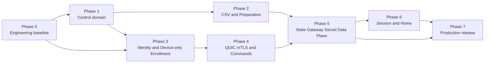

# Natsume V2 总体实施 Roadmap

> 架构基线：`Natsume_V2_Design_v2.7.md`  
> Roadmap 版本：v1.4  
> 日期：2026-07-23  
> 状态：实施阶段职责与 Gate 基线  
> 说明：本文只定义各阶段负责的结果及其验收标准。详细工作包、任务顺序、测试矩阵、风险与交付物分别维护在各 Phase 文件中。

---

## 1. 总体 Roadmap

基准周期保持 **44 周**，建议对外计划另保留 4–6 周管理储备。`Phase 0–7` 是工程实施阶段，不是产品运行时概念；产品本身没有赛事 Phase。

| 阶段 | 基准窗口 | 阶段负责的结果 | Gate | 详细计划 |
|---|---:|---|---|---|
| Phase 0 | W1–W3 | 工程基线、目标环境探针、真实 CI、空壳 Debian 包 | G0 | `docs/implementation/phase-0-engineering-baseline.md` |
| Phase 1 | W4–W9 | 最小 Server Domain、Server vault、Auth/API/SSE、Web Shell | G1 | `docs/implementation/phase-1-control-domain.md` |
| Phase 2 | W7–W13 | 单 CSV、重复导入、Preparation Center、Target/Drift | G2A | `docs/implementation/phase-2-csv-preparation.md` |
| Phase 3 | W7–W16 | Machine ID、Client vault、Daemon 启动检查、只签发 Device certificate 的 Enrollment | G2B | `docs/implementation/phase-3-identity-enrollment.md` |
| Phase 4 | W14–W22 | mandatory-mTLS QUIC、Observed、Operation/Command/journal、Gateway CSR 窄协议契约 | G3 | `docs/implementation/phase-4-quic-command.md` |
| Phase 5 | W20–W29 | `SYNC_STATE` 内 Gateway 证书签发、`SYNC_SECRET`、Caddy、LKG、离线恢复 | G4 | `docs/implementation/phase-5-state-gateway-data-plane.md` |
| Phase 6 | W25–W34 | D-Bus、XDG Autostart 常驻 Slint Session Agent、desktop-only Session、Binding Prompt、Home Reset | G5 | `docs/implementation/phase-6-session-home.md` |
| Phase 7 | W31–W44 | Packaging、Hardening、Scale、Pilot、完整赛事演练与正式发布 | G6/G7 | `docs/implementation/phase-7-production-release.md` |



关键路径：

```text
工程基线
→ 最小领域与两端 vault
→ Machine ID 与只签发 Device certificate 的 Enrollment
→ mandatory-mTLS QUIC 与可靠 Command
→ SYNC_STATE 内通过 QUIC 签发 Gateway certificate
→ human-only SYNC_SECRET 与 Caddy/LKG
→ Session/Home
→ Packaging/Scale/Rehearsal
```

---

## 2. Phase 0：工程基线与目标环境探针

### 负责内容

建立可重复构建、可测试、可安装的真实仓库基线；冻结受支持的 Server/Client OS、Desktop、Browser、DOMjudge、Caddy、硬件和 Home backend；完成 IP-SAN、Enrollment/QUIC 双 TLS 配置、Machine ID、跨桌面 Session Agent XDG/logind/Slint Wayland/X11 GUI、Session lock、Home 和 Debian package 的技术探针。

### 验收标准 G0

- clean checkout 可完成 Rust/Web/codegen/契约/打包相关的真实 CI，关键检查中不存在占位任务；
- Client 安装能通过交互与 preseed 保存并验证 Server IP/port；
- Server IP SAN 和错误 CA/IP 的正反测试通过；
- 匿名 QUIC handshake 被 mandatory client-auth 配置在进入 Protobuf 前拒绝；
- XDG Autostart在GNOME Wayland与LightDM启动的目标X11 desktop中直接启动常驻Agent，且package无Session Agent systemd user unit；greeter/remote/ambiguous session被拒绝；
- Agent初始无窗口，typed trigger才懒显示Slint UI；Slint feature/ELF闭包无Qt backend、interpreter、live-preview、tray、MCP/testing或外部GUI runtime，Wayland unfocused为可观察结果；
- desktop lock/unlock 探针证明不调用 Caddy Admin、不改变 Caddy 配置；
- 目标物理硬件可稳定采集 Machine ID 候选并产出 fixture；
- 空壳 Server/Client Deb 的最终用户、目录、unit、D-Bus 与 Caddy 拓扑可安装、升级和卸载。

---

## 3. Phase 1：最小控制域与 Server 基础

### 负责内容

实现无 Event/phase/Team metadata 的最小领域模型、SQLite 事务约束、Server encrypted vault、operator Auth/RBAC、HTTP/OpenAPI、Audit/Change/SSE、Web Shell，以及无真实传输的 Operation/Command 骨架。

### 验收标准 G1

- Seat、Account、CredentialRevision、SeatAssignment、Device、DeviceBinding、Configuration、AutomationPolicy 的事务与约束通过；
- Machine Hardware ID 不可修改，Device 无 merge/split；
- Server root key、record-level AEAD、key-check、备份/恢复原型可用，密码不以明文进入 DB/WAL/temp/log/API；
- Web → API → SQLite → Audit/Change/SSE 的纵向链路可演示；
- Target generation/hash 可确定性计算，但领域变更不会产生任何 Device 网络副作用；
- API、数据库和 Web 中不存在 Event/phase/Team metadata 兼容层。

---

## 4. Phase 2：单 CSV 与 Preparation Center

### 负责内容

实现唯一的 `seat,account,password` UTF-8 CSV 输入、加密 staging、masked preview、原子 commit、Seat universe 冻结、重复导入语义、非秘密导出、Preparation Center、Target/Secret Drift 与 Automation Policy UI。

### 验收标准 G2A

- 系统只接受一个固定 schema 的 CSV 文件，不存在多文件、XLSX/ODS、列映射或 legacy encoding 路径；
- 首次 commit 冻结 Seat 集合，后续导入必须包含完全相同集合；reassign、password update、unassign、no-op 语义正确；
- password 在 preview、API、export、audit、logs、SQLite plaintext/WAL 中均不可见；
- import commit 只更新 Server truth/Target/Drift，不创建 `SYNC_STATE`、`SYNC_SECRET` 或隐式推送；
- Preparation Center 能清晰区分 target drift、secret drift、Enrollment、Binding、certificate 和 readiness；
- 不提供 DOMjudge credential export。

---

## 5. Phase 3：Machine ID、Client Vault 与 Device-only Enrollment

### 负责内容

实现 Machine Hardware ID 采集与纯逻辑判定、独立 identity file、Daemon 集成启动检查、Client encrypted vault、Server endpoint/trust、server-auth HTTPS Enrollment、人工/策略批准，以及只用于 Daemon QUIC mTLS 的 Device Identity certificate 生命周期。

### 验收标准 G2B

- identity-before-vault 在 fresh install、configured-disk copy、证据暂不可用、identity file 损坏、site namespace mismatch 和 vault corruption 场景下均符合 fail-closed 语义；
- 确定 Machine ID mismatch 会清理 identity-bound local state 并回到普通首次安装；decrypt failure 不会被误判为新 Device；
- Enrollment request、数据库与响应只包含 Device Identity CSR/SPKI/leaf/chain，不包含 Gateway CSR、Gateway SPKI 或 Gateway certificate；
- manual/auto approval 生成有效 Device clientAuth certificate，并可建立第一条 mandatory-mTLS QUIC connection；
- 无 token、installation instance、clone reason、独立 Identity Guard service 或 Device merge/split；
- Phase 3 结束时 Gateway key/certificate 可以完全不存在，且 Caddy 不被误判为已准备。

---

## 6. Phase 4：QUIC mTLS、Observed 与可靠 Command

### 负责内容

实现 Quinn/rustls mandatory-mTLS control session、精确 wire version、connection registry、Observed snapshot、Operation/Target/Command/Attempt、Client command journal、幂等执行与 fleet simulator；冻结 `GatewayCertificateRequest/Result` 只能服务 active `SYNC_STATE` 的协议与授权契约。

### 验收标准 G3

- 匿名、错误 CA/profile/SAN/serial、revoked/disabled Device 在进入应用协议前被拒绝；
- 2,000 条 mTLS connection 和 reconnect storm 在有界内存、FD、队列下稳定；
- Command 在本地 fsync 前不回报 `RECEIVED`，重复投递不重复产生效果，terminal result 可重放；
- Observed 是 apply progress 的唯一设备事实来源，不存在 `DesiredStateStatus`；
- reconnect 不会自动推送最新 Target State；
- Gateway certificate request 在无 mTLS、无 active `SYNC_STATE`、Device/command/generation/configuration 不匹配时被拒绝；相同 request/SPKI 可幂等恢复，不同 SPKI 进入 conflict。

---

## 7. Phase 5：显式 State/Secret、Gateway 与离线数据面

### 负责内容

实现真实 `SYNC_STATE`/`SYNC_SECRET` executor、在 `SYNC_STATE` 内通过 mTLS QUIC 按需生成 Gateway key/CSR 并签发 Gateway certificate、Client encrypted LKG、Caddy visual BLOCKED、runtime materialization、DOMjudge 集成及断电/离线恢复。

### 验收标准 G4

- 第一次 `SYNC_STATE` 在 Gateway credential 不存在时生成本地 Gateway key/CSR，并通过已认证 QUIC 取得按目标 hostname/profile 签发的 certificate；Enrollment 路径不能参与；
- Server 从冻结 command snapshot 派生 Gateway SAN/profile，忽略 CSR 自报 SAN；request/response 与 command journal 可在断线和重启后幂等恢复；
- `SYNC_STATE` 只应用非秘密 target，必要时清旧 secret，并可在 secret 缺失时以有效本地 HTTPS 显示 visual BLOCKED；
- `SYNC_SECRET` 只能由 human actor 触发，并具备 re-auth、reason、Audit、加密两端 journal、零明文日志和重复抑制；
- Gateway private key 持久化时只有 vault ciphertext，明文只在 `/run`；
- steady 状态在 Server 离线时整机重启可恢复 Caddy READY；non-steady transition 不恢复旧 account；
- Caddy/DOMjudge login、Cookie、CSRF、redirect、Brotli、submission 和 failure contract 通过。

---

## 8. Phase 6：D-Bus、Session 与 Home

### 负责内容

完成 local-control D-Bus、Privileged Helper hardening、由 desktop XDG Autostart 直接启动并常驻无初始窗口的 Session Agent、Slint Wayland/X11 GUI、Binding Prompt、desktop-only lock/unlock/terminate、managed Browser、Home Template、OverlayFS/staged-copy backend 与 Home Reset 恢复事务。

### 验收标准 G5

- Privileged Helper 无外部网络、无任意命令/路径/unit，未授权 UID 无法调用；
- GNOME Wayland、GNOME X11（发行版提供时）和 LightDM 启动的目标 X11 desktop 可由同一system-wide XDG Autostart entry直接启动Agent；greeter、remote、inactive、错误UID/seat和多session歧义均被拒绝；
- Agent启动即常驻但无可见窗口，typed snapshot才懒显示Slint component；package无systemd user unit，Daemon不得猜测display环境重启Agent；
- Slint正式构建使用backend-winit + renderer-skia，并禁用Qt backend、interpreter、live-preview、system tray、MCP/system-testing；
- Binding Prompt 在Wayland focus被拒时准确回报`presented_unfocused`并可使用标准通知，不能把普通窗口当安全锁；
- Session commands 精确绑定 session instance/epoch/lock epoch/originating command；stale unlock 无法作用于新 session；
- lock/unlock/terminate 全程不调用或 reload Caddy，当前 Gateway 行为保持不变；
- BindingRequest/BindingResult 端到端可用，binding 不自动同步 secret；
- Home Reset 在每一个 durable step 后 kill/reboot 均可恢复或 fail closed，不能启动不确定 Home；
- 目标 OS 上从 Enrollment、Binding、State/Secret 到 Browser/Session/Home 的完整 Client 流程通过。

---

## 9. Phase 7：Productionization 与正式发布

### 负责内容

完成正式 Debian packages、供应链、升级/回滚、systemd hardening、Observability、Backup/Restore、2,000 Device 容量、Operator Runbook、Pilot、中规模彩排、完整赛事演练和生产冻结。

### 验收标准 G6/G7

- 两个正式 Deb 在支持OS上通过clean install、reinstall、upgrade、interrupted upgrade、remove/purge、reboot；无runtime download、systemd credentials、Identity Guard或Session Agent user service；XDG Autostart与Slint/Agent依赖闭包正确；
- SBOM、license/security scan、checksums/signatures、offline APT repository 与 provenance 完整；
- 2,000 sustained mTLS connections、200 active Commands、bulk `SYNC_STATE`/human `SYNC_SECRET`、reconnect storm 和 soak tests 通过；
- Server DB/root key 分离备份恢复、Client vault corruption/factory reset、PKI、Caddy、Session、Home 和 Device replacement runbook 由非作者人员演练通过；
- Pilot 和完整赛事演练覆盖：单 CSV、Device-only Enrollment、首次 `SYNC_STATE` 的 Gateway QUIC 签发、GNOME Wayland与LightDM/X11的XDG Autostart + Slint Binding GUI、Secret Sync、登录提交、锁定、换机、Home Reset、Server outage/reboot、configured-disk copy、audit/backup/reset；
- 演练中无架构绕过、手工改库、明文秘密或匿名证书通道；
- 无未解决 Critical/High defect，operator sign-off、release notes、known limitations、rollback/factory reset 和生产 tag/package/repository 全部冻结。
