# Natsume V2 完整架构设计

> 状态：V2 权威设计基线（Greenfield，v2.5）  
> 日期：2026-07-22  
> 适用范围：Natsume V2 首个可生产版本及同代演进  
> 约束：V2 不兼容 V1；每次赛事部署都以全新 Server 数据和全新运行基线初始化；产品运行期只服务一场赛事

---

## 0. 文档目标与固定决策

本文描述 Natsume V2 的产品边界、领域模型、设备身份、首次接入、QUIC/mTLS 协议、Web Panel、客户端权限、本地加密存储、Caddy 数据面、离线恢复、Session、Home Reset、部署、测试与实施计划。

v2.5 在 v2.4 的最小领域模型上完成证书生命周期收口：首次 Enrollment 只签发供 Daemon 建立 QUIC mTLS 的 Device Identity certificate；Gateway 私钥、CSR 与证书均延迟到显式 `SYNC_STATE` 执行期间，通过已经完成 mTLS 的 QUIC control session 按目标配置签发。v2.5 同时把总体 Roadmap 与各实施阶段的详细计划拆分为独立文件。

实现若改变本节冻结的核心决策，必须在同一变更中完成：

1. 新增或更新 ADR；
2. 更新本文、OpenAPI、Protobuf 与 D-Bus schema；
3. 更新数据库 migration；
4. 更新威胁模型、运维手册与升级策略；
5. 更新自动测试、故障注入与发布门禁。

### 0.1 已冻结的核心决策

| 领域 | 最终决策 |
|---|---|
| 产品生命周期 | 一个初始化后的 Natsume 实例只服务当前一场赛事；赛事边界由部署重置表达，不在数据库中建模 `Event` |
| 赛事阶段 | 不存在 `draft/preparation/live/closed` 等 phase；操作和自动化策略不受阶段门禁限制 |
| 账号数据 | Natsume 只管理 DOMjudge `account` 与 `password`；组织、类别、展示名、队伍资料等均由外部预处理 pipeline 负责 |
| 赛位数据 | `seat` 是绝对稳定的物理编号；赛位改名、合并和删除不属于正常运行时能力 |
| 数据导入 | 每次只接受一个 UTF-8/UTF-8 BOM CSV，固定列 `seat,account,password`；允许多次导入，以 seat 为主键形成重新分配或密码修订 |
| 导出 | 只导出非秘密资产与状态；不生成 DOMjudge 可导入账号凭据文件，不提供密码导出 |
| 服务端形态 | 单控制器 `natsume-server`；HTTPS 管理/Enrollment 与 QUIC 设备面同进程、不同 transport listener |
| 主数据库 | SQLite + WAL；单控制器、短事务、显式约束 |
| Web Panel | React + TypeScript + Vite + shadcn/ui；静态产物与 Server binary 一起打包但不嵌入 Rust binary |
| Monorepo | Cargo virtual workspace 管 Rust，pnpm workspace 管 Web，根 `justfile` 只编排，nFPM 直接映射 build outputs |
| Rust 错误处理 | SNAFU 统一替代 `anyhow + thiserror`；模块使用 typed error/context selector，binary 顶层使用 `snafu::Report` |
| 设备 ID | 数据库内部使用 UUIDv7 `device_pk`；对外稳定标识为唯一且不可修订的 UUIDv5 `MachineHardwareId`；不存在 `machine_hardware_id_version` |
| 站点身份命名空间 | `fleet_namespace_uuid` 是站点级、公开、不可变的部署材料；随签名 Client package/image 与 Server 配置提供，跨赛事重置保持不变 |
| 安装实例 | 不建模 `installation_instance_id`；机器身份只由 `MachineHardwareId` 表达 |
| 设备字段 | Device 不保存 display name、hostname、canonical anchor kind、当前 claim digest 或 anchor-set hash；hostname/IP 仅可作为瞬时 observation |
| 设备资产调整 | Device 不支持 merge/split；只能先 unbind，再删除旧 Device，然后把 Seat 绑定到重新 enrollment 的新 Device |
| 启动身份校验 | Daemon 启动时读取独立 Machine Hardware ID 文件并重新采集候选；确定不匹配时清理本地状态并进入普通首次安装流程；无独立 Identity Guard service，无 clone 专用记录 |
| 首次接入 | Client 先使用仅验证 Server 的 HTTPS Enrollment；由 operator 人工批准或全局自动批准；Enrollment 只签发 Daemon 的 Device Identity/QUIC client certificate；无 one-time/bootstrap token |
| 正常设备认证 | Device Identity certificate 安装后，Device control 使用 Quinn/QUIC + TLS 1.3 双向证书认证；Machine Hardware ID 负责标识，证书负责认证 |
| Gateway 证书 | Enrollment 不生成、不提交也不返回 Gateway CSR/证书；`SYNC_STATE` 在已认证 QUIC 会话中按目标配置请求签发，Server 从命令快照派生 SAN/profile |
| 传输加密 | QUIC packet protection 由 Quinn/rustls 按 TLS 1.3 握手透明完成；应用不再叠加自研传输加密层 |
| 协议 | 单条长期双向 control stream + Protobuf；精确 `wire_version`；不实现通用 RPC 框架 |
| Target State | `DeviceTargetState` 只包含非秘密目标快照；不主动下发；设备应用由显式 `SYNC_STATE` Command 触发 |
| Secret | 密码不属于 Target State；只通过显式、受审计、不可自动触发的 `SYNC_SECRET` Command 分发 |
| 状态回报 | 删除 `DesiredStateStatus`；`ObservedStateSnapshot` 同时报告 received/applied generation、apply state 与稳定错误码 |
| Binding 协议 | 使用 `BindingRequest` 与 `BindingResult`；不再使用 `BindingRequestResult` |
| 操作模型 | Operation → OperationTarget → Command → Attempt；至少一次投递 + `command_id` 幂等执行 |
| 自动化 | 全局 Automation Policy 可控制 enrollment approval、binding、非秘密 state sync 与 prompt；证书签发不是独立自动化开关：Device cert 随 enrollment approval 签发，Gateway cert 是 `SYNC_STATE` 的受约束子步骤；不能自动同步密码 |
| 本地秘密 | Client 与 Server 的持久化秘密存入应用层 AEAD 加密的 SQLite vault 记录；不使用 systemd credentials |
| 本地密钥 | Client 使用随机 32-byte root key，并以 Machine Hardware ID 作为 HKDF salt 绑定；Machine Hardware ID 不是密钥熵 |
| 身份文件 | `/var/lib/natsume/identity/machine-hardware-id` 独立、非秘密、原子保存，并在打开加密 vault 前验证 |
| 解密失败 | 身份匹配但 vault 解密失败视为损坏/密钥丢失并 fail closed；不得自动认定为新 Device |
| Caddy | 固定版本、独立非 root、loopback HTTPS；磁盘 bootstrap 无秘密并显示本地可视化 503 状态页 |
| Session lock | `LOCK_SESSION`/`UNLOCK_SESSION` 只控制桌面与 Session Agent gate；不切换、不 reload、不阻断 Caddy |
| Client 安装 | 安装阶段询问并持久化 Server IP 与 port；支持 debconf/preseed 和非交互配置 |
| 离线连续性 | steady 状态可从本地加密 vault/LKG 恢复 Caddy；Server 离线时当前赛位继续工作 |
| Home Reset | 固定 contest 用户 + 版本化 Home Template + OverlayFS；不支持时部署期固定 staged-copy fallback |

### 0.2 设计目标

1. 以最小领域模型表达稳定 Seat、DOMjudge 账号/密码、物理 Device 与 Seat 绑定。
2. 系统盘被复制到另一台机器时，在复制的证书、密码、LKG 或 Gateway key 被使用前识别 Machine Hardware ID 不匹配并清理本地状态。
3. 在不向选手、Session Agent、Web Panel、日志或普通导出暴露密码的前提下完成 DOMjudge 自动登录。
4. 让秘密同步始终由 operator 明确触发，且可以审计、超时、重试并抑制重复效果。
5. 将非秘密目标状态与一次性副作用分离：目标状态可计算，真正应用必须由 Command 触发。
6. 让正常 Device control 在 TLS 握手阶段完成双向认证，而不是在应用层自造 bearer token 或签名协议。
7. 支持批量 enrollment、证书签发、binding、state sync、secret sync、Session、Home Reset、诊断与 readiness 检查。
8. 控制服务器或控制网络短暂不可用时，已准备好的工作站仍能访问 DOMjudge。
9. 将浏览器可控 HTTP 输入、联网 daemon、root helper、桌面 Agent 与 Caddy 拆成独立信任边界。
10. 对 2,000 台并发在线设备保持有界资源、可观察状态和确定恢复语义。

### 0.3 明确非目标

- 不兼容或迁移 V1。
- 不在一个数据库中保存多场赛事，也不提供赛事归档、复用、切换或历史查询。
- 不管理 Team 展示名、组织、类别、国家、成员或其他预处理元数据。
- 不解析 XLSX、ODS、TSV、分号 CSV 或 legacy encoding。
- 不提供明文密码回读、敏感凭据导出或 DOMjudge 导入文件生成。
- 不允许 Device merge/split，也不做编辑距离、相似度或人工别名拼接。
- 不把 MAC、IP、hostname 或 `/etc/machine-id` 单独当成可信硬件身份。
- 不提供远程 shell、任意命令、任意文件路径、任意 systemd unit 或通用 RMM。
- 不做多控制器 HA；首版是单实例控制器。
- 不依赖公网 ACME、外部在线 CA 或运行时下载。
- 不实现后台证书续签器；签发和重签均为显式 workflow。
- 不承诺抵抗本地 root、kernel、固件或物理攻击。
- 不把 Session lock 当作网络隔离或秘密撤销机制。

### 0.4 系统不变量

1. DOMjudge 密码不得出现在通用 API、前端状态、日志、指标、错误详情、审计正文、非秘密导出或 Session Agent 中。
2. 任何网络输入都不能直接变成 shell、任意路径、任意 UID、任意 unit、任意环境变量或任意代理上游。
3. `MachineHardwareId` 对一个 Device 永久不变；数据库无版本字段，运行时无 rename、merge 或 split。
4. `fleet_namespace_uuid` 跨赛事重置保持不变；改变它属于站点重新部署，不得由普通升级或 Server 初始化隐式生成。
5. Machine Hardware ID 不是认证凭据；只有有效 Device Identity certificate 才能建立正常 QUIC control session。
6. 独立身份文件必须在本地加密 vault 打开前校验；确定 mismatch 时旧 vault、root key、证书、LKG 和 runtime material 均不得继续使用。
7. 只有 identity file、root key、Client DB、Device certificate 和 LKG 均不存在时才属于真正首次启动；身份文件缺失/损坏但存在任一 identity-bound artifact 时必须 fail closed。
8. 身份匹配但 vault authentication/decryption 失败必须 fail closed，并报告 local vault corruption；不得自动创建新 Device。
9. 首次 Enrollment request 只能携带 Device Identity CSR，Enrollment result 只能返回 Device Identity leaf/chain；Gateway CSR、Gateway key 或 Gateway certificate 出现在 Enrollment schema、数据库或响应中均属于设计违规。
10. Gateway certificate request 只能从已经通过 Device mTLS 的 QUIC control session 发出，并必须绑定同一 Device 的 active `SYNC_STATE` command、target generation、configuration revision、request ID 与 CSR SPKI。
11. Server 不信任 Gateway CSR 中自报的 SAN/EKU；Gateway SAN、profile、validity 与授权范围必须从冻结的 `SYNC_STATE` snapshot 和 Server policy 派生。
12. `SYNC_SECRET` 永远不能由 Automation Policy 自动创建；密码分发必须由 operator 明确提交。
13. Device 只有在 Command 已写入本地 journal 并 fsync 后才能回报 `RECEIVED`。
14. 同一 `command_id` 的重复投递不得产生第二次破坏性效果、第二次密码安装或不受控的第二张 Gateway certificate；相同证书 request 必须幂等返回同一结果。
15. `SYNC_STATE` 的 generation/hash 必须与 Server target 快照一致；Device 不接受任意 URL、路径、SAN 或自由文本配置。
16. `SYNC_SECRET` 必须绑定当前 Device、Seat assignment revision、credential revision 和 command ID；assignment 不匹配时拒绝安装。
17. Caddy 无有效 Gateway certificate、已安装 secret 或可证明的 steady activation state 时必须 fail closed。
18. Seat/account 重新分配时，旧 secret 在新非秘密 state 被应用前必须先被清除或失效；不得隐式回滚旧账号。
19. 首次成功 CSV commit 冻结物理 Seat 集合；后续导入必须包含完全相同的 Seat 集合，不能通过拼写变化隐式创建新 Seat。
20. root `natsume-privileged-helper` 不得拥有外部网络能力。
21. 业务写入、Operation、AuditEvent 和 ChangeEvent 必须位于同一 Server 数据库事务中。
22. `UNLOCK_SESSION` 只能作用于创建当前锁的同一 `session_instance_id + session_epoch + lock_epoch + lock_command_id`。
23. Session lock/unlock 不得 reload Caddy；桌面解锁失败不能改变当前 Caddy runtime config。
24. Home Reset 不得删除或重建系统用户；无法证明 Home 状态安全时不得启动 contest session。
25. BLOCKED 状态页只能暴露 allowlist 中的非秘密 enum、短 ID、时间、进度和恢复提示。

---

## 1. 系统上下文与平面划分

### 1.1 总体上下文

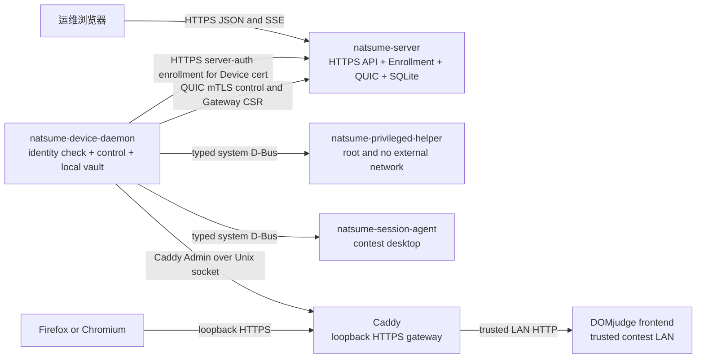
```mermaid
flowchart LR
    Operator["运维浏览器"]
    Server["natsume-server\nHTTPS API + Enrollment + QUIC + SQLite"]
    Daemon["natsume-device-daemon\nidentity check + control + local vault"]
    Privileged["natsume-privileged-helper\nroot and no external network"]
    Session["natsume-session-agent\ncontest desktop"]
    Caddy["Caddy\nloopback HTTPS gateway"]
    Browser["Firefox or Chromium"]
    DOM["DOMjudge frontend\ntrusted contest LAN"]

    Operator -->|"HTTPS JSON and SSE"| Server
    Daemon -->|"HTTPS server-auth enrollment for Device cert"| Server
    Daemon -->|"QUIC mTLS control and Gateway CSR"| Server
    Daemon -->|"typed system D-Bus"| Privileged
    Daemon -->|"typed system D-Bus"| Session
    Daemon -->|"Caddy Admin over Unix socket"| Caddy
    Browser -->|"loopback HTTPS"| Caddy
    Caddy -->|"trusted LAN HTTP"| DOM
```

### 1.2 三个逻辑平面与一个 Enrollment 通道

| 平面/通道 | 连接 | 主要职责 |
|---|---|---|
| 人类控制平面 | Browser → Server，HTTPS JSON + SSE | CSV、Seat/Account、Device、Binding、Operation、审批、观察、审计 |
| Enrollment 通道 | Daemon → Server，server-auth HTTPS | 提交 Machine Hardware ID 与 Device Identity CSR、查询审批、取得 Daemon QUIC client leaf/chain |
| 设备控制平面 | Daemon → Server，QUIC + mandatory mTLS | `SYNC_STATE`、Gateway CSR/签发结果、`SYNC_SECRET`、其他 Command、Observed、Heartbeat |
| 比赛数据平面 | Browser → Caddy → DOMjudge | 本地 TLS、HTTP/2、登录头注入、Brotli 透明传输、fail-closed |

边界规则：

- 未取得 Device certificate 的 Client 不能建立 control session；
- Enrollment HTTPS 不接受 Gateway CSR/证书、Device Command、Target/Observed State 或密码；
- Device certificate 不能调用 operator CRUD；
- Caddy 不参与 Device 身份或 Server 授权；
- Privileged Helper 不持有 DOMjudge 密码，也不能连接 Server 或 DOMjudge；
- Session Agent 不读取本地 vault。

### 1.3 关键数据流

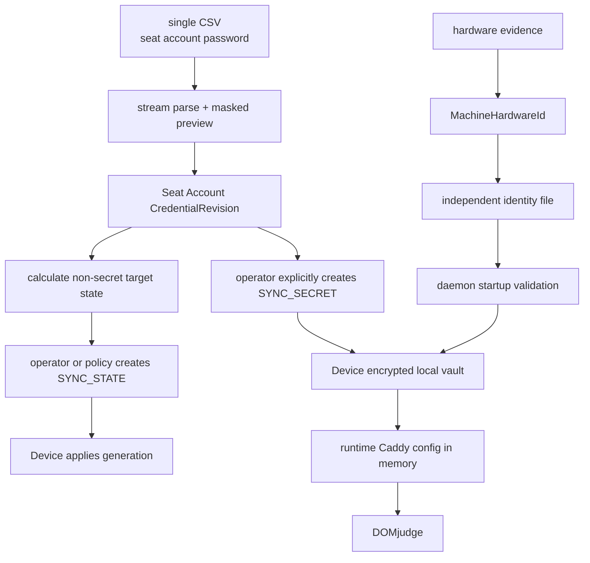
```mermaid
flowchart TB
    CSV["single CSV\nseat account password"] --> Import["stream parse + masked preview"]
    Import --> Domain["Seat Account CredentialRevision"]
    Domain --> Target["calculate non-secret target state"]
    Target --> Sync["operator or policy creates SYNC_STATE"]
    Sync --> Device["Device applies generation"]
    Domain --> Secret["operator explicitly creates SYNC_SECRET"]
    Secret --> Vault["Device encrypted local vault"]
    Vault --> Caddy["runtime Caddy config in memory"]
    Caddy --> DOM["DOMjudge"]

    Hardware["hardware evidence"] --> Mid["MachineHardwareId"]
    Mid --> File["independent identity file"]
    File --> Guard["daemon startup validation"]
    Guard --> Vault
```

---

## 2. 技术选型、Library-first 原则与边界理由

### 2.1 只自研 Natsume 业务语义

Natsume 自己实现：

- Seat/account assignment 与 Device binding；
- 单文件 CSV 的预览、原子提交和 password revision；
- Machine Hardware ID 候选选择、启动匹配和 fleet collision；
- Enrollment 审批与两套 leaf certificate profile；
- Target state、Observed state、Drift 与显式 Sync Command；
- Command 幂等、deadline、resource lane 与恢复；
- Gateway activation journal、本地加密 vault、Session/Home 状态机。

HTTP、QUIC、TLS、X.509、Protobuf、D-Bus、SQLite、CSV、密码学、systemd、Caddy 和 Debian package 由成熟库或组件承担。禁止为了“统一接口”重写 parser、TLS record、QUIC packet protection、HTTP server 或 X.509 编码器。

### 2.2 Rust 服务与基础设施

| 能力 | 采用实现 | 边界 |
|---|---|---|
| Async/runtime | Tokio、tokio-util | 不自研 executor、timer、framing |
| HTTP/API/SSE | Axum、Tower、tower-http | operator 与 Enrollment 使用不同 route/policy |
| OpenAPI | utoipa、utoipa-axum | Web DTO 由 snapshot 生成 |
| SQLite | SQLx、`sqlx::migrate!` | WAL、短事务、writer gate |
| QUIC/TLS | Quinn、rustls | Quinn/rustls 负责 TLS 1.3 handshake 与 QUIC packet protection |
| Protobuf | Prost、prost-build、protoc-bin-vendored | 生成到 `OUT_DIR` |
| Error | SNAFU | stable error code 显式映射，不解析 Display |
| Configuration | Figment + Serde | root-owned TOML + env override |
| CSV | csv | 只接受固定 schema UTF-8 CSV |
| Cryptography | chacha20poly1305、hkdf、sha2、secrecy、zeroize | 随机 root key + identity-bound KDF；不自研 cipher |
| X.509/CSR | rcgen、rustls-pki-types、x509-parser | 生成后独立验证 profile |
| IDs | uuid | UUIDv5 MachineHardwareId、UUIDv7 internal IDs |
| Linux | rustix、sysinfo、smbios-lib、raw-cpuid、procfs、udev | typed system access；不解析 CLI 文本 |
| Retry | backon + business deadline | 无界 retry 禁止 |
| Observability | tracing | 结构化、类型层脱敏 |

### 2.3 SNAFU 错误规则

- 每个领域/基础设施模块定义 typed error enum；
- 使用 context selector 补充 operation/resource context；
- binary 顶层使用 `snafu::Report` 或 `#[snafu::report]`；
- HTTP Problem Details、Protobuf、D-Bus、Command Result 显式映射稳定错误码；
- `Whatever`、裸字符串、无分类 `Box<dyn Error>` 不作为公共逃生舱；
- Secret、private key、password、CSR、Caddy runtime config 使用 redacted `Debug/Display` wrapper；
- CI 包含 report/source-chain/redaction 测试。

### 2.4 单文件 CSV

固定契约：

```csv
seat,account,password
A-01,team001,example-secret
A-02,team002,example-secret
```

- MIME/extension 不能替代内容检查；
- 只接受 UTF-8 或 UTF-8 BOM；
- delimiter 固定为逗号，第一行固定 header；
- 不做编码、分隔符、sheet 或格式自动探测；
- parser streaming 运行并限制文件大小、行数、字段数、字段长度与 deadline；
- password 只进入内存和加密 staging；
- Preview 只返回 `password_present`、policy 结果与 masked revision impact；
- Commit 全有或全无；
- 导出 CSV 对 spreadsheet formula injection 做前缀保护。

### 2.5 Machine Hardware ID 采集

Privileged Helper 采集并在内存中规范化原始值，Daemon 只接收候选 UUID/质量；原始序列号不离开 Helper。

| 证据 | 库/API | 规则 |
|---|---|---|
| Product UUID/serial | `sysinfo::Product` | 首选；拒绝 placeholder、全零、重复模板值 |
| Motherboard serial | `sysinfo::Motherboard` | 与 Product 组合形成强候选 |
| SMBIOS 补充 | `smbios-lib` | 只补齐和交叉检查；冲突显式返回 |
| Processor serial | `raw-cpuid` | 仅真实 leaf 存在时作为辅助 |
| Root disk WWN/serial | `procfs::MountInfo` + `udev` | 仅唯一物理根盘时作为 fallback |
| fingerprint/UUID | sha2 + uuid | 固定 domain separator 与站点级 `fleet_namespace_uuid` |

`fleet_namespace_uuid` 是非秘密站点标识，由受控部署材料提供，不能在每次赛事 Server 初始化时重新生成。它使同一硬件在同一站点始终得到相同 Machine Hardware ID，同时避免跨站点直接关联。MAC、IP、hostname、CPU 型号、内存容量、磁盘型号不得进入 ID。

### 2.6 本地加密数据库而不是 systemd credentials

Server 和 Client 都使用 SQLite 作为 durable store，并对所有私钥、密码、LKG、CA key、secret staging 等敏感 payload 做应用层 AEAD 加密。SQLite schema、索引和非秘密 journal 可以保持可查询；敏感列只能存 `ciphertext + nonce + aad_version + key_version`。

Client root key：

```text
/var/lib/natsume/keys/client-root.key
owner natsume, mode 0400, parent 0700
```

派生：

```text
K_client_vault = HKDF-SHA256(
    input_key = random_client_root_key,
    salt = machine_hardware_id_bytes,
    info = "natsume-client-vault-v1"
)
```

单独使用 Machine Hardware ID 不能提供保密性，因为它不是秘密且熵不可假定。随机 root key 提供真正密钥熵；Machine Hardware ID 只负责把密文绑定到当前硬件身份。

Server 使用独立随机 `server-root.key`，加密数据库中的 operator bootstrap secret、DOMjudge credential revision、Server control TLS private key、Device/Origin issuing CA private key。该 root key 通过文件权限而不是 systemd credentials 提供。没有 TPM/人工口令时，无人值守启动必然需要本地可读 root key，因此本设计不声称抵抗本地 root compromise。

### 2.7 Quinn、TLS 1.3 与 mTLS 的职责

Quinn 使用 rustls 构建 QUIC-compatible TLS configuration。TLS handshake 负责 Server 身份验证、可选 Client 身份验证和 traffic secrets；QUIC 使用这些 secrets 派生 packet/header protection keys。应用看到的是已完成加密、完整性保护和拥塞控制的 stream，不需要再次实现“给 QUIC 包加密”。

Natsume 保留 mTLS 的原因：

- 正常 control session 需要在接受任何 Protobuf 前证明 Client 持有该 Device 的 private key；
- rustls 原生支持 Client 发送 certificate 与 Server 强制验证 certificate；
- Quinn 可取得 peer certificate chain，Server 再校验 SAN、serial、Device 状态和 `ClientHello.machine_hardware_id`；
- 若去掉 mTLS，必须自研 bearer token、签名 challenge、replay 保护、密钥轮换和连接绑定，复杂度与风险更高；
- mTLS 不增加第二层流量加密，它只把 Client certificate authentication 加入现有 TLS 1.3 handshake。

配置原则：

- HTTPS Enrollment：Server certificate required，Client certificate disabled；
- QUIC control：Server certificate required，Client certificate mandatory；
- 两者使用独立 rustls config、session cache 与 listener，不使用“可匿名也可带证书”的混合 control listener；
- `enable_early_data=false`、`max_early_data_size=0`，Command/Secret 不使用 0-RTT；
- ALPN 固定为 `natsume-device/2`；
- Server leaf certificate 包含安装时配置 IP 的 SAN；Client trust root 由签名 package/image 安装。

### 2.8 React Web Panel

```text
React + TypeScript + Vite
shadcn/ui + Tailwind CSS
TanStack Query + TanStack Table
React Hook Form + Zod
openapi-typescript + openapi-fetch
Vitest + Playwright
```

Web 不保存密码、Device/Gateway private key、local vault key、Caddy runtime JSON 或 enrollment private material。Local/session storage 只保存非敏感 UI 偏好。

### 2.9 Protobuf 与 codegen

`.proto` 只属于 `crates/device-protocol`，通过 `prost-build` 与 `protoc-bin-vendored` 在 Cargo `build.rs` 中生成到 `OUT_DIR`。CI 校验 descriptor、golden fixture、最大消息大小与 breaking change。Protobuf 只表达消息，可靠投递与幂等由业务层承担。

### 2.10 Caddy、Home 与 package

- Caddy 只监听 loopback，Admin API 只绑定 permissioned Unix socket；
- 磁盘 bootstrap 只包含 visual BLOCKED page，无 upstream/password；
- Gateway key/cert 在首次 `SYNC_STATE` 时按需产生，此后只从加密 Client DB 解密并 materialize 到 `/run/natsume/gateway-tls`；
- Home 默认 OverlayFS，fallback 为部署期固定的 `rsync -aHAX --numeric-ids --delete`；
- nFPM 直接组合 Rust binary、Web assets、Caddy 和 package-owned rootfs，不维护第二棵 staging tree。

---

## 3. Monorepo、Workspace 与打包边界

### 3.1 目标结构

```text
Natsume/
├── Cargo.toml
├── Cargo.lock
├── rust-toolchain.toml
├── deny.toml
├── package.json
├── pnpm-workspace.yaml
├── pnpm-lock.yaml
├── justfile
├── server/
│   ├── Cargo.toml
│   ├── migrations/
│   └── src/
├── client/
│   ├── device-daemon/
│   ├── privileged-helper/
│   └── session-agent/
├── web/
│   ├── openapi/
│   ├── src/api/generated/
│   └── e2e/
├── crates/
│   ├── device-protocol/
│   ├── local-control-api/
│   └── machine-identity/
├── integration-tests/
├── packaging/
│   ├── server/
│   └── client/
└── docs/
    ├── v2-design.md
    ├── implementation-roadmap.md
    ├── adr/
    └── runbooks/
```

### 3.2 Ownership

| 路径 | package/binary | 唯一职责 |
|---|---|---|
| `server` | `natsume-server` | Domain、SQLite、HTTPS、Enrollment、QUIC、PKI、vault、dispatcher |
| `client/device-daemon` | `natsume-device-daemon` | 启动身份校验、Enrollment、QUIC、Command journal、Client vault、Caddy adapter |
| `client/privileged-helper` | `natsume-privileged-helper` | root hardware collection、Home、logind；无外网 |
| `client/session-agent` | `natsume-session-agent` | binding prompt、desktop lock gate、Browser launch；无秘密 |
| `crates/device-protocol` | `natsume-device-protocol` | Protobuf schema、generated facade、wire fixture |
| `crates/local-control-api` | `natsume-local-control-api` | D-Bus interface/value types |
| `crates/machine-identity` | `natsume-machine-identity` | 纯 normalization、candidate 与 boot-match 逻辑 |
| `web` | `@natsume/web` | operator Panel |
| `integration-tests` | `natsume-integration-tests` | 跨进程、重启、同传、fault 与 package tests |

禁止创建通用 `common/utils/helpers/pipeline` 垃圾桶。只有出现两个真实生产 consumer 且契约稳定时才抽 shared crate。

### 3.3 依赖方向

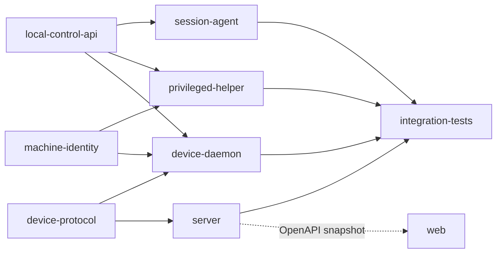
```mermaid
flowchart LR
    Protocol["device-protocol"] --> Server["server"]
    Protocol --> Daemon["device-daemon"]
    Local["local-control-api"] --> Daemon
    Local --> Helper["privileged-helper"]
    Local --> Agent["session-agent"]
    Identity["machine-identity"] --> Daemon
    Identity --> Helper
    Server -. "OpenAPI snapshot" .-> Web["web"]
    Server --> Tests["integration-tests"]
    Daemon --> Tests
    Helper --> Tests
    Agent --> Tests
```

`machine-identity` 不做 Linux I/O；Collector 位于 Privileged Helper。`local-control-api` 不含密码或 root implementation。Production package 不依赖 integration-tests。

### 3.4 原生 workspace

- 根 Cargo virtual workspace 是全部 Rust package 的唯一依赖图和 lockfile；
- pnpm workspace 只包含 `web`；
- `justfile` 只调用 Cargo、pnpm、Mermaid CLI、nFPM、lintian 等原生工具；
- OpenAPI snapshot 与 generated TypeScript 提交仓库，Web build 不依赖 Rust toolchain；
- Cargo `build.rs` 不调用 pnpm，Web build 不调用 Cargo；
- nFPM manifest 是 package file manifest，不复制 `dist/stage`。

### 3.5 根 recipes

```text
fmt, lint, unit, integration, e2e, api, protocol,
diagrams, build, package, package-test, verify
```

Recipes 不实现依赖图、cache、migration 或业务逻辑。

### 3.6 结构演进规则

新增顶层目录、shared crate、Node package 或 Debian package 必须回答唯一 owner、真实 consumers、lockfile/build graph 影响和删除后的产品损失。无法回答时不创建。

---

## 4. 领域模型

### 4.1 核心关系

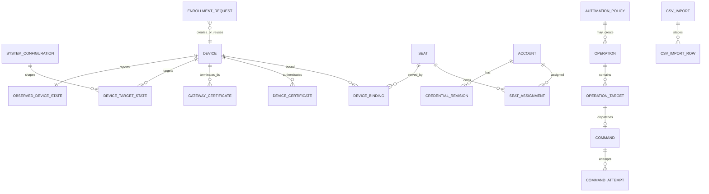
```mermaid
erDiagram
    SYSTEM_CONFIGURATION ||--o{ DEVICE_TARGET_STATE : shapes
    AUTOMATION_POLICY ||--o{ OPERATION : may_create
    SEAT ||--o{ SEAT_ASSIGNMENT : owns
    ACCOUNT ||--o{ SEAT_ASSIGNMENT : assigned
    ACCOUNT ||--o{ CREDENTIAL_REVISION : has
    DEVICE ||--o{ DEVICE_BINDING : bound
    SEAT ||--o{ DEVICE_BINDING : served_by
    DEVICE ||--o{ DEVICE_CERTIFICATE : authenticates
    DEVICE ||--o{ GATEWAY_CERTIFICATE : terminates_tls
    DEVICE ||--o{ DEVICE_TARGET_STATE : targets
    DEVICE ||--|| OBSERVED_DEVICE_STATE : reports
    CSV_IMPORT ||--o{ CSV_IMPORT_ROW : stages
    ENROLLMENT_REQUEST }o--|| DEVICE : creates_or_reuses
    OPERATION ||--o{ OPERATION_TARGET : contains
    OPERATION_TARGET ||--o| COMMAND : dispatches
    COMMAND ||--o{ COMMAND_ATTEMPT : attempts
```

### 4.2 单实例领域边界

数据库不包含 Event。当前配置、Seat、Account、Device、Operation 与审计都天然属于本次初始化后的唯一赛事实例。下一场赛事通过部署 runbook 执行：

1. 导出所需非秘密报告与审计；
2. 吊销/清理 Device binding 与本地 secret；
3. 备份或销毁当前 Server 数据；
4. 初始化新的空数据库、Server vault root key 与本次实例的 Device Issuing CA、Origin Issuing Intermediate；
5. 保持站点级 `fleet_namespace_uuid`、Control Trust Root 与 Local Origin Root 不变；
6. 重新导入 CSV、Enrollment 和 binding。

这不是运行时的“切换赛事”功能。

### 4.3 SystemConfigurationRevision

版本化、不可原地覆盖：

- `configuration_revision_id`: UUIDv7
- `revision_no`
- `domjudge_upstream_url`
- `domjudge_upstream_host_header`
- `client_origin_hostname`，默认 `contest.natsume.test`
- `browser_start_path`
- `domjudge_login_path`
- `gateway_connect_timeout_ms`
- `gateway_response_header_timeout_ms`
- `gateway_certificate_profile_id`
- `browser_policy_revision`
- `home_template_revision`
- `created_by`、`created_at`
- `activated_at?`、`deactivated_at?`

同时最多一个 active revision。配置可以在没有任何 Gateway certificate 时激活；激活只生成新的非秘密 target。每台 Device 执行 `SYNC_STATE` 时，Daemon 检查本地是否已有满足目标 hostname、profile 与有效期要求的 Gateway certificate：满足则复用，不满足则在该命令内通过已认证 QUIC 会话请求签发。Origin hostname 变化必然使旧 SAN 不匹配，因此下一次 `SYNC_STATE` 必须取得新证书后才能完成。

### 4.4 AutomationPolicy

全局 policy，可版本化：

- `policy_revision_id`
- `enabled_until?`
- `allowed_subnets`
- `max_automatic_devices`
- `minimum_hardware_identity_quality`
- `auto_approve_enrollment`
- `auto_approve_binding_request`
- `auto_sync_state_after_binding`
- `auto_open_binding_prompt_on_connect`
- `created_by`、`created_at`、`activated_at?`、`deactivated_at?`

没有 phase 条件。开关默认关闭，可无期限或显式过期，但 Panel 必须持续显示风险 banner。不存在独立的 `auto_issue_device_certificate` 或 `auto_issue_gateway_certificate`：Enrollment approval 本身签发 Device certificate；Gateway certificate 仅在已经授权的 `SYNC_STATE` 中按需签发。**不存在 `auto_sync_secret`。**

### 4.5 Seat

- `seat_id`: UUIDv7 internal key
- `label`: canonical physical seat code，唯一且不可修改
- `created_at`
- `row_version`

Seat 不保存 room、row、attributes、display name 或 Team metadata。首次成功 CSV commit 创建并冻结本实例的 Seat 集合；后续导入出现未知 Seat、缺少已知 Seat 或 label 变化都必须阻止 commit。删除/重建 Seat 只允许在赛事间部署重置或显式离线 maintenance 中进行，不是普通 Panel 操作。

### 4.6 Account 与 CredentialRevision

`Account`：

- `account_id`: UUIDv7
- `domjudge_username`: 唯一
- `row_version`

`CredentialRevision`：

- `credential_revision_id`: UUIDv7
- `account_id`
- `revision_no`
- `password_vault_record_id`
- `created_at`
- `superseded_at?`

Natsume 不保存 display name、organization、category 或成员信息。密码更新只创建新 revision，不返回旧值。

### 4.7 SeatAssignment

- `seat_assignment_id`: UUIDv7
- `seat_id`
- `account_id?`
- `revision_no`
- `state`: `active | superseded | unassigned`
- `created_by`
- `created_at`
- `superseded_at?`

Seat 是主语。CSV 中同一 Seat 的 account 变化表示新 assignment revision。一个 account 同时最多分配到一个 active Seat；一个 Seat 同时最多一个 active Account。

### 4.8 Device

只保存业务需要字段：

- `device_pk`: UUIDv7 internal surrogate key
- `machine_hardware_id`: UUIDv5，唯一、不可修改
- `hardware_identity_quality`: `strong | medium | weak`
- `enrollment_state`: `pending | approved | enrolled | revoked | disabled`
- `daemon_version?`
- `agent_version?`
- `last_source_ip?`
- `last_seen_at?`
- `disabled_at?`
- `row_version`

不保存：

- `machine_hardware_id_version`
- `installation_instance_id`
- `display_name`
- `hostname`
- `canonical_anchor_kind`
- `current_hardware_claim_digest`
- `enrollment_anchor_set_hash`

Hardware candidates 只在 Enrollment/启动判断中临时存在或作为短期、脱敏的 pending request evidence；一旦 Device 创建，Server 只以 immutable Machine Hardware ID 为稳定标识。

### 4.9 DeviceBinding

- `device_binding_id`: UUIDv7
- `device_pk`
- `seat_id`
- `state`: `active | revoked`
- `revision_no`
- `request_source`: `panel | device_prompt | automation`
- `created_by`
- `created_at`、`revoked_at?`

一个 Device 同时最多绑定一个 Seat，一个 Seat 同时最多绑定一个 Device。Device replacement 流程只能：

1. unbind 旧 Device；
2. 确认旧 Device 无 active binding/unfinished destructive command；
3. revoke certificate 并删除旧 Device；
4. 新 Device 完成 Enrollment；
5. 把 Seat 绑定到新 Device。

没有 merge/split/reparent API。

### 4.10 CsvImport 与 staging

- `csv_import_id`: UUIDv7
- `state`: `uploaded | parsed | previewed | committed | failed | expired`
- `content_sha256`
- `row_count`
- `expires_at`
- `created_by`
- `parse_summary_json`

`CsvImportRow`：

- normalized `seat`
- normalized `account?`
- `password_vault_record_id?`，指向有 TTL 的加密 staging record
- row number
- validation/result flags

每个 Import 只有一个 source file；没有 `ImportSource`、source type、column mapping 或多文件 join。

### 4.11 DeviceTargetState

`DeviceTargetState` 是 Server 计算的**非秘密 target snapshot**：

- `device_pk`
- `generation`
- `canonical_hash`
- `binding_revision?`
- `seat_id?`、`seat_label?`
- `seat_assignment_revision?`
- `account_id?`、`domjudge_username?`
- `configuration_revision_id?`
- `client_origin_hostname?`
- `gateway_certificate_profile_id?`
- `gateway_certificate_min_valid_until?`
- `browser_policy_revision`
- `home_template_revision`
- `session_policy`
- `created_at`

它不包含 password、credential revision、secret envelope、secret delivery epoch 或预先存在的 Gateway certificate fingerprint。创建新 generation 不产生隐式网络副作用；只有 `SYNC_STATE` Command 才应用某一 generation，并在需要时完成 Gateway certificate 的 QUIC 内签发子流程。

### 4.12 ObservedDeviceState

- `device_pk`
- `boot_id`
- `received_generation`
- `applied_generation`
- `applied_hash`
- `state_apply_status`: `idle | received | validating | applying | waiting_for_gateway_certificate | applied | failed | recovery_required`
- `state_error_code?`
- `installed_assignment_revision?`
- `installed_credential_revision?`
- `secret_state`: `absent | installed | stale | failed`
- `gateway_state`
- `gateway_config_revision?`
- `gateway_certificate_fingerprint?`
- `gateway_certificate_not_after?`
- `session_instance_id?`
- `session_epoch?`
- `session_lock_state`
- `home_state`
- `component_health_json`
- `observed_at`

`DesiredStateStatus` 被删除；状态变化通过完整或 compact Observed snapshot 表达。Gateway certificate request/issue 进度既体现在关联 `SYNC_STATE` Command，也体现在 `waiting_for_gateway_certificate`/稳定错误码中。

### 4.13 EnrollmentRequest

- `enrollment_request_id`: UUIDv7
- `machine_hardware_id`
- `hardware_identity_quality`
- `device_csr_der`
- `device_spki_sha256`
- `software_version`
- `source_ip`
- `state`: `pending | approved | rejected | issued | expired | conflict`
- `approval_source`: `manual | automation`
- `resolution?`: `create_device | rekey_existing_device`
- `resolved_device_pk?`
- `created_at`、`decided_at?`

Enrollment schema 中没有 Gateway CSR/SPKI，也不返回 Gateway certificate。相同 Machine Hardware ID + 相同 Device SPKI 可幂等恢复同一 request；相同 ID + 不同 Device SPKI 进入 conflict，自动批准暂停。无 bootstrap token、installation nonce 或 clone reason。

### 4.14 GatewayCertificateRequest

Gateway certificate request 是 `SYNC_STATE` 的持久化子资源，不是 Enrollment，也不是独立 HTTP enrollment route：

- `gateway_certificate_request_id`: UUIDv7
- `device_pk`
- `command_id`
- `target_generation`
- `configuration_revision_id`
- `csr_der`
- `spki_sha256`
- `request_nonce_sha256`
- `state`: `pending | issued | rejected | temporarily_unavailable | expired | conflict`
- `issued_certificate_id?`
- `stable_error_code?`
- `created_at`、`completed_at?`

Server 只接受来自当前 mTLS connection 的请求，并要求 `command_id` 指向该 Device 正在执行的 `SYNC_STATE`，且 generation/configuration 与冻结 payload 一致。CSR 仅证明 Gateway private key possession；SAN、EKU、KeyUsage、profile 与 validity 由 Server 从命令快照派生。相同 request ID/command/SPKI 重试必须返回同一已签发结果；同一 request 或 command 出现不同 SPKI 必须进入 conflict。

### 4.15 Operation / Target / Command / Attempt

详见第 11 节。所有设备副作用都必须通过 Command，包括 state sync、secret sync、Session、Home 与 diagnostics。Device certificate 由 Enrollment workflow 安装；Gateway certificate 是 `SYNC_STATE` 内的 QUIC 子协议结果，不使用通用 `INSTALL_CERTIFICATE` Command。

### 4.16 数据库约束

至少包含：

- `seat.label` 唯一且普通 API 不可更新；首次成功导入后 Seat 集合不可插入、删除或改名；
- `account.domjudge_username` 唯一；Account 不保存启停、展示或组织类业务元数据；
- 一个 Seat 同时最多一个 active SeatAssignment；
- 一个 Account 同时最多一个 active SeatAssignment；
- 一个 Device 同时最多一个 active DeviceBinding；
- 一个 Seat 同时最多一个 active DeviceBinding；
- `machine_hardware_id` 全局唯一且不可更新；
- active Device/Gateway certificate serial 唯一；同一 Device 同时最多一个 active Gateway certificate；
- Gateway certificate request 必须唯一绑定 `command_id + target_generation + configuration_revision_id + spki_sha256`，且只允许关联同一 Device 的 `SYNC_STATE`；
- Target generation 对单 Device 单调递增；
- credential revision 对单 Account 单调递增；
- `command_id` 全局唯一；
- `idempotency_key + actor + endpoint` 唯一；
- Device 有 active binding 时禁止 delete；
- 同一 Machine Hardware ID 的 pending Enrollment 使用 conflict-safe unique index；
- Automation Policy 不得包含 secret-sync 字段。

---

## 5. 服务端架构

### 5.1 内部组件

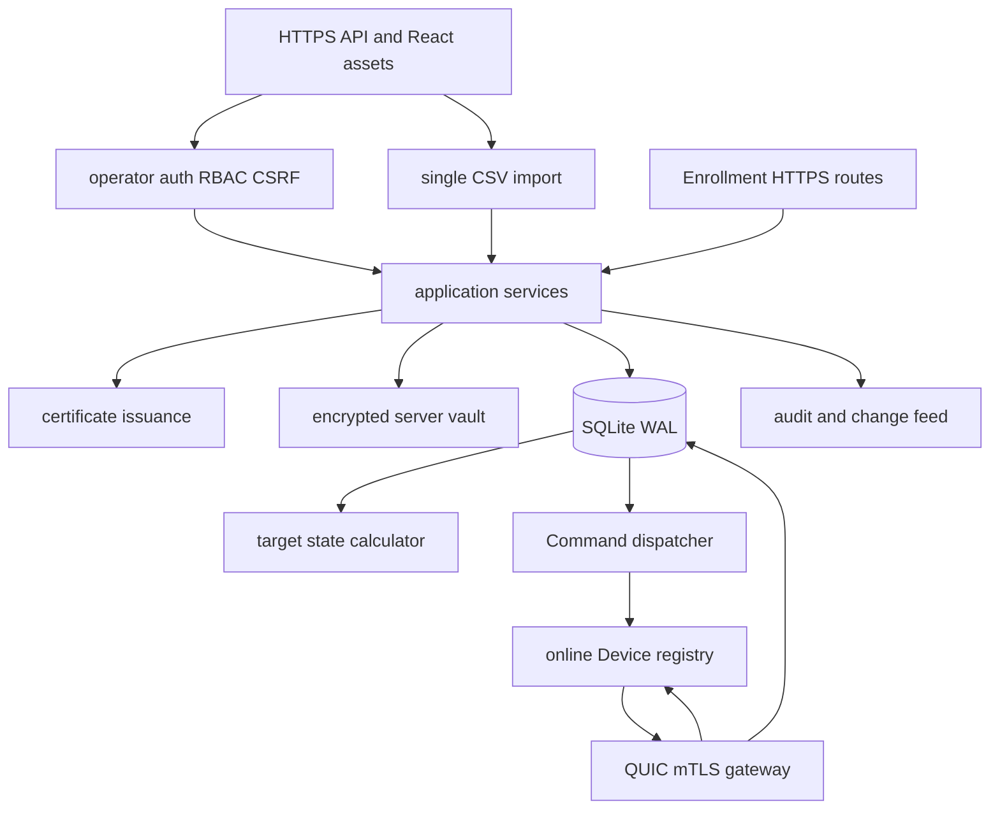
```mermaid
flowchart TB
    HTTP["HTTPS API and React assets"]
    Enroll["Enrollment HTTPS routes"]
    Auth["operator auth RBAC CSRF"]
    Import["single CSV import"]
    App["application services"]
    PKI["certificate issuance"]
    Vault["encrypted server vault"]
    DB[("SQLite WAL")]
    Target["target state calculator"]
    Dispatcher["Command dispatcher"]
    Registry["online Device registry"]
    QUIC["QUIC mTLS gateway"]
    Change["audit and change feed"]

    HTTP --> Auth --> App
    HTTP --> Import --> App
    Enroll --> App
    App --> PKI
    App --> Vault
    App --> DB
    App --> Change
    DB --> Target
    DB --> Dispatcher
    Dispatcher --> Registry
    Registry --> QUIC
    QUIC --> Registry
    QUIC --> DB
```

### 5.2 事务边界

业务 mutation 在单个 SQLite 事务中：

1. 校验 RBAC、ETag、Idempotency-Key 和领域不变量；
2. 写 domain rows；
3. 计算并写受影响 Device 的新 target generation；
4. 只有当前请求明确要求副作用时才创建 Operation/Command；
5. 写 AuditEvent；
6. 写 ChangeEvent；
7. commit。

例如 CSV commit 只改变 Seat/Account/Credential/Assignment 与 target generation，不自动创建 `SYNC_SECRET`。Panel 后续由 operator 显式选择 `SYNC_STATE` 和 `SYNC_SECRET`。

### 5.3 SQLite 使用规则

- WAL、foreign keys、busy timeout；
- 应用级 writer gate；
- parsing、signing、KDF、network I/O 不持有写事务；
- heartbeat 主要保存在内存 registry，状态变化或至少 30 秒 coalesced checkpoint 才落库；
- online backup API + integrity check；
- migration 只向前，不含 V1 或多赛事兼容层。

### 5.4 Server encrypted vault

`/var/lib/natsume-server/natsume.db` 中的敏感 records 只保存 AEAD ciphertext。Root key：

```text
/var/lib/natsume-server/keys/server-root.key
owner natsume-server, mode 0400, parent 0700
```

加密对象：

- DOMjudge password revisions；
- Server control TLS private key；
- Device issuing CA private key；
- Origin issuing CA private key；
- temporary CSV password staging；
- operator bootstrap material；
- future recovery secret。

AAD 绑定 table/type、record UUID、schema version 与 key version。Root key 不进 SQLite backup；备份/恢复 runbook 必须分别备份 DB 密文与 root key，并以不同介质/权限保存。Server root key 丢失时无法恢复密码或 CA key，必须重初始化当前赛事实例。

### 5.5 在线 Device registry

以内层 `device_pk` 为 key，保存：

- current connection epoch；
- peer certificate serial/fingerprint；
- Server-observed source IP；
- heartbeat/boot ID；
- wire/software version；
- queue depth；
- applied generation；
- gateway/session/home compact health。

同一 Device 新连接通过完整 mTLS + ClientHello 后替换旧 epoch。旧连接可提交已完成的 terminal result，但不能覆盖最新 connectivity/Observed。

### 5.6 Target state calculator

Target 是数据库业务事实的纯函数：active SystemConfiguration、SeatAssignment、DeviceBinding、certificate state 与 policy revision。计算结果 canonical serialize + hash，generation 只在内容变化时增长。

Reconciler 不自动发送 target。Dispatcher 只在以下情况投递：

- operator 创建 `SYNC_STATE`；
- Automation Policy 明确允许非秘密自动 sync，并在 binding transaction 后创建可审计 Operation；
- recovery workflow 重投已经存在的同一 Command。

### 5.7 Enrollment 与 control listener 分离

同一个 Server IP/port number 可分别监听：

- TCP：HTTPS management + Enrollment；
- UDP：QUIC control。

端口号相同但 transport 不同，防火墙必须分别允许 TCP/UDP。Enrollment route 只接受固定大小 CSR/evidence，不共享 operator session，也不暴露 control protocol。QUIC listener 必须在 TLS handshake 阶段要求 Device certificate。

### 5.8 配置 revision 激活

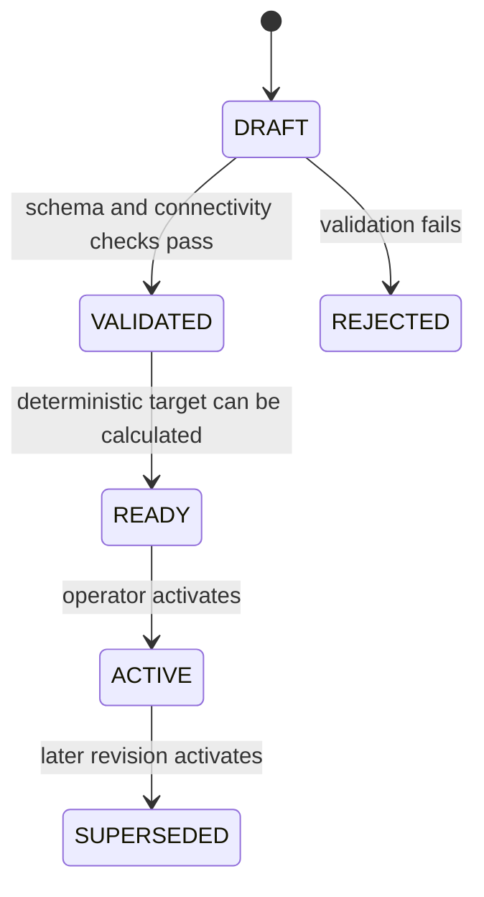
```mermaid
stateDiagram-v2
    [*] --> DRAFT
    DRAFT --> VALIDATED: schema and connectivity checks pass
    DRAFT --> REJECTED: validation fails
    VALIDATED --> READY: deterministic target can be calculated
    READY --> ACTIVE: operator activates
    ACTIVE --> SUPERSEDED: later revision activates
```

配置激活不等待任何 per-Device Gateway certificate，也不触发签发。激活只更新 target generation。Panel 显示哪些 Device 在下一次 `SYNC_STATE` 中需要首次签发或重新签发 Gateway certificate；真正请求必须由该命令经 mTLS QUIC 发起。

---

## 6. 人类控制面：Web Panel、CSV、审批与显式同步

### 6.1 路由与信息架构

```text
/overview
/import
/seats
/accounts
/devices
/bindings
/enrollments
/certificates
/configuration
/automation
/operations
/audit
/settings
/devices/:deviceId
/operations/:operationId
/admin/operators
/admin/pki
```

没有 `/events/:eventId`。

### 6.2 Overview / Preparation Center

主工作台显示：

- CSV 当前 revision 与待应用 assignment 数；
- Enrollment pending/conflict；
- Device certificate coverage 与 Gateway certificate readiness；
- Device binding；
- target generation drift；
- secret absent/stale；
- Gateway/Session/Home；
- 最近 Operation；
- Automation Policy banner；
- Fleet readiness。

主要动作：导入 CSV、审批 Enrollment、打开 binding prompt、绑定、同步 state、同步 secret、Session、Home Reset、readiness 检查。Gateway certificate 不提供 Enrollment 时的独立签发按钮；它由 `SYNC_STATE` 按需取得。

### 6.3 单 CSV 导入语义

固定 header：`seat,account,password`。

推荐把每次文件视为当前 Seat/Account/Password 的**完整权威快照**：

- 首次成功 commit 中每个 Seat 必须恰好出现一次，并由此冻结物理 Seat 集合；
- 后续导入必须包含完全相同的 Seat 集合；未知 Seat、缺少 Seat 或 label 拼写变化都阻止 commit；
- 已存在 Seat label 不可改名；
- `account` 与 `password` 同时非空：Seat 分配给 Account，并创建/复用 password revision；
- `account` 与 `password` 同时为空：显式 unassign；
- 只空一个字段：validation error；
- duplicate Seat、duplicate active Account、未知 header、额外列、空 Seat 均阻止 commit；
- 缺少已知 Seat 默认阻止 commit，避免意外批量 unassign；
- 同一 Seat account 变化表示 reassignment；
- account 不变、password 变化只创建新的 CredentialRevision；
- account/password 都未变化则 no-op；
- 多次导入均生成独立 Import/Audit revision。

Preview 逐行显示：

```text
create_seat | assign | reassign | password_update | unassign | unchanged | error
```

密码只显示 present/changed/policy result，不返回值。

### 6.4 Import 时序

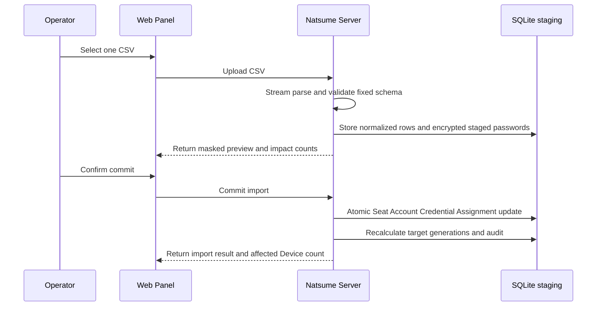
```mermaid
sequenceDiagram
    participant User as Operator
    participant Panel as Web Panel
    participant Server as Natsume Server
    participant DB as SQLite staging

    User->>Panel: Select one CSV
    Panel->>Server: Upload CSV
    Server->>Server: Stream parse and validate fixed schema
    Server->>DB: Store normalized rows and encrypted staged passwords
    Server-->>Panel: Return masked preview and impact counts
    User->>Panel: Confirm commit
    Panel->>Server: Commit import
    Server->>DB: Atomic Seat Account Credential Assignment update
    Server->>DB: Recalculate target generations and audit
    Server-->>Panel: Return import result and affected Device count
```

Import commit 不自动触发 Device sync。

### 6.5 导出

允许：

- Seat/account assignment（不含 password）；
- Device inventory 与 binding；
- certificate/status；
- Operation result；
- Fleet readiness；
- Audit JSONL/CSV。

禁止：

- password/credential export；
- DOMjudge import credential file；
- Caddy runtime config；
- private key、CSR private material、local vault record。

### 6.6 Enrollment UI

Pending 列表显示：Machine Hardware ID、quality、source IP、software version、Device Identity CSR fingerprint、首次/最近请求时间和 conflict。Operator 可 approve/reject；开启 auto approval 时仍要求满足 subnet、quality、device limit、无 duplicate machine ID/Device SPKI conflict。

Approve 的结果是签发并返回 Daemon QUIC client certificate。UI 不展示 Gateway CSR fingerprint，也不暗示 Enrollment 已准备 Caddy。Gateway certificate 状态在 Device/Configuration 页面中以 `not_requested | requesting | active | invalid | failed` 独立展示，并只由 `SYNC_STATE` 驱动。

无 token 输入框、token 生成页面或 token history。

### 6.7 Binding

Panel 支持：

- pending `BindingRequest` approve/reject；
- Device table 选择 Seat；
- Seat table选择 Device；
- unbind；
- replacement wizard（严格执行 unbind/delete/new enrollment/rebind）。

绑定只改变 Server target。是否立即 `SYNC_STATE` 由 operator 选择或 Automation Policy 处理。Secret 不随 binding 自动发送。

### 6.8 显式 `SYNC_STATE`

Panel 预览：

- target Device 数量；
- current/applied 与 target generation；
- assignment/account/config changes；
- Gateway certificate 动作：`reuse | issue | reissue`；
- 是否会 block Gateway、停止 Browser 或清除旧 secret；
- offline policy 与 deadline。

提交后创建 Operation + 每 Device 一个 `SYNC_STATE` Command。Command payload 固定到 generation/hash，不允许 Device 在执行时读取已经变化的“latest”。

执行期间，Daemon 先验证 target。若本地没有满足目标 origin/profile/validity 的 Gateway certificate，则在 configuration resource lane 中生成或选择 Gateway key、持久化 request journal，并通过当前 mTLS QUIC session 发送 `GatewayCertificateRequest`。Server 只按该命令快照签发并返回 `GatewayCertificateResult`。证书验证和加密落盘成功后，Daemon materialize `/run` key/cert、启动或更新 Caddy visual BLOCKED 配置，再完成非秘密 target apply。

断线后 Device 以相同 request ID/CSR SPKI 重试；Server 幂等返回同一结果。没有有效 mTLS、命令已过期、generation/configuration 不匹配或 CSR SPKI 冲突时必须拒绝。

### 6.9 显式 `SYNC_SECRET`

这是唯一 password 分发入口：

1. operator 选择已绑定且 target/applied assignment 一致的 Device；
2. Server 预览 account、credential revision、Device secret state 和 target count，但不显示 password；
3. operator 提交并填写 reason；
4. Server 为每个目标创建 `SYNC_SECRET` Command；
5. dispatcher 只在发送前从 Server vault 解密 password；
6. Device 验证 assignment revision、Device identity、deadline 与 command ID；
7. Device 将 secret 直接写入本地加密 vault并 fsync，再回报 installed；
8. Device 生成/加载 Caddy runtime config并 health check；
9. Operation 汇总 installed/gateway-ready。

Automation Policy、binding、reconnect、target generation 变化均不得自动创建该 Command。

### 6.10 Automation Policy

可自动：

- approve Enrollment；批准即签发 Device Identity certificate；
- approve BindingRequest；
- create `SYNC_STATE` after binding；该命令可在内部按需取得 Gateway certificate；
- open Binding prompt。

不可自动：

- 独立签发任意 Gateway certificate；
- `SYNC_SECRET`；
- Home Reset；
- Session terminate；
- Device delete；
- certificate revoke。

Policy 不受 phase 限制。修改 policy 要求 lead/admin、re-auth、Audit；可配置 expiry，未配置 expiry 时 Panel 持续显示常驻告警。Gateway certificate issuance 没有独立 policy 开关，因为它不是无上下文自动动作，而是已授权 `SYNC_STATE` 的必要、受约束步骤。

### 6.11 Fleet readiness

Readiness 是当前单实例检查，不是“进入 live”状态转换。至少检查：

- CSV 无 unresolved error；
- required Seat 已 assignment；
- required Seat 已 Device binding；
- Enrollment/collision 无 pending blocker；
- Device Identity certificate 有效；每个已应用配置对应的 Gateway certificate 已通过 `SYNC_STATE` 签发并满足 SAN/profile/validity；
- target state 已通过显式 sync 应用；
- current credential revision 已通过显式 secret sync 安装；
- Caddy READY/upstream healthy；
- Browser trust 无警告；
- Home template 正确；
- 无 unfinished destructive/recovery transaction。

### 6.12 API 约定

- 前缀 `/api/v2`；
- JSON snake_case；RFC 3339 UTC；
- errors `application/problem+json`；
- mutation 使用 `Idempotency-Key`；
- mutable resource 使用 ETag/If-Match；
- list cursor pagination；
- secret-sensitive response `Cache-Control: no-store`；
- OpenAPI 生成 Panel types。

代表接口：

```text
POST   /api/v2/imports
POST   /api/v2/imports/{id}:preview
POST   /api/v2/imports/{id}:commit
GET    /api/v2/exports/devices.csv
GET    /api/v2/exports/assignments.csv
GET    /api/v2/enrollments
POST   /api/v2/enrollments/{id}:approve
POST   /api/v2/enrollments/{id}:reject
POST   /api/v2/actions/issue-device-certificates
POST   /api/v2/actions/issue-gateway-certificates
POST   /api/v2/actions/open-binding-prompts
POST   /api/v2/actions/sync-state
POST   /api/v2/actions/sync-secret
POST   /api/v2/actions/lock-session
POST   /api/v2/actions/unlock-session
POST   /api/v2/actions/reset-home
POST   /api/v2/readiness
GET    /api/v2/stream
```

批量动作返回 `202 Accepted` 和 Operation URL。

### 6.13 Auth、RBAC 与 SSE

本地 operator accounts：Argon2id、Secure/HttpOnly/SameSite=Strict cookie、CSRF、idle/absolute timeout。角色：viewer、operator、lead、admin。Secret sync、Home Reset、Device delete、PKI 与 automation policy 至少要求 lead/admin，并可要求 re-auth。

SSE 使用持久化 cursor，事件包括 device/enrollment/binding/target/observed/operation/certificate/automation/import/readiness change。断线通过 Last-Event-ID 补齐，超出窗口发送 snapshot reset。

---
## 7. Machine Hardware ID、首次 Enrollment 与 PKI

### 7.1 身份与认证分层

```text
device_pk
    Server 内部 UUIDv7，只用于关系和事务

MachineHardwareId
    唯一、不可修订的物理设备标识，用于 API、Panel、证书 SAN 与资源定位

Device Identity certificate
    正常 QUIC control session 的认证凭据，证明连接方持有对应 private key
```

Machine Hardware ID 可以被本地 root/固件伪造，因此不承担 cryptographic authentication。Certificate 也不改变 Device ID；重签只更新 credential，不创建新“安装实例”。

### 7.2 Candidate 生成与唯一 ID 选择

Privileged Helper 生成一组脱敏候选：

| candidate kind | component | quality |
|---|---|---|
| `system_uuid` | valid Product UUID | strong |
| `system_uuid_board` | Product UUID + board serial | strong |
| `product_board` | product serial + board serial | strong |
| `board_chassis` | board serial + chassis serial | medium |
| `board_processor` | board serial + actual processor serial | medium |
| `board_root_disk` | board serial + root disk WWN/serial | medium |
| `board_only` | valid board serial | weak fallback |
| `root_disk_only` | unique physical root disk WWN/serial | weak fallback |

Candidate：

```text
Uuid::new_v5(
    fleet_namespace_uuid,
    "natsume/machine-hardware-id/v1" || NUL ||
    candidate_kind || NUL ||
    sorted_component_fingerprints
)
```

首次启动按固定优先级选择最高质量候选作为唯一 `MachineHardwareId`。候选 UUID 的 namespace 必须使用站点级、不可变的 `fleet_namespace_uuid`。若最高质量只有 weak candidate，Enrollment 必须人工批准；若没有任何硬件派生的合格候选，Client 保持 `identity_unavailable`，不创建随机 ID，也不使用会随系统盘复制的 app-local ID 兜底。

Server 不维护 canonical anchor kind、anchor set hash 或 alias graph。Fleet collision 由 `machine_hardware_id` unique constraint 与 pending Enrollment conflict 检测阻止。

### 7.3 独立身份文件

路径：

```text
/var/lib/natsume/identity/machine-hardware-id
owner natsume, mode 0440, parent 0750
```

内容包含 schema version、`fleet_namespace_uuid`、Machine Hardware ID 与 checksum，不包含原始 serial、private key 或 secret。写入使用 temp → fsync → rename → fsync parent。

它必须独立于 SQLite vault，原因是启动时需要在尝试解密任何复制来的 secret 之前比较当前硬件。文件中的 namespace 与部署配置不一致时标记 `site_namespace_mismatch` 并 fail closed；不能把站点配置错误伪装成新设备。

### 7.4 Daemon 启动身份检查

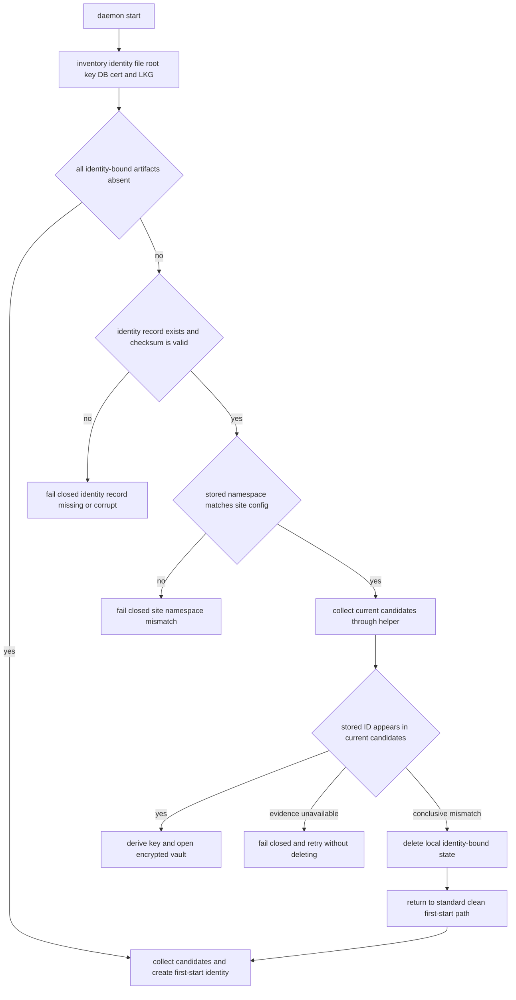
```mermaid
flowchart TD
    Start["daemon start"] --> Inventory["inventory identity file root key DB cert and LKG"]
    Inventory --> Clean{"all identity-bound artifacts absent"}
    Clean -->|"yes"| CollectFirst["collect candidates and create first-start identity"]
    Clean -->|"no"| Record{"identity record exists and checksum is valid"}
    Record -->|"no"| Corrupt["fail closed identity record missing or corrupt"]
    Record -->|"yes"| Namespace{"stored namespace matches site config"}
    Namespace -->|"no"| SiteError["fail closed site namespace mismatch"]
    Namespace -->|"yes"| Collect["collect current candidates through helper"]
    Collect --> Match{"stored ID appears in current candidates"}
    Match -->|"yes"| Open["derive key and open encrypted vault"]
    Match -->|"evidence unavailable"| Retry["fail closed and retry without deleting"]
    Match -->|"conclusive mismatch"| Reset["delete local identity-bound state"]
    Reset --> CleanAgain["return to standard clean first-start path"]
    CleanAgain --> CollectFirst
```

决策必须区分：

- `clean_first_start`：identity file、root key、Client DB、certificate 与 LKG 全部不存在；
- `matched`：当前候选包含 stored ID；
- `indeterminate`：collector permission/firmware/temporary I/O 导致证据不足；不删除任何数据，不启动 Caddy；
- `identity_record_missing_or_corrupt`：身份文件缺失/损坏但其他本地状态存在；fail closed，等待显式 factory reset；
- `site_namespace_mismatch`：部署站点身份发生冲突；fail closed，不自动重建 ID；
- `mismatch`：完整、足够强的当前证据不包含 stored ID；执行 identity-bound local reset。

不允许“身份文件不存在就覆盖现有 vault”，不允许“任何一次读取失败即清空”，也不允许“vault 解密失败即当新设备”。

### 7.5 Identity-bound local reset

确定 mismatch 后，Daemon 在同一 startup workflow 中：

1. 停止/阻止 Caddy，并删除 `/run/natsume/gateway-tls` 与 runtime status；
2. 删除 Client encrypted DB、client root key、Command/activation journal、Device/Gateway certificate、Gateway request journal、LKG 与 installed secret；
3. 删除独立 Machine Hardware ID 文件；
4. fsync 相关目录；
5. 重新采集当前候选并保存新的 Machine Hardware ID；
6. 生成新的 random client root key 与 Device Identity key；Gateway key 在后续 `SYNC_STATE` 首次需要证书时延迟生成；
7. 保留 root-owned Server endpoint、站点 `fleet_namespace_uuid` 与公开 trust roots；
8. 进入与干净安装完全相同的 pending Enrollment 流程。

Server 只看到一个普通的新 EnrollmentRequest。没有 `CLONE_DETECTED` reason、clone audit type、special certificate path 或自动吊销源 Device。源 Device 是否仍存在由 operator 后续通过 Device/Binding 管理处理。

### 7.6 为什么不以“数据库解密失败”识别新设备

AEAD authentication 失败可能来自：

- root key 丢失或被覆盖；
- SQLite page/record 损坏；
- AAD/schema/key-version bug；
- 部分写入或不完整恢复；
- 错误文件权限/读取路径。

这些情况与硬件变化不可区分。若都自动当作新 Device，会隐藏数据损坏并产生重复 Device/证书。因此顺序固定为：**先独立 Machine Hardware ID 校验，再打开 vault；身份匹配但 decrypt 失败进入 `local_vault_corrupt`，等待 operator reset。**

### 7.7 Client 安装配置

Debian install 阶段收集：

```toml
[server]
ip = "10.10.0.5"
port = 8443
```

- root-owned `/etc/natsume/config.toml`，mode 0640；
- 支持 debconf 交互、preseed 和环境/命令行 noninteractive installation；
- IP 必须是 canonical IPv4/IPv6 literal，port 为 1–65535；
- 同一数字端口分别用于 TCP HTTPS 和 UDP QUIC；
- 修改 endpoint 是本地 administrator action，不接受 Server Command 远程改写；
- `/etc/natsume/site.toml` 与 `/etc/natsume/trust/{control-ca,local-origin-ca}.crt` 由站点签名 package/image 构建输入提供；其中 `fleet_namespace_uuid`、Control Root 与 Local Origin Root 跨赛事保持稳定，不通过安装问答临时生成；
- Server control leaf 由 Control Root 签发并包含配置 IP SAN；其 private key 存在 Server encrypted vault。禁止 `dangerous` verifier、TOFU 或跳过 hostname/IP validation。

### 7.8 首次 Enrollment 时序

首次 Client 没有 Device certificate，因此不能直接进入 mandatory-mTLS QUIC listener。采用 server-authenticated HTTPS；该通道只建立 Daemon 的 QUIC 身份：

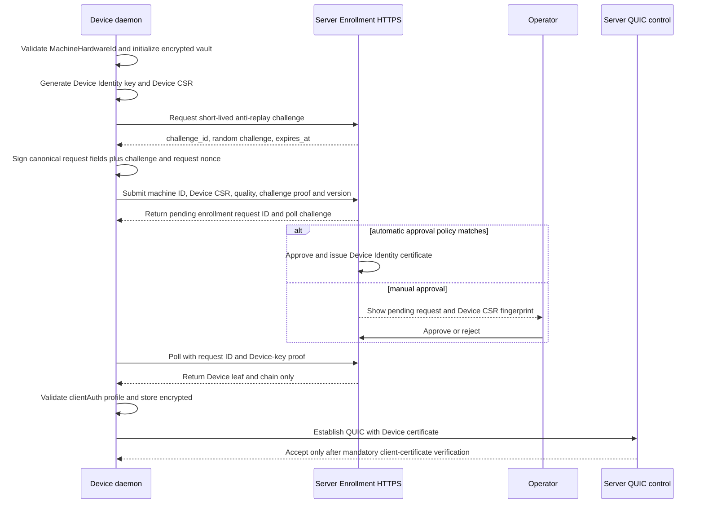
```mermaid
sequenceDiagram
    participant Daemon as Device daemon
    participant HTTPS as Server Enrollment HTTPS
    participant Operator as Operator
    participant QUIC as Server QUIC control

    Daemon->>Daemon: Validate MachineHardwareId and initialize encrypted vault
    Daemon->>Daemon: Generate Device Identity key and Device CSR
    Daemon->>HTTPS: Request short-lived anti-replay challenge
    HTTPS-->>Daemon: challenge_id, random challenge, expires_at
    Daemon->>Daemon: Sign canonical request fields plus challenge and request nonce
    Daemon->>HTTPS: Submit machine ID, Device CSR, quality, challenge proof and version
    HTTPS-->>Daemon: Return pending enrollment request ID and poll challenge
    alt automatic approval policy matches
        HTTPS->>HTTPS: Approve and issue Device Identity certificate
    else manual approval
        HTTPS-->>Operator: Show pending request and Device CSR fingerprint
        Operator->>HTTPS: Approve or reject
    end
    Daemon->>HTTPS: Poll with request ID and Device-key proof
    HTTPS-->>Daemon: Return Device leaf and chain only
    Daemon->>Daemon: Validate clientAuth profile and store encrypted
    Daemon->>QUIC: Establish QUIC with Device certificate
    QUIC-->>Daemon: Accept only after mandatory client-certificate verification
```

Enrollment request proof：

```text
signature = Sign_device_key(
  SHA-256(canonical request fields || server challenge || request nonce)
)
```

CSR 本身证明 Device private-key possession；signed request/poll proof 进一步防止 request status 被其他 Client 接管。`challenge_id`、challenge、`request_nonce` 与 poll challenge 都只是短时防重放/持钥证明材料，不授予批准权，不是 bootstrap/one-time enrollment token。

Enrollment request/response 不包含 Gateway key、Gateway CSR、Gateway SPKI 或 Gateway certificate。Daemon 必须先用 Device certificate 建立正常 QUIC mTLS；Gateway certificate 只能在后续 `SYNC_STATE` 期间通过该已认证连接取得。

### 7.9 Approval 规则

Manual approval：operator 查看 Machine Hardware ID、quality、source IP、CSR fingerprints 后 approve/reject。

Auto approval 仅在 policy 开启且同时满足：

- source IP 在 allowlist；
- identity quality 达标；
- 没有现存 Device/pending request collision；
- 同一 Machine Hardware ID 的 SPKI 与幂等 request 一致；
- 未超过自动设备上限；
- CSR profile、key algorithm、size、signature 和 software version 合格。

同一 Machine Hardware ID 出现不同 Device SPKI 时标记 `conflict`，不自动批准。Operator 若确认这是同一物理设备在本地 reset/密钥丢失后的正常 re-key，可先撤销旧 Device certificate，再以 `rekey_existing_device` 在同一 Device row 上签发新证书；若无法确认则 reject。该流程不创建第二个 Device，也不是 merge/split。

### 7.10 分阶段生成的两套 Device-side key

```text
Device Identity key
    首次启动时生成；Enrollment 只为它签发 rustls clientAuth certificate

Gateway TLS key
    首次需要应用含 local origin 的 SYNC_STATE 时延迟生成；仅用于 Caddy loopback HTTPS
```

两者都在 Client 本地生成、永不上传 private key，且使用不同 vault record type、AAD、key lifecycle 和 certificate profile。

Device Identity CSR 走 server-auth HTTPS Enrollment。Gateway CSR 不能走 Enrollment；Daemon 只有在持有有效 Device certificate、已建立 mTLS QUIC、并正在执行匹配的 `SYNC_STATE` 时才生成/提交。Server 忽略 Gateway CSR 自报 SAN/EKU/CA flag，按冻结 target snapshot 和固定 profile 签发。

默认 `ENSURE_VALID` 行为：已有 Gateway key/certificate 满足目标 hostname、profile、SPKI match 与 minimum validity 时复用；否则创建新 Gateway key/CSR。显式 `FORCE_REISSUE` 可由受审计的同步配置操作要求重新生成 key/CSR，但仍使用同一 `SYNC_STATE` 子协议。

### 7.11 Certificate profiles

信任层级分离：

- 站点级 offline **Control Trust Root**：公钥随 Client package/image 下发，只签 Server control leaf；
- 站点级 offline **Local Origin Root**：公钥进入受管 Browser trust store，只签每次赛事初始化产生的 Origin Issuing Intermediate；
- 本次实例 **Device Issuing CA**：私钥存 Server encrypted vault，直接签 Device clientAuth leaf；
- 本次实例 **Origin Issuing Intermediate**：私钥与 intermediate certificate 存 Server encrypted vault，签 Gateway serverAuth leaf。

两个 offline Root 的 private key 均不进入 Natsume runtime。这样 Server 数据重置后可以更换本次实例 issuing key，同时无需重新部署所有 Browser trust roots或改变 Machine Hardware ID namespace。

Device leaf：

```text
BasicConstraints CA=false
EKU clientAuth
SAN URI=urn:natsume:device:<machine_hardware_id>
KeyUsage digitalSignature
```

Gateway leaf：

```text
BasicConstraints CA=false
EKU serverAuth
SAN DNS=<client_origin_hostname>
KeyUsage digitalSignature
```

Server control leaf（由站点级 Control Trust Root 签发）：

```text
BasicConstraints CA=false
EKU serverAuth
SAN IP=<configured server IP>
KeyUsage digitalSignature
```

签发结果必须用独立 parser 校验 SAN、EKU、KeyUsage、BasicConstraints、serial 和 validity。Server control leaf private key、Device Issuing CA private key、Origin Issuing Intermediate private key/certificate只以 encrypted Server vault record存储。站点级 Control Trust Root 与 Local Origin Root 的 private key不进入 Natsume运行环境。

### 7.12 正常 QUIC mTLS 实现

Client rustls config：

- trust Control CA；
- verify Server IP SAN；
- `with_client_auth_cert(device_chain, device_private_key)`；
- TLS 1.3；
- ALPN `natsume-device/2`；
- early data disabled。

Server rustls config：

- `WebPkiClientVerifier` trust Device Identity CA；
- client certificate mandatory，不调用 `allow_unauthenticated`；
- Server leaf + private key；
- TLS 1.3；
- early data disabled。

Quinn 把 rustls config 包装成 `QuicClientConfig`/`QuicServerConfig`。Handshake 成功后，Server 从 `peer_identity()` 取得 certificate chain，再做 Natsume 业务检查：

1. leaf chains to Device CA；
2. EKU/clientAuth/profile valid；
3. SAN Machine Hardware ID 与 `ClientHello` 完全一致；
4. serial active、Device 已 enrolled 且未 revoked/disabled；
5. certificate fingerprint 与数据库 active record 一致。

TLS handshake 失败的连接不会进入 Protobuf parser。

### 7.13 mTLS 必要性评估结论

保留 mandatory mTLS。它的收益不是“再加密一次”，而是把 Client private-key possession 绑定到 QUIC handshake，并把匿名连接挡在应用协议之前。替代方案若只使用 Machine Hardware ID，则可被伪造；若使用长期 bearer token，则需要额外安全存储、重放防护、轮换和 channel binding；若自定义签名 challenge，则实际上重新实现一套弱化的 client-auth protocol。

首次 Enrollment 与正常 control 分离解决“鸡生蛋”问题：第一次只验证 Server，批准后才取得 Client certificate；后续所有 Device control 都使用 mTLS。

### 7.14 重签、撤销与删除

- 无后台续签 timer；operator 或明确 workflow 触发重签；
- Device certificate 丢失/撤销/过期后回到 pending Enrollment，仍无 token；相同 Machine ID 的人工确认 re-key 复用同一 Device row；
- Gateway certificate 缺失、损坏、SAN/profile 不匹配或有效期不足时，operator 重新执行 `SYNC_STATE`；Daemon 在该 mTLS 命令内请求新证书，Caddy 在成功前保持 absent/BLOCKED；
- Gateway certificate 不提供匿名 HTTPS recovery route，也不通过 Enrollment 补发；
- Device delete 前必须 unbind、撤销 Device/Gateway certificates、确认无 active Command；
- Device 删除后 machine ID tombstone 可用于审计/防误复用，但不能 merge 到其他 Device；
- Machine ID collision 只能 reject/delete/re-enroll，不提供 merge/split。

---

## 8. 设备协议：Quinn + Protobuf 窄会话

### 8.1 连接模型

- Client 主动连接配置的 Server UDP IP/port；
- Quinn + rustls TLS 1.3，mandatory Device certificate；
- ALPN `natsume-device/2`；
- 每条 connection 一条长期 bidirectional control stream；
- 大型 diagnostics 使用独立 bounded unidirectional stream；
- 权威消息不用 QUIC datagram；
- 0-RTT disabled；
- source IP 只作为 observation。

### 8.2 Framing

Control stream 使用 `LengthDelimitedCodec`：

```text
u32 big-endian payload_length
payload_length bytes of Protobuf ControlEnvelope
```

- hard max 1 MiB，在分配前生效；
- string/list/map 另有业务上限；
- 不增加 CRC；QUIC packet protection 已提供 integrity；
- 不压缩 control message；
- decode 后仍执行 semantic validation；
- malformed/oversized/schema violation 关闭 session，只记录稳定错误码和 envelope type，不记录 payload。

### 8.3 消息闭集

```protobuf
message ControlEnvelope {
  oneof body {
    ClientHello client_hello = 1;
    ServerHello server_hello = 2;
    Heartbeat heartbeat = 3;
    ObservedStateSnapshot observed_state = 4;
    Command command = 5;
    CommandStatus command_status = 6;
    BindingRequest binding_request = 7;
    BindingResult binding_result = 8;
    GatewayCertificateRequest gateway_certificate_request = 9;
    GatewayCertificateResult gateway_certificate_result = 10;
    ServerDrain server_drain = 11;
    ProtocolError protocol_error = 12;
  }
}
```

删除 `DesiredStateStatus`。`TargetStateSnapshot` 只作为 `SYNC_STATE` Command 的 typed payload，不是连接后自动推送消息。协议不提供通用 `CertificateIssueRequest`：Device Identity certificate 只由 Enrollment HTTPS 产生；QUIC certificate 子协议只服务于当前 `SYNC_STATE` 所需的 Gateway certificate。

### 8.4 ClientHello

至少包含：

- `machine_hardware_id`
- `boot_id`
- `wire_version`
- daemon/agent version
- capability set
- last observed sequence
- last applied target generation/hash
- command terminal-result cursor

不包含 installation instance、hardware claim digest 或 identity guard state。

### 8.5 ServerHello

- exact wire version acceptance；
- `connection_epoch`；
- heartbeat interval/idle timeout；
- max frame/bulk limits；
- server time；
- terminal-result resume cursor；
- server capability flags。

### 8.6 Command payloads

至少：

```text
SYNC_STATE
SYNC_SECRET
OPEN_BINDING_PROMPT
LOCK_SESSION
UNLOCK_SESSION
TERMINATE_SESSION
RESET_HOME
COLLECT_DIAGNOSTICS
RESTART_AGENT
RUN_LOCAL_PREFLIGHT
CLEAR_LOCAL_SECRET
```

`SYNC_STATE` 包含完整、非秘密、canonical target snapshot，并明确 Gateway certificate 行为：

```protobuf
message SyncState {
  uint64 generation = 1;
  bytes canonical_hash = 2;
  TargetStateSnapshot snapshot = 3;
  GatewayCertificateMode gateway_certificate_mode = 4;
}

enum GatewayCertificateMode {
  GATEWAY_CERTIFICATE_MODE_UNSPECIFIED = 0;
  GATEWAY_CERTIFICATE_MODE_ENSURE_VALID = 1;
  GATEWAY_CERTIFICATE_MODE_FORCE_REISSUE = 2;
}
```

`SYNC_SECRET`：

```protobuf
message SyncSecret {
  string seat_id = 1;
  uint64 seat_assignment_revision = 2;
  string account_id = 3;
  string credential_revision_id = 4;
  SecretBytes password = 5;
}
```

`SecretBytes` 类型禁止 `Debug/Display/Serialize` 到日志，decode buffer 使用 zeroize。它在网络上由 QUIC 1-RTT packet protection 加密；Server/Client journal 中必须重新以各自 vault key 加密，不能保存 protobuf plaintext。

没有 `INSTALL_CERTIFICATE` Command。Gateway leaf/chain 使用下节的专用 request/result 消息，且只能作为正在执行的 `SYNC_STATE` 子流程出现。

### 8.7 Gateway certificate QUIC 子协议

```protobuf
message GatewayCertificateRequest {
  string request_id = 1;
  string command_id = 2;
  uint64 target_generation = 3;
  string configuration_revision_id = 4;
  bytes csr_der = 5;
  bytes spki_sha256 = 6;
  bytes request_nonce = 7;
}

enum GatewayCertificateResultState {
  GATEWAY_CERTIFICATE_RESULT_STATE_UNSPECIFIED = 0;
  GATEWAY_CERTIFICATE_RESULT_STATE_ISSUED = 1;
  GATEWAY_CERTIFICATE_RESULT_STATE_REJECTED = 2;
  GATEWAY_CERTIFICATE_RESULT_STATE_CONFLICT = 3;
  GATEWAY_CERTIFICATE_RESULT_STATE_TEMPORARILY_UNAVAILABLE = 4;
  GATEWAY_CERTIFICATE_RESULT_STATE_EXPIRED = 5;
}

message GatewayCertificateResult {
  string request_id = 1;
  string command_id = 2;
  uint64 target_generation = 3;
  GatewayCertificateResultState state = 4;
  bytes leaf_der = 5;
  repeated bytes chain_der = 6;
  bytes certificate_fingerprint = 7;
  string stable_error_code = 8;
}
```

约束：

1. 只允许在完成 `ClientHello/ServerHello` 的 mTLS connection 上发送；
2. Server 从 authenticated peer 映射 Device，忽略消息中任何自报 identity；
3. `command_id` 必须属于该 Device、kind=`SYNC_STATE`、尚未 terminal 且 deadline 未过；
4. `target_generation` 和 `configuration_revision_id` 必须与 command payload 完全相等；
5. CSR signature、key algorithm、SPKI hash 合格；SAN/EKU 不从 CSR 采信；
6. Server 从 target snapshot 派生 DNS SAN/profile/validity，签发后持久化 request 与 certificate，再返回结果；
7. 相同 request ID/command/SPKI 重试返回同一 leaf/chain；不同 SPKI 返回 conflict；
8. Device 必须验证 chain、SAN、EKU、KeyUsage、BasicConstraints、SPKI 与 minimum validity 后，才能把 key/cert 写入 encrypted vault；
9. 网络断开只使 `SYNC_STATE` 保持 running/waiting；不得降级到匿名 HTTPS 或 Enrollment。

### 8.8 Target apply progress 合并到 Observed

`ObservedStateSnapshot` 包含：

```protobuf
uint64 observed_sequence;
uint64 received_generation;
uint64 applied_generation;
bytes applied_hash;
StateApplyStatus state_apply_status;
string state_error_code;
SecretState secret_state;
string installed_credential_revision_id;
GatewayState gateway_state;
SessionState session_state;
HomeState home_state;
```

Device 在 received、validating、applying、applied、failed/recovery_required transition 后发送 snapshot。Server 以 `observed_sequence` 去重和排序。单独 `DesiredStateStatus` 会与 Observed 重复、产生不同步的双状态源，因此不保留。

### 8.9 BindingRequest / BindingResult

`BindingRequest`：

- `request_id`
- `machine_hardware_id`
- `seat_code`
- `prompt_command_id`
- `session_instance_id`
- `session_epoch`
- `created_at`

`BindingResult`：

- `request_id`
- `state`: `pending | approved | rejected | conflict | expired`
- `binding_revision?`
- `stable_error_code?`

Server 仍是唯一裁决者。Device 不携带 password 或自改 binding。

### 8.10 握手与重连

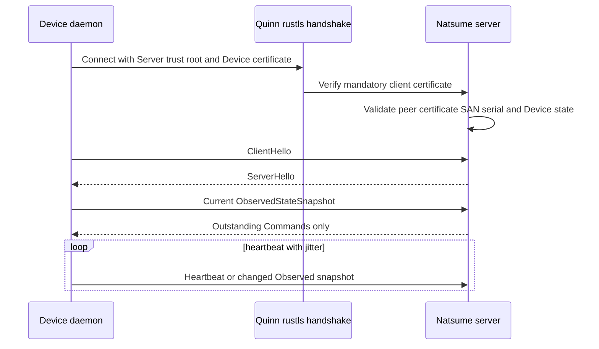
```mermaid
sequenceDiagram
    participant Device as Device daemon
    participant TLS as Quinn rustls handshake
    participant Server as Natsume server

    Device->>TLS: Connect with Server trust root and Device certificate
    TLS->>Server: Verify mandatory client certificate
    Server->>Server: Validate peer certificate SAN serial and Device state
    Device->>Server: ClientHello
    Server-->>Device: ServerHello
    Device->>Server: Current ObservedStateSnapshot
    Server-->>Device: Outstanding Commands only
    loop heartbeat with jitter
        Device->>Server: Heartbeat or changed Observed snapshot
    end
```

重连不会自动发送 latest Target State。Server 只重投未 terminal 的 existing Commands。Operator 可看到 target/applied drift并创建新的 `SYNC_STATE`。

### 8.11 Wire version

- exact match；
- 不做 minor downgrade/N-1 decoder；
- mismatch 连接在 Hello 后标记 incompatible，不发送 Command/secret；
- software version/capability 只用于可见性和 command precondition；
- schema breaking change 提升 wire version。

### 8.12 Heartbeat 与在线

默认 heartbeat 10 秒 ±20% jitter；30 秒 degraded，35 秒或 connection close offline。Heartbeat 不是 Target status，包含 compact health 与 session target。

### 8.13 有界 queue

Priority：

1. P0 ProtocolError/ServerDrain/revoke notice；
2. P1 Command/terminal result；
3. P2 Observed change；
4. P3 Heartbeat/telemetry。

P3 可 coalesce/drop；P0/P1 不得静默丢弃。队列满时 dispatcher backpressure，不无界增长。

### 8.14 Bulk stream

只允许已授权 diagnostics command，header 绑定 command ID、size、sha256、content type、redaction profile。默认 64 MiB，限速、超时、并发有界。无任意 path 参数。

---

## 9. Target State、Observed State 与 Drift

### 9.1 为什么保留 Target State

即使 state apply 变成显式 Command，Server 仍需要一个可计算、可比较的目标快照：

- 展示当前业务期望；
- 冻结 `SYNC_STATE` payload；
- 计算 Drift；
- 对批量预览给出 exact impact；
- 避免把 URL、policy、assignment 作为自由 Command 参数散落。

它是数据模型，不是自动同步机制。

### 9.2 Target 来源

- active SystemConfigurationRevision；
- active SeatAssignment；
- active DeviceBinding；
- Gateway certificate requirement（hostname/profile/minimum validity），不是预先存在的 fingerprint；
- Browser/Home/session policy；
- Device capability。

Password/CredentialRevision 不参与 target hash。Password 变化不会增长 target generation，只改变 `credential desired vs installed` 的 secret drift。

### 9.3 Target 结构

```text
DeviceTargetState
├── assignment
│   ├── binding_revision
│   ├── seat_id and seat_label
│   ├── seat_assignment_revision
│   ├── account_id
│   └── domjudge_username
├── gateway
│   ├── configuration_revision_id
│   ├── local_origin_hostname
│   ├── fixed_upstream_profile
│   ├── exact_login_policy
│   ├── gateway_certificate_profile_id
│   └── gateway_certificate_min_valid_until
├── session
│   ├── browser_policy_revision
│   └── home_template_revision
└── metadata
    ├── generation
    ├── canonical_hash
    └── created_at
```

无 secret section，也不包含 `expected_gateway_certificate_fingerprint`。证书 fingerprint 是执行结果和 Observed fact，不是预先要求 Device 已经拥有的 target 输入。

### 9.4 `SYNC_STATE` apply 状态机

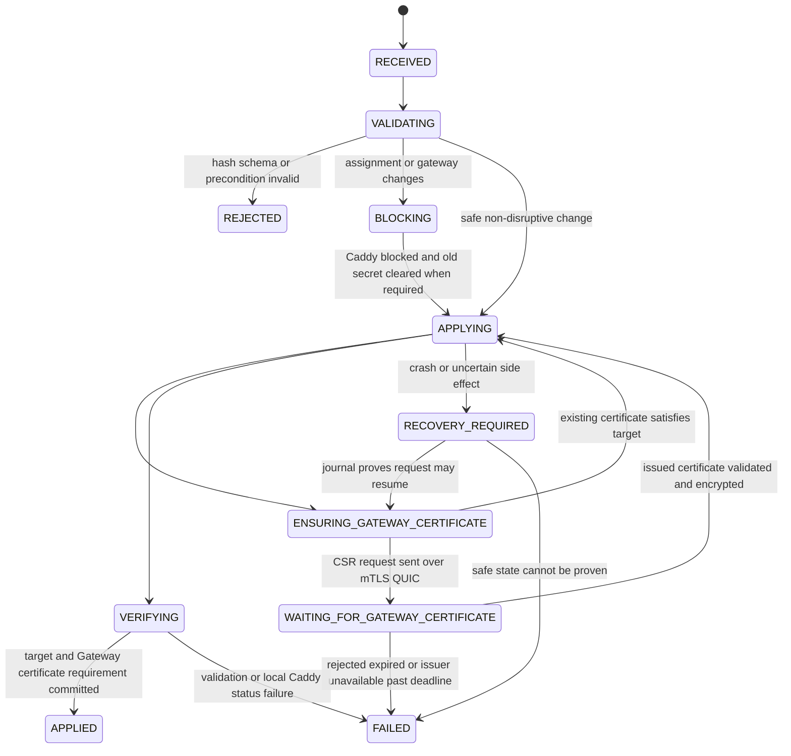
```mermaid
stateDiagram-v2
    [*] --> RECEIVED
    RECEIVED --> VALIDATING
    VALIDATING --> REJECTED: hash schema or precondition invalid
    VALIDATING --> BLOCKING: assignment or gateway changes
    VALIDATING --> APPLYING: safe non-disruptive change
    BLOCKING --> APPLYING: Caddy blocked and old secret cleared when required
    APPLYING --> ENSURING_GATEWAY_CERTIFICATE
    ENSURING_GATEWAY_CERTIFICATE --> APPLYING: existing certificate satisfies target
    ENSURING_GATEWAY_CERTIFICATE --> WAITING_FOR_GATEWAY_CERTIFICATE: CSR request sent over mTLS QUIC
    WAITING_FOR_GATEWAY_CERTIFICATE --> APPLYING: issued certificate validated and encrypted
    WAITING_FOR_GATEWAY_CERTIFICATE --> FAILED: rejected expired or issuer unavailable past deadline
    APPLYING --> VERIFYING
    VERIFYING --> APPLIED: target and Gateway certificate requirement committed
    VERIFYING --> FAILED: validation or local Caddy status failure
    APPLYING --> RECOVERY_REQUIRED: crash or uncertain side effect
    RECOVERY_REQUIRED --> ENSURING_GATEWAY_CERTIFICATE: journal proves request may resume
    RECOVERY_REQUIRED --> FAILED: safe state cannot be proven
```

当 assignment/account 改变：

1. durable transition journal；
2. Caddy visual BLOCKED 或保持 absent；
3. stop managed Browser/session as policy requires；
4. 清除旧 installed secret 和旧 LKG；
5. 应用新非秘密 assignment/config；
6. 确保匹配配置的 Gateway certificate：复用或通过 QUIC 请求；
7. materialize key/cert 并启动/更新 Caddy visual BLOCKED；
8. commit target generation；
9. gateway 保持 `blocked_secret_missing`；
10. 等待 operator 显式 `SYNC_SECRET`。

因此 state APPLIED 表示非秘密 target 和 Gateway TLS prerequisite 已满足，但不等于比赛数据面 READY。若 Server/QUIC 在首次证书请求前不可用，命令保持 waiting 或按 deadline 失败，Caddy 不使用临时、自签或 Enrollment 证书。

### 9.5 `SYNC_SECRET` 状态机

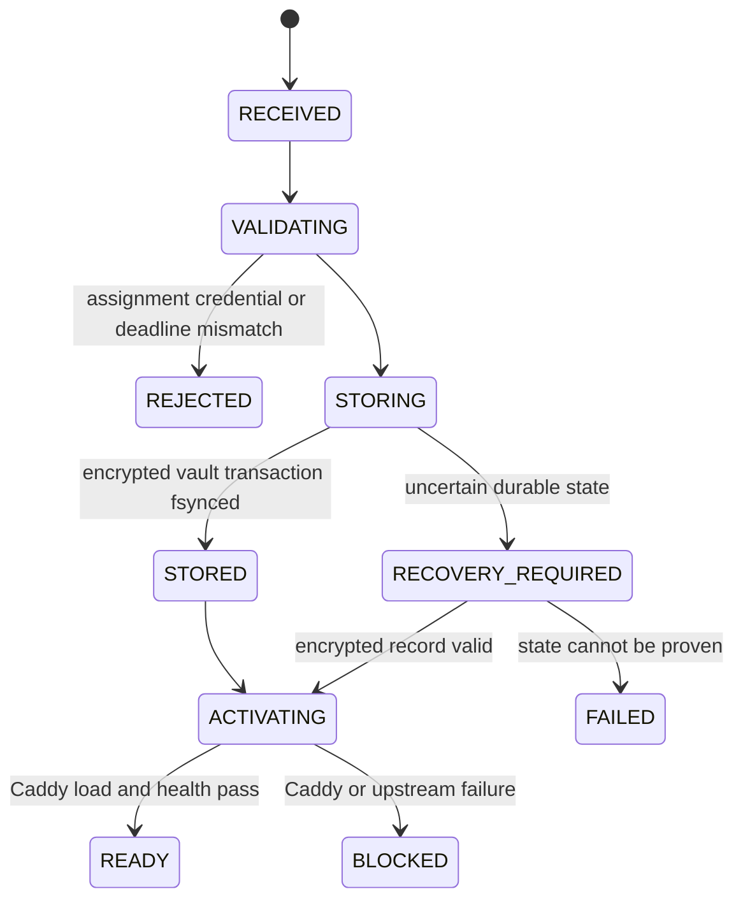
```mermaid
stateDiagram-v2
    [*] --> RECEIVED
    RECEIVED --> VALIDATING
    VALIDATING --> REJECTED: assignment credential or deadline mismatch
    VALIDATING --> STORING
    STORING --> STORED: encrypted vault transaction fsynced
    STORED --> ACTIVATING
    ACTIVATING --> READY: Caddy load and health pass
    ACTIVATING --> BLOCKED: Caddy or upstream failure
    STORING --> RECOVERY_REQUIRED: uncertain durable state
    RECOVERY_REQUIRED --> ACTIVATING: encrypted record valid
    RECOVERY_REQUIRED --> FAILED: state cannot be proven
```

Device 回报 revision/状态，不回报 secret。重复 Command 返回 stored terminal result。

### 9.6 Observed State

Observed 只报告事实：

- identity/control/certificate；
- target received/applied；
- assignment revision；
- installed credential revision；
- Gateway runtime revision/health；
- Session instance/epoch/lock；
- Home instance/template；
- unfinished recovery transaction；
- stable component error code。

### 9.7 Drift 分类

```text
offline_pending
state_generation_behind
state_apply_failed
binding_mismatch
configuration_mismatch
gateway_certificate_mismatch
secret_absent
secret_stale
gateway_blocked
gateway_upstream_unhealthy
session_mismatch
home_template_mismatch
local_recovery_required
unsupported_capability
```

Secret drift 单独比较 active CredentialRevision 与 observed installed revision。它不会自动触发 Command。

### 9.8 Superseded state command

Pending、尚未 offered 的旧 `SYNC_STATE` 在 target generation 被更新后可以标记 `skipped_superseded`。已经 `RECEIVED` 的 Command 仍按 frozen payload完成或失败；Server 随后显示新 drift。禁止执行中偷偷改成 latest target。

---

## 10. 领域变更与显式设备副作用

### 10.1 纯领域变更

以下动作只更新 Server truth/target：

- CSV import；
- SystemConfiguration activate；
- SeatAssignment change；
- DeviceBinding change；
- Browser/Home policy revision。

它们不隐式向在线 Device 推送 payload。

### 10.2 显式 Command

设备上的任何副作用都由 Command 表达：

- `SYNC_STATE`
- `SYNC_SECRET`
- `OPEN_BINDING_PROMPT`
- `LOCK_SESSION`
- `UNLOCK_SESSION`
- `TERMINATE_SESSION`
- `RESET_HOME`
- `COLLECT_DIAGNOSTICS`
- `RUN_LOCAL_PREFLIGHT`
- `CLEAR_LOCAL_SECRET`

### 10.3 Operator workflow

当 CSV 产生 reassignment/password change：

1. Preview/commit 只更新 Server；
2. Panel 显示受影响 Device、旧 applied assignment、target assignment 和 secret drift；
3. operator 创建 `SYNC_STATE`；
4. Device block/清旧 secret/应用新 assignment；
5. operator确认 target applied；
6. operator 单独创建 `SYNC_SECRET`；
7. Device 安装 password、激活 Caddy。

Panel 可以提供向导把两个显式步骤连续展示，但不能把 secret sync 藏成自动 background action。

### 10.4 Automation 的边界

Automation 可以为非秘密 target 创建 `SYNC_STATE` Operation；每个自动动作仍有 actor=`automation-policy:<revision>`、frozen targets、deadline 和 audit。Secret sync 永远需要 human actor。

### 10.5 清除优先于分发

解绑、Device disable、account reassignment 可以创建 `CLEAR_LOCAL_SECRET` 或 `SYNC_STATE` clear transition。秘密撤销/清除属于降低权限，可由安全 workflow 自动触发；**新的 password 分发不可自动触发。**

---

## 11. Operation、Target、Command 与投递语义

### 11.1 聚合

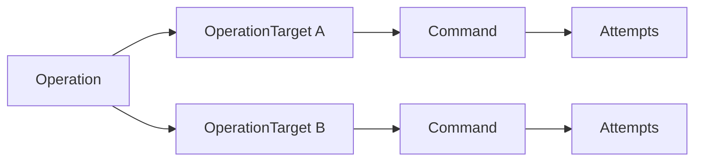
```mermaid
flowchart LR
    Operation["Operation"] --> T1["OperationTarget A"]
    Operation --> T2["OperationTarget B"]
    T1 --> C1["Command"]
    T2 --> C2["Command"]
    C1 --> A1["Attempts"]
    C2 --> A2["Attempts"]
```

Operation 表达 operator/automation 意图和批量聚合；Target 冻结目标；Command 是 Device 可执行指令；Attempt 只记录投递尝试。

### 11.2 Operation kind

```text
APPROVE_ENROLLMENT
REKEY_DEVICE_CERTIFICATE
SYNC_STATE
SYNC_SECRET
OPEN_BINDING_PROMPT
LOCK_SESSION
UNLOCK_SESSION
TERMINATE_SESSION
RESET_HOME
COLLECT_DIAGNOSTICS
RUN_PREFLIGHT
CLEAR_LOCAL_SECRET
DELETE_DEVICE
```

Import/export 可使用 Job/Audit。Enrollment approval/rekey 是 HTTPS PKI workflow，不创建 Device Command；Gateway certificate issuance 是 `SYNC_STATE` 子步骤，不是独立 Operation kind。

### 11.3 创建事务

1. 验证 actor/RBAC/re-auth/target filter；
2. 展开并冻结 Device IDs；
3. 记录 target count 与 selection digest；
4. 插入 Operation/Targets；
5. 插入 typed Commands；
6. 对 secret payload 在 Server vault 中加密存储；
7. 写 Audit/ChangeEvent；
8. commit。

### 11.4 状态

Operation：`queued | running | succeeded | partial | failed | cancelled | expired`。

Target：`pending | waiting_for_online | dispatched | running | succeeded | failed | cancelled | expired | skipped`。

Command：`pending | offered | received | running | succeeded | failed | cancelled | expired | manual_intervention_required`。

状态只前进。重复 terminal result 必须一致，否则记录 protocol/security error。

### 11.5 At-least-once + effectively-once

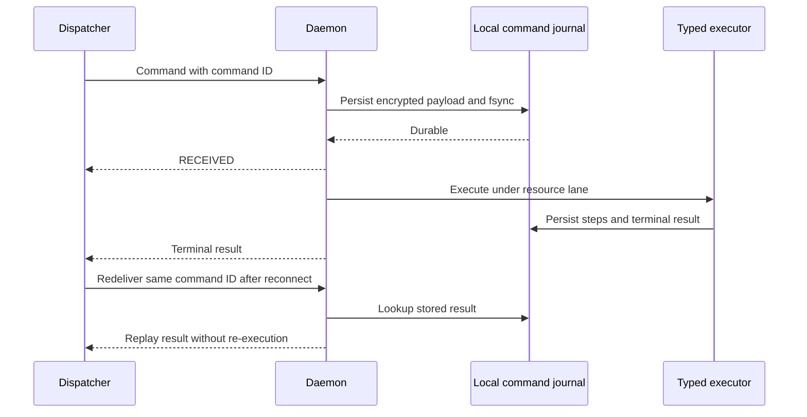
```mermaid
sequenceDiagram
    participant Server as Dispatcher
    participant Device as Daemon
    participant DB as Local command journal
    participant Exec as Typed executor

    Server->>Device: Command with command ID
    Device->>DB: Persist encrypted payload and fsync
    DB-->>Device: Durable
    Device-->>Server: RECEIVED
    Device->>Exec: Execute under resource lane
    Exec->>DB: Persist steps and terminal result
    Device-->>Server: Terminal result
    Server->>Device: Redeliver same command ID after reconnect
    Device->>DB: Lookup stored result
    Device-->>Server: Replay result without re-execution
```

网络不宣称 exactly-once；效果由 durable idempotency 实现。

### 11.6 Secret Command durability

Server：Command payload 的 password 以 Server vault ciphertext 保存；dispatch 时只在内存解密。

Client：在回报 RECEIVED 前，把 payload 直接 re-encrypt 到 Client vault command record；不得把 decoded protobuf 写普通 SQLite、journal/log 或 core dump。Terminal 后按 retention policy删除 command secret ciphertext，只保留 credential revision/result。

### 11.7 Resource lanes

- `configuration`: `SYNC_STATE`、Gateway key/CSR/certificate 子流程与 Gateway activation；
- `secret`: `SYNC_SECRET`、`CLEAR_LOCAL_SECRET`；
- `session`: lock/unlock/terminate/prompt；
- `home`: RESET_HOME；
- `diagnostics`: bounded upload。

`home` 排斥 configuration/session；secret 与 configuration 对同一 Device 串行；Session lock 不排斥 Caddy traffic。

### 11.8 Deadline/offline policy

```text
FAIL_IF_OFFLINE
QUEUE_UNTIL_DEADLINE
ONLINE_ONLY_SNAPSHOT
REQUIRE_ALL_ONLINE
```

Secret、Session、Home 使用短且明确 deadline。过期 secret command不得在数小时/数天后突然安装。`SYNC_STATE` 可有较长 deadline，但 frozen target不能自动变成 latest。

### 11.9 Cancellation

未 dispatch 可取消；received 未 running 可安全取消；running 仅在 executor定义 safe point 时取消；Home/Gateway/secret durable step 之后不能虚假报告 cancelled，必须完成验证、恢复或 manual intervention。

---

## 12. Client 进程、启动顺序与权限边界

### 12.1 进程图

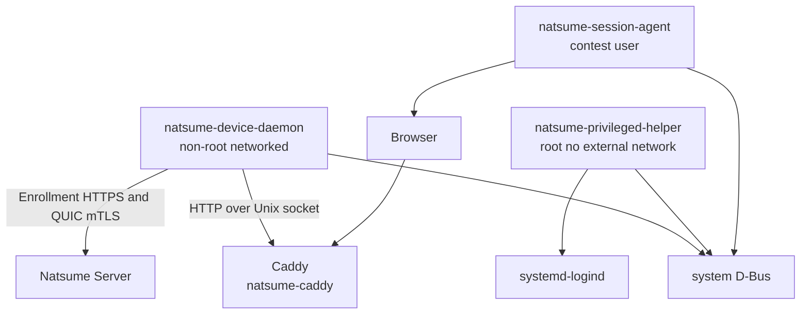
```mermaid
flowchart TB
    Server["Natsume Server"]
    Daemon["natsume-device-daemon\nnon-root networked"]
    Helper["natsume-privileged-helper\nroot no external network"]
    Agent["natsume-session-agent\ncontest user"]
    Caddy["Caddy\nnatsume-caddy"]
    Bus["system D-Bus"]
    Logind["systemd-logind"]
    Browser["Browser"]

    Daemon -->|"Enrollment HTTPS and QUIC mTLS"| Server
    Daemon --> Bus
    Helper --> Bus
    Agent --> Bus
    Helper --> Logind
    Daemon -->|"HTTP over Unix socket"| Caddy
    Agent --> Browser
    Browser --> Caddy
```

### 12.2 Device Daemon

职责：

- 读取 Server IP/port/trust root；
- 启动 Machine Hardware ID 校验；
- 生成/管理 client root key 与 encrypted DB；
- 首次 Enrollment 与 certificate install；
- QUIC/mTLS control session；
- Command journal/resource lanes；
- target/Observed/Drift 本地状态；
- password/LKG/Gateway keys encrypted vault；Gateway key只在`SYNC_STATE`按需生成；
- Caddy runtime config/materialization/recovery；
- Session Agent/Helper typed D-Bus orchestration。

Daemon 非 root，不能 mount、任意改 system config、读取原始 SMBIOS 或执行 shell。

### 12.3 Privileged Helper

Root + `PrivateNetwork=yes`。固定 methods：

```text
CollectHardwareCandidates
PrepareHomeInstance
ActivateHomeInstance
RecoverHomeInstance
GarbageCollectHomeInstance
QueryContestSession
TerminateContestSession
RequestDesktopLock
InstallManagedBrowserPolicy
```

参数只允许 typed IDs/enums/revisions。Contest UID、paths、template root、allowed units 来自本地只读配置，不由 Server自由传入。

### 12.4 Session Agent

- 随 graphical contest session 启动；
- 注册 `session_instance_id`/`session_epoch`；
- 显示 Binding prompt、desktop lock gate、recovery status；
- GatewayReady 时启动 managed Browser；
- 提交 BindingRequest；
- 不读取 password、Device/Gateway key 或 Client DB vault。

### 12.5 Session lock/unlock

Lock 只控制桌面环境：

1. Daemon 验证 exact SessionTarget；
2. 持久化 lock journal；
3. Agent 显示不可绕过的 full-screen gate；
4. Helper/logind 请求桌面 lock；
5. Agent确认 locked；
6. Command terminal success。

Unlock：

1. 必须匹配 `session_instance_id + session_epoch + lock_epoch + lock_command_id`；
2. Agent/desktop unlock；
3. 移除 gate；
4. 不调用 Caddy Admin，不 reload、不 health check、不切换 Gateway；
5. Caddy/Browser network session 在 lock 期间保持原样。

Daemon/Agent 在同一 graphical session 中重启时按 durable journal 重建 lock gate。Session 被 terminate、logind replacement 或整机 reboot 后 session epoch 改变，旧 lock/unlock 变成 stale，不自动作用于新 session。

### 12.6 Caddy

- 独立 non-root；
- loopback 443；
- Admin Unix socket；
- 只读取 `/run/natsume/gateway-tls` 中 Daemon materialize 的 Gateway key/cert；
- 不读取 Client DB、Device key、Command journal 或 D-Bus privileged interface；
- 每次启动先 visual BLOCKED。

### 12.7 本地 IPC

| Interface | Owner | Caller | 实现 |
|---|---|---|---|
| `org.natsume.Privileged1` | Helper | daemon UID | zbus + system-bus policy |
| `org.natsume.Device1` | Daemon | contest UID | zbus typed methods/signals |
| `org.freedesktop.login1` | logind | Helper | zbus_systemd |
| Caddy Admin | Caddy | daemon group | Reqwest Unix socket |

### 12.8 systemd ordering

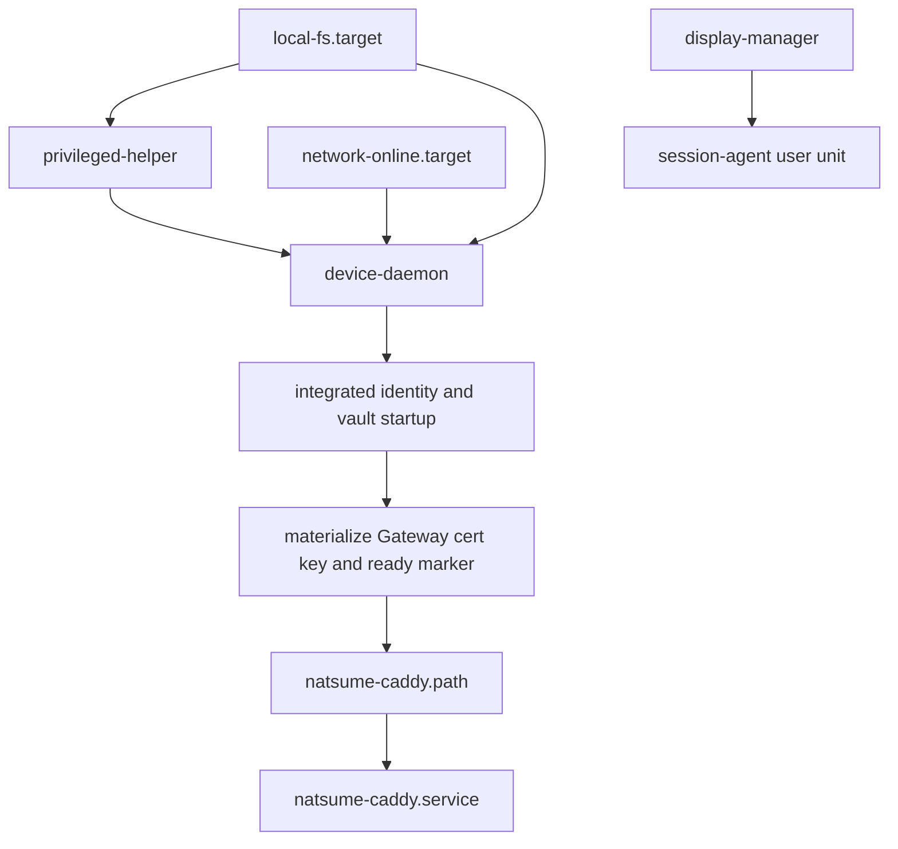
```mermaid
flowchart TD
    FS["local-fs.target"] --> Helper["privileged-helper"]
    FS --> Daemon["device-daemon"]
    Network["network-online.target"] --> Daemon
    Helper --> Daemon
    Daemon --> Check["integrated identity and vault startup"]
    Check --> Runtime["materialize Gateway cert key and ready marker"]
    Runtime --> Path["natsume-caddy.path"]
    Path --> Caddy["natsume-caddy.service"]
    Display["display-manager"] --> Agent["session-agent user unit"]
```

不存在 `natsume-identity-guard.service`。Daemon 未完成 identity/vault check 时不创建 ready marker，Caddy 不启动。

### 12.9 Hardening

Daemon：User=natsume、NoNewPrivileges、ProtectSystem=strict、ProtectHome=yes、CapabilityBoundingSet empty、仅 `/var/lib/natsume` 与 `/run/natsume` writable。

Helper：root、PrivateNetwork、RestrictAddressFamilies=AF_UNIX、最小 capability、显式 writable paths。

Caddy：User=natsume-caddy、只读 `/run/natsume/gateway-tls` 与 status assets、Admin socket group、最小 bind capability。

Agent：contest user systemd user unit，无 linger、无 system secret path access。

---

## 13. 本地 HTTPS、Caddy visual status、Brotli 与恢复

### 13.1 数据路径

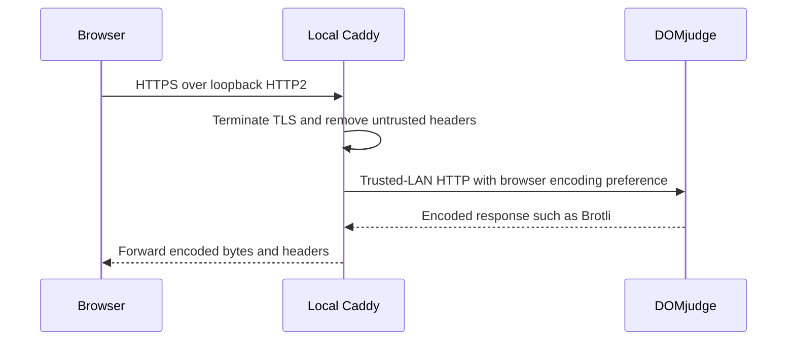
```mermaid
sequenceDiagram
    participant Browser as Browser
    participant Caddy as Local Caddy
    participant DOM as DOMjudge

    Browser->>Caddy: HTTPS over loopback HTTP2
    Caddy->>Caddy: Terminate TLS and remove untrusted headers
    Caddy->>DOM: Trusted-LAN HTTP with browser encoding preference
    DOM-->>Caddy: Encoded response such as Brotli
    Caddy-->>Browser: Forward encoded bytes and headers
```

TLS 计算分散在 Client。Brotli 在中心 DOMjudge frontend 编码，Caddy 不解压/重压。

### 13.2 Local origin

默认：

```text
https://contest.natsume.test/
127.0.0.1 contest.natsume.test
::1       contest.natsume.test
```

每台 Device 有独立 Gateway key/certificate/serial，可共享 SAN，因为 hostname 在各机只解析到本机 loopback。

### 13.3 Gateway certificate 的按需签发与 materialization

首次 Enrollment 完成后，本地可以只有 Device Identity key/certificate；Gateway key/certificate 可以完全不存在。第一次执行需要 local origin 的 `SYNC_STATE` 时，Daemon：

1. 比较 target 的 hostname、certificate profile 与 minimum validity；
2. 若 encrypted vault 中已有合格 Gateway key/certificate，则复用；
3. 否则生成新的 Gateway private key，先以 encrypted vault record 和 request journal 持久化；
4. 构造 CSR，通过当前 mTLS QUIC control session 发送绑定 command/generation/configuration 的 `GatewayCertificateRequest`；
5. 验证 Server 返回 leaf/chain 的 SPKI、SAN、EKU、KeyUsage、CA=false、validity 与 Local Origin Root chain；
6. 原子写 encrypted Gateway key/certificate records，并持久化 request terminal result；
7. decrypt 到 tmpfs `/run/natsume/gateway-tls/<generation>/`；
8. mode/ownership 最小化，atomic current switch，创建 ready marker。

Reboot 后 `/run` 清空，必须由 Daemon 在 identity/vault 校验后重新 materialize。Caddy 永远不从 `/var/lib` 读取 plaintext key。没有有效 Device mTLS connection 时不能申请新的 Gateway certificate；已有合格 certificate 与 steady LKG 则仍可离线恢复。

### 13.4 Visual BLOCKED page

Package-owned assets：

```text
/usr/share/natsume/gateway-status/index.html
/usr/share/natsume/gateway-status/status.css
/usr/share/natsume/gateway-status/status.js
/usr/share/natsume/gateway-status/icons.svg
/run/natsume/gateway-status/status.json
```

允许状态：

```text
restoring
transition_blocked
secret_missing
upstream_unhealthy
recovery_required
unassigned
```

不包含 `session_locked`。Desktop lock 不改变 Caddy 状态。

状态 JSON 只允许：schema version、enum state/reason、更新时间、machine short ID、seat label、operation short ID、progress、suggested action。禁止 arbitrary message、HTML、Markdown、path、IP、account、password、certificate body 或 error chain。

安全 headers：strict CSP、no-store、nosniff、DENY frame、no referrer；无 inline script/style、外部 URL、cookie、local storage 或 analytics；JS 只使用 `textContent`。主 HTML 始终 HTTP 503，静态 asset/status 可 200。

### 13.5 Caddy 启动条件

唯一 runtime condition：

```text
/run/natsume/gateway-tls/ready
```

该 marker 只能由已完成 integrated identity check、成功打开 Client vault，并通过既有合格证书或 `SYNC_STATE` QUIC 签发流程 materialize 当前 Gateway cert/key 的 Daemon 创建。`natsume-caddy.path` 监听 marker；service ExecCondition 再校验证书、key、origin 和 mode。

未 Enrollment、identity indeterminate/mismatch、vault corrupt 或 certificate absent 时 Caddy 不监听 443，由 Session Agent/本地诊断显示原因。

### 13.6 Runtime proxy rules

1. upstream 只来自 validated SystemConfiguration；
2. 删除 Browser 提供的 DOMjudge auth 与 Forwarded/X-Forwarded headers；
3. exact login matcher 才注入 account/password；
4. 非 login request 不携带 credential headers；
5. external proto/host semantics 固定；
6. Caddy transport 不自行补 gzip，不配置 response encode；
7. Content-Encoding/Vary/ETag 透明；
8. body streaming、有界 timeout；
9. 禁止 CONNECT、forward proxy、user target；
10. Access log 默认关闭，诊断时也去除 Cookie/auth headers。

### 13.7 Gateway 状态机

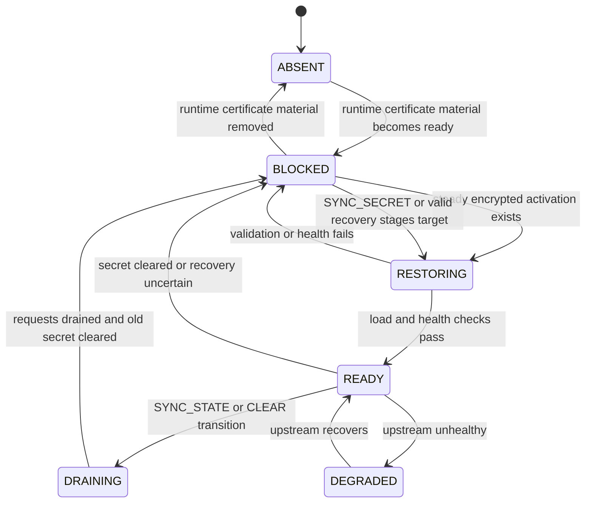
```mermaid
stateDiagram-v2
    [*] --> ABSENT
    ABSENT --> BLOCKED: runtime certificate material becomes ready
    BLOCKED --> RESTORING: steady encrypted activation exists
    RESTORING --> READY: load and health checks pass
    RESTORING --> BLOCKED: validation or health fails
    READY --> DRAINING: SYNC_STATE or CLEAR transition
    DRAINING --> BLOCKED: requests drained and old secret cleared
    BLOCKED --> RESTORING: SYNC_SECRET or valid recovery stages target
    READY --> DEGRADED: upstream unhealthy
    DEGRADED --> READY: upstream recovers
    READY --> BLOCKED: secret cleared or recovery uncertain
    BLOCKED --> ABSENT: runtime certificate material removed
```

Session lock/unlock 不出现于状态机。

### 13.8 Activation journal

Client DB 保存：

```text
GatewayActivationRecord
phase = steady | transition_blocking | target_staged | runtime_loaded | recovery_required
active_state_generation
target_state_generation
active_credential_revision
target_credential_revision
runtime_config_hash
gateway_certificate_fingerprint
updated_at
```

所有包含 password/runtime input 的 payload 在 encrypted columns。关键顺序：transition journal fsync → BLOCKED → stop Browser if required → clear old secret → stage new encrypted record → load Caddy → health → commit steady → allow Browser。

### 13.9 Whole reboot

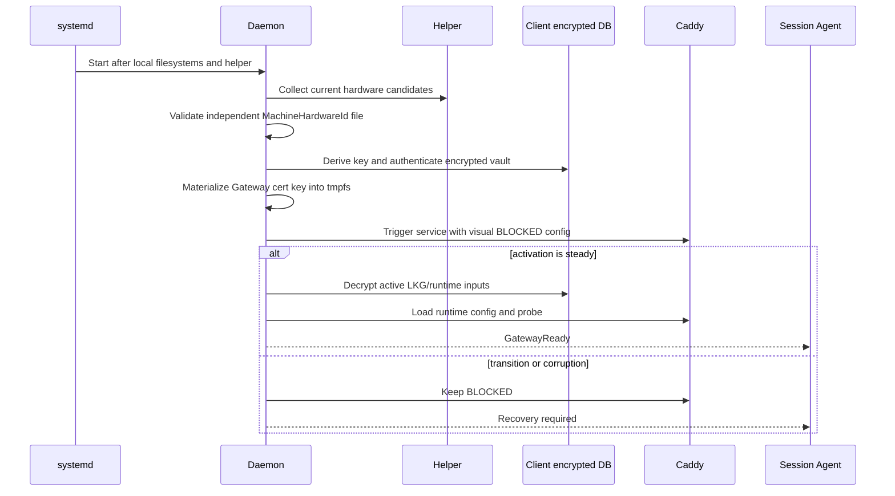
```mermaid
sequenceDiagram
    participant Systemd as systemd
    participant Daemon as Daemon
    participant Helper as Helper
    participant DB as Client encrypted DB
    participant Caddy as Caddy
    participant Agent as Session Agent

    Systemd->>Daemon: Start after local filesystems and helper
    Daemon->>Helper: Collect current hardware candidates
    Daemon->>Daemon: Validate independent MachineHardwareId file
    Daemon->>DB: Derive key and authenticate encrypted vault
    Daemon->>Daemon: Materialize Gateway cert key into tmpfs
    Daemon->>Caddy: Trigger service with visual BLOCKED config
    alt activation is steady
        Daemon->>DB: Decrypt active LKG/runtime inputs
        Daemon->>Caddy: Load runtime config and probe
        Daemon-->>Agent: GatewayReady
    else transition or corruption
        Daemon->>Caddy: Keep BLOCKED
        Daemon-->>Agent: Recovery required
    end
```

Server 离线不阻止 steady restore。Identity mismatch、vault auth failure、AAD/fingerprint mismatch、non-steady journal 都 fail closed。

### 13.10 Caddy/Daemon 单独重启

Caddy restart：先 BLOCKED，Daemon检测 admin socket/process epoch变化，若 steady则从 encrypted DB replay并 health check。

Daemon restart：Caddy 可继续内存 runtime。Daemon重新执行 identity file check、vault auth、status revision comparison；不一致或 non-steady 时立即 load BLOCKED。

### 13.11 Power-loss matrix

| 断电点 | 重启行为 |
|---|---|
| steady | identity/vault validate后 replay active runtime |
| transition journal写入、尚未 BLOCKED | 启动先 BLOCKED，不恢复旧 secret |
| old secret cleared、target secret absent | `secret_missing`，等待显式 SYNC_SECRET |
| secret ciphertext durable、runtime未load | 验证后继续 activation |
| runtime load成功、steady record未写 | 保持/重载 BLOCKED后重新验证，再 commit |
| identity mismatch | 清理旧 local state，走普通首次 Enrollment |
| identity matched but vault decrypt fails | 不清空 identity；报告 vault corrupt并等待 reset |

### 13.12 DOMjudge integration contract

冻结 DOMjudge version 和 xheaders login contract，覆盖 login/redirect/Cookie/CSRF/submission/clarification/scoreboard/logout、Brotli、upload、long response 与 upstream failure。Optional network policy可阻止 contest user直连 DOMjudge，只允许 Caddy process。

---

## 14. CSV、Enrollment、Binding 与赛位切换工作流

### 14.1 初始准备

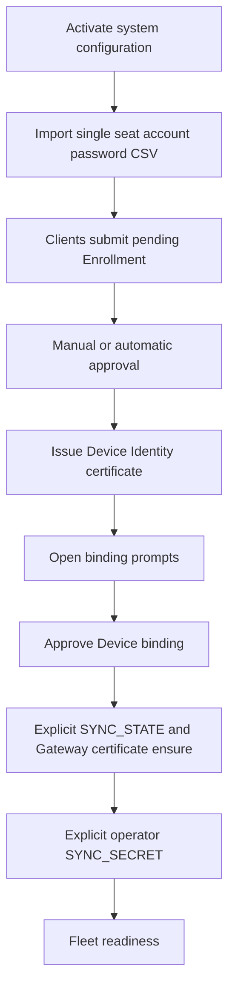
```mermaid
flowchart TD
    Config["Activate system configuration"] --> CSV["Import single seat account password CSV"]
    CSV --> Enroll["Clients submit pending Enrollment"]
    Enroll --> Approve["Manual or automatic approval"]
    Approve --> DeviceCert["Issue Device Identity certificate"]
    DeviceCert --> Prompt["Open binding prompts"]
    Prompt --> Bind["Approve Device binding"]
    Bind --> State["Explicit SYNC_STATE and Gateway certificate ensure"]
    State --> Secret["Explicit operator SYNC_SECRET"]
    Secret --> Check["Fleet readiness"]
```

没有 phase transition，也没有“进入 live 自动关闭 automation”。

### 14.2 BindingRequest validation

Server 校验：prompt command有效、Device enrolled/online、Seat存在、Device/Seat无 active conflict、session target仍有效、Automation Policy scope。成功写 DeviceBinding 与 target generation；是否创建 `SYNC_STATE` 取决于 operator选择或 policy。

### 14.3 Reassignment

当 CSV 把 Seat 从 account A 改为 B：

- Server 创建新 SeatAssignment revision；
- Device target generation变化；
- old Caddy继续工作直到 operator执行 sync，这是可见 drift；
- `SYNC_STATE` 执行时先 BLOCKED并清除 account A secret；
- state applied后保持 secret missing；
- operator显式 `SYNC_SECRET` 安装 account B password；
- 不自动 rollback A。

Panel 对这种高风险 drift持续显示 banner，并提供两阶段向导。

### 14.4 Password change

同一 Seat/account 仅 password变化：

- 新 CredentialRevision；
- target generation不变；
- observed installed credential revision变为 stale；
- Caddy可继续使用旧 password，直到 operator明确 `SYNC_SECRET`；
- 新 command成功后原子替换本地 encrypted secret并 reload/verify Caddy；
- 失败时根据 DOMjudge password生效策略保持旧 runtime或 BLOCKED，由 command policy明确定义，不能静默猜测。

推荐比赛中改密使用“Server/DOMjudge 改密已完成 → 立即 bulk SYNC_SECRET → readiness确认”的受控 runbook。

### 14.5 Unbind

Unbind 只更新 Server binding/target。现场安全流程应同时创建 `SYNC_STATE` 或 `CLEAR_LOCAL_SECRET`：

1. Caddy BLOCKED；
2. stop managed Browser/session as policy；
3. 删除 local secret/LKG；
4. applied unassigned state；
5. Device 可保留 Device Identity/Gateway certificate；后续配置变化由下一次 `SYNC_STATE` 判断是否复用或重签。

### 14.6 Device replacement

严格流程：

```text
unbind old Device
→ clear old local secret when reachable
→ revoke old Device certificate
→ delete old Device record
→ enroll new physical Device
→ bind same Seat to new Device
→ SYNC_STATE
→ operator SYNC_SECRET
```

若旧 Device离线，仍可 unbind/revoke/delete；它重新上线时 certificate已撤销，不能 control reconnect。离线期间可能继续使用其本地 LKG，这是离线撤销的明确 non-claim，应由网络/物理运维处理。

### 14.7 Readiness 与批量操作

所有批量动作先冻结 targets/selection digest，显示 online/offline、target/applied、secret revision、Gateway、deadline。没有 phase gate，但 destructive/secret操作仍要求角色、re-auth、reason和二次确认。

---
## 15. Session 管理与 Home Reset

### 15.1 Session identity

`natsume-session-agent` 每次 graphical session 注册：

```text
session_instance_id = UUIDv7 generated by Agent
session_epoch = daemon-monotonic counter for current logind session
logind_session_id
contest_uid
boot_id
agent_version
```

以下情况改变 epoch 或 instance：Agent重新注册且旧实例消失、logind session替换、用户logout、整机reboot、terminate完成。Server/Device都不能只用 `logind_session_id` 或 PID 作为长期目标。

### 15.2 Session 状态

```text
absent
starting
ready
locking
locked
unlocking
terminating
stopped
error
```

Session state 与 Gateway state 正交。Session locked 时 Gateway仍可 READY。

### 15.3 `LOCK_SESSION`

Payload：

```text
session_instance_id
session_epoch
requested_lock_epoch
command_id
deadline
```

执行：

1. 校验 target 与当前注册 Session 完全匹配；
2. 确认 `requested_lock_epoch` 是当前 epoch 的下一值；
3. journal fsync；
4. Agent开启 full-screen gate；
5. Helper通过 logind/桌面 API请求 lock；
6. 等待 Agent acknowledgement；
7. 持久化 active `lock_command_id`；
8. terminal success。

`LOCK_SESSION` 使用 `ONLINE_ONLY_SNAPSHOT`，不允许排队到未来新 Session。

### 15.4 `UNLOCK_SESSION`

Payload：

```text
session_instance_id
session_epoch
expected_lock_epoch
expected_lock_command_id
command_id
deadline
```

只有四元组匹配当前 durable lock 才执行。迟到、重复、跨 Session、跨 epoch 或对错误 lock command 的 unlock 返回：

```text
SESSION_CHANGED
STALE_LOCK_EPOCH
LOCK_COMMAND_MISMATCH
NO_ACTIVE_LOCK
```

执行只调用桌面 unlock/Agent gate removal。Caddy config、Gateway health、password、Browser network connection和LKG均不变。

### 15.5 Restart semantics

- Agent crash/restart且仍是同一 logind session：Daemon重新下发当前 lock state，gate恢复；
- Daemon crash/restart：从 journal 恢复同一 Session lock；
- logind session replacement/reboot：旧 target invalid，旧 lock/unlock terminal为 `SESSION_CHANGED`；
- 新 Session默认按部署的 kiosk/browser policy启动，不继承 stale lock。

### 15.6 `TERMINATE_SESSION`

终止前：停止 managed Browser、撤销 Agent registration、使 active lock无效、请求 logind terminate。它不清除 Device certificate；是否清 secret由单独 state/secret workflow决定。

### 15.7 Home 模型

```text
HomeTemplateRevision
HomeInstance
HomeActivationRecord
HomeResetCommand
```

固定 contest OS user。Home reset切换 filesystem instance，不删除/recreate user。

### 15.8 OverlayFS backend

```text
lowerdir = /usr/lib/natsume/home-templates/<revision>
upperdir = /var/lib/natsume/homes/<instance>/upper
workdir  = /var/lib/natsume/homes/<instance>/work
mount    = /home/contest
```

必须验证：目标 filesystem `d_type/xattr/ACL`、upper/work同 filesystem、template只读、mount options、Browser/IDE behavior、shutdown ordering。

### 15.9 Staged-copy fallback

部署期固定选择，不允许运行时自动切 backend：

1. 创建新 staging dir；
2. `rsync -aHAX --numeric-ids --delete` from template；
3. validate owner/mode/xattr/ACL；
4. atomic activate；
5. 保留 previous直到成功；
6. background GC。

### 15.10 Home Reset transaction

```mermaid
stateDiagram-v2
    [*] --> VALIDATING
    VALIDATING --> QUIESCING
    QUIESCING --> PREPARING
    PREPARING --> ACTIVATING
    ACTIVATING --> VERIFYING
    VERIFYING --> SUCCEEDED
    QUIESCING --> FAILED_SAFE
    PREPARING --> FAILED_SAFE
    ACTIVATING --> RECOVERY_REQUIRED
    VERIFYING --> RECOVERY_REQUIRED
    RECOVERY_REQUIRED --> VERIFYING
    RECOVERY_REQUIRED --> MANUAL_INTERVENTION
```

步骤：验证 Session target → terminate/quiesce → journal → prepare new instance → activate → verify → start new session → terminal。每一步后执行 kill/reboot test。

### 15.11 冲突矩阵

| Running operation | New operation | 结果 |
|---|---|---|
| Home Reset | Sync State/Secret | queue or reject conflict |
| Home Reset | Lock/Unlock | reject `HOME_TRANSITION` |
| Session lock | Sync Secret | 可执行；桌面仍 locked，Gateway可更新 |
| Sync State assignment transition | Lock | 可执行桌面 lock，不改变 Gateway transition |
| Terminate Session | Unlock | reject stale/terminating |
| Diagnostics | Session lock | 可并行，受资源限制 |

---

## 16. Client 本地加密数据库、LKG 与离线连续性

### 16.1 文件布局

```text
/etc/natsume/config.toml                         non-secret endpoint/config
/etc/natsume/site.toml                           public immutable fleet namespace and trust paths
/etc/natsume/trust/control-ca.crt               public Control Trust Root
/etc/natsume/trust/local-origin-ca.crt          public Local Origin Root
/var/lib/natsume/identity/machine-hardware-id   independent non-secret identity file
/var/lib/natsume/keys/client-root.key           random secret root key
/var/lib/natsume/client.db                      SQLite journals + encrypted vault records
/run/natsume/gateway-tls/                       tmpfs plaintext Gateway cert/key
/run/natsume/gateway-status/status.json         non-secret status snapshot
/run/natsume/caddy-admin.sock                   permissioned admin socket
```

不使用 `/run/credentials/*`、`LoadCredential=` 或 systemd credential store。

### 16.2 Client DB tables

非秘密/metadata：

```text
schema_metadata
command_journal
command_steps
observed_state
state_apply_journal
gateway_activation
session_registration
session_lock_journal
home_activation
server_endpoint_state
```

Sensitive encrypted records：

```text
vault_records(
  record_id,
  record_type,
  subject_id,
  key_version,
  aad_version,
  nonce,
  ciphertext,
  created_at,
  superseded_at
)
```

`record_type` allowlist：

```text
device_private_key
device_certificate_chain
gateway_private_key
gateway_certificate_chain
installed_domjudge_secret
last_known_good_gateway
pending_secret_command
```

SQLite文件不是“任何字节都不可见”的全盘加密；设计保证所有 confidentiality-sensitive payload 只以 AEAD ciphertext出现。这样保留可检查 journal/事务能力并避免引入 SQLCipher native ABI。若未来改为整库加密，仍不得降低独立 identity-file 检查和 record-level AAD。

### 16.3 Root key 创建

- 32 bytes OS CSPRNG；
- `O_CREAT | O_EXCL | O_NOFOLLOW`；
- owner natsume、mode 0400；
- file + parent fsync；
- package/image 不预置；
- 不备份到 Server；
- 不通过 API/diagnostics/export读取；
- key rotation只通过显式 local maintenance transaction。

### 16.4 Key derivation

```text
K_master = HKDF-SHA256(
  input_key = client_root_key,
  salt = canonical_machine_hardware_id_bytes,
  info = "natsume-client-vault-v1"
)

K_record = HKDF-SHA256(
  input_key = K_master,
  salt = record_id_bytes,
  info = record_type || key_version
)
```

AEAD推荐 XChaCha20-Poly1305 或 ChaCha20-Poly1305；nonce绝不复用。AAD：

```text
schema_version
record_type
record_id
subject_id
machine_hardware_id
binding_revision where applicable
credential_revision where applicable
key_version
```

### 16.5 首次初始化

1. Daemon得到当前 Machine Hardware ID；
2. 原子写 identity file；
3. 创建 client root key；
4. 创建 SQLite schema；
5. 初始化 vault key-check record；
6. 生成 Device Identity private key并加密写 vault；
7. 提交只包含 Device CSR 的 Enrollment。

Gateway private key不在首次初始化中生成；它由后续 `SYNC_STATE` 在真正需要 local origin certificate 时延迟创建。

任一步失败都通过 startup transaction marker恢复或清理未完成的本地初始状态；尚未发出/批准 Enrollment 时可安全重试。

### 16.6 Vault 打开

1. 重新采集 candidates；
2. 校验 stored Machine Hardware ID；
3. 读取 root key；
4. derive K_master；
5. decrypt/authenticate key-check record；
6. validate SQLite schema/integrity；
7. 才允许读取 Device key、已有 Gateway key（若曾同步配置）、secret或LKG。

身份 `indeterminate`、identity mismatch、root key missing、key-check auth fail分别使用不同错误码和恢复路径。

### 16.7 Last Known Good

LKG作为 encrypted vault record，包含：

- current applied state generation/hash；
- Seat/account/assignment revision；
- installed credential revision；
- fixed upstream/profile/login matcher；
- account/password；
- Gateway runtime config inputs/hash；
- Gateway certificate fingerprint；
- health expectations；
- activation sequence。

不再以独立 plaintext或单独bin文件保存。`gateway_activation`只保存非秘密phase/revision/hash，指向一个 encrypted LKG record。

### 16.8 Offline behavior

| 故障 | 行为 |
|---|---|
| Server/QUIC断开、Gateway steady | 当前 Caddy/Browser/assignment继续；不能取得新Command |
| 整机reboot、Server离线、identity/vault/steady均有效 | 从 encrypted LKG恢复Caddy READY |
| reboot且state/secret transition未完成 | visual BLOCKED；按local journal继续或manual recovery |
| Daemon restart | 重新identity/vault验证并接管Caddy |
| Caddy restart | visual BLOCKED起步，Daemon replay LKG |
| identity evidence temporarily unavailable | 不删数据，不开Caddy，重试/等待operator |
| identity conclusive mismatch | 清本地状态，普通首次Enrollment |
| root key missing或vault auth fail | fail closed，标记corrupt；不自动新建Device |
| Gateway cert invalid | Caddy不启动；通过显式 `SYNC_STATE` 在 mTLS QUIC 内重签 |
| credential stale但旧Gateway steady | 保持旧runtime并显示stale；等待operator SYNC_SECRET |
| Session locked | Caddy行为不变 |

### 16.9 Secret replacement

`SYNC_SECRET`：

1. 验证 current applied assignment；
2. 将新 password以新 vault record写入并fsync；
3. 生成 target LKG ciphertext；
4. load/health check Caddy；
5. commit activation steady指针；
6. supersede旧secret/LKG record；
7. zeroize内存plaintext。

不能先删旧record再写新record。若新DOMjudge password已在upstream生效而旧password失效，operator可选择 failure policy=`block_on_activation_failure`。

### 16.10 Clear/reset

以下动作清除 installed secret/LKG：

- `SYNC_STATE` assignment/account change；
- unassigned target apply；
- `CLEAR_LOCAL_SECRET`；
- Device disable/revoke workflow到达Client；
- identity mismatch local reset；
- operator local factory reset。

只承诺 filesystem-level删除，不对SSD物理secure erase作不可验证承诺。

### 16.11 Root key/vault corruption recovery

身份匹配但root key/vault丢失：

- Caddy保持ABSENT/BLOCKED；
- Device certificate若还能从vault读取则矛盾；通常也不可用，必须operator执行local factory reset；
- reset清除identity-bound local state但可以选择保留identity file，从而对同一 Machine Hardware ID重新Enrollment；
- Server pending request与旧certificate由operator审批/撤销；
- 不把corruption伪装成clone/new machine。

### 16.12 Server vault backup

Server DB backup与 `server-root.key` 分开、双人控制。Restore必须验证：DB integrity、key-check record、Server control leaf/private-key match、Device/Origin CA public/private match、active certificate serial、password record auth。缺root key时不能“跳过秘密”启动生产实例；应重新初始化。

---

## 17. 安全威胁模型

### 17.1 信任边界

```mermaid
flowchart LR
    Browser["untrusted browser input"] --> Caddy["local gateway boundary"]
    Caddy --> DOM["trusted contest LAN"]
    Internetish["management LAN"] --> Server["control boundary"]
    Server --> Daemon["mTLS device boundary"]
    Daemon --> Helper["typed privilege boundary"]
    Contest["contest user"] --> Agent["session boundary"]
    Disk["copied disk/state"] --> Identity["startup identity boundary"]
```

### 17.2 主要威胁与控制

| 威胁 | 控制 |
|---|---|
| 伪造 Device control连接 | mandatory QUIC mTLS、Device CA、SAN/serial/Device state校验 |
| 首次接入冒充 | Server-auth HTTPS、Device CSR/request proof、manual/limited auto approval、subnet/quality/collision checks；Enrollment无Gateway证书能力 |
| 同传复制证书/密码 | 独立identity file先验、Machine ID mismatch清理、root-key+ID KDF、`/run` runtime key重建 |
| 解密损坏被误当新设备 | identity与vault error分离；auth fail fail closed |
| Password从Panel/API泄漏 | write-only import、masked preview、无secret export、redacted types |
| Password自动下发 | secret不在Target State，只有human-triggered SYNC_SECRET |
| Browser伪造auth/upstream | Caddy删除headers、fixed upstream/exact matcher |
| Command/CSR重放 | mTLS、0-RTT disabled、command/request ID journal、deadline、generation/config revision/SPKI binding |
| 迟到unlock | exact session/lock epochs与originating command |
| Session lock导致Gateway恢复故障 | lock不触碰Caddy |
| root helper被网络驱动 | PrivateNetwork、typed methods、fixed paths/enums |
| systemd credential依赖 | 不使用；application vault + file ACL |
| Secret进入core/log | no core、redacted Debug、zeroize、payload-log ban |
| Device collision | immutable unique Machine ID、pending conflict、无merge/split |
| 直接访问DOMjudge绕过Caddy | optional host firewall/user policy |
| 本地root窃取root key | 明确out of scope；权限/hardening只降低偶发泄漏 |

### 17.3 Enrollment abuse

- 全局/每IP/每Machine ID rate limit；
- bounded CSR/body；
- CSR signature/key algorithm/profile validation；
- pending TTL；
- same ID/different SPKI conflict；
- auto approval默认关闭；
- approval Audit包含actor、policy revision、source IP、fingerprints，不含raw serial/private data；
- Enrollment listener不能调用Command/Observed接口，也不能提交或取得Gateway certificate。

### 17.4 mTLS session security

- TLS 1.3 only；
- 0-RTT disabled；
- dedicated mTLS ServerConfig；
- trust root pinning；
- certificate expiry/serial/revocation check；
- peer certificate与ClientHello Machine ID cross-check；
- connection epoch防旧session覆盖；
- protocol parser只在handshake成功后创建。

### 17.5 Secret at rest

- Server/Client随机root key；
- AEAD per record；
- identity/revision AAD；
- key files O_NOFOLLOW/0400；
- tmpfs runtime material；
- no systemd credentials/env vars/CLI args；
- backup key分离；
- no plaintext migration/temp files。

### 17.6 Secret in memory

Plaintext password只在：CSV parser row、Server import/dispatch buffer、Client command executor、Caddy config construction中短时存在。使用 bounded lifetime、`SecretString/SecretVec`、zeroize、no Debug、core disabled。Caddy运行时最终必须持有可用credential；这属于其data-plane trust boundary。

### 17.7 Non-claims

- 本地root/kernel/firmware可读取key或伪造hardware；
- copied machine若伪造出完全相同强证据，纯软件无法可靠区分；
- Server离线时无法即时撤销旧Client的本地LKG；
- SQLite WAL/SSD物理介质不承诺secure erase；
- visual lock不是反作弊安全边界。

---

## 18. 故障语义

### 18.1 Fail-closed 总表

| 故障 | 安全行为 | 恢复 |
|---|---|---|
| Server DB unavailable | operator mutation失败，online sessions可维持 | DB恢复/restore |
| Server root key unavailable | Server拒绝生产启动或secret/PKI功能 | 恢复key或重初始化 |
| Enrollment HTTPS unavailable | Client保持pending/unconfigured | 网络/Server恢复 |
| QUIC mTLS fail | 不进入protocol | 修复trust/cert/re-enroll |
| Machine ID indeterminate | 不删数据、不启Caddy | evidence恢复/operator诊断 |
| Machine ID mismatch | 清Client identity-bound state | 普通首次Enrollment |
| Vault auth fail | 不清identity，不启Caddy | operator factory reset/re-enroll |
| Target drift | 不自动apply | operator/policy SYNC_STATE |
| Secret stale | 不自动sync | operator SYNC_SECRET |
| Sync State/Gateway CSR crash | BLOCKED + command/request journal recovery | idempotent resume/manual intervention |
| Sync Secret crash | encrypted record/journal恢复，绝不plaintext | resume/clear/retry |
| Caddy load fail | visual BLOCKED | fixconfig/cert/upstream/retry |
| Session unlock stale | desktop保持当前状态 | new exact unlock |
| Home activation uncertain | 不启动contest session | recover/manual intervention |

### 18.2 Stable error codes

Namespaces：

```text
AUTH_*
IMPORT_*
IDENTITY_*
ENROLLMENT_*
CERTIFICATE_*
PROTOCOL_*
COMMAND_*
STATE_*
SECRET_*
GATEWAY_*
SESSION_*
HOME_*
VAULT_*
PACKAGE_*
```

错误Display可变，stable code不可随文案变化。Secret/path/source chain不得进入远端Problem Details或CommandStatus。

### 18.3 Retry

仅对transient network/busy errors重试；business deadline优先。Certificate/profile/schema/auth/identity mismatch不重试。Backoff full jitter且全局有界；Enrollment/QUIC reconnect避免2,000台同步风暴。

### 18.4 Recovery ownership

- Server DB/vault：Server runbook；
- Client identity/vault：Daemon startup + operator factory reset；
- Caddy activation：Daemon；
- Session lock：Daemon + Agent；
- Home：Helper + Daemon journal；
- package upgrade：maintainer scripts + systemd；
- 不允许两个组件各自“修复”同一 durable state。

---

## 19. 审计、日志、指标与健康检查

### 19.1 AuditEvent

业务事务内写 append-only AuditEvent：

```text
audit_event_id
occurred_at
actor_type and actor_id
request_id and idempotency_key
action
resource_type and resource_id
before_summary
after_summary
reason
source_ip
operation_id
```

密码、private key、CSR DER、Caddy runtime JSON、encrypted blob、root key、raw hardware serial均不得进入。Secret sync audit只记录 account/credential revision/target count/result。

### 19.2 必须审计

- CSV upload/preview/commit/expiry；
- SeatAssignment/password revision变化；
- Enrollment approve/reject/auto policy decision；
- Device certificate Enrollment issue/revoke 与 Gateway certificate QUIC issue/revoke；
- Device binding/unbind/delete；
- Automation Policy修改；
- SYNC_STATE/SYNC_SECRET/CLEAR_LOCAL_SECRET；
- Session/Home/diagnostics；
- local identity mismatch/reset与vault corruption report；
- Server backup/restore/key check；
- operator/role/session变化。

Local identity mismatch可记录通用 `local_identity_reset_required/completed`；不记录“clone detected”。

### 19.3 Logs

结构化 journald/tracing：timestamp、level、component、request/operation/command/device short ID、stable code、latency。禁止password、Cookie、auth header、private key、full CSR、full Caddy config、raw serial、vault ciphertext。IP按部署policy可保留或截断。

### 19.4 Metrics

Server：

- HTTPS/enrollment/QUIC connections与failures；
- pending/conflict approvals；
- online/degraded/offline Devices；
- Command latency/retry/queue depth；
- target drift/secret stale counts；
- SQLite writer wait/WAL/checkpoint；
- Device/Gateway certificate expiry 与 Gateway request latency/failure；
- SSE lag；
- import parse/commit；
- vault decrypt failures（无record ID高基数）。

Client：

- identity check result；
- Enrollment/QUIC reconnect；
- command journal/recovery；
- state/secret apply duration；
- Caddy load/health/replay；
- Session/Home transitions；
- vault auth failures。

### 19.5 Health endpoints

```text
/health/live
/health/ready
/metrics
```

Server ready要求DB migration、vault key-check、HTTPS listener、QUIC listener与dispatcher可用。Client本地health通过D-Bus/diagnostic，不开通用网络port。

### 19.6 Alerting

至少：

- Server vault/DB不可用；
- pending Enrollment backlog/conflict；
- large online drop/reconnect storm；
- target drift/secret stale above threshold；
- repeated identity mismatch/vault corruption；
- Caddy BLOCKED/upstream failure；
- unfinished Home/Gateway recovery；
- Device/Gateway certificate approaching expiry 与 stuck Gateway request；
- audit export/backups failing。

---

## 20. 性能与容量设计

### 20.1 目标

- 2,000 concurrent Device QUIC sessions；
- heartbeat 10s with jitter；
- 200 concurrent active Commands；
- bounded Server memory/queue；
- Web 2,000-row tables responsive；
- reconnect after Server restart无同步风暴；
- CSV规模至少覆盖全部Seat并留余量。

### 20.2 连接预算

每Device单connection/单control stream；heartbeat compact；unchanged Observed不重复发；telemetry coalesce；diagnostics独立限流。Quinn endpoint connection/stream/window limit必须基于load test固定。

### 20.3 SQLite write reduction

- heartbeat内存化+coalesced checkpoint；
- Audit/Change与业务mutation同事务；
- terminal results批量/短事务；
- indexed queries避免full scan；
- Web snapshot cursor；
- DB operations不在QUIC per-connection task中持长锁。

### 20.4 Dispatcher

- ready queue按priority；
- per-Device one in-flight per lane；
- global semaphore默认200；
- offline target不占execution slot；
- secret command payload仅在即将dispatch时decrypt；
- deadline queue使用timer wheel/ordered heap且有界。

### 20.5 Reconnect storm

Client exponential backoff full jitter；Server accept/handshake semaphore；Enrollment与QUIC各自rate limit；duplicate session replacement O(1)；Server restart场景load test必须证明恢复时间和memory峰值。

### 20.6 Web

TanStack Table virtualize/paginate；SSE event只invalidate受影响query；Operation details lazy-load；不在browser中持password或massive audit log。

---

## 21. 构建、打包、安装与供应链

### 21.1 产物

```text
natsume-server_<version>_<arch>.deb
natsume-client_<version>_<arch>.deb
```

Server包：binary、Web assets、systemd unit、default config、sysusers/tmpfiles、migration metadata、public trust/provisioning templates。站点 offline Root private key不进入package。

Client包：daemon/helper/agent、fixed Caddy、systemd units/path、D-Bus policies、sysusers/tmpfiles、browser policy、Home template、visual status assets，以及构建期注入的站点 `fleet_namespace_uuid`、Control Root 与 Local Origin Root public certificates。

### 21.2 Client 安装交互

`postinst`/debconf问题：

```text
Natsume Server IP
Natsume Server port
```

验证后写 `/etc/natsume/config.toml`。Noninteractive部署：

```text
debconf preseed
or
NATSUME_SERVER_IP / NATSUME_SERVER_PORT package variables
```

Maintainer script不得在未提供值时猜测localhost/广播发现，不下载CA，不生成one-time token，不直接发Enrollment request。Daemon首次启动负责identity/vault/enrollment。

### 21.3 Client systemd units

只保留三个产品进程与一个Caddy path/unit：

```text
natsume-privileged-helper.service
natsume-device-daemon.service
natsume-caddy.path
natsume-caddy.service
natsume-session-agent.service (user)
```

无 Identity Guard service。Daemon依赖Helper/local-fs/network-online；Caddy path只观察runtime ready marker。

### 21.4 Server secret startup

Server unit直接以固定User读取：

```text
/var/lib/natsume-server/keys/server-root.key
/var/lib/natsume-server/natsume.db
```

不配置 `LoadCredential=`，不从environment/CLI传root key。Unit用ProtectSystem、ReadWritePaths、NoNewPrivileges等限制。

Server control certificate 使用显式初始化流程，避免把 private key 作为部署文件长期暴露：

1. `natsume-server init --server-ip <ip>` 创建空数据库、random `server-root.key`，并在 encrypted vault 内生成 Server control key；
2. CLI 只导出对应 CSR 和 SPKI fingerprint；
3. 站点级 offline Control Trust Root 按固定 profile 与 IP SAN 签发 Server leaf；
4. Server 同时导出 Origin Intermediate CSR，由站点级 offline Local Origin Root 签发；
5. `natsume-server import-control-certificate` 与 `import-origin-intermediate` 分别验证 chain、SAN/EKU/BasicConstraints、SPKI match 后写入数据库；
6. Server control certificate 与 Device Issuing CA ready 后，Enrollment/QUIC control listeners 才可接受生产流量；Origin Issuing Intermediate 可以作为独立 `gateway_issuer` health component加载，但在任何 `SYNC_STATE` 需要签发 Gateway certificate 前必须 ready。Issuer 不可用时该命令保持 BLOCKED/失败，不影响已有 Device mTLS connection或已有合格 Gateway certificate的离线数据面。

`postinst` 只创建User/目录，不生成CA、不下载证书、不把private key写入config或命令行。

### 21.5 Caddy供应链

固定version、module set、SHA-256；CI验证binary/version/modules；禁止postinstall下载；Caddy与包一起签名；license/SBOM包含其依赖。

### 21.6 Reproducible build

- Rust/pnpm lockfiles；
- pinned toolchain/Node/pnpm/nFPM；
- `--locked`/`--frozen-lockfile`；
- generated OpenAPI/proto/diagrams clean diff；
- source/date metadata fixed where possible；
- artifact checksums、SBOM、license inventory、security report。

### 21.7 Upgrade

Upgrade matrix覆盖：

- clean install；
- same-version reinstall；
- previous supported V2 minor → current；
- Server migration with encrypted vault records；
- Client DB/vault key/AAD version migration；
- Caddy asset/unit replacement；
- endpoint config preservation；
- service restart ordering；
- rollback policy（schema migrated后不承诺binary rollback，除非restore backup）。

升级不得重写 Machine Hardware ID file、client root key或Server endpoint。发现旧 v2.3 `installation_instance_id`/identity-guard state属于pre-release migration时一次性丢弃，不形成长期compat layer。

### 21.8 Uninstall/purge

普通 remove保留config/data；purge可删除。Purge必须明确提示将失去identity、certificate、vault和offline LKG。Server purge要求先导出审计/backup。无静默secure erase承诺。

### 21.9 Offline repository

赛事环境使用签名离线APT repository；发布签名、checksums、SBOM和packages一同交付。Client/Server运行期不需公网。

---
## 22. 测试策略与发布门禁

### 22.1 测试金字塔

| 层级 | 内容 |
|---|---|
| Pure unit | domain constraints、CSV normalization、Machine ID candidate/boot decision、target hash、drift、state machines |
| Component | SQLite migration/vault、HTTP/RBAC/CSRF、Enrollment/PKI、Protobuf、D-Bus、Caddy adapter |
| Contract | OpenAPI snapshot、wire golden fixture、certificate profile、CSV schema、D-Bus introspection、package layout |
| Integration | Server + fake/real Daemon + Caddy + DOMjudge + Session/Home |
| Fault | kill/reboot/network loss/disk corruption/duplicate/reorder/deadline |
| Scale | 2,000 QUIC、200 Commands、reconnect storm、SQLite pressure、Web tables |
| Package/OS | clean install、preseed、upgrade、purge、systemd/D-Bus permissions、physical hardware |
| Rehearsal | full preparation、credential change、replacement、offline、Session/Home、release runbook |

### 22.2 Domain/CSV tests

- no Event/entity/phase columns；
- Seat immutable/unique；
- Account username unique；
- active assignment uniqueness；
- account/password paired-empty semantics；
- duplicate/missing known Seat；
- BOM/UTF-8/malformed quote/oversize/field length/deadline；
- repeated imports: no-op/password update/reassignment/unassign；
- masked preview/password never serialized；
- atomic commit/rollback；
- no secret/DOMjudge credential export。

### 22.3 Machine identity tests

Fixture-first，至少六台异构硬件和VM：

- normalization/placeholder rejection；
- deterministic UUIDv5；
- stored ID present → matched；
- collector unavailable → indeterminate/no delete；
- copied configured disk to different hardware → mismatch before vault open；
- image copied before first boot → each machine gets own ID/root key；
- identity matched + corrupted DB → vault_corrupt, not new Device；
- same Machine ID pending with different SPKI → conflict；
- no merge/split API/schema；
- identity reset returns to ordinary Enrollment with no clone reason；
- identity file missing/corrupt while DB/root key/cert exists fails closed；
- `fleet_namespace_uuid` mismatch fails closed and is never treated as a new Device。

### 22.4 Enrollment/PKI tests

- Client 初始无 cert，只能访问 Enrollment HTTPS；
- Server IP SAN/trust root validation，wrong CA/IP rejected；
- signed request/poll proof；
- manual approval、auto policy、reject、expiry、rate limit；
- no bootstrap/one-time token field/route/UI；
- Enrollment request只有Device CSR/SPKI，schema/DB/response均无Gateway CSR/certificate；
- Device CSR key/signature/profile validation；
- Enrollment只返回Device clientAuth leaf/chain；
- Device certificate SAN/EKU/KeyUsage/CA=false/serial；
- Device Issuing CA private key only encrypted vault；
- same request idempotency/different Device SPKI conflict；
- revoke/delete/unbind ordering。

### 22.5 QUIC/mTLS tests

- server certificate verification；
- mandatory Client certificate；
- anonymous QUIC handshake rejected before Protobuf；
- wrong CA/profile/SAN/serial/revoked/disabled Device rejected；
- `peer_identity` cross-check with ClientHello；
- exact wire version/ALPN；
- 0-RTT disabled；
- malformed/oversized frame；
- reconnect/connection epoch/old result；
- no application bearer token fallback；
- Gateway certificate request rejected before mTLS/Hello；
- request must match active `SYNC_STATE` Device/command/generation/configuration；
- same request/SPKI idempotently returns same certificate；different SPKI conflicts；
- CSR SAN ignored and Server target hostname used；
- issuer unavailable/connection loss resumes without HTTPS downgrade；
- packet capture confirms no plaintext application payload after handshake。

### 22.6 State/secret tests

- domain change creates target but no unsolicited network sync；
- reconnect does not auto-send latest target；
- operator/allowed automation creates `SYNC_STATE`；missing Gateway certificate is requested only inside that command over mTLS QUIC；
- `DesiredStateStatus` absent；Observed transitions complete；
- password absent from target/hash/proto TargetStateSnapshot；
- password revision change yields `secret_stale` but no Command；
- only human-triggered `SYNC_SECRET` path；
- Automation schema cannot represent secret sync；
- assignment mismatch/deadline/stale credential rejected；
- secret journal encrypted before RECEIVED；
- duplicate command replays terminal result；
- assignment switch clears old secret before applied；
- power loss at each state/secret/activation step。

### 22.7 Caddy/DOMjudge tests

- Caddy cannot start before `SYNC_STATE` has obtained or reused valid runtime Gateway material；
- Enrollment leaves Gateway key/cert absent；persistent Gateway key/cert only ciphertext after `SYNC_STATE`，plaintext only `/run`；
- visual BLOCKED states and 503；
- no `session_locked` state/reload；
- CSP/asset/local-only/injection tests；
- header stripping/exact login injection；
- cookie/CSRF/redirect/logout/submission；
- Brotli transparent；
- Server offline steady reboot recovery；
- transition reboot never restores old account；
- Caddy/Daemon restart matrix。

### 22.8 Session/Home tests

- lock/unlock exact instance/epochs/command；
- Agent/Daemon restart same session reasserts gate；
- reboot/new session invalidates stale unlock；
- lock/unlock produces zero Caddy Admin calls/config changes；
- Browser/Gateway remains functional behind desktop lock；
- Home reset kill/reboot after every durable step；
- OverlayFS/staged-copy target OS behavior；
- D-Bus authorization/invalid typed parameter；
- Helper no external network。

### 22.9 Secret leakage tests

Automated repository/artifact/runtime scans：

- logs/journald/traces/metrics；
- Problem Details/Protobuf errors/SSE；
- Web local/session storage；
- exports/audit；
- SQLite plaintext search/WAL/temp files；
- `/proc/<pid>/cmdline` and environment；
- package content；
- core dump disabled；
- systemd unit has no LoadCredential/SetCredential；
- test secrets use recognizable canaries and fail build on occurrence。

### 22.10 Package tests

- interactive and preseed server IP/port；
- invalid/missing endpoint fail install/configure clearly；
- clean install/upgrade/reinstall/remove/purge；
- exactly expected service units, no identity-guard unit；
- sysusers/tmpfiles/D-Bus policy；
- Caddy digest/modules；
- unit hardening/systemd-analyze；
- offline APT/signature；
- no runtime downloads。

### 22.11 Release gates

Gates：

```text
G0 engineering baseline and target probes
G1 simplified control domain and single CSV
G2 identity file, encrypted vault and Device-only Enrollment PKI
G3 mandatory-mTLS QUIC and reliable Commands
G4 explicit state/secret sync and Caddy offline data plane
G5 Session/Home and OS integration
G6 packaging/security/scale release candidate
G7 full contest rehearsal and production ready
```

任何 Gate 不得以“后续加固”豁免 identity-before-vault、no-auto-secret、mTLS、idempotency、session exact target、offline recovery 或 package tests。

---

## 23. 实施计划

总体职责、阶段窗口和阶段验收标准见 `Natsume_V2_Implementation_Roadmap_v1.2.md`。详细实施任务不再内嵌在 Roadmap 或本文，分别维护在：

```text
docs/implementation/phase-0-engineering-baseline.md
docs/implementation/phase-1-control-domain.md
docs/implementation/phase-2-csv-preparation.md
docs/implementation/phase-3-identity-enrollment.md
docs/implementation/phase-4-quic-command.md
docs/implementation/phase-5-state-gateway-data-plane.md
docs/implementation/phase-6-session-home.md
docs/implementation/phase-7-production-release.md
```

依赖顺序冻结为：

```text
Engineering baseline
→ minimal Server domain and Server vault
→ Machine ID, Client vault and Device-only Enrollment
→ mandatory-mTLS QUIC and reliable Commands
→ explicit SYNC_STATE with QUIC Gateway certificate issuance
→ explicit SYNC_SECRET, Caddy and offline data plane
→ Session/Home
→ packaging, scale and full rehearsal
```

Phase 3 的验收不得声称 Gateway 已准备；它只证明 Device Identity certificate 能建立正常 QUIC mTLS。第一次 Gateway key/CSR/certificate 的生成、签发、持久化和 Caddy materialization 属于 Phase 5，并必须由 `SYNC_STATE` 触发。

## 24. 必须建立的 ADR

至少：

1. Native polyglot monorepo与direct nFPM；
2. SNAFU统一错误模型；
3. Single-lifetime deployment：无Event/phase；
4. Seat/account/password最小领域模型；
5. Single authoritative CSV import；
6. Immutable single MachineHardwareId，无installation instance/merge/split；
7. Independent identity file + Daemon-integrated startup check；
8. Application-encrypted SQLite vault + random file root key，no systemd credentials；
9. Server-auth HTTPS Enrollment + manual/auto approval，only Device Identity certificate，no token；
10. Mandatory QUIC mTLS after Enrollment and no 0-RTT；
11. Gateway certificate is issued only inside authenticated `SYNC_STATE` over QUIC；
12. Target state is inert; explicit SYNC_STATE Command；
13. Human-only explicit SYNC_SECRET and no secret in Target State；
14. Observed snapshot replaces DesiredStateStatus；
15. Visual Caddy BLOCKED page；
16. Desktop-only epoch-bound Session lock；
17. Home backend and recovery；
18. Device delete/re-enroll instead of merge/split。

ADR必须包含context、decision、alternatives、failure/recovery、security impact、test impact、migration impact。

---

## 25. V2 MVP 验收清单

### 25.1 领域与数据

- [ ] 数据库/API/Web无Event或phase。
- [ ] Account只管理username/password revision。
- [ ] Seat label唯一且不可改。
- [ ] 单CSV `seat,account,password`可重复导入并原子commit。
- [ ] 无multi-file adapter、XLSX/ODS、DOMjudge credential export。
- [ ] Password不出现在preview/export/audit/log。

### 25.2 Device identity

- [ ] Device无machine ID version、installation instance及冗余字段。
- [ ] Machine Hardware ID immutable unique。
- [ ] 站点 `fleet_namespace_uuid` 跨赛事稳定，普通初始化/升级不得重写。
- [ ] 独立identity file在vault前校验。
- [ ] identity file缺失/损坏但其他本地状态存在时fail closed，不得误走首次安装。
- [ ] evidence unavailable不删数据。
- [ ] conclusive mismatch清理并走普通first-start。
- [ ] decrypt failure不自动创建新Device。
- [ ] 无merge/split service/API/UI。

### 25.3 Enrollment/mTLS

- [ ] Client install保存Server IP/port并验证IP SAN。
- [ ] 初始Client无certificate时只能走server-auth HTTPS Enrollment。
- [ ] Manual或policy auto approval；无one-time/bootstrap token。
- [ ] Enrollment request/DB/API只包含Device Identity CSR/SPKI；无Gateway CSR/SPKI。
- [ ] Enrollment result只返回Daemon QUIC client leaf/chain。
- [ ] Device Identity private key本地生成并加密保存。
- [ ] 正常QUIC强制client certificate。
- [ ] Quinn/rustls负责TLS1.3/packet protection；0-RTT关闭。
- [ ] peer cert SAN/serial/Device state与ClientHello交叉校验。
- [ ] Gateway key在`SYNC_STATE`时延迟生成；Gateway CSR只能通过已认证QUIC提交。
- [ ] Gateway request绑定Device/command/generation/configuration/SPKI且可幂等恢复。
- [ ] Server忽略CSR自报SAN，按target配置签发Gateway leaf。

### 25.4 State/secret

- [ ] DeviceTargetState只含非秘密target且不自动推送。
- [ ] State应用由SYNC_STATE Command触发。
- [ ] 删除DesiredStateStatus，Observed覆盖apply进度。
- [ ] BindingRequest响应名为BindingResult。
- [ ] Password只经human-triggered SYNC_SECRET。
- [ ] Automation无法auto-sync secret。
- [ ] assignment change先清旧secret，再等待显式新secret。
- [ ] Secret Command在Server/Client durable store均加密。

### 25.5 Caddy/Session/Home

- [ ] 首次Enrollment后Gateway key/cert可以不存在；第一次`SYNC_STATE`才生成/签发。
- [ ] Gateway key/cert persistent只为vault ciphertext，plaintext只在`/run`。
- [ ] Caddy visual 503 page无secret/injection/remote asset。
- [ ] Session lock/unlock不触碰Caddy。
- [ ] stale unlock无法作用于新Session。
- [ ] steady状态Server离线整机reboot可恢复Gateway。
- [ ] non-steady transition不恢复旧account。
- [ ] Home reset可断电恢复。

### 25.6 Packaging/operations

- [ ] 无Identity Guard service。
- [ ] 无systemd LoadCredential/SetCredential。
- [ ] Client安装支持interactive/preseed endpoint。
- [ ] Two Deb clean install/upgrade/purge通过。
- [ ] 2,000 Device/200 Command通过。
- [ ] Server/Client vault backup/reset runbook演练。
- [ ] 完整赛事演练签收。

---

## 26. 技术依据

### 26.1 QUIC/TLS/mTLS

- Quinn crate documentation: QUIC uses encryption and identity verification based on TLS 1.3; custom rustls client/server configs are wrapped as QUIC configs.  
  <https://docs.rs/quinn/latest/quinn/>
- Quinn `Connection::peer_identity`: rustls-backed connection exposes the peer certificate chain for application-level identity checks.  
  <https://docs.rs/quinn/latest/quinn/struct.Connection.html#method.peer_identity>
- rustls `ConfigBuilder`: client certificate sending is configured with `with_client_auth_cert`; server client-certificate verification with `with_client_cert_verifier`.  
  <https://docs.rs/rustls/latest/rustls/struct.ConfigBuilder.html>
- rustls `WebPkiClientVerifier`: can require every client to present a certificate chaining to trusted roots.  
  <https://docs.rs/rustls/latest/rustls/server/struct.WebPkiClientVerifier.html>
- RFC 9001: QUIC uses TLS handshake secrets for packet protection; TLS record protection is not used, and 0-RTT application data is replayable.  
  <https://www.rfc-editor.org/rfc/rfc9001.html>

### 26.2 其他基础

- SQLite WAL/backup/foreign keys/STRICT tables；
- systemd service sandboxing、sysusers、tmpfiles、logind D-Bus；
- Caddy Admin API、Unix socket、`persist_config off`、file_server status；
- PKCS#10 CSR、X.509 SAN/EKU/KeyUsage/BasicConstraints；
- HKDF、AEAD、CSPRNG、key separation；
- Debian policy、debconf/preseed、nFPM、APT repository signing。

实现阶段必须锁定实际crate/component版本并以官方文档和目标OS行为为准。

---

## 27. 最终架构摘要

Natsume V2 v2.5 是一个**单赛事生命周期、最小领域模型、显式副作用、分阶段证书生命周期和本地可恢复数据面**：

- 实例初始化后不再建模Event或phase；
- CSV只包含Seat、Account、Password；Seat是稳定物理主键；
- Device只有一个immutable Machine Hardware ID，不存在installation instance、版本、merge/split或冗余身份字段；站点 `fleet_namespace_uuid` 跨赛事保持稳定；
- 独立identity file让Daemon在打开复制的加密vault前判断硬件是否匹配；
- mismatch清理后走普通首次安装，decrypt failure则作为corruption fail closed；
- 初次接入走server-auth HTTPS pending Enrollment，人工或受限自动批准，无token，且**只签发Daemon的Device Identity/QUIC client certificate**；
- 批准后QUIC control强制mTLS，Quinn/rustls透明完成TLS1.3和packet protection；
- Gateway key不会在Enrollment中预生成或签发。第一次显式`SYNC_STATE`执行时，Daemon按需生成Gateway key/CSR，通过已认证QUIC提交；Server把请求绑定到Device、command、generation与configuration，并从冻结target派生SAN/profile后签发；
- DeviceTargetState是非秘密target且不会自动同步；`SYNC_STATE`是显式Command，并负责确保相应Gateway TLS prerequisite；
- Password只通过human-triggered `SYNC_SECRET`，不属于Target State，也不受reconnect/automation隐式发送；
- Observed snapshot是唯一设备事实回报，不保留重复的DesiredStateStatus；
- Server/Client秘密都在应用层AEAD加密SQLite records，root key为受文件权限保护的随机key，不依赖systemd credentials；
- Caddy通过tmpfs runtime key、encrypted LKG和visual BLOCKED page实现fail-closed/offline restore；
- Session lock只控制桌面，完全不切换Caddy，从而降低unlock恢复耦合；
- 所有设备副作用通过Operation/Command/journal/deadline/epoch受审计执行；Gateway certificate request是`SYNC_STATE`的窄子协议而不是通用签发接口；
- Roadmap只保留各阶段职责与验收标准，详细工作包分别存放在八个Phase文件中；
- package、fault、scale与完整赛事演练是架构的一部分，而不是发布前补丁。

这组边界把Daemon身份建立与Browser/Gateway身份建立明确分开：先通过Enrollment取得控制面身份，再在已认证控制面中按实际配置签发数据面证书，避免Enrollment提前制造尚无配置上下文的Gateway credential。
